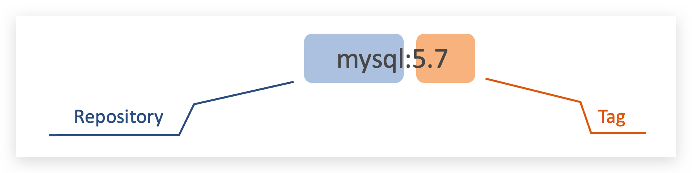
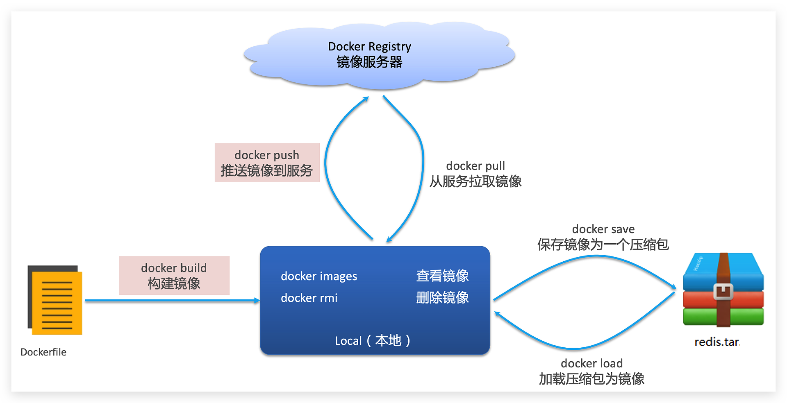
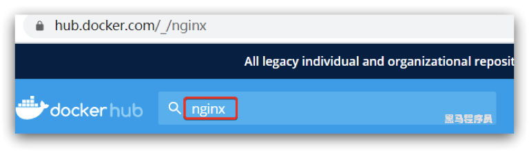
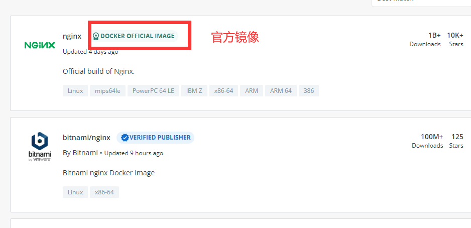
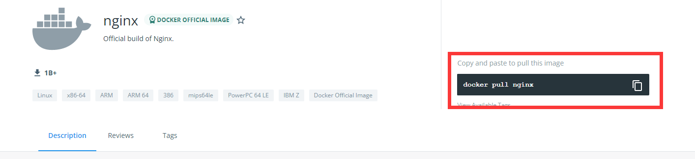
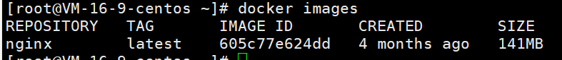
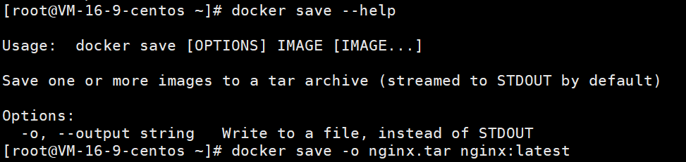

# Docker的镜像


## 1. 镜像简介

首先来看下镜像的名称组成：

- 镜名称一般分两部分组成：[repository]:[tag]。
- 在没有指定tag时，默认是latest，代表最新版本的镜像

如图：



常见的镜像操作命令如图：



## 2. 镜像命令

### docker images

```shell
# 列出本地所有镜像
docker images
参数:
	-a：列出本地所有镜像(含历史镜像层)
	-q：只显示镜像ID
```

### docker search

```shell
# 查询远程库中的镜像
docker search
参数：
	--limit:只列出N个镜像，默认25个

docker search --limit 5 redis
```

### docker pull

```shell
# 下载镜像
docker pull 镜像名称：TAG
```

### docker system df

```shell
# 查看镜像/容器/数据卷所占的空间
docker system df
```

### docker rmi

```shell
# 移除镜像
docker rmi 镜像ID

# 全部删除 , 慎用！
docker rmi $(docker images -qa)
```

### docker save

```shell
# 保存镜像到本地文件
docker save

docker save -o xxx.tar [repository]:[tag]
```

### docker load

```shell
# 导入镜像
docker load -i xxx.tar
```


## 3. 虚悬镜像

仓库名，标签名都是`<none>`的镜像，俗称虚悬镜像`dangling image`


```shell
# 查看本地所有虚悬镜像
docker image ls -f dangling=true


# 删除所有虚悬镜像
docker image prune
```


## 4. 命令实战


### 从DockerHub中拉取一个nginx镜像并查看

首先去镜像仓库搜索nginx镜像







然后在 linux 上执行命令  

```shell
docker pull nginx  # 拉取镜像

# 查看镜像
docker images
```




### 用docker save命令将nginx镜像导出到磁盘，然后再通过load加载回来


导出：

```shell
docker save -o nginx.tar nginx:latest
```




导入：

```shell
# 先删除镜像
docker rmi nginx:latest
docker images  # 查看镜像
  
docker load --help
docker load -i nginx.tar
docker images
```


