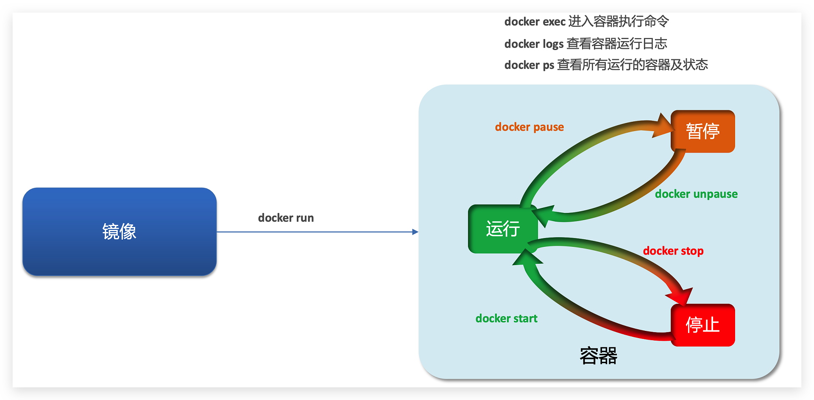
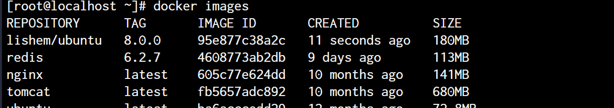
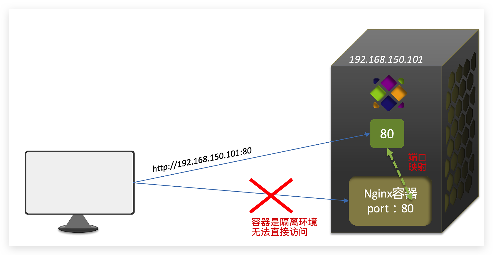
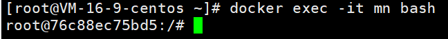
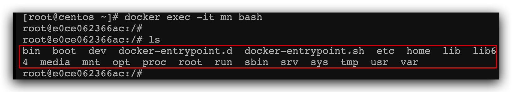
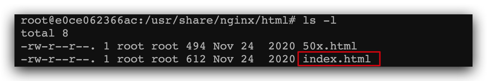

# docker的容器


## 1. Docker容器概述


容器就是docker 启动的 运行实例，容器共有三种状态




## 2. Docker 容器相关命令

### docker run

```shell
# 容器启动命令
docker run

参数：
	--name ：指定容器名称
	-d ： 后台运行容器并返回容器ID
	-i ： 以交互模式运行容器，通常与 -t 同时使用
	-t :  为容器重新分配一个伪输入终端，通常与 -i 同时使用
	-P ： 随机端口映射
	-p ： 指定端口映射
```

如果交互式启动容器：

```shell
docker run it xxx:1.0.0 bash 

# 终端会进入容器，此时退出方式有两种
exit 退出，容器停止
ctrl+p+q 退出，容器不会停止
```

### docker ps

```shell
# 列举本地容器
docker ps

参数：
    -a :列出当前所有正在运行的容器+历史上运行过的
    -l :显示最近创建的容器。
    -n：显示最近n个创建的容器。
    -q :静默模式，只显示容器编号
```

### docker start

```shell
# 启动已经停止的容器
docker start 容器ID或容器名
```

### docker restart

````shell
# 重启正在运行的容器
docker restart 容器ID或容器名
````

### docker stop

```shell
# 停止运行的容器
docker stop 容器ID或容器名
```

### docker kill

```shell
# 强制停止容器
docker kill 容器ID或容器名
```

### docker rm 

```shell
# 删除已停止的容器
docker rm 容器ID或容器名

# 一次删除所有容器，慎用
docker rm -f $(docker ps -a -q)
docker ps -a -q|xargs docker rm
```

### docker logs

```shell
# 查看容器日志
docker logs 容器id
```

### docker top

```shell
# 查看容器内运行进程
docker top 容器id
```

### docker inspect

```shell
# 获取容器的元数据 ，包括很多容器的配置
docker inspect 容器id
```

### docker exec 

```shell
# 进入容器，开启交互模式
docker exec -it 容器id bash
```

### docker attach

```shell
# 进入容器，开启交互模式
docker attach 容器ID
```

> 以上两个命令都可以进入容器，他们有什么区别呢？
>
> - attach直接进入容器启动命令的终端，不会启动新的进程，用exit退出，**会导致容器停止**。
> - exec是在容器中打开新的终端，并且可以启动新的进程，用exit退出，**不会导致容器停止**。

### docker cp 

```shell
docker cp 容器id：容器内的路径  目的主机路径
docker cp 本地文件或文件夹  容器id:容器内的路径
```

### docker export/import

```shell
# 此组命令可以直接将容器导出为 tar文件，或者将tar文件导入为镜像
docker export 容器id > 文件名.tar
cat 文件名.tar | docker import - 镜像用户/镜像名:镜像版本号
```

### docker commit

```shell
# 提交容器副本使之成为一个新的镜像
docker commit -m "提交的描述信息" -a "作者" 容器ID 要创建的目标镜像名:[标签名]

# 如:
docker commit -m "新的镜像" -a "lishem" 2beab80a05cd lishem/ubuntu:8.0.0
```



### docker stats

```shell
docker stats [OPTIONS] [CONTAINER...]

--all , -a :显示所有的容器，包括未运行的。
--format :指定返回值的模板文件。
--no-stream :展示当前状态就直接退出了，不再实时更新。
--no-trunc :不截断输出。

# 用于显示docker容器状态，包括：CPU、内存、网络 I/O 等，常见用法
docker stats 容器ID
```


### 附 ：大全

```shell
attach    Attach to a running container                 # 当前 shell 下 attach 连接指定运行镜像
build     Build an image from a Dockerfile              # 通过 Dockerfile 定制镜像
commit    Create a new image from a container changes   # 提交当前容器为新的镜像
cp        Copy files/folders from the containers filesystem to the host path   #从容器中拷贝指定文件或者目录到宿主机中
create    Create a new container                        # 创建一个新的容器，同 run，但不启动容器
diff      Inspect changes on a container's filesystem   # 查看 docker 容器变化
events    Get real time events from the server          # 从 docker 服务获取容器实时事件
exec      Run a command in an existing container        # 在已存在的容器上运行命令
export    Stream the contents of a container as a tar archive   # 导出容器的内容流作为一个 tar 归档文件[对应 import ]
history   Show the history of an image                  # 展示一个镜像形成历史
images    List images                                   # 列出系统当前镜像
import    Create a new filesystem image from the contents of a tarball # 从tar包中的内容创建一个新的文件系统映像[对应export]
info      Display system-wide information               # 显示系统相关信息
inspect   Return low-level information on a container   # 查看容器详细信息
kill      Kill a running container                      # kill 指定 docker 容器
load      Load an image from a tar archive              # 从一个 tar 包中加载一个镜像[对应 save]
login     Register or Login to the docker registry server    # 注册或者登陆一个 docker 源服务器
logout    Log out from a Docker registry server          # 从当前 Docker registry 退出
logs      Fetch the logs of a container                 # 输出当前容器日志信息
port      Lookup the public-facing port which is NAT-ed to PRIVATE_PORT    # 查看映射端口对应的容器内部源端口
pause     Pause all processes within a container        # 暂停容器
ps        List containers                               # 列出容器列表
pull      Pull an image or a repository from the docker registry server   # 从docker镜像源服务器拉取指定镜像或者库镜像
push      Push an image or a repository to the docker registry server    # 推送指定镜像或者库镜像至docker源服务器
restart   Restart a running container                   # 重启运行的容器
rm        Remove one or more containers                 # 移除一个或者多个容器
rmi       Remove one or more images       # 移除一个或多个镜像[无容器使用该镜像才可删除，否则需删除相关容器才可继续或 -f 强制删除]
run       Run a command in a new container              # 创建一个新的容器并运行一个命令
save      Save an image to a tar archive                # 保存一个镜像为一个 tar 包[对应 load]
search    Search for an image on the Docker Hub         # 在 docker hub 中搜索镜像
start     Start a stopped containers                    # 启动容器
stop      Stop a running containers                     # 停止容器
tag       Tag an image into a repository                # 给源中镜像打标签
top       Lookup the running processes of a container   # 查看容器中运行的进程信息
unpause   Unpause a paused container                    # 取消暂停容器
version   Show the docker version information           # 查看 docker 版本号
wait      Block until a container stops, then print its exit code   # 截取容器停止时的退出状态值
```


## 3. 案例

### 创建并运行一个容器，容器内运行nginx

命令：

```bash
docker run --name containerName -p 80:80 -d nginx
```

命令解读：

- docker run ：创建并运行一个容器
- -name : 给容器起一个名字，比如叫做mn
- p ：将宿主机端口与容器端口映射，冒号左侧是宿主机端口，右侧是容器端口
- d：后台运行容器
- nginx：镜像名称，例如nginx

这里的`-p`参数，是将容器端口映射到宿主机端口。

默认情况下，容器是隔离环境，我们直接访问宿主机的80端口，肯定访问不到容器中的nginx。

现在，将容器的80与宿主机的80关联起来，当我们访问宿主机的80端口时，就会被映射到容器的80，这样就能访问到nginx了：



相关命令：

```bash
docker ps # 查看docker正在运行的容器
docker logs mn # 查看 mn 容器的日志
docker logs -f mn  # 持续输出日志
```


### 进入Nginx容器，修改HTML文件内容

进入容器内部命令：

```bash
docker exec -it mn bash
```

命令解读：

- docker exec ：进入容器内部，执行一个命令
- it : 给当前进入的容器创建一个标准输入、输出终端，允许我们与容器交互
- mn ：要进入的容器的名称
- bash：进入容器后执行的命令，bash是一个linux终端交互命令

执行后进入容器



容器内部会模拟一个独立的Linux文件系统，看起来如同一个linux服务器一样：



nginx的环境、配置、运行文件全部都在这个文件系统中，包括我们要修改的html文件。

查看DockerHub网站中的nginx页面，可以知道nginx的html目录位置在`/usr/share/nginx/html`

我们执行命令，进入该目录：

```bash
cd /usr/share/nginx/html
```

查看目录下文件：



该容器内没有vi命令，可以使用如下方式：

```shell
sed -i -e 's#Welcome to nginx#传智教育欢迎您#g' -e 's#<head>#<head><meta charset="utf-8">#g' index.html
```

访问 nginx 即可看到修改后的页面
