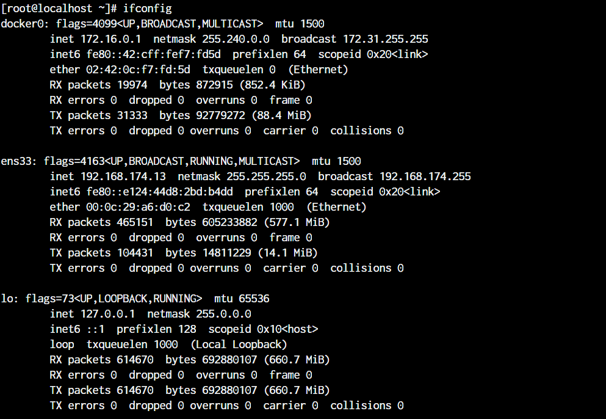
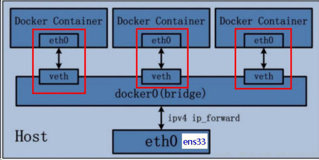
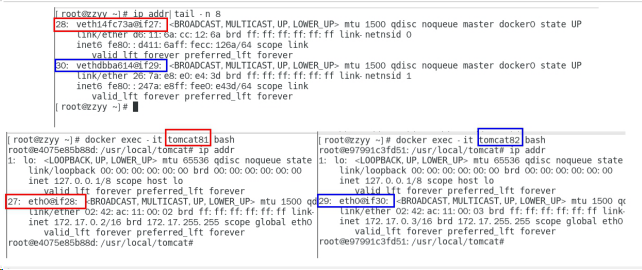
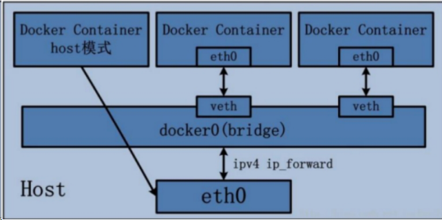
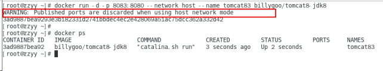
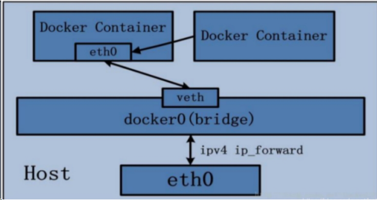
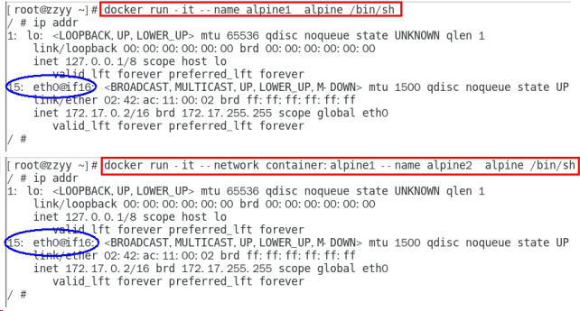

[TOC]


# Docker 网络


## 1. 从linux的网络来看Docker的网络



在没有装docker 的时候，只有两个网络 ens33 和  lo， 当安装linux的时候选择相关虚拟化的的服务安装系统后，会有 virbr0 这个网络。

安装完docker 后，可以从上图看出 ，多了一个 docker0的虚拟网桥


## 2. Docker 网络常用命令

### 查看网络

```shell
docker network ls

# 默认帮我们创建的网络
[root@localhost ~]# docker network ls
NETWORK ID     NAME      DRIVER    SCOPE
127581618a10   bridge    bridge    local
a1e9e108a4da   host      host      local
718fabe56065   none      null      local
```

### 创建网络

```shell
docker network create 网络名称
```

### 删除网络

```shell
docker network rm 网络名称或网络id
```

### 查看网络源数据

```shell
docker network inspect 网络名称或网络id
```


## 3. Docker 网络用处

- 管理容器间的互联和通信以及端口映射
- 容器IP变动时候可以通过服务名直接网络通信而不受到影响


## 4.Docker 网络模式

### 4.1 Docker的四种网络模式

- `bridge`： 为每一个容器分配、设置IP等，并将容器连接到一个docker0。虚拟网桥，默认为该模式。

  使用`--network brigde`指定，默认使用docker0

- `host`：容器将不会虚拟出自己的网卡，配置自己的IP等，而是使用宿主机的IP和端口。

  使用`--network host` 指定

- `none`：容器有独立的Network namespace，但并没有对其进行任何网络设置，如分配 veth pair 和网桥连接，IP等。

  使用`--network none` 指定

- `container`：新创建的容器不会创建自己的网卡和配置自己的IP，而是和一个指定的容器共享IP、端口范围等。

  使用`--network container:NAME或容器id` 指定


### 4.2 bridge模式

容器启动的默认网络模式



以这种模式启动的容器内部有一个 `etho0` 与宿主机的 `veth` 一一对应，同时容器与宿主机全部连接到 网桥上进行通信。

可以以如下方式验证：

```
docker run -d -p 8081:8080   --name tomcat81 billygoo/tomcat8-jdk8
docker run -d -p 8082:8080   --name tomcat82 billygoo/tomcat8-jdk8
```

两两匹配验证



`brideg`方式默认分配IP不会因为某个IP现在有停止的容器占用而不分配，也就是docker默认不会因为有已经停止的容器占用ip而不给新的容器分配ip


### 4.3 host模式

直接使用宿主机的 IP 地址与外界进行通信，不再需要额外进行NAT 转换。

容器将不会获得一个独立的Network Namespace， 而是和宿主机共用一个Network Namespace。容器将不会虚拟出自己的网卡而是使用宿主机的IP和端口。



指定以`host`  网络模式启动的容器不需要再配置端口映射，如果配置，会报警告

```shell
# 有警告的命令
docker run -d -p 8083:8080 --network host --name tomcat83 billygoo/tomcat8-jdk8

# 警告是因为 host 不需要 -p，所以正确的命令是
docker run -d --network host --name tomcat83 billygoo/tomcat8-jdk8
```





### 4.4 none模式

在none模式下，并不为Docker容器进行任何网络配置。 也就是说，这个Docker容器没有网卡、IP、路由等信息，只有一个lo，需要我们自己为Docker容器添加网卡、配置IP等。


### 4.5 container 模式

新建的容器和已经存在的一个容器共享一个网络ip配置而不是和宿主机共享。新创建的容器不会创建自己的网卡，配置自己的IP，而是和一个指定的容器共享IP、端口范围等。同样，两个容器除了网络方面，其他的如文件系统、进程列表等还是隔离的。



container模式的坑：

```shell
docker run -d -p 8085:8080                              --name tomcat85 billygoo/tomcat8-jdk8
docker run -d -p 8086:8080 --network container:tomcat85 --name tomcat86 billygoo/tomcat8-jdk8

# 以上两个命令 第二个容器不能正常启动，因为第二个容器和第一个容器公用一套网络，第二个容器启动时发现 8080 端口已经被占用了
```

正确的操作示例：

```shell
docker run -it                             --name alpine1  alpine /bin/sh
docker run -it --network container:alpine1 --name alpine2  alpine /bin/sh
```



注意：这种共享模式，如果 拥有这个网卡的容器停了，共享别的容器网络的容器也就断网了


## 5. 自定义网络

我们希望容器之间可以通过 **容器名** 互相访问， 而不是通过固定的ip，毕竟默认的`bridge` 模式分配的ip随机且有概率重复。此时便需要我们自定义网络。


新建自定义网络

```shell
docker network create my_custom_network
```

新建容器加入自定义网络

```shell
docker run -d -p 8081:8080 --network my_custom_network  --name tomcat81 billygoo/tomcat8-jdk8
docker run -d -p 8082:8080 --network my_custom_network  --name tomcat82 billygoo/tomcat8-jdk8
```

此时两个容器质检就可以用 **服务名** 或者 **容器id** 相互访问

- 自定义网络本身就维护好了主机名和ip的对应关系（ip和域名都能通）


