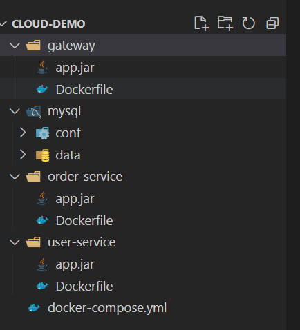

[TOC]


# docker-compose容器编排


## 1. Docker-compose 概述

Docker-Compose是Docker官方的开源项目， 负责实现对Docker容器集群的快速编排。

Docker-Compose可以管理多个 Docker 容器组成一个应用。你需要定义一个 YAML 格式的配置文件docker-compose.yml，写好多个容器之间的调用关系。然后，**只要一个命令，就能同时启动/关闭这些容器**。


Docker-Compose允许用户通过一个单独的`docker-compose.yml`模板文件（YAML 格式）来定义一组相关联的应用容器为一个项目（project）。


## 2. Docker-compose 下载

官网 https://docs.docker.com/compose/compose-file/compose-file-v3/

下载地址 https://docs.docker.com/compose/install/

```shell
# 官网的一键安装，github的，比较慢
curl -L https://github.com/docker/compose/releases/download/1.23.1/docker-compose-`uname -s`-`uname -m` > /usr/local/bin/docker-compose

# 可以用这个国内的
curl -L https://get.daocloud.io/docker/compose/releases/download/1.25.1/docker-compose-`uname -s`-`uname -m` -o /usr/local/bin/docker-compose


# 修改权限
chmod +x /usr/local/bin/docker-compose

# 验证是否成功
docker-compose --version

# 卸载
rm /usr/local/bin/docker-compose
```


## 3. Docker-compose 必知概念

一文件：docker-compose.yml

两要素：

- 服务（service）
  - 一个个应用容器实例，比如订单微服务、库存微服务、mysql容器、nginx容器或者redis容器
- 工程（project）
  - 由一组关联的应用容器组成的一个完整业务单元，在 docker-compose.yml 文件中定义。

三步骤：

- 编写Dockerfile定义各个微服务应用并构建出对应的镜像文件
- 使用 docker-compose.yml 定义一个**完整业务单元**，安排好整体应用中的各个容器服务。
- 最后，执行`docker-compose up`命令 来启动并运行整个应用程序，完成一键部署上线


## 4. Compose常用命令

```shell
docker-compose -h                     # 查看帮助
docker-compose up                     # 启动所有docker-compose服务
docker-compose up -d                  # 启动所有docker-compose服务并后台运行
docker-compose down                   # 停止并删除容器、网络、卷、镜像。
docker-compose exec  yml里面的服务id   # 进入容器实例内部  docker-compose exec docker-compose.yml文件中写的服务id /bin/bash
docker-compose ps                      # 展示当前docker-compose编排过的运行的所有容器
docker-compose top                     # 展示当前docker-compose编排过的容器进程

docker-compose logs  yml里面的服务id    # 查看容器输出日志
docker-compose config                  # 检查配置
docker-compose config -q               # 检查配置，有问题才有输出
docker-compose restart   			  # 重启服务
docker-compose start     			  # 启动服务
docker-compose stop      			  # 停止服务
```


## 5.Docker-compose 实操作


### 5.1 如果连镜像也不想手动打



docker-compose.yml 内容如下

```shell
version: "3.2"

services:
  nacos:
    image: nacos/nacos-server
    environment:
      MODE: standalone
    ports:
      - "8848:8848"
  mysql:
    image: mysql:5.7.25
    environment:
      MYSQL_ROOT_PASSWORD: 123
    volumes:
      - "$PWD/mysql/data:/var/lib/mysql"
      - "$PWD/mysql/conf:/etc/mysql/conf.d/"
  userservice:
    build: ./user-service
  orderservice:
    build: ./order-service
  gateway:
    build: ./gateway
    ports:
      - "10010:10010"
```

```shell
# 进入 docker-compose.yml 目录下，使用命令进行部署
# 检查 docker-compose.yml 编写是否正确
docker-compose config -q  # 没输出说明 文件没问题
docker-compose up -d

# 重启某些微服务
docker-compose restart gateway userservice orderservice

# 看所有日志
docker-compose logs

# 看所有日志 持续刷新
docker-compose logs -f

# 看某个微服务的日志
docker-compose logs -f usersrvice
```


### 5.2 如果是打好镜像的


没有指定 container_name 容器名字的，默认使用 docker-compose.yml 所在目录名+服务名

```shell
version: "3"
 
services:
  microService:
    image: zzyy_docker:1.6
    # 容器名字
    container_name: ms01
    ports:
      - "6001:6001"
    volumes:
      - /app/microService:/data
    networks: 
      - atguigu_net 
    depends_on: 
      - redis
      - mysql
 
  redis:
    image: redis:6.0.8
    ports:
      - "6379:6379"
    volumes:
      - /app/redis/redis.conf:/etc/redis/redis.conf
      - /app/redis/data:/data
    networks: 
      - atguigu_net
    command: redis-server /etc/redis/redis.conf
 
  mysql:
    image: mysql:5.7
    environment:
      MYSQL_ROOT_PASSWORD: '123456'
      MYSQL_ALLOW_EMPTY_PASSWORD: 'no'
      MYSQL_DATABASE: 'db2021'
      MYSQL_USER: 'zzyy'
      MYSQL_PASSWORD: 'zzyy123'
    ports:
       - "3306:3306"
    volumes:
       - /app/mysql/db:/var/lib/mysql
       - /app/mysql/conf/my.cnf:/etc/my.cnf
       - /app/mysql/init:/docker-entrypoint-initdb.d
    networks:
      - atguigu_net
    command: --default-authentication-plugin=mysql_native_password #解决外部无法访问
 
networks: 
   atguigu_net: 
```

