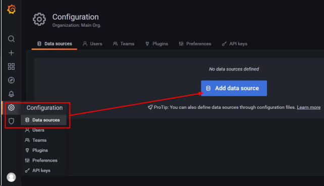

[TOC]

# Docker 监控工具


## Docker 轻量级可视化工具 Portainer

Portainer 是一款轻量级的应用，它提供了图形化界面，用于方便地管理Docker环境，包括单机环境和集群环境。

官网 https://www.portainer.io/

安装 https://docs.portainer.io/v/ce-2.9/start/install/server/docker/linux


```shell
docker run -d -p 8000:8000 -p 9000:9000 --name portainer --restart=always -v /var/run/docker.sock:/var/run/docker.sock -v portainer_data:/data  portainer/portainer
```

访问地址：http://192.168.174.13:9000


## CAdvisor+InfluxDB+Granfana

简称CIG

通过docker stats命令可以很方便的看到当前宿主机上所有容器的CPU,内存以及网络流量等数据，但是，docker stats统计结果只能是当前宿主机的全部容器，数据资料是实时的，没有地方存储、没有健康指标过线预警等功能。

CIG就是为解决这个问题，CAdvisor监控收集+InfluxDB存储数据+Granfana展示图表


启动一套CIG

```shell
mkdir /root/cig
vim docker-compose.yml
```

docker-compose.yml 文件内容如下

```dockerfile
version: '3.1'
 
volumes:
  grafana_data: {}
 
services:
 influxdb:
  image: tutum/influxdb:0.9
  restart: always
  environment:
    - PRE_CREATE_DB=cadvisor
  ports:
    - "8083:8083"
    - "8086:8086"
  volumes:
    - ./data/influxdb:/data
 
 cadvisor:
  image: google/cadvisor
  links:
    - influxdb:influxsrv
  command: -storage_driver=influxdb -storage_driver_db=cadvisor -storage_driver_host=influxsrv:8086
  restart: always
  ports:
    - "8080:8080"
  volumes:
    - /:/rootfs:ro
    - /var/run:/var/run:rw
    - /sys:/sys:ro
    - /var/lib/docker/:/var/lib/docker:ro
 
 grafana:
  user: "104"
  image: grafana/grafana
  user: "104"
  restart: always
  links:
    - influxdb:influxsrv
  ports:
    - "3000:3000"
  volumes:
    - grafana_data:/var/lib/grafana
  environment:
    - HTTP_USER=admin
    - HTTP_PASS=admin
    - INFLUXDB_HOST=influxsrv
    - INFLUXDB_PORT=8086
    - INFLUXDB_NAME=cadvisor
    - INFLUXDB_USER=root
    - INFLUXDB_PASS=root
```

```shell
docker-compose config -q
docker-compose up -d
```

- 浏览cAdvisor收集服务，http://ip:8080/

- 浏览influxdb存储服务，http://ip:8083/

- 浏览grafana展现服务，http://ip:3000

在influxdb中，可以看到docker-compose 创建的数据库


grafana 首次访问 访问 用户名密码：admin/admin


为grafana 配置数据源：




用户名密码默认都是root


