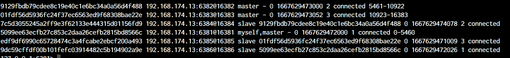

[toc]


# Docker 安装常见软件


## tomcat

```shell
docker pull tomcat:8.5.83-jdk8-temurin-focal
docker run -d -p 8080:8080 --name t1 tomcat:8.5.83-jdk8-temurin-focal
```

运行起来以后依然访问不到主页，是因为tomcat的官方镜像默认 webapps里没有东西，而默认的首页放在 webapps.dist中


可以使用如下命令：

```shell
rm -r webapps
mv webapps.dist webapps
```

即可正常访问 tomcat


## mysql

### 单节点部署

#### mysql5

```shell
docker pull mysql:5.7.38

# 新建目录 /root/mysql5/conf
mkdir -p  /root/mysql5/conf
cd /root/mysql5/conf
vim my.cnf

########## 内容如下 ##########

[mysqld]
# 设置3306端口
port=3306
# 允许最大连接数
max_connections=1000
# 允许连接失败的次数。这是为了防止有人从该主机试图攻击数据库系统
max_connect_errors=10
# 服务端使用的字符集默认为UTF8
character-set-server=utf8mb4
# 创建新表时将使用的默认存储引擎
default-storage-engine=INNODB
# 默认使用“mysql_native_password”插件认证
default_authentication_plugin=mysql_native_password
# windows默认表名是小写，linux默认大写，需要配置一下
lower_case_table_names=1
[mysql]
# 设置mysql客户端默认字符集
default-character-set=utf8mb4
[client]
# 设置mysql客户端连接服务端时默认使用的端口
port=3306
default-character-set=utf8mb4

############# 配置文件完结 ##############


docker run \
    --name mysql5 \
    -e MYSQL_ROOT_PASSWORD='root' \
    -p 3306:3306 \
    --restart=always \
    --privileged=true \
    -v /root/mysql5/log:/var/log/mysql \
    -v /root/mysql5/data:/var/lib/mysql \
    -v /root/mysql5/conf:/etc/mysql/conf.d \
    -d \
mysql:5.7.38

# 注意： docker容器内mysql 的编码需要进入 容器登陆mysql查看
# 用客户端工具查看的是不准的
SHOW VARIABLES LIKE 'character%';
```

#### mysql8

```shell
docker run \
    --name mysql8 \
    -e MYSQL_ROOT_PASSWORD='root' \
    -v /home/lishem/docker_mysql8/data:/var/lib/mysql:rw \
    -v /etc/localtime:/etc/localtime:ro \
    -p 3306:3306 \
    --restart=always \
    -d mysql:8.0  --lower_case_table_names=1
```


### 主从部署

主机

```shell
############## 主机  ############
docker run \
	-p 3307:3306 \
    --name mysql-master \
    -v /root/mysql-master/log:/var/log/mysql \
    -v /root/mysql-master/data:/var/lib/mysql \
    -v /root/mysql-master/conf:/etc/mysql/conf.d \
	-e MYSQL_ROOT_PASSWORD='root' \
	-d mysql:5.7.38
########### 主机配置文件内容 my.cnf #################

[mysqld]
# 设置server_id，同一局域网中需要唯一 
server_id=101
# 指定不需要同步的数据库名称
binlog-ignore-db=mysql
# 开启二进制日志功能
log-bin=mall-mysql-bin
# 设置二进制日志使用内存大小（事务）
binlog_cache_size=1M
# 设置使用的二进制日志格式（mixed,statement,row）
binlog_format=mixed
# 二进制日志过期清理时间。默认值为0，表示不自动清理。
expire_logs_days=7
# 跳过主从复制中遇到的所有错误或指定类型的错误，避免slave端复制中断。
# 如：1062错误是指一些主键重复，1032错误是因为主从数据库数据不一致
slave_skip_errors=1062

########## 重启主机docker容器   ################
## 进入mysql master 容器，登陆mysql，创建数据同步用户
docker exec -it mysql-master bash
mysql -uroot -proot
CREATE USER 'slave'@'%' IDENTIFIED BY 'root';
GRANT REPLICATION SLAVE, REPLICATION CLIENT ON *.* TO 'slave'@'%';
```

从机

```shell
############## 从机  ############
docker run \
	-p 3308:3306 \
    --name mysql-slave \
    -v /root/mysql-slave/log:/var/log/mysql \
    -v /root/mysql-slave/data:/var/lib/mysql \
    -v /root/mysql-slave/conf:/etc/mysql/conf.d \
	-e MYSQL_ROOT_PASSWORD='root' \
	-d mysql:5.7.38
########### 从机配置文件内容 my.cnf #################

[mysqld]
# 设置server_id，同一局域网中需要唯一
server_id=102
# 指定不需要同步的数据库名称
binlog-ignore-db=mysql
# 开启二进制日志功能，以备Slave作为其它数据库实例的Master时使用
log-bin=mall-mysql-slave1-bin
# 设置二进制日志使用内存大小（事务）
binlog_cache_size=1M
# 设置使用的二进制日志格式（mixed,statement,row）
binlog_format=mixed
# 二进制日志过期清理时间。默认值为0，表示不自动清理。
expire_logs_days=7
# 跳过主从复制中遇到的所有错误或指定类型的错误，避免slave端复制中断。
# 如：1062错误是指一些主键重复，1032错误是因为主从数据库数据不一致
slave_skip_errors=1062
# relay_log配置中继日志
relay_log=mall-mysql-relay-bin
# log_slave_updates表示slave将复制事件写进自己的二进制日志
log_slave_updates=1
# slave设置为只读（具有super权限的用户除外）
read_only=1

########## 重启从机docker容器   ################
```

配置：

```shell
# 进入主机 mysql，查看主从复制状态
mysql> show master status;
+-----------------------+----------+--------------+------------------+-------------------+
| File                  | Position | Binlog_Do_DB | Binlog_Ignore_DB | Executed_Gtid_Set |
+-----------------------+----------+--------------+------------------+-------------------+
| mall-mysql-bin.000001 |      617 |              | mysql            |                   |
+-----------------------+----------+--------------+------------------+-------------------+

# 在从机中配置主机地址配置
# 主从复制命令参数说明
# master_host：主数据库的IP地址；
# master_port：主数据库的运行端口；
# master_user：在主数据库创建的用于同步数据的用户账号；
# master_password：在主数据库创建的用于同步数据的用户密码；
# master_log_file：指定从数据库要复制数据的日志文件，通过查看主数据的状态，获取File参数；
# master_log_pos：指定从数据库从哪个位置开始复制数据，通过查看主数据的状态，获取Position参数；
# master_connect_retry：连接失败重试的时间间隔，单位为秒。

change master to master_host='192.168.174.13', master_user='slave', master_password='root', master_port=3307, master_log_file='mall-mysql-bin.000001', master_log_pos=617, master_connect_retry=30;

# 从机查看主从同步状态
show slave status \G;
# 此时看到 Slave_IO_Running 和 Slave_SQL_Running 还未开始
## Slave_IO_Running: No
## Slave_SQL_Running: No

# 从机 中开启主从复制
start slave;
# 再去看从机状态：
show slave status \G;
## Slave_IO_Running: Yes
## Slave_SQL_Running: Yes


##################### 此时 主从复制已搭建完成  ###################
```


## Oracle

### oracle-19c

```shell
# 创建目录 并授权
mkdir -p /oracle/oracle19c/oradata
chmod 777 /oracle/oracle19c/oradata

docker run -d  \
    -p 1521:1521 -p 5500:5500 \
    --restart=always \
    -v /oracle/oracle19c/oradata:/opt/oracle/oradata \
    -e ORACLE_SID=ORCL \
    -e ORACLE_PDB=ORCLPDB \
    --name oracle19c \
    -e ORACLE_PWD=orcl \
    -e ORACLE_EDITION=standard \
    -e ORACLE_CHARACTERSET=ZHS16GBK \
    registry.cn-hangzhou.aliyuncs.com/zhuyijun/oracle:19c
    
## 启动需要很长时间，最好去看日志启动完了再进行下面操作

# 进入容器
docker exec -it oracle19c bash

# 创建目录并赋予权限
cd /opt/oracle/oradata
mkdir tablespace
chmod 777 tablespace

# 用sqlplus登陆
sqlplus / as sysdba
# 将会话模式设置为ORCLPDB
alter session set container=ORCLPDB;

# 创建表空间
create tablespace "SCOOT" datafile '/opt/oracle/oradata/tablespace/scott.dbf' size 100m  autoextend on next 10m;
# 创建用户
create user SCOOT IDENTIFIED BY TIGGER;
alter user SCOOT default tablespace "SCOOT";
# 赋予SCOOT权限
GRANT CONNECT,RESOURCE,DBA,CREATE SESSION,CREATE USER,DROP USER,ALTER USER,CREATE ANY VIEW,DROP ANY VIEW,EXP_FULL_DATABASE,IMP_FULL_DATABASE TO SCOOT;

#######################navicate登陆#########################
服务名：ORCLPDB
用户名：SCOOT
密码：TIGGER
```


### oracle-12c

```shell
# 创建目录 并授权
mkdir -p /oracle/oracle12c/oradata
chmod 777 /oracle/oracle12c/oradata

docker run -d \
    --name oracle12c \
    -p 1521:1521 -p 8080:8080 \
    --restart=always \
    -v /oracle/oracle12c/oradata:/u01/app/oracle \
    -v /etc/localtime:/etc/localtime:ro \
	truevoly/oracle-12c

## 启动需要很长时间，最好去看日志启动完了再进行下面操作
# 进入容器
docker exec -it oracle12c bash

# 创建目录并赋予权限
cd /u01/app/
mkdir -p oradata/tablespace
chmod 777 oradata
cd oradata
chmod 777 tablespace

sqlplus / as sysdba
# 默认 用户名  system  密码  oracle

# 创建表空间
create tablespace "SCOOT" datafile '/u01/app/oradata/tablespace/scoot.dbf' size 100m  autoextend on next 10m ; 

CREATE USER "SCOTT" IDENTIFIED BY "TIGGER" DEFAULT TABLESPACE SCOOT;

GRANT CONNECT,RESOURCE,DBA,CREATE SESSION,CREATE USER,DROP USER,ALTER USER,CREATE ANY VIEW,DROP ANY VIEW,EXP_FULL_DATABASE,IMP_FULL_DATABASE TO SCOOT;

####################连接##################
服务名:xe
用户名：SCOOT
密码：TIGGER
```


## redis

### 单节点部署

```shell
docker pull redis:6.2.7

# 新建目录 /root/redis6
mkdir -p  /root/redis6
# 找一个该版本的 redis.conf 放入该目录

# 修改redis.conf

# 1. 开启密码验证 ,特殊字符也不需要加引号，约903行
requirepass 123456 

# 2. 注释掉 bind 127.0.0.1 -::1 允许外界连接，约 75行
# bind 127.0.0.1 -::1

# 3. 将daemonize yes注释起来或者 daemonize no设置，因为该配置和docker run中-d参数冲突，会导致容器一直启动失败，约 259 行
daemonize no

# 4. 开启redis数据持久化  appendonly yes ,约 1254 行
appendonly yes


# 运行镜像
docker run \
    -p 6379:6379 \
    --name redis6 \
    --privileged=true \
    -v /root/redis6/redis.conf:/etc/redis/redis.conf \
    -v /root/redis6/data:/data \
    -d \
    redis:6.2.7 redis-server /etc/redis/redis.conf


# 如果临时用，不需要大量调整配置：
docker run \
    -d \
    --name redis6 \
    -p 6379:6379 \
    --privileged=true \
    -v /root/redis6/data:/data \
	redis:6.2.7 --requirepass '123456'
```

### 3主3从集群配置


```shell
## 启动6台 redis docker 容器
docker run -d \
	--name redis-node-1 \
	--net host \
	--privileged=true \
	-v /root/redis/share/redis-node-1:/data \
	redis:6.2.7 \
    --cluster-enabled yes \
	--appendonly yes --port 6381

docker run -d \
	--name redis-node-2 \
	--net host \
	--privileged=true \
	-v /root/redis/share/redis-node-2:/data \
	redis:6.2.7 \
    --cluster-enabled yes \
	--appendonly yes --port 6382 

docker run -d \
	--name redis-node-3 \
	--net host \
	--privileged=true \
	-v /root/redis/share/redis-node-3:/data \
	redis:6.2.7 \
    --cluster-enabled yes \
	--appendonly yes --port 6383 
	
docker run -d \
	--name redis-node-4 \
	--net host \
	--privileged=true \
	-v /root/redis/share/redis-node-4:/data \
	redis:6.2.7 \
    --cluster-enabled yes \
	--appendonly yes --port 6384

docker run -d \
	--name redis-node-5 \
	--net host \
	--privileged=true \
	-v /root/redis/share/redis-node-5:/data \
	redis:6.2.7 \
    --cluster-enabled yes \
	--appendonly yes --port 6385 

docker run -d \
	--name redis-node-6 \
	--net host \
	--privileged=true \
	-v /root/redis/share/redis-node-6:/data \
	redis:6.2.7 \
    --cluster-enabled yes \
	--appendonly yes --port 6386 
```

- 进入容器构建集群关系

```shell
docker exec -it redis-node-1 bash

## 以下命令是创建进，--cluster-replicas 1 表示为每个master创建一个slave节点
redis-cli --cluster create 192.168.174.13:6381 192.168.174.13:6382 192.168.174.13:6383 192.168.174.13:6384 192.168.174.13:6385 192.168.174.13:6386 --cluster-replicas 1


####################### 输出 #########################
>>> Performing hash slots allocation on 6 nodes...
Master[0] -> Slots 0 - 5460
Master[1] -> Slots 5461 - 10922
Master[2] -> Slots 10923 - 16383
Adding replica 192.168.174.13:6385 to 192.168.174.13:6381
Adding replica 192.168.174.13:6386 to 192.168.174.13:6382
Adding replica 192.168.174.13:6384 to 192.168.174.13:6383
>>> Trying to optimize slaves allocation for anti-affinity
[WARNING] Some slaves are in the same host as their master
M: 5099ee63ecfb27c853c2daa26cefb2815bd8566c 192.168.174.13:6381
   slots:[0-5460] (5461 slots) master
M: 9129fbdb79cdee8c19e40c1e6bc34a0a56d4f488 192.168.174.13:6382
   slots:[5461-10922] (5462 slots) master
M: 01fdf56d5936fc24f37ec6563ed9f68308bae22e 192.168.174.13:6383
   slots:[10923-16383] (5461 slots) master
S: 7c5d3055245a2ff9e3f62133e444315d01156fd9 192.168.174.13:6384
   replicates 9129fbdb79cdee8c19e40c1e6bc34a0a56d4f488
S: edf9df6990c65728474c3a4fcabe2ebcf200a493 192.168.174.13:6385
   replicates 01fdf56d5936fc24f37ec6563ed9f68308bae22e
S: 9dc59cffdf00b101fefc03914482c5b194902a9e 192.168.174.13:6386
   replicates 5099ee63ecfb27c853c2daa26cefb2815bd8566c
Can I set the above configuration? (type 'yes' to accept):   # 输入yes


>>> Nodes configuration updated
>>> Assign a different config epoch to each node
>>> Sending CLUSTER MEET messages to join the cluster
Waiting for the cluster to join
...
>>> Performing Cluster Check (using node 192.168.174.13:6381)
# M表示主  S 表示从
M: 5099ee63ecfb27c853c2daa26cefb2815bd8566c 192.168.174.13:6381
   slots:[0-5460] (5461 slots) master
   1 additional replica(s)
M: 9129fbdb79cdee8c19e40c1e6bc34a0a56d4f488 192.168.174.13:6382
   slots:[5461-10922] (5462 slots) master
   1 additional replica(s)
M: 01fdf56d5936fc24f37ec6563ed9f68308bae22e 192.168.174.13:6383
   slots:[10923-16383] (5461 slots) master
   1 additional replica(s)
S: 7c5d3055245a2ff9e3f62133e444315d01156fd9 192.168.174.13:6384
   slots: (0 slots) slave
   replicates 9129fbdb79cdee8c19e40c1e6bc34a0a56d4f488
S: edf9df6990c65728474c3a4fcabe2ebcf200a493 192.168.174.13:6385
   slots: (0 slots) slave
   replicates 01fdf56d5936fc24f37ec6563ed9f68308bae22e
S: 9dc59cffdf00b101fefc03914482c5b194902a9e 192.168.174.13:6386
   slots: (0 slots) slave
   replicates 5099ee63ecfb27c853c2daa26cefb2815bd8566c
[OK] All nodes agree about slots configuration.
>>> Check for open slots...
>>> Check slots coverage...
[OK] All 16384 slots covered.
```

- 查看集群状态

```shell
redis-cli -p 6381
cluster info
cluster nodes


#################### 输出  #####################
root@localhost:/data# redis-cli -p 6381
127.0.0.1:6381> cluster info
cluster_state:ok
cluster_slots_assigned:16384
cluster_slots_ok:16384
cluster_slots_pfail:0
cluster_slots_fail:0
cluster_known_nodes:6
cluster_size:3
cluster_current_epoch:6
cluster_my_epoch:1
cluster_stats_messages_ping_sent:132
cluster_stats_messages_pong_sent:141
cluster_stats_messages_sent:273
cluster_stats_messages_ping_received:136
cluster_stats_messages_pong_received:132
cluster_stats_messages_meet_received:5
cluster_stats_messages_received:273
127.0.0.1:6381> cluster nodes
## 这里可以看到 谁是谁的从，智能分配的
9129fbdb79cdee8c19e40c1e6bc34a0a56d4f488 192.168.174.13:6382@16382 master - 0 1667629473000 2 connected 5461-10922
01fdf56d5936fc24f37ec6563ed9f68308bae22e 192.168.174.13:6383@16383 master - 0 1667629473052 3 connected 10923-16383
7c5d3055245a2ff9e3f62133e444315d01156fd9 192.168.174.13:6384@16384 slave 9129fbdb79cdee8c19e40c1e6bc34a0a56d4f488 0 1667629474078 2 connected
5099ee63ecfb27c853c2daa26cefb2815bd8566c 192.168.174.13:6381@16381 myself,master - 0 1667629472000 1 connected 0-5460
edf9df6990c65728474c3a4fcabe2ebcf200a493 192.168.174.13:6385@16385 slave 01fdf56d5936fc24f37ec6563ed9f68308bae22e 0 1667629471009 3 connected
9dc59cffdf00b101fefc03914482c5b194902a9e 192.168.174.13:6386@16386 slave 5099ee63ecfb27c853c2daa26cefb2815bd8566c 0 1667629472026 1 connected

### 此时的主从
M   S
1   6
2   4
3   5
```



- 连接集群

redis集群启动默认采用哈希槽算法，以集群启动的redis不能连接单一主机进行操作。

```shell
# 这种单机连接方式不可用
redis-cli -p 6381

# 需要用集群连接方式，加了 -c 表是以集群方式连接，不存储在6381的数据会 重定向至真实的存储机
redis-cli -p 6381 -c 

# --cluster check 集群检查，查看集群状态
redis-cli --cluster check 192.168.174.13:6381
```

> 如果某一主机宕机，其附属从机便切换为主机
>
> 宕机主机再恢复，便成为现在主机的从机。如果想要宕机的机器继续做主机，需要将其现在的主机停机重启。

### redis 集群扩容


```shell
## 新建 6387  6388 两个节点
docker run -d \
	--name redis-node-7 \
	--net host \
	--privileged=true \
	-v /root/redis/share/redis-node-7:/data \
	redis:6.2.7 \
    --cluster-enabled yes \
	--appendonly yes --port 6387

docker run -d \
	--name redis-node-8 \
	--net host \
	--privileged=true \
	-v /root/redis/share/redis-node-8:/data \
	redis:6.2.7 \
    --cluster-enabled yes \
	--appendonly yes --port 6388
	
## 进入 6387 机器内部 将其作为 master节点加入原有集群
docker exec -it redis-node-7 bash
## 前面是现在要加入的节点，后面是要加入集群的master节点
redis-cli --cluster add-node 192.168.174.13:6387 192.168.174.13:6381
# 通过以下命令可以看到  6387 现在是一个 master 节点
redis-cli --cluster check  192.168.174.13:6387

###########  输出  ##############
192.168.174.13:6387 (cc293c24...) -> 0 keys | 0 slots | 0 slaves.
192.168.174.13:6381 (5099ee63...) -> 0 keys | 5461 slots | 1 slaves.
192.168.174.13:6382 (9129fbdb...) -> 0 keys | 5462 slots | 1 slaves.
192.168.174.13:6383 (01fdf56d...) -> 0 keys | 5461 slots | 1 slaves.

########### 重新分配槽号 ##########
# 操作的是现在作为主节点的一个 实例
redis-cli --cluster reshard IP:端口
redis-cli --cluster reshard 192.168.174.13:6381
```


```shell
# 检查现在的集群情况
redis-cli --cluster check  192.168.174.13:6381
```


> 可以看出，槽位号的分配是之前的 master 节点分别截取了一部分，分配到了 新的 6387 节点下

- 为主节点 6387 挂载从节点 6388

```shell
redis-cli --cluster add-node ip:新slave端口 ip:新master端口 --cluster-slave --cluster-master-id 新主机节点ID

redis-cli --cluster add-node 192.168.174.13:6388 192.168.174.13:6387 --cluster-slave --cluster-master-id cc293c2438378052869d3860744ee46820d1904d

# 检查现在的集群情况
redis-cli --cluster check  192.168.174.13:6381
```


### redis 集群缩容


```shell
# 先删除从节点
## 查询从机id
redis-cli --cluster check  192.168.174.13:6381

## 集群中删除 6388 节点
redis-cli --cluster del-node IP:端口 要删除节点id
redis-cli --cluster del-node 192.168.174.13:6388 515c8d1384c5764b5b04af45954100f5d64ab5f4
# 此时集群中只有 4个 master  3个 slaver

## 将6387的槽号情况，重新分配，本例将清出来的槽号都给6381
redis-cli --cluster reshard 192.168.174.13:6381
```


```shell
## 删除6387 节点
redis-cli --cluster del-node 192.168.174.13:6387 cc293c2438378052869d3860744ee46820d1904d

redis-cli --cluster check  192.168.174.13:6381
```

