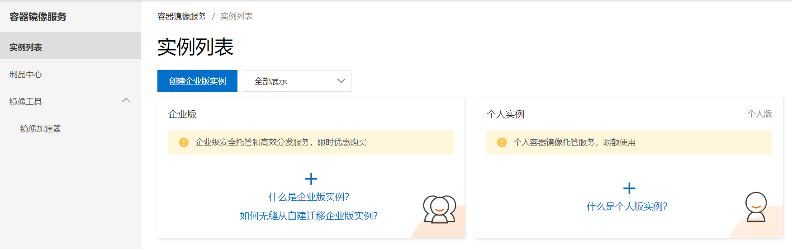
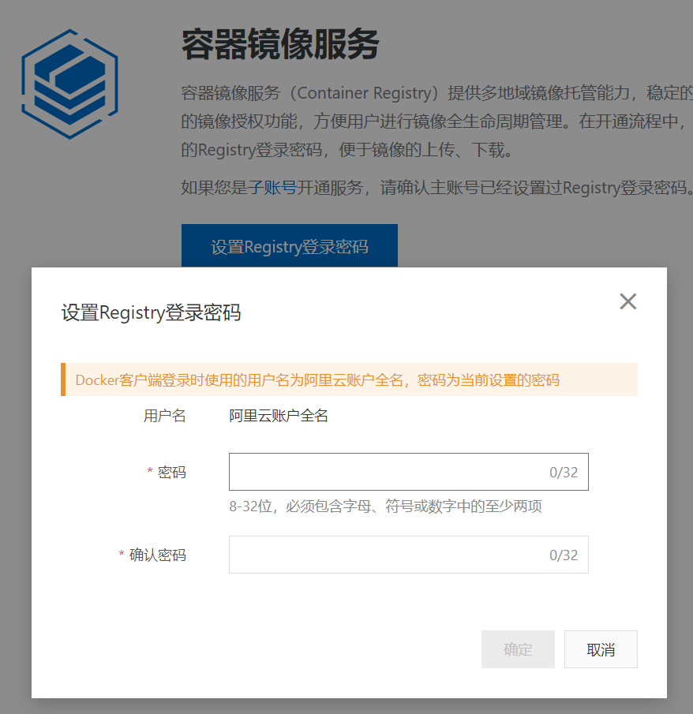
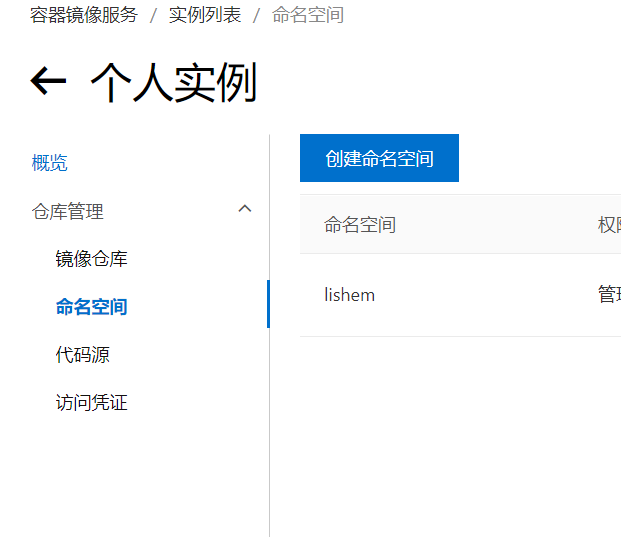
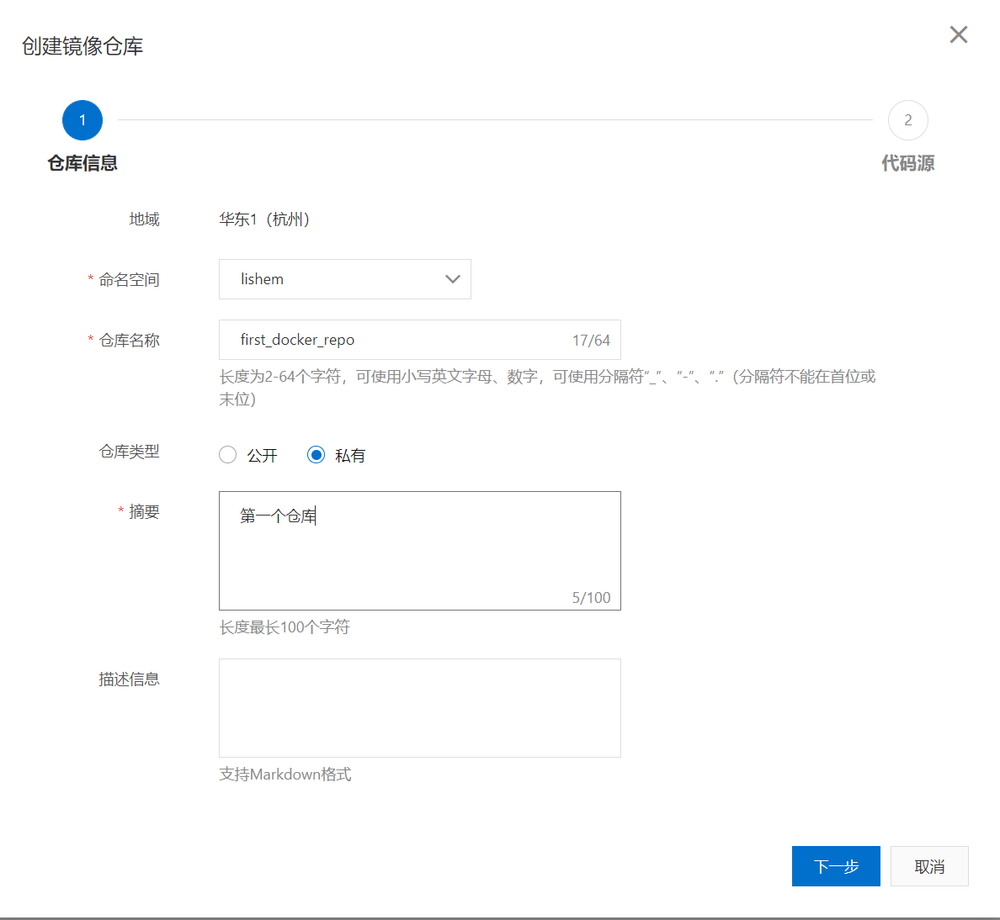
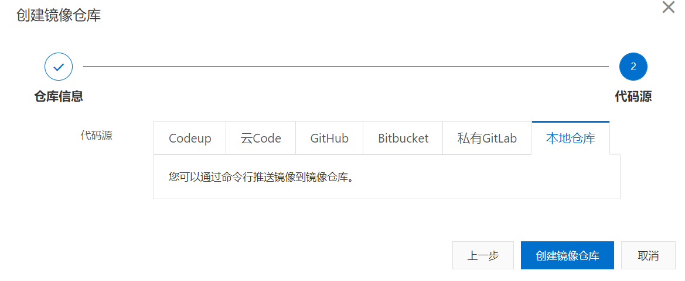
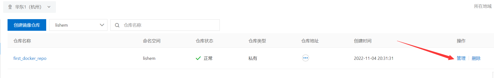
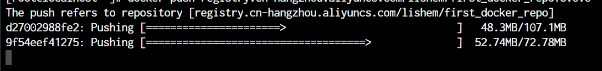

# 推送Docker镜像到阿里云


## 进入阿里云容器镜像服务

https://cr.console.aliyun.com/cn-hangzhou/instances



点击添加个人实例，然后设置Registry登陆密码



## 创建命名空间



## 创建镜像仓库



- 选择本地仓库推送，然后创建仓库




## 进入管理界面，获得脚本




## 推送镜像到仓库

### 登陆

```shell
docker login --username=xxxxxxx registry.cn-hangzhou.aliyuncs.com
```

### 为镜像重新打标签

```shell
docker tag [ImageId] registry.cn-hangzhou.aliyuncs.com/命名空间/镜像仓库名:[镜像版本号]

# 如
docker tag 95e877c38a2c registry.cn-hangzhou.aliyuncs.com/lishem/first_docker_repo:8.0.0
```


### 推送

```shell
docker push registry.cn-hangzhou.aliyuncs.com/命名空间/镜像仓库名:[镜像版本号]

# 如
docker push registry.cn-hangzhou.aliyuncs.com/lishem/first_docker_repo:8.0.0
```




## 拉取阿里云镜像到本地使用

```shell
docker pull registry.cn-hangzhou.aliyuncs.com/命名空间/镜像仓库名:[镜像版本号]
```

