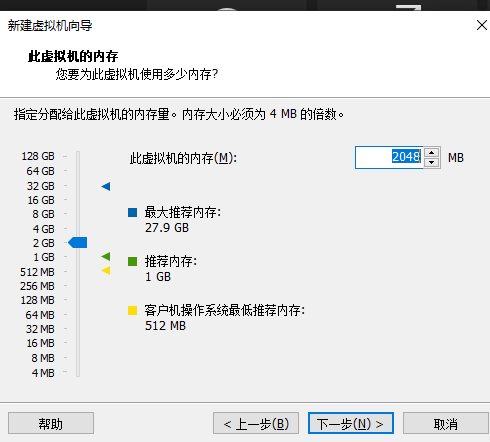
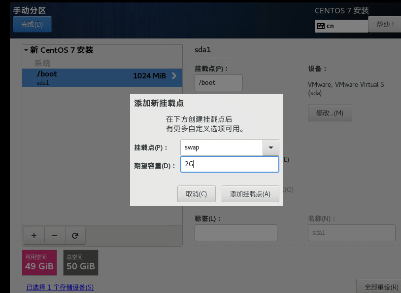

[toc]


# 创建虚拟机并安装系统


## 创建虚拟机关键步骤





##  安装系统


- ext4 第四代文件拓展系统，最大容量1EB，单个文件16GB
- xfs 新一代文件拓展系统，最大容量8EB

所以这里选择  ext4 和 xfs 都可以



- swap分区选内存的1倍-2倍都可以


## 初始化配置

### 更改主机名

```shell
vi /etc/hostname

# 通过命令 hostname 可以查看主机名，但修改主机名后要重启

# 也可以通过 以下命令设置，不需要重启
hostnamectl set- hostname xxxx 
```

> windows host 文件所在目录
>
> ```shell
> C:\Windows\System32\drivers\etc
> ```
>
> windows 权限不足不能替换时，在外面改好，替换进去

### 配置host

```shell
vim /etc/hosts

# 添加映射，比如下面这样
192.168.174.100 hadoop100
```


### 固定ip地址

网关IP 在这看


```shell
vi /etc/sysconfig/network-scripts/ifcfg-ens33

### 修改为：
TYPE="Ethernet"
PROXY_METHOD="none"
BROWSER_ONLY="no"
BOOTPROTO="static"  # 这个要改
DEFROUTE="yes"
IPV4_FAILURE_FATAL="no"
IPV6INIT="yes"
IPV6_AUTOCONF="yes"
IPV6_DEFROUTE="yes"
IPV6_FAILURE_FATAL="no"
IPV6_ADDR_GEN_MODE="stable-privacy"
NAME="ens33"
UUID="2ddeebba-6c37-4dd1-b280-bd616ba31cb0"
DEVICE="ens33"
ONBOOT="yes"
IPADDR=192.168.174.101   # 自己定义的
GATEWAY=192.168.174.2    # 通过虚拟机的  编辑-虚拟机网络编辑器-NAT- NAT设置 里面有个网关IP
DNS1=192.168.174.2   # 同网关IP


# 重启网络服务
systemctl restart netword

## 如果能ping通百度，重启虚拟机 使新的主机名生效
```


## 远程链接

```shell
ssh root@192.168.31.141 -p 37104
```


