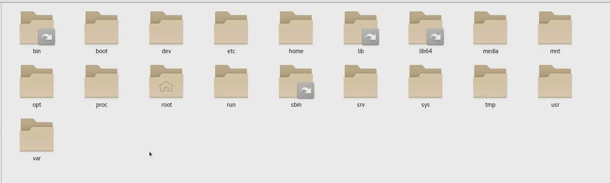
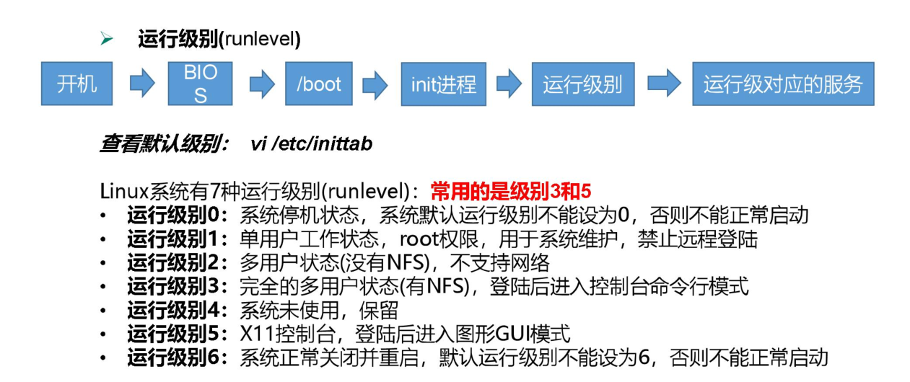

# linux文件系统与系统管理


## 目录结构

linux 的文件系统是采用级层式的树状目录结构，在此结构中的最上层是根目录“/”，然后在此目录下再创建其他的目录。

`/` 下的目录长这样：



首先说一下 usr ：**Unix System Resource**

```shell
##############   4 个软链接   ###########
/bin    # binary的缩写，这个目录存放着最常用的命令，软链接，链接到 /usr/bin
/sbin   # s是Super user的意思，这里存放系统管理员使用的系统管理程序，软连接，链接到 /usr/sbin
/lib    # 系统开机所需要最基本的动态连接共享库，其作用类似于Windows里的DLL文件。几乎所有的应用程序都需要用到这些共享库。 软链接，链接到 usr/lib
/lib64  # 存64位的动态链接，软链接，链接到 链接到 usr/lib64

############### 真正的目录   ###############
/boot   # 系统启动目录，保存系统启动相关的文件，如内核文件和启动引导程序( grub）文件等  
/dev    # 设备文件保存位置。Linux中所有内容以文件形式保存，包括硬件。那么这个目录就是用来保存所有硬件设备文件
/etc    # 配置文件保存位置。系统内所有采用默认安装方式(rpm安装）的服务的配置文件全部都保存在这个目录当中，如用户账户和密码，服务的启动脚本，常用服务的配置文件等
/home   # 用户主目录
/media  # 挂载目录。系统建议是用来挂载媒体设备的，例如软盘和光盘，不常用
/mnt    # 挂载目录，早期Linux中只有这一个挂载目录，并没有细分。现在这个目录系统建议挂载额外设备，如U盘，移动硬盘和其他操作系统的分区，现在不常用
/opt    # 第三方安装的软件保存位置。这个目录就是放置和安装其他软件的位置，我手工安装的源码包软件都可以安装到这个目录当中。但是我们习惯把软件放置到/usr/local目录当中，也就是说/usr/local/目录也可以用来安装软件
/root   # root用户主目录
/proc   # 虚拟文件系统，该目录中的数据并不保存到硬盘当中，而是保存到内存当中。主要保存系统的内核，进程，外部设备状态和网络状态灯。如/proc/cpuinfo是保存CPU信息的，/proc/devices是保存设备驱动的列表的，/proc/filesystems是保存文件系统列表的，/proc/net/是保存网络协议信息的
/run    # 运行信息，重启即消失，一般不动
/srv    # 服务数据目录。一些系统服务启动之后，可以在这个目录中保存所需要的数据
/sys    # 系统硬件信息
/tmp    # 临时目录。系统存放临时文件的目录，该目录下所有用户都可以访问和写入。我们建议此目录中不能保存重要数据，最好每次开机都把该目录清空
/var    # 动态数据保存位置。主要保存缓存、日志以及软件运行所产生的文件
```


## 服务启停

Centos 6 :

```shell
service 服务名  start|stop|restart|status 

中间的服务名，在  /etc/init.d 目录内
```


Cnetos 7:

```shell
systemctl start|stop|restart|status  服务名

服务名在  /usr/lib/systemd/system 目录内
```


## 系统运行级别

查看运行级别：

```shell
cat /etc/inittab

# 可以看到 这个不再启用了
# CentOS7  的运行级别简化为:
# multi-user.target 等价于原运行级别 3（多用户有网，无图形界面）
# graphical.target 等价于原运行级别 5（多用户有网，有图形界面）

# 查看当前运行级别
systemctl get-default

# 修改运行级别
systemctl set-default multi-user.target 
systemctl set-default graphical.target 
```




利用运行级别可以开关机

```shell
init 0 # 关机
init 6 # 重启
```


##  开机启动配置

```shell
# 停止开机自启
systemctl disable 服务名

# 开启开机自启
systemctl enable 服务名

# 查看所有开机自启服务
systemctl list-unit-files
```


## 关闭防火墙

```shell
# 查看防火墙状态
systemctl status firewalld

# 停止防火墙
systemctl stop firewalld

# 停止开机自启防火墙
systemctl disable firewalld
```


## 关机


```shell
shutdown [选项] 时间
选项： -c  取消关机命令
	  -h  关机
	  -r  重启
shutdown -h now  # 马上关机
shutdown # 1分钟后关机
shutdown -c # 取消关机计划
shutdown 3  # 3分钟后关机
shutdown  15:28  # 15.28分关机

poweroff  # 直接断电。。慎用
init 0
```

