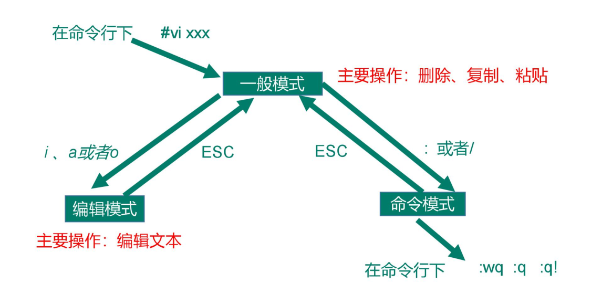

# VIM编辑器使用


## 三种编辑模式




## 插入操作

```shell
# a  在光标所在字符后插入
# A  在光标所在行尾插入
# i  在光标所在字符前插入
# I  在光标所在行行首插入
# o  在光标下插入新行
# O  在光标上插入新行
```


## 定位命令

```shell
#  :set nu    设置行号
#  :set nonu  取消行号
#  gg  	      到第一行
#  GG         到最后一行
#  nG         到指定的行
#  :n         到指定行
#  $          移至行尾
#  0          移至行首
```


## 删除命令

```shell
# x    删除光标所在处字符
# nx   删除光标所在处后 n 个字符
# dd   删除光标所在行，
# ndd  删除 n 行
# dG   删除光标所在行到文件末尾内容
# D    删除光标所在处到行尾内容
# :n1,n2d 删除指定范围的行
# dw   删除光标到后面第一个遇到的空格
```


## 复制和剪切命令

```shell
# yy   复制当前行
# nyy  复制当前行以下 n 行
# dd   剪切当前行
# ndd  剪切当前行以下 n 行
# p、P 粘贴在当前光标所在行下或行上
# np   粘贴n次

# y$  复制光标到本行结尾
# y^  复制本行开头到光标
# yw  复制当前单词
```


## 替换和取消命令

```shell
# r   取代光标所在处字符  替换一个
# R   从光标所在处开始替换字符，按 Esc 结束  往后一直是替换
# u   取消上一步操作
```


## 连续注释

```shell
# 连续行注释 
:n1,n2s/^/#/g   #行首注释
:n1,n2s/^#//g   # 行首去注释
:n1,n2s/^/\/\//g   # 行首加注释//
```


## 搜索和搜索替换命令

```shell
# /String	  搜索指定字符串; 搜索时忽略大小写 :set ic
# n 		  搜索指定字符串的下一个出现位置
# N  		  搜索指定字符串的上一个出现位置       

# 只替换一个
# s/old/new  替换光标所在行第一个old单词为new

# 替换当前行
: s/old/new/g  替换光标所在行所有 old 为 new

# 全文替换
: %s/old/new/g 全文替换指定字符串 tips:%s 

# 范围替换
# :n1,n2s/old/new/g 在一定范围内替换指定字符串
: 31,33s/AA/BB/g


# 起始行,终止行 s/要替换的字符串/替换的新的字符串/g   g不询问   c询问
```

## 保存和退出命令

```shell
# :w  保存修改
# :w new_filename  另存为指定文件
# :wq 保存修改并退出
# ZZ 快捷键，保存修改并退出
# :q! 不保存修改退出
# :wq! 保存修改并退出（文件所有者及 root 可使用）
```


## 总结一下：

删除用 d  ，剪切用x ，复制用  y ，粘贴统一用p，想去哪用 go 的 g

^代表行首，&代表行尾，g代表文件头，G代表文件尾，w 是word的缩写，