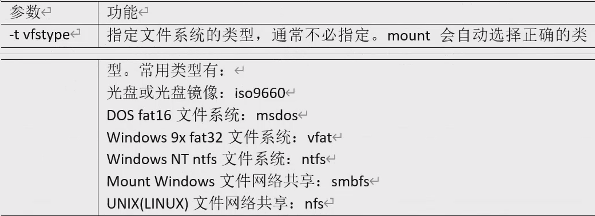
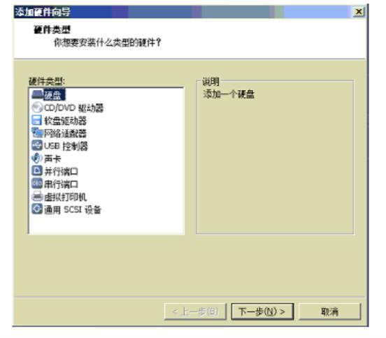
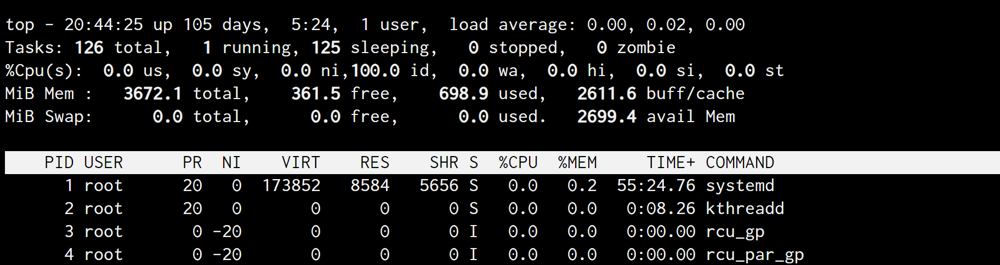

[toc]


# 常用命令


## 1. 帮助命令

命令名称：man

```shell
命令名称：man
命令英文原意：manual
命令所在路径：/usr/bin/man
执行权限：所有用户
语法：man [命令或配置文件]
    (空格) 或 f 翻页
    (Enter) 换行
    q 或 Q 退出
    / 搜索
功能描述：获得帮助信息
范例： 
man ls # 查看 ls 命令的帮助信息
man services # 查看配置文件 services 的帮助信息

# 用 whereis 搜索命令或配置帮助文档时，有时候有两个，如
# whereis 见查找命令
passwd: /usr/bin/passwd /etc/passwd  /usr/share/man/man1/passwd.1.gz   /usr/share/man/man5/passwd.5.gz   
# 其中 1 是命令的帮助  5是配置文件的帮助
# 此时若果你需要看配置文件的帮助：
man 5 passwd
```

命令：whatis   --- 命令帮助简短信息

```shell
命令：whatis
语法：whatis 命令
功能描述：获得命令的简单介绍信息
范例：what is ls
```

命令：apropos   --- 配置帮助简短信息

```shell
类似的：apropos
语法：apropos 配置文件
whatis 类似于精确查找
apropos 模糊查找关键字 [功能等于 man -k ][可以 tab 快速补全]
```

命令： --help

```shell
命令名称：help
命令所在路径：Shell 内置命令
执行权限：所有用户
语法：help 命令
功能描述：获得 Shell 内置命令的帮助信息
范例： 
help umask # 注意 这种方法得到的是shell内置命令的帮助,which 和 whereis 找不到的命令 
# 通过 man 一个shell内置命令可以看到全部shell内置命令，如
man cd
```


## 2. 文件目录类

### 2.1 目录命令

#### 命令名称：ls

```shell
命令名称：ls
命令英文原意：list
命令所在路径：/bin/ls
执行权限：所有用户
功能描述：显示目录文件
语法：ls 选项[-ald] [文件或目录]
     -a 显示所有文件，包括隐藏文件 all 所有的
     -l 详细信息显示 long 长格式显示
     -d 查看目录属性 如 ls -ld /etc
     -h 人性化显示  human人类
     -i 文件的ID号
```

ls -l 解释

```shell
# 权限 硬链接次数 所有者  所属组 大小  最后修改时间   文件/目录名
drwxrwxr-x  9    moon   moon  4096 3月  20 17:16 ./
drwxrwxr-x 17    moon   moon  4096 3月  17 22:28 ../
drwxrwxr-x  5    moon   moon  4096 3月   6 11:20 dataset/
drwxrwxr-x  3    moon   moon  4096 3月   6 11:08 .idea/

# 权限解释：
drwxrwxr-x  3 moon moon  4096 3月  20 17:14 networks/
-rw-rw-r--  1 moon moon  2455 3月   6 13:15 predict.py
lrwxrwxrwx   1 root root   39 1月   8 22:18 resolv.conf -> ../run/systemd/re....
# 第1位  d 表示 目录  - 表示文件  l 表示软链接
# 后9位： 所有者权限(u)  所属组权限(g)  其他人权限(o)
# r 读权限  w 写权限  x 执行权限
```

#### 命令名称：mkdir

```shell
命令名称：mkdir
命令英文原意：make directories
命令所在路径：/bin/mkdir
执行权限：所有用户
语法：mkdir -p [目录名]
功能描述：创建新目录-p 递归创建
范例： mkdir -p /tmp/Japan/boduo  # 递归创建
	  mkdir /tmp/Japan/longze /tmp/Japan/cangjing # 创建多个
```

#### 命令名称：cd

```shell
命令英文原意：change directory
命令所在路径：shell 内置
命令执行权限：所有用户
语法：cd [目录]
功能描述：切换目录
范例：   cd /tmp/Japan/boduo 切换到指定目录
		cd .. 回到上一级目录
		cd . 回到当前目录  当然没人这么用
```

#### 命令名称：pwd

```shell
命令名称：pwd
命令英文原意： print working directory
命令所在路径：/bin/pwd
参数： -P  抛开软连接干扰，打印真正目录
执行权限：所有用户
语法：pwd
功能描述：显示当前目录
范例： pwd
```

#### 命令名称：rmdir

```shell
# 人家说了是删除空的才行，多级目录用这个命令不好使。应该是用 rm -rf
命令英文原意：remove empty directories
命令所在路径：/bin/rmdir
执行权限：所有用户
语法：rmdir [目录名]
功能描述： 删除空目录
范例： rmdir /tmp/Japan/boduo
```

#### 命令名称：cp

```shell
命令名称：cp
命令英文原意：copy
命令所在路径：/bin/cp
执行权限：所有用户
语法：cp -rp [原文件或目录] [目标目录]
        -r 复制目录 
        -p 保留文件属性 就是最后修改日期
功能描述：复制文件或目录
范例： 
cp -r /tmp/Japan/cangjing /root # 将目录/tmp/Japan/cangjing 复制到目录/root 下
cp -rp /tmp/Japan/boduo /tmp/Japan/longze /root # 将/tmp/Japan 目录下的 boduo 和 longze 目录复制到/root 下，保持目录属性  多个文件复制到一个目录下
cp /tmp/Japan/buduo /root/wenjian  # 拷贝并改名
```

#### 命令名称：rm

```shell
命令名称：rm 
命令英文原意：remove
命令所在路径：/bin/rm
执行权限：所有用户
语法：rm -rf [文件或目录]
        -r 删除目录
        -f 强制执行
功能描述：删除文件
范例： rm /tmp/yum.log  # 删除文件/tmp/yum.log
       rm -rf /tmp/Japan/longze # 删除目录/tmp/Japan/longze 
```

#### 命令名称：mv

```shell
命令名称：mv # 剪切或更名 
命令英文原意：move
命令所在路径：/bin/mv
执行权限：所有用户
语法：rm [原文件或目录] [目标目录]
功能描述：剪切或更名
范例：  mv /tmp/Japan/cangjing /root # 剪切
       mv /tmp/Japan/longze /root/nvshen # 剪切并改名
```


### 2.2 文件命令

#### 命令名称：touch

```shell
命令名称：touch
命令所在路径：/bin/touch
执行权限：所有用户
语法：touch [文件名]
功能描述：创建空文件
范例：   touch Japanlovestory.list
```

#### 命令名称：cat

```shell
命令所在路径：/bin/cat
执行权限：所有用户
语法：cat [文件名]
功能描述：显示文件内容
	  -n 显示行号
范例：  cat /etc/issue 
	   cat -n /etc/services
	   tac /etc/issue # 倒着显示内容
```

#### 命令名称：more

```shell
命令名称：more
命令所在路径：/bin/more
执行权限：所有用户
语法：more [文件名]
        (空格) 或 f 翻页
        (Enter) 换行
        q 或 Q 退出
功能描述：分页显示文件内容
范例： more /etc/services
```

#### 命令名称：less

```shell
命令名称：less
命令所在路径：/usr/bin/less
执行权限：所有用户
语法：less [文件名]
功能描述：分页显示文件内容（可向上翻页） PageUp/PageDown可以上下翻页，↑↓可以翻行
与more的区别：动态加载入内存，more是一次全部打开
范例： less /etc/services
	  # tips: 按下 / 后可以输入搜索内容，回车开始搜索 搜索的内容会高亮，n下一个搜索
      # 按 q 退出（more 也可以） 
```

#### 命令名称：head

```shell
命令名称：head
命令所在路径：/usr/bin/head
执行权限：所有用户
语法：head [文件名]
功能描述：显示文件前面几行
        -n 指定行数
范例：
head -n 20 /etc/services
```

#### 命令名称：tail

```shell
tail
命令所在路径：/usr/bin/tail
执行权限：所有用户
语法：tail [文件名]
功能描述：显示文件后面几行
    -n 指定行数
    -f 动态显示文件末尾内容
范例： tail -n 18 /etc/services
```

### 2.3 链接命令

#### 命令名称：ln

```shell
命令名称：ln
命令英文原意：link
命令所在路径：/bin/ln
执行权限：所有用户
语法：ln -s [原文件] [目标文件]
    -s 创建软链接
功能描述：生成链接文件

范例：
ln -s /etc/issue /tmp/issue.soft  # 创建文件/etc/issue 的软链接/tmp/issue.sof
ln /etc/issue /tmp/issue.hard  # 创建文件/etc/issue 的硬链接/tmp/issue.hard 
```

软链接和硬链接的区别：

- 软链接类似指针
- 硬链接为拷贝+同步更新 （注意，不是引用，占两份硬盘空间）
- 硬链接和源文件有相同的文件ID
- 硬链接不能跨分区，不能链接目录

```shell
# 注意：删除软连接的时候，软连接名后面不要加/ ,因为这样会把 它链接到的目录下内容也删掉！！
rf -rf 软连接名
```


### 2.4 控制台和重定向：

#### 命令名称：echo

```shell
命令名称：echo
命令所在路径：/usr/bin
执行权限：所有用户
语法： echo [选项] [内容]
	-e :支持反斜线控制的字符转换
		\\  \本身
		\n   换行
		\t   制表符
范例：
echo -e "hello \n world"
echo $PATH # 输出PATH环境变量
```

#### 命令名称：>   >>

```shell
命令名称：>   覆写重定向
命令名称：>>   追加重定向

作用，将左侧结果   追加到  后面的目的地，目的地可以是文件
```

#### 命令名称：history

```shell
命令名称： history
命令功能： 查看当前shell的历史命令
history -c 清空所有历史

history 10  # 查看最近10条命令
  461  2022-10-30 19:21:53 man
  462  2022-10-30 19:22:02 man cp
  463  2022-10-30 19:25:21 whereis ls
  464  2022-10-30 19:28:22 type cd
此时在shell中 执行：  !464   就相当于执行了 type cd

```

## 3. 时间日期类

### 命令名称：date

```shell
命令名称：date
date +%Y   # 显示当前年份
date +%m   # 显示当前月份
date +%d   # 显示当前是哪一天
date +%s   # 当前时间的时间戳，以秒计数
date "+%Y-%m-%d %H:%M:%S" # 显示年月日时分秒
date -d '1 days ago'   # 显示前一天时间
date -d '-1 days ago'   # 显示明天时间
date -s "2017-06-19 20:52:18"  # 设置系统时间
```

命令名称：ntpdate

```shell
ntpdate 另一台linux的ip    与另一台电脑同步时间
# 详细设置详见 集群时间同步操作
```

命令名称：cal

```shell
命令名称：cal
查看日历
cal -3  查看近3个月日历 ，可以根据cal --help 看详细用法
```


## 4. 用户管理类

首先需要介绍三个 和用户相关的配置文件

- 用户信息文件  `/etc/passwd`
- 影子文件 `/etc/shadow`
- 组信息文件`/etc/group` 和 组密码文件 `/etc/gshadow`

### 4.1 用户信息文件

`/etc/passwd` 字段解释如下：

```shell
root:x:0:0:root:/root:/bin/bash
lishem:x:1001:1001::/home/lishem:/bin/bash

第 1 字段：用户名称
第 2 字段：密码标志 关联/etc/shadow
第 3 字段：UID（用户 ID）
	0： 超级用户
	1-499： 系统用户（伪用户）
	500-65535： 普通用户(centos7 从 1000 开始计算)
第 4 字段：GID（用户初始组 ID）[不推荐修改初始组]
	用户创建后默认有一个同名的初始组
	一个用户可以加入其他附加组，附加组可以有多个
	这个组ID 关联 /etc/group文件
第 5 字段：用户说明
第 6 字段：家目录
    普通用户：/home/用户名/
    超级用户：/root/
第 7 字段：登录之后的 Shell
	Shell 就是 Linux 的命令解释器
	在/etc/passwd当中，除了标准Shell是/bin/bash之外，
	还可以写如/sbin/nologin，/usr/bin/passwd 等。
	# 暂时禁用用户，可以把/bin/bash -> /bin/nologin
```

### 4.2 影子文件

`/etc/shadow` 字段解释如下：

```shell
root:$1$vnceluSQ$yEQpHHio9VkMmMa2IqfGU1:18993:0:99999:7:::

第 1 字段：用户名
第 2 字段：加密密码
	加密算法升级为 SHA512 散列加密算法
	如果密码位是“!!”或“*”代表没有密码，不能登录
第 3 字段：密码最后一次修改日期
	使用 1970 年 1 月 1 日作为标准时间，每过一天时间戳加 1
第 4 字段：两次密码的修改间隔时间（和第 3 字段相比）
第 5 字段：密码有效期（和第 3 字段相比）
第 6 字段：密码修改到期前的警告天数（和第 5 字段相比）
第 7 字段：密码过期后的宽限天数（和第 5 字段相比）
	0：代表密码过期后立即失效
	-1：则代表密码永远不会失效。
第 8 字段：账号失效时间
	要用时间戳表示
第 9 字段：保留

# 把时间戳换算为日期
date -d "1970-01-01 16066 days"

# 把日期换算为时间戳
echo $(($(date --date="2014/01/06" +%s)/86400+1))
```

### 4.3 组信息文件和组密码文件

组信息文件`/etc/group`

```shell
root:x:0:

第一字段：组名
第二字段：组密码标志
第三字段：GID
第四字段：组中附加用户
```

组密码文件`/etc/gshadow`

```shell
root:::

第一字段：组名
第二字段：组密码 (不推荐使用，可以理解为给组设置个小组长)
第三字段：组管理员用户名
第四字段：组中附加用户
```


### 4.4 用户命令

#### 命令名称：useradd

```shell
useradd [选项] 用户名
用户：添加用户
选项：
    -u UID： 手工指定用户的 UID 号
    -d 家目录： 手工指定用户的家目录
    -c 用户说明： 手工指定用户的说明
    -g 组名： 手工指定用户的初始组
    -G 组名： 指定用户的附加组
    -s shell： 手工指定用户的登录 shell。默认是/bin/bash

useradd lamp # 就是修改了5.1中的配置文件
useradd -u 1050 -g lamp1 -G root,bin -d /home/lamp1 -c "test user" -s /bin/bash lamp1 # 全参demo
```

useradd是根据默认配置来的，默认配置在  `/etc/default/useradd`中，内容如下：

```shell
# useradd defaults file
GROUP=100   # 用户默认组，现在一般这个不生效
HOME=/home   # 用户家目录
INACTIVE=-1  # 密码过期宽限天数，，shadow文件第7字段
EXPIRE=      # 密码失效时间，shadow文件第8字段
SHELL=/bin/bash   # 默认shell
SKEL=/etc/skel    # 模板目录
CREATE_MAIL_SPOOL=yes   # 是否建立邮箱
```

还有一个默认文件： `/etc/login.defs`:

```shell
MAIL_DIR	/var/spool/mail   # 邮箱目录

PASS_MAX_DAYS	99999  # 密码有效期
PASS_MIN_DAYS	0     # 密码修改间隔
PASS_MIN_LEN	8     # 密码最小8位，这个字段已经不生效了 PAM生效
PASS_WARN_AGE	7     # 密码到期警告

UID_MIN                  1000   # 最小和最大UID范围
UID_MAX                 60000
SYS_UID_MIN               201 
SYS_UID_MAX               999

GID_MIN                  1000
GID_MAX                 60000
SYS_GID_MIN               201
SYS_GID_MAX               999

CREATE_HOME	yes
UMASK           077
USERGROUPS_ENAB yes
ENCRYPT_METHOD SHA512    # 加密模式
```

#### 命令名称：passwd

```shell
passwd [选项] 用户名
用户 设置密码
选项：
    -S 查询用户密码的密码状态。仅 root 用户可用。
    -l 暂时锁定用户。仅 root 用户可用
    -u 解锁用户。仅 root 用户可用
    --stdin 可以通过管道符输出的数据作为用户的密码。
# passwd 如果什么都不加，就是修改当前用户密码

# 查看密码状态
passwd -S lamp
lamp PS 2013-01-06 0 99999 7 -1
# 用户名 密码设定时间（2013-01-06） 密码修改间隔时间（0） #密码有效期（99999 ） 警告时间（7） 密码不失效（-1）

# 锁定用户和解锁用户  其实就是在 /etc/passwd 这个用户密码前加了!!
passwd -l lamp
passwd -u lamp

# 使用字符串作为用户的密码
echo "123" | passwd --stdin lamp（shell 编程添加100个用户）

# 以下命令也可以修改密码
echo “新密码” | passwd --stdin 用户名
# 这种方式虽然简单，但是通过 history 命令可以查到用户的密码，所以不安全。
```

命令名称：id

```shell
id 用户名

uid=1000(lighthouse) gid=1000(lighthouse) groups=1000(lighthouse)
# 可以看到 该用户id ，组信息等，该命令可以看该用户存在不
```

#### 命令名称：usermod

```shell
usermod [选项] 用户名
修改用户信息
选项：
    -u UID： 修改用户的 UID 号
    -c 用户说明： 修改用户的说明信息
    -G 组名： 修改用户的附加组，添加到组，可以看下面的例子 lamp添加到root组
    -L： 临时锁定用户（Lock）
    -U： 解锁用户锁定（Unlock）
    
usermod -c "test user" lamp # 修改用户说明
usermod -G root lamp # 把 lamp 用户加入 root 组
usermod -L lamp # 锁定用户 其实就是在 /etc/passwd 这个用户密码前加了!
usermod -U lamp # 解锁用户
```

#### 命令名称：chage

```shell
chage [选项] 用户名
选项：
	-l： 列出用户的详细密码状态
	-d 日期： 修改密码最后一次更改日期（shadow3 字段）
	-m 天数： 两次密码修改间隔（4 字段）
	-M 天数： 密码有效期（5 字段）
	-W 天数： 密码过期前警告天数（6 字段）
	-I 天数： 密码过后宽限天数（7 字段）
	-E 日期： 账号失效时间（8 字段）
	
chage -d 0 lamp  # 这个命令其实是把密码修改日期归 0 了（shadow 第 3 字段）#这样用户一登陆就要修改密码
```

#### 命令名称：userdel

```shell
userdel [-r] 用户名
选项：
	-r 删除用户的同时删除用户家目录
	
手工删除用户:
vim /etc/passwd
vim /etc/shadow
vim /etc/group
vim /etc/gshadow
rm -rf /var/spool/mail/lamp
rm -rf /home/lamp/
```

#### 命令名称：su

切换用户，这个仅仅是切换用户，和下面的 sudo 区分开

```shell
su [选项] 用户名
英文单词：switch user 切换用户
选项：
	- ：选项只使用“-”代表连带用户的环境变量一起切换 (env 命令查看当前环境变量)
	-c 命令： 仅执行一次命令，而不切换用户身份
su – root  # 切换成 root
su - root -c "useradd user3"  # 不切换成 root，但是执行 useradd 命令添加 user1 用户

# 这种切换用户本质是通过bash 调用 bash 登陆操作的
# 所以如果想要回原来的用户，除了su 切换外，还可以 使用exit  退出本层 shell
```

#### 命令名称：sudo

```shell
命令含义：普通用户，以root身份临时执行某些root用户才能执行的操作
# 前提：普通用户在 sudoers 文件列表中
```

操作：将普通用户加入  sudoers 文件中，需要root用户来执行

```shell
visudo #  root用户操作  也可以：vim /etc/sudors 

# 用户名 被管理主机的地址=(可使用的身份)   授权命令(绝对路径)
# root用户拥有任何地方运行任何命令的权限
root	ALL=(ALL) 	ALL
#%组名 被管理主机的地址=（可使用的身份） 授权命令（绝对路径）
# 所有在 wheel 组的用户可以执行所有命令
%wheel	ALL=(ALL)	ALL

# 这个是说，在wheel组里的，执行一些 root 权限才能执行的命令 密码都不用输了
%wheel        ALL=(ALL)       NOPASSWD: ALL

# 所以 普通用户添加root权限就是，在下面加一行，名字改成 普通用户的名字
zhangsan	ALL=(ALL) 	ALL
```

然后切换回zhangsan用户：

```shell
sudo ls /root
# 输入  zhangsan 的密码，即可执行此命令
# 因为在配置文件中，zhangsan已经被认可，所以加 sudo 可以执行任何命令
```


### 4.5 用户组命令

#### 添加用户组：groupadd

```shell
groupadd [选项] 组名
选项：
	-g GID 指定组 ID
```

#### 修改用户组 ：groupmod

```shell
groupmod [选项] 组名
选项：
    -g GID 修改组 ID
    -n 新组名 修改组名
    
groupmod -n yxlm lol  # 把组名 lol 修改为 yxlm
```

#### 删除用户组 ：groupdel

```shell
groupdel [选项] 组名
# 删除组的时候，组内不允许有初始用户存在

groupadd lol
useradd -g lol timo
useradd -G lol yasuo
因为 timo 是初始组是 lol。删除 lol 会导致 timo 没有初始组。所以不可删。需要先删除用户。
而 yasuo 是附加组。可删。
```

#### 添加或离开组 ：gpasswd

```shell
gpasswd [选项] 组名
选项：
    -a 用户名： 把用户加入组
    -d 用户名： 把用户从组中删除
    
gpasswd -a zhangsan tgroup  # 张三加入组 tgroup
```


## 5. 权限管理

### 5.1 rwx常规权限

rwx作用在文件和目录的不同解释

```
作用到文件：
[ r ]代表可读(read): 可以读取，查看
[ w ]代表可写(write): 可以修改，但是不代表可以删除该文件，删除一个文件的前
提条件是对该文件所在的目录有写权限，才能删除该文件.
[ x ]代表可执行(execute):可以被系统执行

作用到目录
[ r ]代表可读(read): 可以读取，ls查看目录内容
[ w ]代表可写(write): 可以修改，目录内创建+删除+重命名目录
[ x ]代表可执行(execute):可以进入该目录
```

#### 命令名称：chmod

```shell
# 首先要知道，文件的权限只有所有者和root可以更改
命令名称：chmod
命令英文原意：change the permissions mode of a file
命令所在路径：/bin/chmod
执行权限：所有用户
语法：chmod [{ugoa}{+-=}{rwx}] [文件或目录]
            [mode=421 ] [文件或目录]
            -R 递归修改
功能描述：改变文件或目录权限

r=4 w=2 x=1 rwx=4+2+1=7
# 一般都用数字直接修改 3个位置的所有权限
chmod -R 777 xiyou/
```

#### 命令名称：chown

```shell
命令名称：chown
命令英文原意：change file ownership
命令所在路径：/bin/chown
			-r 递归执行
执行权限：root
语法：chown [用户] [文件或目录]
功能描述：改变文件或目录的所有者 
范例： 
chown lishem temp # 改变temp的所有者为lishem
chown root:lishem temp # temp原来所属组是root，现在给到lishem，注意，这个是所属组的！
```

#### 命令名称：chgrp

```shell
命令名称：chgrp
命令英文原意：change file group ownership
命令所在路径：/bin/chgrp
执行权限：root
语法：chgrp [用户组] [文件或目录]
功能描述：改变文件或目录的所属组
范例：
chgrp ourgroup temp  # 改变文件 temp 的所属组为 ourgroup
```

#### 命令名称：umask

```shell
命令名称：umask
命令英文原意：the user file-creation mask
命令所在路径：Shell 内置命令
执行权限：所有用户
语法：umask [-S]
	-S 以 rwx 形式显示新建文件缺省权限
功能描述：显示、设置文件的缺省权限
范例： 
umask # 直接显示权限，777减umask的值就是真正的缺省权限
umask -S # 显示新建文件的缺省权限，就是上面算出来的

# 目录的缺省权限 rwxr-xr-x
# 文件的缺省权限 rw-r--r--
# tips: 新建文件是默认没有 x 权限（比如：防止木马病毒攻击）
```

### 5.2 ACL权限

#### 5.2.1 ACL权限简介与开启

​	ACL 是 Access Control List 的缩写，主要的目的是在提供传统的 owner,group,others 的read,write,execute 权限之外的细部权限设定。ACL 可以针对单一使用者，单一文件或目录来进行r,w,x 的权限规范，对于需要特殊权限的使用状况非常有帮助。

​	简单说就是 单独对某一用户 赋予某种权限

查看分区 ACL 权限是否开启

```shell
df -h # 查看到需要查询的分区

Filesystem      Size  Used Avail Use% Mounted on
devtmpfs        1.9G     0  1.9G   0% /dev
tmpfs           1.9G   24K  1.9G   1% /dev/shm
tmpfs           1.9G  588K  1.9G   1% /run
tmpfs           1.9G     0  1.9G   0% /sys/fs/cgroup
/dev/vda1        79G  5.1G   71G   7% /
tmpfs           379M     0  379M   0% /run/user/0

# 查询是否有ACL权限
dumpe2fs -h /dev/vda1
# 若 Default mount options:    user_xattr acl 是这样的，就是开启了

# 临时开启分区 ACL 权限
mount -o remount,acl / # 重新挂在根分区，并挂载加入ACL权限

# 永久开启分区 ACL 权限
vim /etc/fstab
# 文件里面是这样的，有可能defaults 后面没有acl，手动加上
UUID=4b499d76-769a-40a0-93dc-4a31a59add28 /                       ext4    defaults,acl        1 1
mount -o remount /  # 重新挂载文件系统或重启动系统，使修改生效
```

#### 5.2.2 查看与设定ACL权限

 查看 ACL 命令

```shell
getfacl 文件名  # 查看acl权限
setfacl 选项 文件名 #  设定 ACL 权限的命令
选项：
    -m 设定 ACL 权限
    -x 删除指定的 ACL 权限
    -b 删除所有的 ACL 权限
    -d 设定默认 ACL 权限。
    -k 删除默认 ACL 权限
    -R 递归设定 ACL 权限。
```

来个例子演示

```shell
useradd zhangsan # 添加用户张三
useradd lisi  # 添加用户李四
useradd st  # 添加用户 st
groupadd tgroup  # 添加组 tgroup
gpasswd -a zhangsan tgroup  # 张三加入组 tgroup
gpasswd -a lisi tgroup  # 李四加入组 tgroup
mkdir /home/lishem/project  # 创建测试文件夹
chown root:tgroup /home/lishem/project   # 将测试文件夹的所属组改为tgroup
setfacl -m u:st:rx /home/lishem/project/  # 给用户 st 赋予 r-x 权限，
# 使用"u:用户名:权限"格式
# 使用"g:组名:权限"格式

drwxrwx---+ 2 root tgroup 4096 Mar 24 13:50 project/
可以看到 权限多了个+号，就是除了普通权限 还有acl权限的意思

# 查看一下现在acl权限：

# file: project/
# owner: root
# group: tgroup
user::rwx
user:st:r-x
group::rwx
mask::rwx
other::---


# 给组加一个acl权限吧：
setfacl -m g:tgroup2:rwx /home/lishem/project/
# 此时的acl权限如下
[root@VM-16-9-centos lishem]# getfacl project/
# file: project/
# owner: root
# group: tgroup
user::rwx
user:st:r-x
group::rwx
group:tgroup2:rwx
mask::rwx
other::---
```

#### 5.2.3 最大有效权限与删除ACL权限

最大有效权限 mask

mask 是用来指定最大有效权限的。如果我给用户赋予了 ACL 权限，是需要和 mask的权限“相与”才能得到用户的真正权限

修改最大有效权限

```shell
setfacl -m m:rx 文件名  #  设定 mask 权限为 r-x。使用“m:权限”格式
```

删除ACL权限：

```shell
setfacl -x u:用户名 文件名  # 删除指定用户的 ACL 权限
setfacl -x g:组名 文件名  # 删除指定用户组的 ACL 权限
setfacl -b 文件名 # 会删除文件的所有的 ACL 权限
```

#### 5.2.4递归ACL权限和 默认ACL权限

1. 递归ACL权限：

递归是父目录在设定 ACL 权限时，所有的子文件和子目录也会拥有相同的 ACL 权限。

```shell
setfacl -m u:用户名:权限 -R 目录名
# 只对当前现有目录有作用  ，例如新 h touch  的文件没有设定的权限
```

2. 默认ACL权限

递归设定完，新目录还是没权限啊，挺麻烦的，所以有默认ACL权限

- 默认 ACL 权限的作用是如果给父目录设定了默认 ACL 权限，那么父目录中所有新建的子文件(目录)都会继承父目录的 ACL 权限。

```shell
setfacl -m d:u:用户名:权限 文件名
```

这里需要注意，默认ACL不会修改现存的文件和目录，现存的还是需要递归去设定的

### 5.3 文件特殊权限

#### 5.3.1 SetUID

SetUID 的功能

- 只有**可以执行的二进制程序**才能设定 SUID 权限
- 命令执行者要对该程序拥有 x（执行）权限
- 命令执行者在执行该程序时获得该程序文件属主的身份（在执行程序的过程中灵魂附体为文件的属主）
- SetUID 权限只在该程序执行过程中有效，也就是说身份改变只在程序执行过程中有效

>```shell
># passwd 命令拥有 SetUID 权限，所以普通可以修改自己的密码
>ll /usr/bin/passwd 
>-rwsr-xr-x 1 root root 27856 Apr  1  2020 /usr/bin/passwd
># 所有者权限中的 s 就代表 suid权限
>```

>```shell
># cat 命令没有 SetUID 权限，所以普通用户不能查看/etc/shadow 文件内容
>ll /usr/bin/cat
>-rwxr-xr-x 1 root root 54080 Nov 17  2020 /usr/bin/cat
>```

```shell
# 设置SetUID的方法
4 代表 SUID
chmod 4755 文件名
chmod u+s 文件名

# 取消 SetUID 的方法
chmod 755 文件名
chmod u-s 文件名
```

危险的 SetUID

- 对系统中默认应该具有 SetUID 权限的文件作一列表，定时检查有没有这之外的文件被设置了 SetUID 权限

```shell
新建 gailun(盖伦)文件，赋予 s 权限
touch gailun
chmod 4755 gailun
ll
-rws sr-xr-x. 1 root root 0 4 月 1 17:22 gailun

然后去掉 s,x 权限。只保留 rw 权限。
chmod 644 gailun
-rw-r--r--. 1 root root 0 4 月 1 17:22 gailun

添加 s 权限（此处发现 S 为大写，这是报错，因为 gailun 文件没有 x 权限，对应命令执行者要对该程序拥有 x（执行）权限 ）
chmod u+s gailun
-rwSr--r--. 1 root root 0 4 月 1 17:22 gailun
```

#### 5.3.2 SetGID

SetGID 针对文件的作用：

- 只有**可执行的二进制程序**才能设置 SGID 权限
- 命令执行者要对该程序拥有 x（执行）权限
- 命令执行在执行程序的时候，组身份升级为该程序文件的属组
- SetGID 权限同样只在该程序执行过程中有效，也就是说组身份改变只在程序执行过程中有效

针对文件的例子：

```shell
ll /usr/bin/locate
-rwx--s--x 1 root slocate 35612 8 月 24 2010 /usr/bin/locate

ll /var/lib/mlocate/mlocate.db
-rw-r----- 1 root slocate 1838850 1 月 20 04:29 /var/lib/mlocate/mlocate.db

# /usr/bin/locate是可执行二进制程序，可以赋予SGID
# 执行用户lamp对/usr/bin/locate命令拥有执行权限
# 执行/usr/bin/locate命令时，组身份会升级为slocate组，而slocate组对/var/lib/mlocate/mlocate.db数据库拥有r权限，所以普通用户可以使用locate命令查询mlocate.db数据库
# 命令结束，lamp用户的组身份返回为lamp组
```

SetGID 针对目录的作用：

- 普通用户必须对此目录拥有 r 和 x 权限，才能进入此目录
- 普通用户在此目录中的有效组会变成此目录的属组
- 若普通用户对此目录拥有 w 权限时，新建的文件的默认属组是这个目录

```shell
cd /tmp
mkdir dtest
chmod g+s dtest
ll -d dtest/
drwxr-sr-x 2 root root 4096 Mar 24 16:22 dtest/
chmod 777 dtest
drwxrwsrwx 2 root root 4096 Mar 24 16:22 dtest/

su - lamp
cd /tmp/dtest
touch abc
ll

-rw-rw-r-- 1 lamp root 0 Mar 24 16:25 aaa
# 可以看出 所有者是lamp 所属组是 root
```

```shell
#  设定 SetGID
2 代表 SGID
chmod 2755 文件名
chmod g+s 文件名

# 取消 SetGID
chmod 755 文件名
chmod g-s 文件名
```

#### 5.3.3 Stick BIT

SBIT黏着位作用：(简单来说是防止删除)

- 粘着位目前只对**目录有效**
- 普通用户对该目录拥有 w 和 x 权限，即普通用户可以在此目录拥有写入权限
- 如果没有粘着位，因为普通用户拥有 w 权限，所以可以删除此目录下所有文件，包括其他用户建立的文件。一但赋予了粘着位，除了 root 可以删除所有文件，普通用户就算拥有 w 权限，也只能删除自己建立的文件，但是不能删除其他用户建立的文件

> 只用 root 和文件拥有者可以修改删除某文件。其他用户无法操作。

```shell
# 有SBIT的目录是 /tmp 目录
drwxrwxrwt. 9 root root 4096 Mar 24 16:25 /tmp
```

设置和取消黏着位

```shell
# 设置粘着位
chmod 1755 目录名
chmod o+t 目录名
# 取消粘着位
chmod 777 目录名
chmod o-t 目录名
```

### 5.4 文件系统属性chattr权限

```shell
# chattr 命令格式  相当于锁文件，root也无法更改
chattr [+-=] [选项] 文件或目录名
	+:增加权限
	-:删除权限
	=:等于权限
chattr +i abc
选项：
	i:如果对文件设置 i 属性，那么不允许对文件进行删除、改名，也不能添加和修改数据；
	  如果对目录设置 i 属性，那么只能修改目录下文件的数据，但不允许建立和删除文件。
	a:如果对文件设置 a 属性，那么只能在文件中增加数据，但是不能删除也不能修改数据；
	  如果对目录设置 a 属性，那么只允许在目录中建立和修改文件，但是不允许删除
```

```shell
# 查看文件系统属性
lsattr 选项 文件名
选项：
	-a 显示所有文件和目录
	-d 若目标是目录，仅列出目录本身的属 性，而不是子文件的
```


## 6. 搜索查找类

#### 命令名称：find

```shell
命令名称：find
命令所在路径：/bin/find
执行权限：所有用户
语法：find [搜索范围] [匹配条件]
	 -name 按名字查找
	 -iname 按名字查找 不区分大小写
	 -size 按大小查找 +n 大于 -n 小于  n 等于
	 -user  按所有者查找
	 -group 按所属组查找
	 -amin  按最后访问时间查找
	 -cmin  按文件属性修改时间查找
	 -mmin  文件内容修改时间查找
	 -type  根据文件类型查找 f 文件 d 目录 l 软链接
	 -inum  根据文件id查找  找硬链接可以用这个方法
功能描述：文件搜索
范例：
find -name init # 在当前目录查找init
find /etc -name init  # 在目录/etc 中查找文件 init
find /etc -name *init*  # 在目录/etc 中查找文件名包含 init
find /etc -name init??？  # 在目录/etc 中查找文件名 init 开头并有 3 个字符的
find /etc -name init* # 在目录/etc 中查找文件名 init 开头的
# tips:* 匹配任意字符，?匹配单个字符
find / -size +204800  # 在根目录下查找大于 100MB 的文件
find /home -user shenchao  # 在/home 下查找所有者为 shenchao 的文件
find /etc -cmin -5  # 在/etc 下查找 5 分钟内被修改过属性的文件和目录

# -a 两个条件同时满足  -o 两个条件满足一个即可
find /etc -size +163840 -a -size -204800 # 在/etc 下查找大于 80MB 小于 100MB 的文件
find /etc -name init* -a -type f # 在/etc下查找名字以init开头的，并且是文件的
find /etc -name inittab -exec ls -l {} \  # 在/etc 下查找 inittab 文件并显示其详细信息
# -exec/-ok  命令 {} \;    是固定的

find /etc -name init* -a -type f -exec ls -l {} \; # 查找文件 init*，并且 ls -l 输出
```

#### 命令名称：locate

```shell
命令名称：locate
命令所在路径：/usr/bin/locate
执行权限：所有用户
语法：locate 文件名
功能描述：在文件资料库中查找文件
# 资料库在 /var/lib/mlocate/mlocate.db
范例： locate inittab
# 新建文件 locate 不到，可以 updatedb  ,更新文件资料库后查找[tmp 不在文件资料库内]
locate -i masichun.json #  -i 作用你不区分大小写类似 -iname

# 使用updatedb 可以更新 /var/lib/mlocate/mlocate.db 文件，没事别更新。。
```

#### 命令名称：which

```shell
命令名称：which
命令所在路径：/usr/bin/which
执行权限：所有用户
语法：which 命令
功能描述：搜索命令所在目录及别名信息
范例：$ which ls
```

#### 命令名称：whereis

```shell
命令名称：whereis
命令所在路径：/usr/bin/whereis
执行权限：所有用户
语法：whereis [命令名称]
功能描述：搜索命令所在目录及帮助文档路径
范例：$ whereis ls
```

#### 命令名称：grep和 管道符

```shell
命令名称：grep
命令所在路径：/bin/grep
执行权限：所有用户
语法：grep -iv [指定字串] [文件]
功能描述：在文件中搜寻字串匹配的行并输出
	-i 不区分大小写
	-v 排除指定字串
	-n  查找出来加行号
范例：
grep mysql /root/install.log  # 在 install.log 中查找包含mysql的那一行
grep -v ^# /etc/inittab 去除以#开头的所有行信息,^表示以 XXX 开头
grep -n abc install.log

# 这个命令经常与管道符| 配合使用
管道符，|，表示将前一个命令的处理结果输出传递给后面的命令处理
ls | grep -n test
```

#### 命令名称：wc

```shell
命令名称：wc
命令所在路径:/usr/bin/wc
执行权限：所有用户
语法： wc 文件名
用于统计 文件中的 行数、单词书、字符数
```


## 7. 压缩解压类

### 7.1 gzip/gunzip

针对 `.gz`文件，单文件压缩

#### 命令名称：gzip

```shell
命令名称：gzip
命令英文原意：GNU zip
命令所在路径：/bin/gzip
执行权限：所有用户
语法：gzip [文件]
功能描述：压缩文件
	压缩后文件格式：.gz
gzip a.java   => 得到 a.java.gz
```

#### 命令名称：gunzip

```shell
命令名称：gunzip [= gzip -d]
命令英文原意：GNU unzip
命令所在路径：/bin/gunzip
执行权限：所有用户
语法：gunzip [压缩文件]
功能描述：解压缩.gz 的压缩文件
范例： 
gunzip a.java.gz  => 得到 a.java
```

### 7.2   zip/unzip

针对 `.zip` 文件 ，可以压缩文件

#### 命令名称：zip

```shell
命令名称：zip
命令所在路径：/usr/bin/zip
执行权限：所有用户
语法：
zip 选项[-r] [压缩后文件名] [文件或目录]
    -r 压缩目录
功能描述：压缩文件或目录
压缩后文件格式：.zip
范例：
zip buduo.zip boduo  # 压缩文件
zip -r Japan.zip Japan  # 压缩目录
# 会保留原文件
```

#### 命令名称：unzip

```shell
命令名称：unzip
命令所在路径：/usr/bin/unzip
执行权限：所有用户
语法：unzip [压缩文件]
功能描述：解压.zip 的压缩文件
范例：
unzip test.zip
```

### 7.3 tar

#### 命令名称：tar

```shell
命令名称：tar
命令所在路径：/bin/tar
执行权限：所有用户
语法：tar 选项[-zcf] [压缩后文件名] [目录]
    -c 打包
    -x 解包
    -v 显示详细信息
    -f 指定文件名
    -z 打包同时压缩 gz格式压缩
    -j 打包同时压缩 bz2 格式压缩
    -C 解压到指定目录
功能描述：打包目录 压缩后文件格式：.tar.gz

# 压缩目录
tar -zcvf Japan.tar.gz Japan
# 压缩多个文件
tar -zcvf houma.tar.gz houge.txt bailongma.txt

# 解压到当前文件夹
tar -zxvf  Japan.tar.gz
# 解压到指定目录
tar -zxvf jdk-8u212-linux-x64.tar.gz -C /opt/module/  
```

### 7.4 bzip2/bunzip2

#### 命令名称：bzip2

```shell
命令名称：bzip2
命令所在路径：/usr/bin/bzip2
执行权限：所有用户
语法： bzip2 选项 [-k] [文件]
		-k 产生压缩文件后保留原文件
功能描述：压缩文件
压缩后文件格式：.bz2
范例：
bzip2 -k boduo
tar -cjf Japan.tar.bz2 Japan
```

#### 命令名称：bunzip2

```shell
命令名称：bunzip2
命令所在路径：/usr/bin/bunzip2
执行权限：所有用户
语法： bunzip2 选项 [-k] [压缩文件]
		-k 解压缩后保留原文件
功能描述：解压缩
范例：
bunzip2 -k boduo.bz2
tar -xjf Japan.tar.bz2
```


## 8. 磁盘管理类

### 8.1 查看磁盘状态

#### 命令名称：du

```shell
du [选项] [目录或文件名]
命令英文原意： disk usage
选项：
    -a 显示每个子文件的磁盘占用量。默认只统计 子目录的磁盘占用量
    -h 使用习惯单位显示磁盘占用量，如 KB，MB 或 GB 等
    -c 显示所有的文件和子目录大小后，显示总和
    -s 只统计总占用量，而不列出子目录和子文件的 占用量
    --max-depth=n   指定统计子目录的深度为第 n 层
# 看目录占用空间就用这个    
du -sh /etc
```

#### 命令名称：df

```shell
df [选项] [挂载点]
命令英文原意： disk free
选项：
    -a 显示所有的文件系统信息，包括特殊文件系统，如 /proc、/sysfs
    -h 使用习惯单位显示容量，如 KB，MB 或 GB 等
    -T 显示文件系统类型
    -m 以 MB 为单位显示容量
    -k 以 KB 为单位显示容量。默认就是以 KB 为单位
```

du命令和df命令的区别：

- df 命令是从文件系统考虑（面向硬件）的，不光要考虑文件占用的空间，还要统计被命令或程序占用的空间（最常见的就是文件已经删除，但是程序并没有释放空间
- du 命令是面向文件的，**只会计算文件或目录占用的空间**

#### 命令名称：free

```shell
free [选项]
	-m  按mb显示
	-h  人性化显示
              total        used        free      shared  buff/cache   available
Mem:            15G        2.2G        158M         14M         13G         12G
Swap:          1.9G        196M        1.7G

# cached（缓存）：是指把读取出来的数据保存在内存当中，当再次读取时，不用读取硬盘而直接从内存当中读取，加速了数据的读取过程
# buffer（缓冲）：是指在写入数据时，先把分散的写入操作保存到内存当中，当达到一定程度再集中写入硬盘，减少了磁盘碎片和硬盘的反复寻道，加速了数据的写入过程
```


#### 命令名称：fsck

```shell
# 系统自己完成，一般不需要自己去做
fsck [选项] 分区设备文件名 
文件系统修复命令
选项： 
	-a：不用显示用户提示，自动修复文件系统 
	-y：自动修复。和-a 作用一致，不过有些文件系统只支 持-y
```

####  命令名称：dumpe2fs

```shell
dumpe2fs 分区设备文件名
显示磁盘状态命令
如： dumpe2fs /dev/vda1
# dumpe2fs 命令为 ext 文件系统家族的命令，
# 若系统为CentOS7，文件系统为 XFS ， XFS 默认支持 ACL。
# 可以使用 xfs_info /dev/xxx 查看'XFS`文件系统信息。
```


### 8.2 挂载相关命令

#### 命令名称：lsblk

```shell
lsblk   查看设备挂载情况
	-f  查看详细的设备挂载情况，显示文件系统信息
```

对于Linux用户来讲，不论有几个分区，分别分给哪一个目录使用，它总归就是一个根目录、一个独立且唯一的文件结构。

Linux中每个分区都是用来组成整个文件系统的一部分，它在用一种叫做**挂载**的处理方法，它整个文件系统中包含了一整套的文件和目录，并将一个分区和一个目录联系起来，要载入的那个分区将使它的存储空间在这个目录下获得。

#### 命令名称：mount

```shell
mount [-t 文件系统] [-L 卷标名] [-o 特殊选项] 设备文件名 挂载点
选项：
	-t 文件系统：加入文件系统类型来指定挂载的类型，可以 ext3、ext4、iso9660等文件系统
	-L 卷标名： 挂载指定卷标的分区，而不是安装设备文件名挂载
	-o 特殊选项：可以指定挂载的额外选项，具体见下表
	
# 这个命令最主要的作用就是将设备文件名和 挂载点 连接起来
```

- -t 的选项



- -o 的选项

| 参数          | 说明                                                         |
| ------------- | ------------------------------------------------------------ |
| atime/noatime | 更新访问时间/不更新访问时间。访问分区文件时，是否更新文件的访问时间，默认为更新 |
| async/sync    | 异步/同步,默认为异步                                         |
| auto/noauto   | 自动/手动，mount -a命令执行时，是否会自动安装/etc/fstab文件内容挂载，默认为自动 |
| defaults      | 定义默认值，相当于rw,suid,dev,exec,auto,nouser,async这七个选项 |
| exec/noexec   | 执行/不执行，设定是否允许在文件系统中执行可执行文件，默认是exec允许 |
| remount       | 重新挂载已经挂载的文件系统，一般用于指定修改特殊权限         |
| rw/ro         | 读写/只读，文件系统挂载时，是否具有读写权限，默认是rw        |
| suid/nosuid   | 具有/不具有SUID权限，设定文件系统是否具有SUID和SGID的权限，默认是具有 |
| user/nouser   | 允许/不允许普通用户挂载，设定文件系统是否允许普通用户挂载,默认是不允许，只有root可以挂载分区 |
| userquota     | 写入代表文件系统支持用户磁盘配额，默认不支持写入代表文件系统支持组磁盘配额，默认不支持 |
| grpquota      | 写入代表文件系统支持组磁盘配额，默认不支持写入代表文件系统支持组磁盘配额，默认不支持 |


来一套挂载：

```shell
# 添加新硬件后，使用 lsblk 命令

[root@studylinux ~]# lsblk
NAME   MAJ:MIN RM  SIZE RO TYPE MOUNTPOINT
sda      8:0    0   50G  0 disk 
├─sda1   8:1    0    1G  0 part /boot
├─sda2   8:2    0    2G  0 part [SWAP]
└─sda3   8:3    0   47G  0 part /
sr0     11:0    1  918M  0 rom 


# 可以看到，系统已经识别到新设备 sr0 ,但是此时 sr0没有挂载点
# 创建挂载目录
mkdir /mnt/cdrom
# 执行 mount 命令进行挂载
mount sr0  /mnt/cdrom

# 重新挂在home分区，让它不具有可执行权限
mount -o remount,noexec /home
# 改回来。。
mount -o remount,exec /home

# 光盘 系统自动监测一般为 cdrom 或 sr0    cdrom 为sr0的软连接
# 创建挂载点
mkdir /mnt/cdrom/
# 挂载光盘
mount -t iso9660 /dev/cdrom /mnt/cdrom/
# 或者
mount /dev/cdrom /mnt/cdrom/
```

#### 命令名称：umount

```shell
umount 设备文件名或挂载点 二选一
umount /mnt/cdrom
```


#### 自动挂载

修改 `/etc/fstab` 文件

```shell
# /home was on /dev/sda5 during installation
UUID=d557cdb3-6cfc-4a21-a982-39339ce4acd0 /home           ext4    defaults        0       2

第一字段：分区设备文件名或 UUID（硬盘通用唯一识别码）,这个UUID查询 ：dumpe2fs -h /dev/sdb1 查到的 Filesystem UUID 字段，也可以直接写设备名称
第二字段：挂载点
第三字段：文件系统名称
第四字段：挂载参数
第五字段：指定分区是否被 dump 备份，0 代表不备份，1 代表每天备份，2 代表不定期备份 备份在 lost+found目录
第六字段：指定分区是否被 fsck 检测，0 代表不检测，其他数字代表检测的优先级，那么当然 1 的优先级比 2 高
```

### 8.3 磁盘分区

1、添加新硬盘



添加了硬盘以后机器需要重启

2、查看新硬盘

```shell
lsblk # 也行
fdisk -l
```

3、使用 fdisk 命令分区

```shell
fdisk /dev/sdb  # sdb 就是新硬盘在dev中的显示 这里是给硬盘分区，所以就是sdb  后面没数字

# 命令提示出来后  选n就是新建分区 然后按提示走
```

fdisk 交互指令说明

| 命令 | 说明                                                      |
| ---- | --------------------------------------------------------- |
| a    | 设置可引导标记                                            |
| b    | 编辑bsd磁盘标签                                           |
| c    | 设置DOS操作系统兼容标识                                   |
| d    | 删除一个分区                                              |
| l    | 显示已知的文件系统类型。82为Linux swap分区，83为Linux分区 |
| m    | 显示帮助菜单                                              |
| n    | 新建分区                                                  |
| o    | 建立空白DOS分区表                                         |
| p    | 显示分区列表                                              |
| q    | 不保存退出                                                |
| s    | 新建空白SUN磁盘标签                                       |
| t    | 改变一个分区的系统ID                                      |
| u    | 改变显示记录单位                                          |
| v    | 验证分区表                                                |
| w    | 保存退出                                                  |
| x    | 附加功能（仅专家)                                         |

4、 重新读取分区表信息

```shell
partprobe
```

5、 格式化分区

```shell
mkfs -t ext4 /dev/sdb1  # 这里是格式化分区，不是硬盘，所以后面有数字了。仅能格式化主分区和逻辑分区
```

6、 建立挂载点并挂载

```shell
mkdir /disk1
mount /dev/sdb1 /disk1/

# 使用mount 或者 df 命令看分区是否正常挂载
# 使用 fdisk -l 命令只能看到分区是否被正常分配
```

自动挂载 看上一节

## 9. 进程管理类

### 9.1 服务管理

#### 命令名称：service

```shell
centos6.x 的服务管理
用法： service 服务名 start | stop |restart | status
服务名是  /etc/init.d  下面的内容
```

#### 命令名称：chkconfig

```shell
centos6.x 设置后台服务自启

chkconfig 			# 查看所有服务器自启配置
chkconfig 服务名 off  # 关掉指定服务的自动启动
chkconfig 服务名 on   # 开启指定服务的自动启动
chkconfig 服务名 --list # 查看服务开机启动状态
```

#### 命令名称：systemctl

```shell
centos7+ 的服务管理
用法： systemctl start | stop | restart | status 服务名
服务名是  /usr/lib/systemd/system   下的内容  一般是  xxx.service


# 停止开机自启
systemctl disable 服务名
# 开启开机自启
systemctl enable 服务名
# 查看所有开机自启服务
systemctl list-unit-files
```


### 9.2 进程管理

#### 命令名称：ps

```shell
命令名称：ps
英文： process status 进程状态
命令作用：查看进程状态
参数：
	a 列出带有终端的所有用户的进程
	x 列出当前用户的所有进程，包括没有终端的进程
	u 面向用户友好的显示风格
	-e 列出所有进程
	-u 列出某个用户关联的所有进程
	-f 显示完整格式的进程列表
	
# 一般用法
ps aux |grep xxx  # 查看系统中所有进程，主要是看资源占用率
ps -ef |grep xxx  # 可以查看子父进程之间的关系

ps aux 结果含义：
USER：该进程是由哪个用户产生的
PID：进程的 ID 号
%CPU：该进程占用 CPU 资源的百分比，占用越高，进程越耗费资源；
%MEM：该进程占用物理内存的百分比，占用越高，进程越耗费资源；
VSZ：该进程占用虚拟内存的大小，单位 KB；
RSS：该进程占用实际物理内存的大小，单位 KB；
TTY：该进程是在哪个终端中运行的。对于 CentOS 来说，tty1 是图形化终端，tty2-tty6 是本地的字符界面终端。pts/0-255 代表虚拟终端。
STAT：进程状态。常见的状态有：R：运行状态、S：睡眠状态、T：暂停状态、Z：僵尸状态、s：包含子进程、l：多线程、+：前台显示
START：该进程的启动时间
TIME：该进程占用 CPU 的运算时间，注意不是系统时间
COMMAND：产生此进程的命令名


ps -ef 显示信息说明
UID：用户 ID
PID：进程 ID
PPID：父进程 ID
C：CPU 用于计算执行优先级的因子。数值越大，表明进程是 CPU 密集型运算，
执行优先级会降低；数值越小，表明进程是 I/O 密集型运算，执行优先级会提高
STIME：进程启动的时间
TTY：完整的终端名称
TIME：CPU 时间
CMD：启动进程所用的命令和参数
```

#### 命令名称：kill

```shell
kill  终止进程
用法： 
kill [选项] 进程号
killall 进程名称
	-9  强制关闭进程
	-l  列举所有信号值
```

#### 命令名称：pstree

```shell
需要手动安装  pstree
yum install pstree

直接执行  pstree  可以看到当前进程树
参数：  -p  显示进程PID
	   -u  显示进程所属用户
```

#### 命令名称：netstat

```shell
netstate  显示网络 状态和 端口占用 信息
选项
    -a 显示所有正在监听（listen）和未监听的套接字（socket）
    -n 拒绝显示别名，能显示数字的全部转化成数字
    -l 仅列出在监听的服务状态
    -p 表示显示哪个进程在调用
使用：
netstat -anp | grep 进程号  # 查看该进程网络信息
netstat –nlp | grep 端口号  # 查看网络端口号占用情况
```


### 9.3 实时监控命令

#### 命令名称：top

```shell
命令名称：top
选项：
	-d 秒数 指定 top 命令每隔几秒更新。默认是 3 秒在 top 命令的交互模式当中可以执行的命令：
	-i 使 top 不显示任何闲置或者僵死进程。
	-p 通过指定监控进程 ID 来仅仅监控某个进程的状态。
	
操作：
P 以 CPU 使用率排序，默认就是此项
M 以内存的使用率排序
N 以 PID 排序
U 选定某个用户
q 退出 top
```



```shell
# 解释：
# 第一行   
top： 	    # 本身命令名称
20:44:24     # 当前时间
up 105 days  # 启动了105天
1 user     	 # 当前登陆正在使用的用户数
load average: 0.00, 0.02, 0.00     # 平均负载，过去1分钟，5分钟，15分钟的负载  大于1表示超负荷


# 第二行  主要是当前进程数
Tasks: 126 total,     # 总进程数
1 running,            # 1 运行
125 sleeping,         # 125 睡眠
0 stopped,            # 0 停止
0 zombie              # 0 僵尸

# 第三行  CPU占用
%Cpu(s): 
0.2 us,    # 用户进程占用CPU 时间比
0.2 sy,    # 系统进程占用CPU 时间比
0.0 ni,    # 经过nice 命令调整后 的用户进程 占用CPU时间比
99.5 id,   # CPU空闲时间
0.1 wa,    # 等待 IO操作占用时间比
0.0 hi,    # 硬件中断请求时间占比
0.0 si,    # 软中断请求时间占比
0.0 st     # 被虚拟化 占用CPU的时间占比

# 第四行 内存占用
MiB Mem :   3672.1 total,    360.7 free,    699.0 used,   2612.3 buff/cache

# 第五行 交换内存占用
MiB Swap:      0.0 total,      0.0 free,      0.0 used.   2699.3 avail Mem 


# 表头
PID    USER    PR               NI               VIRT             RES
进程ID  用户 任务调度优先级  用户指定的优先级     虚拟内存占用大小    物理内存占用大小

	SHR              S            %CPU          %MEM     TIME+          COMMAND 
共享内存占用大小     进程状态   CPU计算时间占比   内存占用   占用CPU时间     生成当前进程命令

```


### 9.4crontab 定时任务

#### 命令名称：crontab

```shell
# 使用这个命令首先要确定 cornd服务是启动的
systemctl status crond

命令：crontab
选项：
	-e 编辑crontab定时任务
	-l 查询crontab任务
	-r 删除当前用户所有crontab任务
	
# 举例	
crontab -e
# 进入 crontab 编辑界面。会打开 vim 编辑你的工作。
# 第一个 *  一小时当中的第几分钟 0-59
# 第二个 *  一天当中的第几小时 0-23
# 第三个 *  一个月当中的第几天 1-31
# 第四个 *  一年当中的第几月 1-12
# 第五个 *  一周当中的星期几 0-7（0 和 7 都代表星期日）

# * 代表任何时间。比如第一个 * 就代表一小时中每分钟都执行一次的意思。
# ， 代表不连续的时间。比如“0 8,12,16 * * * 命令”，就代表在每天的 8 点 0 分，12 点 0 分，16 点 0 分都执行一次命令
# - 代表连续的时间范围。比如 0 5 * * 1-6 命令 ，代表在周一到周六的凌晨 5 点 0 分执行命令
# */n 代表每隔多久执行一次。比如 */10 * * * * 命令，代表每隔 10 分钟就执行一遍命令


# 45 22 * * * 命令 每天 22 点 45 分执行命令
# 0 17 * * 1 命令 每周 1 的 17 点 0 分执行命令
# 0 5 1,15 * * 命令 每月 1 号和 15 号的凌晨 5 点 0 分执行命令
# 40 4 * * 1-5 命令 每周一到周五的凌晨 4 点 40 分执行命令
# */10 4 * * * 命令 每天的凌晨 4 点，每隔 10 分钟执行一次命令
# 0 0 1,15 * 1 命令 每月 1 号和 15 号，每周 1 的 0 点 0 分都会执行命令。注意：星期几和几号最好不要同时出现，因为他们定义的都是天。非常容易让管理员混乱


# 每分钟 输出一个 hello world 在  /root/hello 中
*/1 * * * * echo "hello world" >> /root/hello
```


