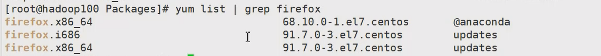

# 软件包管理


## 1. RMP安装

也不知道为啥 说有违规内容
这部分也不重要，知道 YUM安装也是基于RPM的就够了


## 2. YUM安装

### 2.1 修改网络YUM源

centos7:

```shell
cd /etc/yum.repos.d

yum install wget
cp CentOS-Base.repo CentOS-Base.repo.backup

# 二选一
wget http://mirrors.aliyun.com/repo/Centos-7.repo   # 阿里云
wget http://mirrors.163.com/.help/CentOS7-Base-163.repo   # 网易云

# 二选一
mv CentOS7-Base-163.repo CentOS-Base.repo
mv Centos-7.repo CentOS-Base.repo

# 清理旧缓存数据，缓存新数据
yum clean all
# 把服务器的包信息下载到本地电脑缓存起来
yum makecache
```

centos8:

```shell
# centos8 最小化安装完成 yum配置是有问题的，依次执行以下命令即可解决


# 就是删除  /etc/yum.repos.d 内的所有东西
cd /etc/yum.repos.d
rm -rf *

curl -o /etc/yum.repos.d/CentOS-Base.repo https://mirrors.aliyun.com/repo/Centos-vault-8.5.2111.repo
curl -o /etc/yum.repos.d/CentOS-epel.repo https://mirrors.aliyun.com/repo/epel-archive-8.repo

yum clean all
yum makecache
```


### 2.2 yum命令


```shell
yum  [选项] [参数]

选项：
	-y   对所有提问都回答yes
参数：
    install 安装 rpm软件包
    update 更新 rpm软件包
    check-update 检查是否有可用的更新 rpm软件包
    remove 删除指定的 rpm 软件包
    list 显示软件包信息
    clean 清理 yum 过期的缓存
    deplist 显示 yum 软件包的所有依赖关系
```


注意：



上图的   updates两行表示  检测到有更新版本，而不是你的电脑已经装了 三个版本，实际安装的是第一个加@符号的