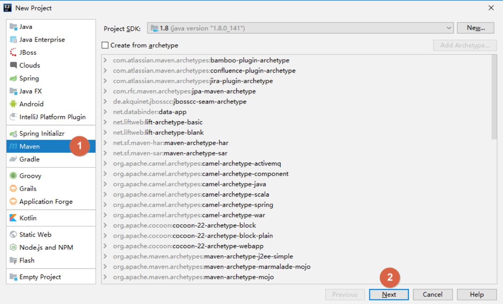
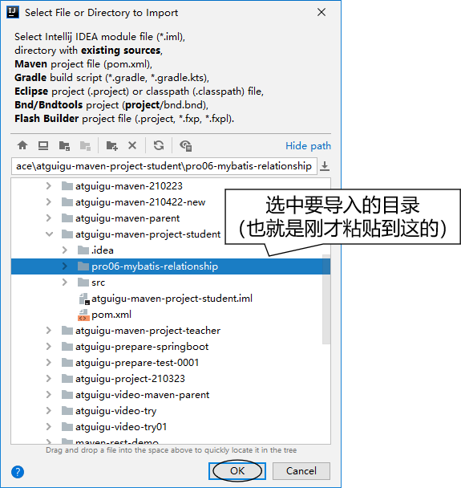

[toc]


# 使用Maven：IDEA环境


## 1. 创建父工程

### 1.1 创建Project





### 1.2 开启自动导入

创建 Project 后，IDEA 会自动弹出下面提示，我们选择**『Enable Auto-Import』**，意思是启用自动导入。


这个自动导入**一定要开启**，因为 Project、Module 新创建或 pom.xml 每次修改时都应该让 IDEA 重新加载 Maven 信息。这对 Maven 目录结构认定、Java 源程序编译、依赖 jar 包的导入都有非常关键的影响。

另外也可以通过 IDEA 的 Settings 设置来开启：


## 2. 配置maven信息

### 2.1 配置新工程的默认Maven配置信息


这样配置以后，每次打开或创建新项目都是用的是这样配置的信息。

### 2.2 为当前工程配置Maven信息

也许我们当前工程需要特殊的maven配置，则按如下流程配置


打开后就是为本工程配置的Maven信息


## 3. 创建Java模块工程


## 4. 创建Web模块工程

### 4.1 创建模块

按照前面的同样操作创建模块，**此时**这个模块其实还是一个**Java模块**。

### 4.2 修改打包方式

Web 模块将来打包当然应该是 **war** 包。

```xml
<packaging>war</packaging>
```


### 4.3 Web设定

首先打开项目结构菜单：


然后到 Facets 下查看 IDEA 是否已经帮我们自动生成了 Web 设定。正常来说只要我们确实设置了打包方式为 war，那么 IDEA 2019 版及以上版本就会自动生成 Web 设定。


另外，对于 IDEA 2018 诸版本没有自动生成 Web 设定，那么请参照下面两图，我们自己创建：


### 4.4 借助IDEA生成web.xml


### 4.5 设置Web资源的根目录

结合 Maven 的目录结构，Web 资源的根目录需要设置为 src/main/webapp 目录。


## 5. 其他操作

### 5.1 在IDEA中执行Maven命令

#### 5.1.1 直接执行


#### 5.1.2 手动输入


如果有需要，还可以给命令后面附加参数：


```sh
# -D 表示后面要附加命令的参数，字母 D 和后面的参数是紧挨着的，中间没有任何其它字符
# maven.test.skip=true 表示在执行命令的过程中跳过测试
mvn clean install -Dmaven.test.skip=true
```


### 5.2 在IDEA中查看某个模块的依赖信息


### 5.3 工程导入

Maven工程除了自己创建的，还有很多情况是别人创建的。而为了参与开发或者是参考学习，我们都需要导入到 IDEA 中。下面我们分几种不同情况来说明：

#### 5.3.1 来自版本控制系统

我一般都先在外面clone，再导入

#### 5.3.2 来自工程目录

直接使用 IDEA 打开工程目录即可

### 5.4 模块导入

#### 5.4.1 情景重现

在实际开发中，通常会忽略模块（也就是module）所在的项目（也就是project）仅仅导入某一个模块本身。这么做很可能是类似这样的情况：比如基于 Maven 学习 SSM 的时候，做练习需要导入老师发给我们的代码参考。


#### 5.4.2 导入 Java 类型模块

找到老师发的工程目录


复制我们想要导入的模块目录


粘贴到我们自己工程目录下


##### 在 IDEA 中执行导入 重点





修改POM：

刚刚导入的 module 的父工程坐标还是以前的，需要改成我们自己的 project。


最终效果：


#### 5.4.3 导入 Web 类型模块

其它操作和上面演示的都一样，只是多一步：删除多余的、不正确的 web.xml 设置。如下图所示：


