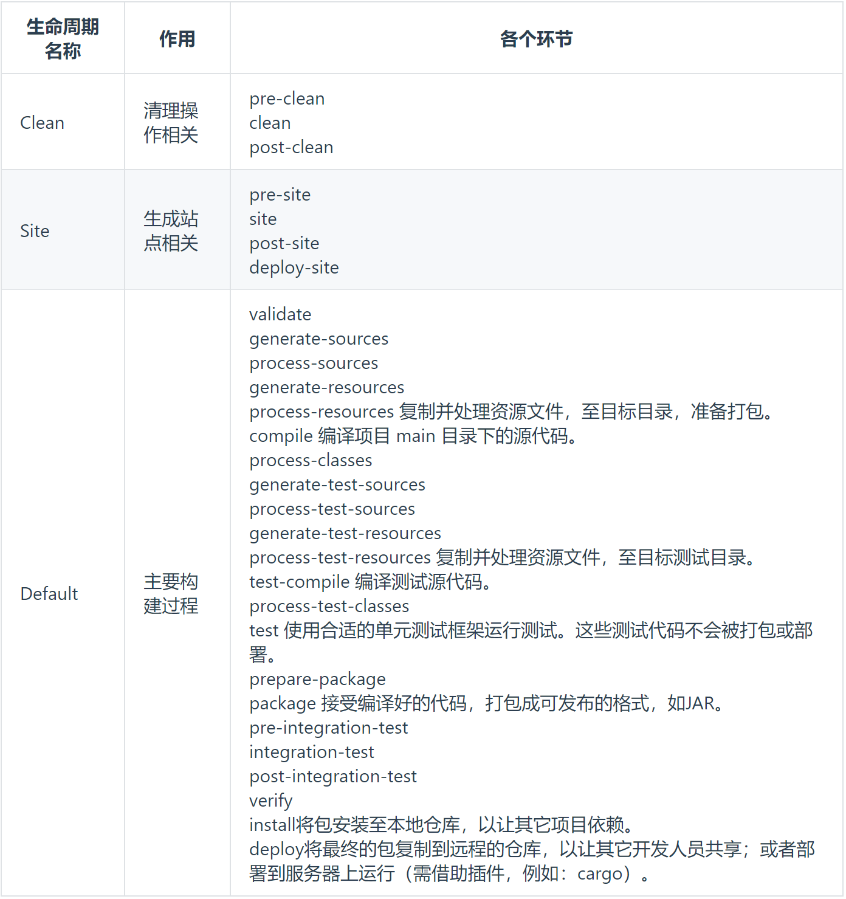

[toc]

# 其他核心概念

## 1. 生命周期

为了让构建过程自动化完成，Maven 设定了三个生命周期，生命周期中的每一个环节对应构建过程中的一个操作。

说明：

- 前面三个生命周期彼此是独立的。
- 在任何一个**生命周期内部，执行任何一个具体环节的操作，都是从本周期最初的位置开始执行，直到指定的地方**。（本节记住这句话就行了，其他的都不需要记）
- 所以，执行package不会执行clean，会从validate开始执行

Maven 之所以这么设计其实就是为了提高构建过程的自动化程度：让使用者只关心最终要干的即可，过程中的各个环节是自动执行的。

## 2. 插件和目标

### 插件：

Maven 的核心程序仅仅负责宏观调度，不做具体工作。具体工作都是由 Maven 插件完成的。例如：编译就是由 maven-compiler-plugin-3.1.jar 插件来执行的。

### 目标

一个插件可以对应多个目标，而每一个目标都和生命周期中的某一个环节对应。

Default 生命周期中有 compile 和 test-compile 两个和编译相关的环节，这两个环节对应 compile 和 test-compile 两个目标，而这两个目标都是由 maven-compiler-plugin-3.1.jar 插件来执行的。

## 3. 仓库

- 本地仓库：在当前电脑上，为电脑上所有 Maven 工程服务
- 远程仓库：需要联网
  - 局域网：我们自己搭建的 Maven 私服，例如使用 Nexus 技术。
  - Internet
    - 中央仓库
    - 镜像仓库：内容和中央仓库保持一致，但是能够分担中央仓库的负载，同时让用户能够就近访问提高下载速度，例如：Nexus aliyun

建议：不要中央仓库和阿里云镜像混用，否则 jar 包来源不纯，彼此冲突。

Maven 依赖信息的网站：https://mvnrepository.com/

