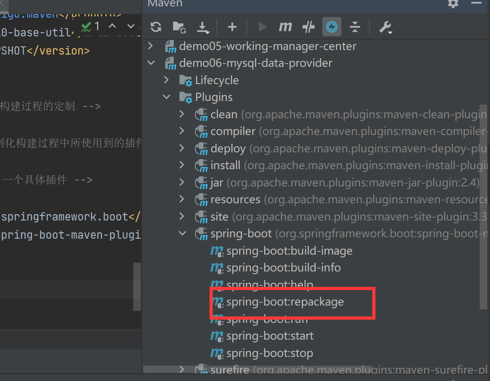

[toc]


# 单一架构案例 和 SSM案例


也可以在 pom里指定最终构建的名称：

```xml
<!-- 对构建过程进行自己的定制 -->
<build>
    <!-- 当前工程在构建过程中使用的最终名称 -->
    <finalName>demo-me</finalName>
</build>
```


package ，成war包就可以了

```shell
mvn clean package -Dmaven.test.skip=true
```


直接可以打出 可以运行的war包


# 微服务案例


需要先在 父工程执行 install 操作

```shell
mvn clean install -Dmaven.test.skip=true
```


此时生成的也不是微服务直接能运行的jar包

可以以 SpringBoot 微服务形式直接运行的 jar 包包括：

- 当前微服务本身代码
- 当前微服务所依赖的 jar 包
- 内置 Tomcat（Servlet 容器）
- 与 jar 包可以通过 java -jar 方式直接启动相关的配置

要加入额外的资源、相关配置等等，仅靠 Maven 自身的构建能力是不够的，所以要通过 build 标签引入下面的插件。

```xml
<!-- build 标签：用来配置对构建过程的定制 -->
<build>
    <!-- plugins 标签：定制化构建过程中所使用到的插件 -->
    <plugins>
        <!-- plugin 标签：一个具体插件 -->
        <plugin>
            <groupId>org.springframework.boot</groupId>
            <artifactId>spring-boot-maven-plugin</artifactId>
        </plugin>
    </plugins>
</build>
```

加入这个jar包后的效果：




然后执行命令：

```shell
mvn clean package spring-boot:repackage -Dmaven.test.skip=true
```

- clean 子命令：清理之前构建的结果
- package 子命令：我们真正要调用的 spring-boot:repackage 要求必须将当前微服务本身的 jar 包提前准备好，所以必须在它之前执行 package 子命令。
- spring-boot:repackage 子命令：调用 spring-boot 插件的 repackage 目标
- -Dmaven.test.skip=true 参数：跳过测试

即可构建出我们能执行的jar包

然后运行jar包：

```xml
nohup java -jar demo06-mysql-data-provider-1.0-SNAPSHOT.jar>demo06.log 2>&1 &
nohup java -jar demo02-user-auth-center-1.0-SNAPSHOT.jar>demo02.log 2>&1 &
```


