[TOC]


# 生产实践


## 1. 搭建Maven私服：nexus


### 1.1. Nexus 安装

#### 1.1.1 下载地址

https://download.sonatype.com/nexus/3/latest-unix.tar.gz

#### 1.1.2 上传、解压

上传到 Linux 系统，解压后即可使用，不需要安装。但是需要**注意**：必须提前安装 JDK。

```shell
cd /opt/software
tar -zxvf nexus-3.42.0-01-unix.tar.gz -C /opt/module/


```

#### 1.1.3 启动 Nexus

```shell
/opt/module/nexus-3.42.0-01/bin/nexus start

# 然后在 /opt/module/sonatype-work/ 目录下会是 nexus的工作目录
# 也可以通过配置文件 /opt/module/nexus-3.42.0-01/etc/nexus-default.properties 中  nexus-context-path=/  进行修改
```

#### 1.1.4 查看端口占用情况

```shell
netstat -anp | grep java
```

上面 45614 这个每次都不一样，不用管它。我们要访问的是 8081 这个端口。但是需要**注意**：8081 端口的这个进程要在启动 /opt/nexus-3.37.0-01/bin/nexus 这个主体程序**一、两分钟**后才会启动，请耐心等待

#### 1.1.5 访问 Nexus 首页

首页地址：http://[Linux 服务器地址]:8081/


### 1.2. 初始设置

#### 1.2.1 设置密码

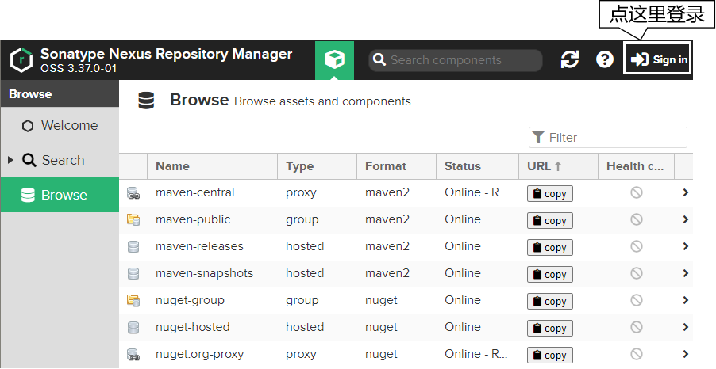

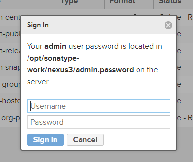

这里参考提示：

- 用户名：admin
- 密码：查看 /opt/sonatype-work/nexus3/admin.password 文件

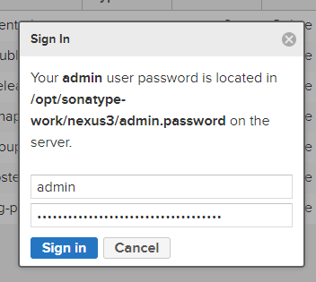

给 admin 用户指定新密码：

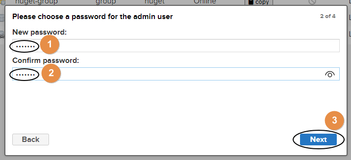

匿名登录，启用还是禁用？由于启用匿名登录后，后续操作比较简单，这里我们演示禁用匿名登录的操作方式：

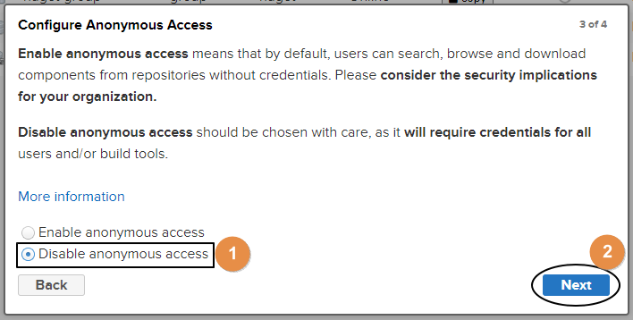

完成：

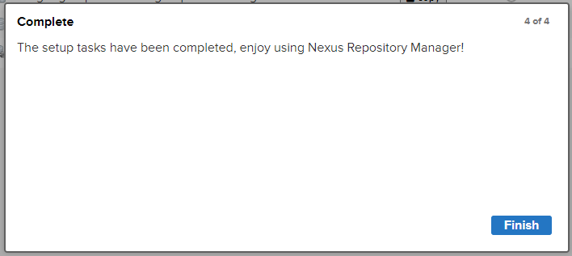

#### 1.2.2 配置镜像

毕竟默认从 中央仓库下载太慢了

配置nexus的镜像为阿里云

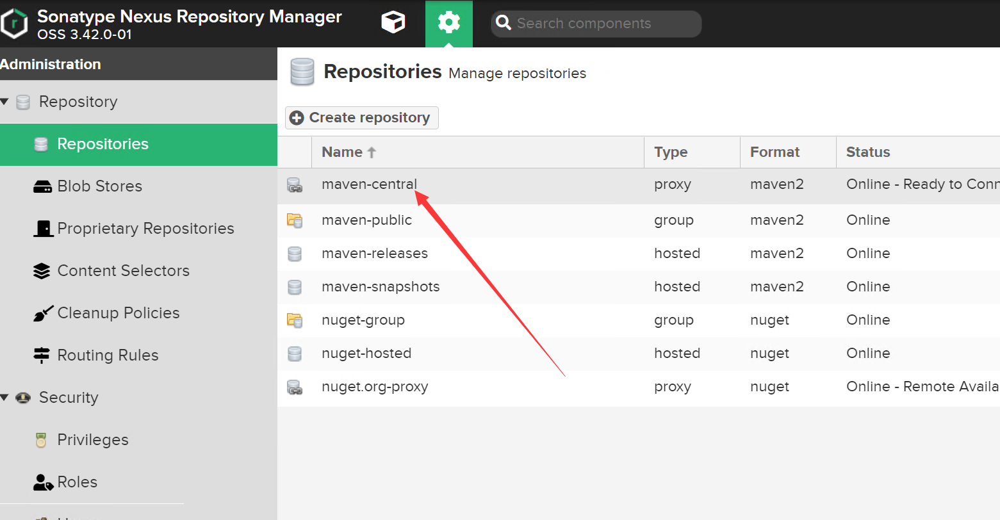

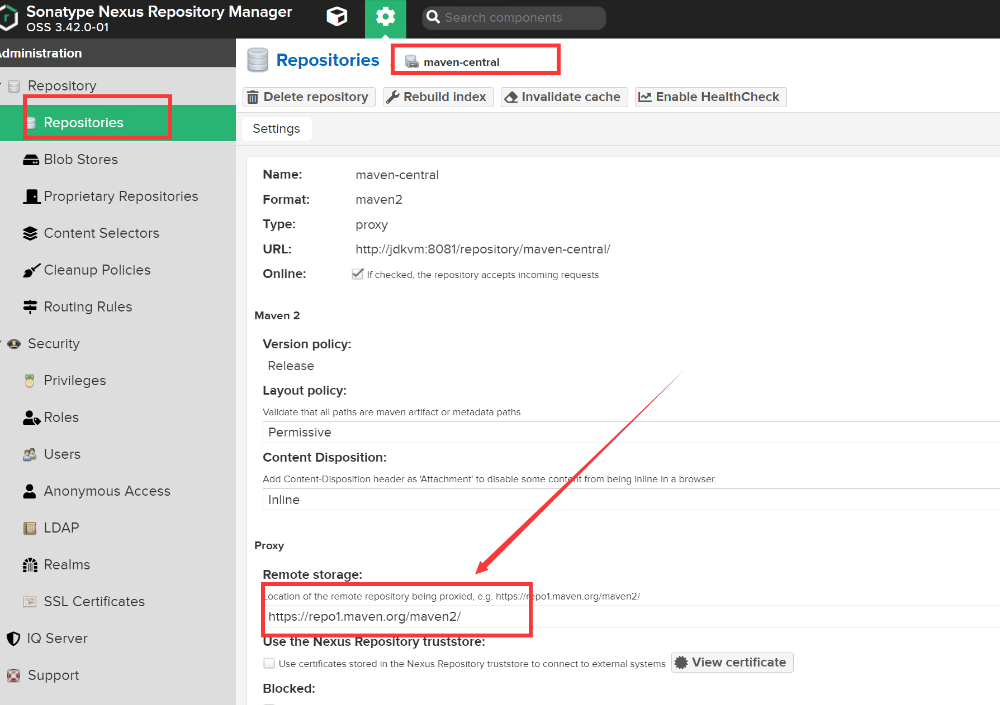

改为：

```
http://maven.aliyun.com/nexus/content/groups/public
```

**然后去页面最下面保存**


### 1.3. 对接 Nexus
#### 1.3.1 通过 Nexus 下载 jar 包

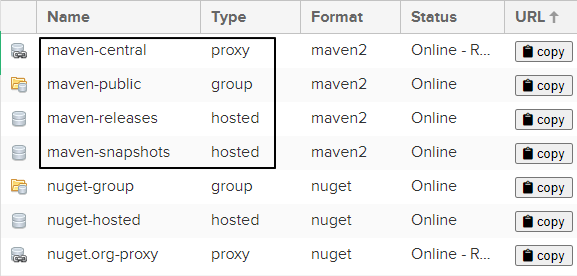

| 仓库类型 | 说明                                           |
| -------- | ---------------------------------------------- |
| proxy    | 某个远程仓库的代理                             |
| group    | 存放：通过 Nexus 获取的第三方 jar 包           |
| hosted   | 存放：本团队其他开发人员部署到 Nexus 的 jar 包 |

| 仓库名称        | 说明                                                         |
| --------------- | ------------------------------------------------------------ |
| maven-central   | Nexus 对 Maven 中央仓库的代理                                |
| maven-public    | Nexus 默认创建，供开发人员下载使用的组仓库                   |
| maven-releasse  | Nexus 默认创建，供开发人员部署自己 jar 包的宿主仓库 要求 releasse 版本 |
| maven-snapshots | Nexus 默认创建，供开发人员部署自己 jar 包的宿主仓库 要求 snapshots 版本 |

初始状态下，这几个仓库都没有内容：

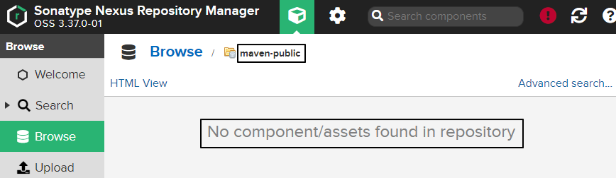


##### 方式一：在 settings.xml的mirror标签配置

这种方式配置简单，如果开发环境只有一套nexus可以这样使用。

本地仓库指定 Nexus服务器地址

```xml
<mirror>
    <id>nexus-mine</id>
    <mirrorOf>central</mirrorOf>
    <name>Nexus mine</name>
    <url>http://192.168.198.100:8081/repository/maven-public/</url>
</mirror>
```

这里的 url 标签是这么来的：

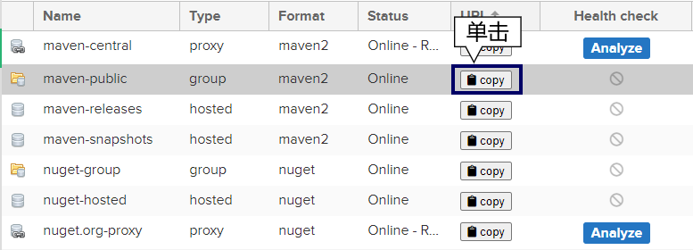

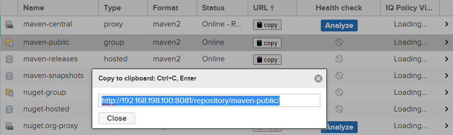

把上图中看到的地址复制出来即可。如果我们在前面允许了匿名访问，到这里就够了。但如果我们禁用了匿名访问，那么接下来我们还要继续配置 settings.xml：

```xml
<server>
    <!-- 这个id 和 上面mirror配置的标签一致 -->
    <id>nexus-mine</id>
    <username>admin</username>
    <password>atguigu</password>
</server>

<!-- 这个好像可以统一配置，以后不论id都用这组用户名密码 -->
<server>
    <id>nexus-snapshots</id>
    <username>admin</username>
    <password>admin123</password>
</server>
<server>
    <id>nexus-releases</id>
    <username>admin</username>
    <password>admin123</password>
</server>
```

这里需要**格外注意**：server 标签内的 id 标签值必须和 mirror 标签中的 id 值一样。

##### 方式二：在settins.xml的 repositories标签配置

```xml
<server>
    <id>nexus-mine</id>
    <username>admin</username>
    <password>atguigu</password>
</server>

<profiles>
    <profile>
        <id>nexus-profile</id>
        <repositories>
            <repository>
                <id>nexus-mine</id>
                <name>nexus-mine</name>
                <url>http://192.168.198.100:8081/repository/maven-snapshots/</url>
                <snapshots>
                    <enabled>true</enabled>
                </snapshots>
                <releases>
                    <enabled>true</enabled>
                </releases>
            </repository>
        </repositories>
    </profile>
</profiles>

<!-- 记得后面激活这个配置 -->
<activeProfiles>
    <activeProfile>nexus-profile</activeProfile>
</activeProfiles>
```

##### 方式三：为单个项目配置

```xml
<projects>

    <!-- 依赖等相关配置 -->

    <!-- 私仓配置 -->
    <repositories>
        <repository>
            <!-- 仓库基本信息 -->
            <id>myNexus</id>
            <name>我的nexus私仓</name>
            <url>http://xxx.xxx.xxx.xxx/repository/maven-group/</url>

            <!-- 是否允许 RELEASE 版本的依赖，以及相关策略 -->
            <releases>
                <enabled>true</enabled>
                <!-- 完整性校验策略，ignore/warn(默认)/fail -->
                <checksumPolicy>ignore</checksumPolicy>
                <!-- 更新策略：always/daily(默认)/interval:xxx分钟/never -->
                <updatePolicy>always</updatePolicy>
            </releases>
            <!-- SNAPSHOT版本的依赖策略 -->
            <snapshots>
                <enabled>true</enabled>
                <checksumPolicy>ignore</checksumPolicy>
                <updatePolicy>always</updatePolicy>
            </snapshots>
        </repository>
    </repositories>

    <!-- 插件私仓配置，配置方式和依赖的私仓配置一样 -->
    <pluginRepositories>
        <pluginRepository>
            <!-- 仓库基本信息 -->
            <id>myNexusPlugin</id>
            <name>我的nexus私仓</name>
            <url>http://xxx.xxx.xxx.xxx/repository/maven-group/</url>
            <releases>
                <enabled>true</enabled>
            </releases>
            <snapshots>
                <enabled>true</enabled>
            </snapshots>
        </pluginRepository>
    </pluginRepositories>

</projects>
```


#### 1.3.2 上传jar包到到 Nexus

配置Maven工程

```xml
<distributionManagement>
    <!-- 往那个地方部署，就用哪个 -->
    <repository>
        <!-- 这个id 和 上面server 里面配的一致 -->
        <id>nexus-localvm</id>
        <name>Nexus 321</name>
        <url>http://jdkvm:8081/repository/maven-public/</url>
    </repository>
    <snapshotRepository>
        <id>nexus-mine</id>
        <name>Nexus Snapshot</name>
        <url>http://192.168.198.100:8081/repository/maven-snapshots/</url>
    </snapshotRepository>
</distributionManagement>
```

这里 snapshotRepository 的 id 标签也必须和 settings.xml 中指定的 mirror 标签的 id 属性一致。

执行 部署命令

```shell
mvn deploy
```

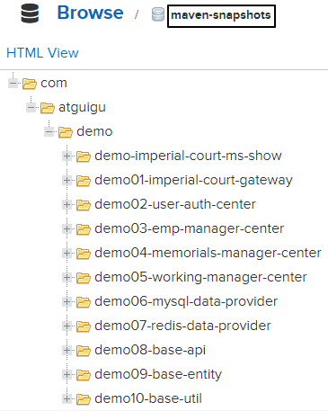

上传的时候附源码：

pom.xml里面加上插件

```xml
<build>
    <plugins>
        <!-- 要将源码放上去，需要加入这个插件 -->
        <plugin>
            <artifactId>maven-source-plugin</artifactId>
            <version>3.2.1</version>
            <configuration>
                <attach>true</attach>
            </configuration>
            <executions>
                <execution>
                    <phase>compile</phase>
                    <goals>
                        <goal>jar</goal>
                    </goals>
                </execution>
            </executions>
        </plugin>
    </plugins>
</build>
```


#### 1.3.3 引用别人部署的 jar 包

- 默认访问的 Nexus 仓库：maven-public
- 存放别人部署 jar 包的仓库：maven-snapshots

怎么办呢？

配置repositories

在 pom.xml里面 ，project的 里面一层

```xml
<repositories>
    <repository>
        <!-- 这个ID 也要和 server 里面配的一致 -->
        <id>nexus-mine</id>
        <name>nexus-mine</name>
        <url>http://192.168.198.100:8081/repository/maven-snapshots/</url>
        <snapshots>
            <enabled>true</enabled>
        </snapshots>
        <releases>
            <enabled>true</enabled>
        </releases>
    </repository>
</repositories>
```


也可以在settings.xml里面

```xml
<profiles>
    <profile>
        <id>nexus-profile</id>
        <repositories>
            <repository>
                <id>nexus-mine</id>
                <name>nexus-mine</name>
                <url>http://192.168.198.100:8081/repository/maven-snapshots/</url>
                <snapshots>
                    <enabled>true</enabled>
                </snapshots>
                <releases>
                    <enabled>true</enabled>
                </releases>
            </repository>
        </repositories>
    </profile>
</profiles>

<!-- 记得后面激活这个配置 -->
<activeProfiles>
    <activeProfile>nexus-profile</activeProfile>
</activeProfiles>
```


## 2. jar包冲突问题

### 2.1. 谁需要面对 jar 包冲突？

先给结论：编订依赖列表的程序员。初次设定一组依赖，因为尚未经过验证，所以确实有可能存在各种问题，需要做有针对性的调整。那么谁来做这件事呢？我们最不希望看到的就是：团队中每个程序员都需要自己去找依赖，即使是做同一个项目，每个模块也各加各的依赖，没有统一管理。那前人踩过的坑，后人还要再踩一遍。而且大家用的依赖有很多细节都不一样，版本更是五花八门，这就让事情变得更加复杂。

所以虽然初期需要根据项目开发和实际运行情况对依赖配置不断调整，最终确定一个各方面都 OK 的版本。但是一旦确定下来，放在父工程中做依赖管理，各个子模块各取所需，这样基本上就能很好的避免问题的扩散。

即使开发中遇到了新问题，也可以回到源头检查、调整 dependencyManagement 配置的列表——而不是每个模块都要改。所以学完这一节你应该就会对前面讲过的『继承』有了更深的理解。

### 2.2. 表现形式

由于实际开发时我们往往都会整合使用很多大型框架，所以一个项目中哪怕只是一个模块也会涉及到大量 jar 包。数以百计的 jar 包要彼此协调、精密配合才能保证程序正常运行。而规模如此庞大的 jar 包组合在一起难免会有磕磕碰碰。最关键的是由于 jar 包冲突所导致的问题非常诡异，这里我们只能罗列较为典型的问题，而没法保证穷举。

但是我们仍然能够指出一点：一般来说，由于我们自己编写代码、配置文件写错所导致的问题通常能够在异常信息中看到我们自己类的全类名或配置文件的所在路径。**如果整个错误信息中完全没有我们负责的部分，全部是框架**、第三方工具包里面的类报错，这往往就是 jar 包的问题所引起的。

而具体的表现形式中，主要体现为找不到类或找不到方法。

#### 2.2.1 抛异常：找不到类

此时抛出的常见的异常类型：

- java.lang.**ClassNotFoundException**：编译过程中找不到类
- java.lang.**NoClassDefFoundError**：运行过程中找不到类
- java.lang.**LinkageError**：不同类加载器分别加载的多个类有相同的全限定名

#### 2.2.2 抛异常：找不到方法

程序找不到符合预期的方法。这种情况多见于通过反射调用方法，所以经常会导致：java.lang.NoSuchMethodError。

#### 2.2.3 没报错但结果不对

发生这种情况比较典型的原因是：两个 jar 包中的类分别实现了同一个接口，这本来是很正常的。但是问题在于：由于没有注意命名规范，两个不同实现类恰巧是同一个名字。

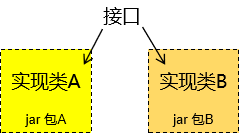

### 2.3. 本质

以上表现形式归根到底是**两种基本情况**导致的

#### 2.3.1 同一jar包的不同版本

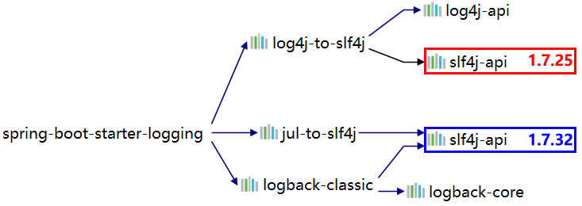

#### 2.3.2 不同jar包中包含同名类

这里我们拿 netty 来举个例子，netty 是一个类似 Tomcat 的 Servlet 容器。通常我们不会直接依赖它，所以基本上都是框架传递进来的。那么当我们用到的框架很多时，就会有不同的框架用不同的坐标导入 netty。

### 2.4. 解决办法
#### 2.4.1 概述

很多情况下常用框架之间的整合容易出现的冲突问题都有人总结过了，拿抛出的异常搜索一下基本上就可以直接找到对应的 jar 包。我们接下来要说的是通用方法。

不管具体使用的是什么工具，基本思路无非是这么两步：

- 第一步：把彼此冲突的 jar 包找到
- 第二步：在冲突的 jar 包中选定一个。具体做法无非是通过 exclusions 排除依赖，或是明确声明依赖。

#### 2.4.2 IDEA 的 Maven Helper 插件

这个插件是 IDEA 中安装的插件，不是 Maven 插件。它能够给我们罗列出来同一个 jar 包的不同版本，以及它们的来源。但是对不同 jar 包中同名的类没有办法。

#### 2.4.3 Maven 的 enforcer 插件

使用 Maven 的 enforcer 插件既可以检测同一个 jar 包的不同版本，又可以检测不同 jar 包中同名的类。

**配置 enforcer 插件**

```xml
<build>
    <pluginManagement>
        <plugins>
            <plugin>
                <groupId>org.apache.maven.plugins</groupId>
                <artifactId>maven-enforcer-plugin</artifactId>
                <version>1.4.1</version>
                <executions>
                    <execution>
                        <id>enforce-dependencies</id>
                        <phase>validate</phase>
                        <goals>
                            <goal>display-info</goal>
                            <goal>enforce</goal>
                        </goals>
                    </execution>
                </executions>
                <dependencies>
                    <dependency>
                        <groupId>org.codehaus.mojo</groupId>
                        <artifactId>extra-enforcer-rules</artifactId>
                        <version>1.0-beta-4</version>
                    </dependency>
                </dependencies>
                <configuration>
                    <rules>
                        <banDuplicateClasses>
                            <findAllDuplicates>true</findAllDuplicates>
                        </banDuplicateClasses>
                    </rules>
                </configuration>
            </plugin>
        </plugins>
    </pluginManagement>
</build>
```

使用：

```shell
mvn clean package enforcer:enforce
```

如果有jar包冲突，就可以看到


## 3. 体系外jar包引入

### 3.1 提出问题

目前来说我们在 Maven 工程中用到的 jar 包都是通过 Maven 本身的机制导入进来的。

而实际开发中确实有可能用到一些 jar 包并非是用 Maven 的方式发布，那自然也没法通过 Maven 导入。

此时如果我们能够拿到该 jar 包的源码那还可以自己建一个 Maven 工程，自己打包。可是如果连源码都没有呢？

这方面的例子包括一些人脸识别用的 jar 包、海康视频监控 jar 包等等


### 3.2 解决办法

#### 3.2.1 准备一个体系外jar包

创建一个 Java 工程，然后导出 jar 包即可用来测试。

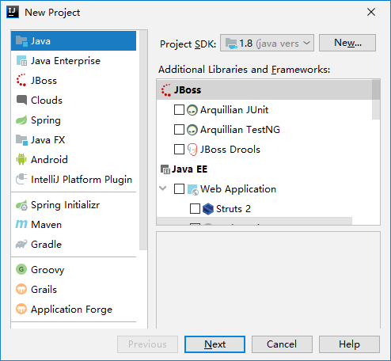

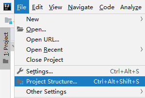

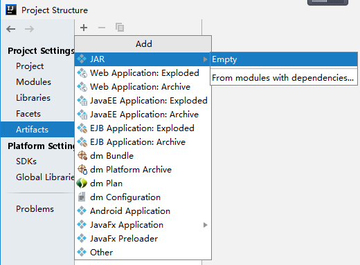

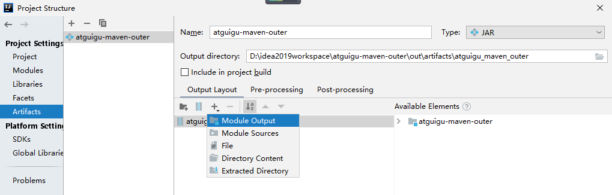

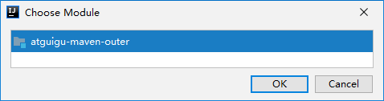

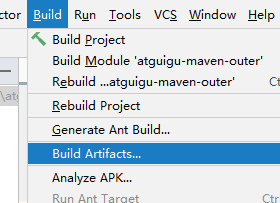

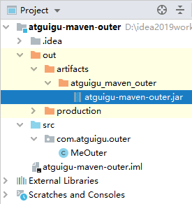

#### 3.2.2 将该jar包安装到maven仓库

这里我们使用 install 插件的 install-file 目标：

```shell
mvn install:install-file -Dfile=[体系外 jar 包路径] \
-DgroupId=[给体系外 jar 包强行设定坐标] \
-DartifactId=[给体系外 jar 包强行设定坐标] \
-Dversion=1 \
-Dpackage=jar
```

例如（Windows 系统下使用 ^ 符号换行；Linux 系统用 \）：

```shell
mvn install:install-file -Dfile=D:\idea2019workspace\atguigu-maven-outer\out\artifacts\atguigu_maven_outer\atguigu-maven-outer.jar ^
-DgroupId=com.atguigu.maven ^
-DartifactId=atguigu-maven-outer ^
-Dversion=1 ^
-Dpackaging=jar
```

就可以啦
