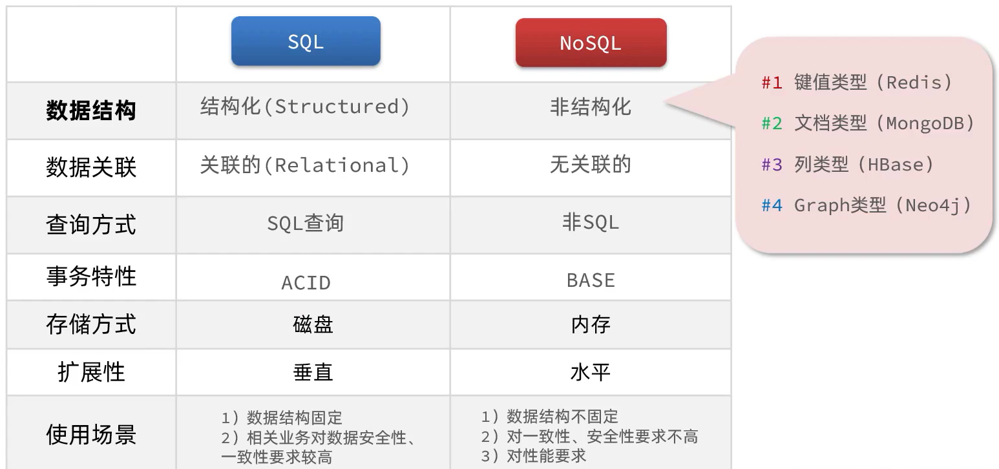
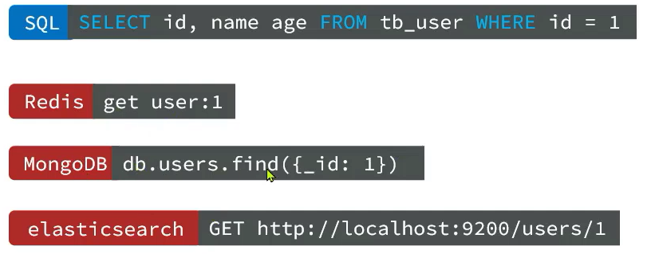
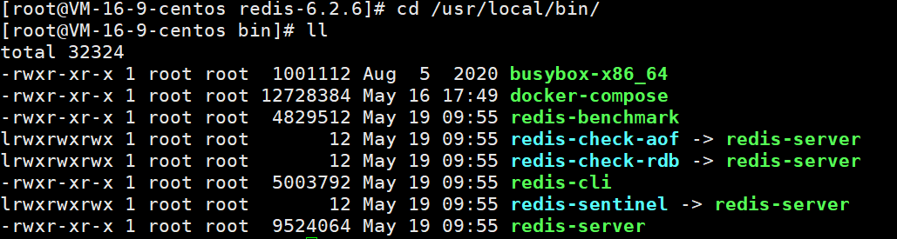

[TOC]

# Redis概述与安装


Redis的官方网站地址：https://redis.io/


## 1. Redis 概述


### 1.1 关系型数据库与非关系型数据库

SQL：（Structured Query Language）关系型数据库   关系型数据库

NoSQL ：  非结构查询数据库   非关系型数据库




不同数据库查询方法



### 1.2 Redis

Redis 诞生于2009年，全程是Remote Dictiory Server，远程词典服务器，是一个基于内存的键值型NoSQL数据库

特征：

- 键值（key-value）型，value支持多种不同数据结构，功能丰富
- 单线程，每个命令具备原子性
- 低延迟，速度快（基于内存、IO多路复用、良好的编码）
- 支持数据持久化
- 支持主从集群、分片集群
- 支持多语言客户端


## 2. 安装redis

### 2.1 源码安装redis

#### 2.1.1 源码安装

安装依赖GCC+TCL

```shell
yum install -y gcc tcl
```

上传安装包

```shell
# 上传至 /usr/local/src 目录下
cd /usr/local/src
tar -zxvf redis-6.2.6.tar.gz
cd redis-6.2.6
make && make install
```

如果没有出错，应该就安装成功了。

默认的安装路径是在 `/usr/local/bin`目录下：



可以在任意目录下  运行redis

```shell
redis-cli # 是redis提供的命令行客户端
redis-server # 是redis的服务端启动脚本
redis-sentinel # 是redis的哨兵启动脚本
```


#### 2.1.2 设置后台启动

如果要让Redis以**后台**方式启动，则必须修改Redis配置文件，就在我们之前解压的redis安装包下（`/usr/local/src/redis-6.2.6`），名字叫redis.conf：

我们先将这个配置文件备份一份：

```shell
cp redis.conf redis.conf.bck
```

然后修改redis.conf文件中的一些配置：

```shell
# 允许访问的地址，默认是127.0.0.1，会导致只能在本地访问。修改为0.0.0.0则可以在任意IP访问，生产环境不要设置为0.0.0.0
bind 0.0.0.0
# 守护进程，修改为yes后即可后台运行
daemonize yes 
# 密码，设置后访问Redis必须输入密码
requirepass 123321
```

Redis的其它常见配置：

```shell
# 监听的端口
port 6379
# 工作目录，默认是当前目录，也就是运行redis-server时的命令，日志、持久化等文件会保存在这个目录
dir .
# 数据库数量，设置为1，代表只使用1个库，默认有16个库，编号0~15
databases 1
# 设置redis能够使用的最大内存
maxmemory 512mb
# 日志文件，默认为空，不记录日志，可以指定日志文件名
logfile "redis.log"
```

指定配置文件启动Redis：

```shell
# 进入redis安装目录 
cd /usr/local/src/redis-6.2.6
# 启动
redis-server redis.conf
```

停止redis:

```shell
# 利用redis-cli来执行 shutdown 命令，即可停止 Redis 服务，
# 因为之前配置了密码，因此需要通过 -u 来指定密码
redis-cli -u 123321 shutdown
```


#### 2.1.3 设置开机启动

就是将Redis交给 `systemctl` 来管理，进而可以控制是否开机自启

新建文件redis.service

```shell
vi /etc/systemd/system/redis.service


############ 文件内容 start######################
[Unit]
Description=redis-server
After=network.target

[Service]
Type=forking
ExecStart=/usr/local/bin/redis-server /usr/local/src/redis-6.2.6/redis.conf
PrivateTmp=true

[Install]
WantedBy=multi-user.target
############ 文件内容 end ######################

# 重新加载系统服务
systemctl daemon-reload

## 此时我们可以用 ststemctl 命令来操作redis启停
# 启动
systemctl start redis
# 停止
systemctl stop redis
# 重启
systemctl restart redis
# 查看状态
systemctl status redis
# 开机自启
systemctl enable redis
```


### 2.2 docker直接安装redis

参考：[docker安装常用软件命令](https://lishem12.gitee.io/#/./docs/docker/docker安装常用软件命令?id=redis)

```shell
docker run \
    -d \
    --name redis6 \
    -p 6379:6379 \
    --privileged=true \
    -v /root/redis6/data:/data \
    redis:6.2.7 --requirepass '123456'
```


### 3. Redis 命令行客户端

Redis安装完成后就自带了命令行客户端：redis-cli，使用方式如下：

```shell
redis-cli [options] [commonds]

# 其中常见的options有：
#   -h 127.0.0.1：指定要连接的redis节点的IP地址，默认是127.0.0.1
#   -p 6379：指定要连接的redis节点的端口，默认是6379
#   -a 123321：指定redis的访问密码

#  其中的commonds就是Redis的操作命令，例如：
#	-ping：与redis服务端做心跳测试，服务端正常会返回pong
#   redis-cli -h 127.0.0.1 -p 6379 -a 123456 ping


# 登陆redis
redis-cli -h 127.0.0.1 -p 6379 -a 123456
```

