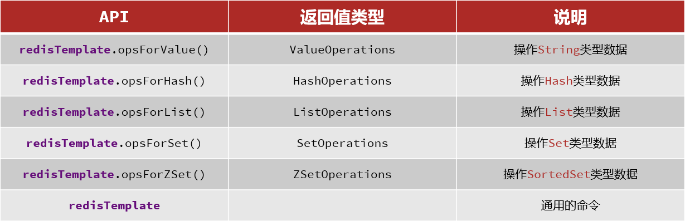

# Redis客户端


## 1. 图形化桌面客户端


GitHub上的大神编写了Redis的图形化桌面客户端，地址：https://github.com/uglide/RedisDesktopManager

不过该仓库提供的是RedisDesktopManager的源码，并未提供windows安装包。

在下面这个仓库可以找到安装包：https://github.com/lework/RedisDesktopManager-Windows/releases


## 2. Java客户端

在Redis官网中提供了各种语言的客户端，地址：https://redis.io/resources/clients/

主要推荐有三种客户端：

- Jedis
  - 以Redis命令作为方法名称，学习成本低，简单实用。但是Jedis实例是线程不安全的，多线程环境下需要基于连接池来使用
- lettuce
  - Lettuce是基于Netty实现的，支持同步、异步和响应式编程方式，并且是线程安全的。支持Redis的哨兵模式、集群模式和管道模式。
- Redisson
  - Redisson是一个基于Redis实现的分布式、可伸缩的Java数据结构集合。包含了诸如Map、Queue、Lock、 Semaphore、AtomicLong等强大功能

### 2.1 Jedis客户端

Jedis的地址： https://github.com/redis/jedis

Jedis API的方法名就是 操作Redis的命令名称

#### 2.1.1 引入依赖

```xml
<!-- jedis -->
<dependency>
    <groupId>redis.clients</groupId>
    <artifactId>jedis</artifactId>
    <version>3.7.0</version>
</dependency>
```

#### 2.1.2 建立链接并操作数据

Jedis使用的基本步骤：

- 引入依赖
- 创建Jedis对象，建立连接
- 使用Jedis，方法名与Redis命令一致
- 释放资源

```java
package com.lishem.test;


import org.junit.After;
import org.junit.Before;
import org.junit.Test;
import redis.clients.jedis.Jedis;

import java.util.Map;

public class JedisTest {

    private Jedis jedis;

    @Before
    public void setUp() {
        // 1. 建立链接
        jedis = new Jedis("192.168.2.181", 6379);
        // 2. 设置密码
        jedis.auth("123456");
        // 3. 选择库
        jedis.select(0);
    }

    @Test
    public void testString() {
        // 存入数据
        String result = jedis.set("name", "王小二");
        System.out.println("result=" + result);
        // result=OK
        // 获取数据
        String name = jedis.get("name");
        System.out.println("name=" + name);
        // name=王小二
    }

    @Test
    public void testHash() {
        // 存入数据
        jedis.hset("user:1", "name", "jack");
        jedis.hset("user:1", "age", "1");
        // 获取
        Map<String, String> map = jedis.hgetAll("user:1");
        System.out.println(map);
    }

    @After
    public void tearDown() {
        if (jedis != null) {
            jedis.close();
        }
    }
}
```

#### 2.1.3 Jedis连接池

Jedis本身是线程不安全的，并且频繁的创建和销毁连接会有性能损耗，因此推荐使用Jedis连接池代替Jedis的直连方式。

```java
package com.lishem.jedis.util;

import redis.clients.jedis.Jedis;
import redis.clients.jedis.JedisPool;
import redis.clients.jedis.JedisPoolConfig;

public class JedisConnectionFactory {

    private static final JedisPool jedisPool;

    static {
        // 配置连接池
        JedisPoolConfig poolConfig = new JedisPoolConfig();
        // 最大连接
        poolConfig.setMaxTotal(8);
        // 最大空闲连接
        poolConfig.setMaxIdle(8);
        // 最小空闲连接
        poolConfig.setMinIdle(0);
        // 设置最长等待时间， ms
        poolConfig.setMaxWaitMillis(200);
        // 创建连接池对象
        jedisPool = new JedisPool(poolConfig,
                "101.43.74.114", 6379, 2000, "123321");
    }

    // 获取Jedis对象
    public static Jedis getJedis() {
        return jedisPool.getResource();
    }
}
```

使用：

```java
private Jedis jedis;

@Befor
void setUp() {
    // 1. 建立链接
    jedis = JedisConnectionFactory.getJedis();
    // 2. 选择库
    jedis.select(0);
}
```


### 2.2 Lettuce客户端

参考地址：https://github.com/lettuce-io/lettuce-core

#### 2.21 引入依赖

```xml
<dependency>
    <groupId>io.lettuce</groupId>
    <artifactId>lettuce-core</artifactId>
    <version>5.3.7.RELEASE</version>
</dependency>
```

#### 2.2.2 编写代码

```java
package com.lishem.test;

import io.lettuce.core.RedisClient;
import io.lettuce.core.RedisURI;
import io.lettuce.core.api.StatefulRedisConnection;
import io.lettuce.core.api.sync.RedisStringCommands;
import org.junit.Test;


public class LettuceClient {

    RedisClient redisClient;

    @Test
    public void test() {
        RedisURI redisUri = RedisURI.Builder.redis("192.168.2.181")
                .withPort(6379)
                .withPassword("123456")
                .withDatabase(0)
                .build();
        redisClient = RedisClient.create(redisUri);
        StatefulRedisConnection<String, String> connection = redisClient.connect();
        RedisStringCommands sync = connection.sync();
        Object value = sync.get("name");
        System.out.println(value);
    }
}
```


## 3.SpringData 操作Redis

SpringData是Spring中数据操作的模块，包含对各种数据库的集成，其中对Redis的集成模块就叫做SpringDataRedis，官网地址：https://spring.io/projects/spring-data-redis

- 提供了对不同Redis客户端的整合（Lettuce和Jedis）
- 提供了RedisTemplate统一API来操作Redis
- 支持Redis的发布订阅模型
- 支持Redis哨兵和Redis集群
- 支持基于Lettuce的响应式编程
- 支持基于JDK、JSON、字符串、Spring对象的数据序列化及反序列化
- 支持基于Redis的JDKCollection实现

SpringDataRedis中提供了RedisTemplate工具类，其中封装了各种对Redis的操作。并且将不同数据类型的操作API封装到了不同的类型中：



### 3.1 引入依赖

SpringBoot的redis默认使用的`lettuce`，如果想使用 `Jedis` 则需要自己引入

使用lettuce的：

```xml
<!-- redis依赖 默认底层使用 lettuce -->
<dependency>
    <groupId>org.springframework.boot</groupId>
    <artifactId>spring-boot-starter-data-redis</artifactId>
</dependency>
<!-- 连接池依赖 -->
<dependency>
    <groupId>org.apache.commons</groupId>
    <artifactId>commons-pool2</artifactId>
</dependency>
```

使用Jedis的

```xml
<!--redis客户端-->
<dependency>
    <groupId>org.springframework.boot</groupId>
    <artifactId>spring-boot-starter-data-redis</artifactId>
    <exclusions>
        <exclusion>
            <groupId>io.lettuce</groupId>
            <artifactId>lettuce-core</artifactId>
        </exclusion>
    </exclusions>
</dependency>
<dependency>
    <groupId>redis.clients</groupId>
    <artifactId>jedis</artifactId>
</dependency>
```

### 3.2 编写配置

```yaml
spring:
  redis:
    host: 192.168.2.181
    port: 6379
    password: 123456
    database: 0
    lettuce:
      pool:
        max-active: 8
        max-idle: 8
        min-idle: 0
        max-wait: 100ms
```

### 3.3 注入RedisTemplate

```java
@Autowired
private RedisTemplate redisTemplate;
```

### 3.4 编写测试类

```java
package com.heima;

import org.junit.jupiter.api.Test;
import org.springframework.beans.factory.annotation.Autowired;
import org.springframework.boot.test.context.SpringBootTest;
import org.springframework.data.redis.core.RedisTemplate;

@SpringBootTest
class ApplicationTests {

    @Autowired
    private RedisTemplate redisTemplate;

    @Test
    void testString() {
        // 写入一条String数据
        redisTemplate.opsForValue().set("name1","王小二");
        // 获取String数据
        Object name = redisTemplate.opsForValue().get("name1");
        System.out.println("name="+name);
    }

    @Test
    void testHash(){
        redisTemplate.opsForHash().put("user:400","name","王小三");
        redisTemplate.opsForHash().put("user:400","age","21");
        Map<Object, Object> entries = redisTemplate.opsForHash().entries("user:400");
        System.out.println(entries);
    }
}
```


