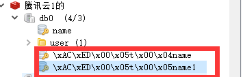
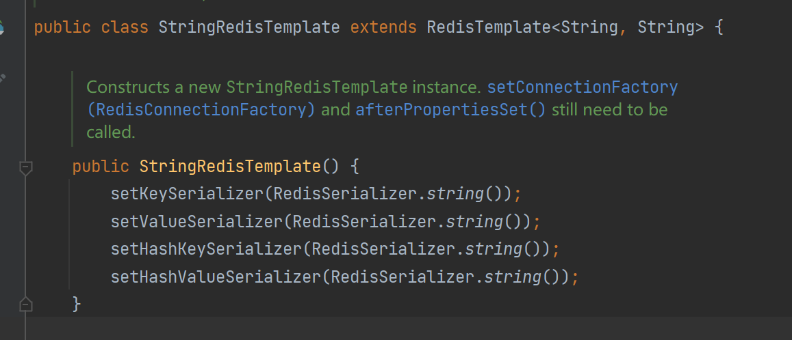

# Redis乱码与序列化


RedisTemplate可以接收任意Object作为值写入Redis，只不过写入前会把Object序列化为字节形式，默认是**采用JDK序列化**，得到的结果是这样的：



这样的序列化 可读性差，内存占用大。解决思路就是，将 Object 转成字符串。


## 方式一：自定义序列化

引入 Object转String 的一个依赖，此处引入 jackson。如果项目中已经有相关依赖，如SpirngMVC ，不需要重复引入

```xml
<!-- Jackson 依赖 -->
<dependency>
    <groupId>com.fasterxml.jackson.core</groupId>
    <artifactId>jackson-databind</artifactId>
    <version>2.13.2</version>
</dependency>
```

自定义RedisTemplate的序列化方式，代码如下：

```java
package com.heima.config;

import org.springframework.context.annotation.Bean;
import org.springframework.context.annotation.Configuration;
import org.springframework.data.redis.connection.RedisConnectionFactory;
import org.springframework.data.redis.core.RedisTemplate;
import org.springframework.data.redis.serializer.GenericJackson2JsonRedisSerializer;
import org.springframework.data.redis.serializer.RedisSerializer;

import java.net.UnknownHostException;

@Configuration
public class RedisConfig {

    @Bean
    public RedisTemplate<String, Object> redisTemplate(RedisConnectionFactory redisConnectionFactory) throws UnknownHostException {
        // 创建Template
        RedisTemplate<String, Object> redisTemplate = new RedisTemplate<>();
        // 设置连接工厂
        redisTemplate.setConnectionFactory(redisConnectionFactory);
        // 设置序列化工具
        GenericJackson2JsonRedisSerializer jsonRedisSerializer = new GenericJackson2JsonRedisSerializer();
        // key和 hashKey采用 string序列化
        redisTemplate.setKeySerializer(RedisSerializer.string());
        redisTemplate.setHashKeySerializer(RedisSerializer.string());
        // value和 hashValue采用 JSON序列化
        redisTemplate.setValueSerializer(jsonRedisSerializer);
        redisTemplate.setHashValueSerializer(jsonRedisSerializer);
        return redisTemplate;
    }
}
```


## 方式二：使用StringRedisTemplate

Spring默认提供了一个StringRedisTemplate类，它的key和value的序列化方式默认就是String方式。省去了我们自定义RedisTemplate的过程

```java
package com.heima;

import com.fasterxml.jackson.core.JsonProcessingException;
import com.fasterxml.jackson.databind.ObjectMapper;
import com.heima.pojo.User;
import org.junit.jupiter.api.Test;
import org.springframework.beans.factory.annotation.Autowired;
import org.springframework.boot.test.context.SpringBootTest;
import org.springframework.data.redis.core.StringRedisTemplate;

@SpringBootTest
public class RedisStringTest {

    @Autowired
    private StringRedisTemplate redisTemplate;

    private static final ObjectMapper mapper =new ObjectMapper();

    @Test
    void testPojo() throws JsonProcessingException {
        // 创建对象
        User user = new User("王小二",21);
        // 手动序列化
        String json = mapper.writeValueAsString(user);
        // 写入一条对象数据
        redisTemplate.opsForValue().set("name", json);
        // 获取对象数据
        String jsonUser = redisTemplate.opsForValue().get("name");
        // 手动反序列化
        User user1 = mapper.readValue(jsonUser, User.class);
        System.out.println(user1);
    }
}
```


可以看到，StringRedisTemplate 就是我们指定了 序列化方式




