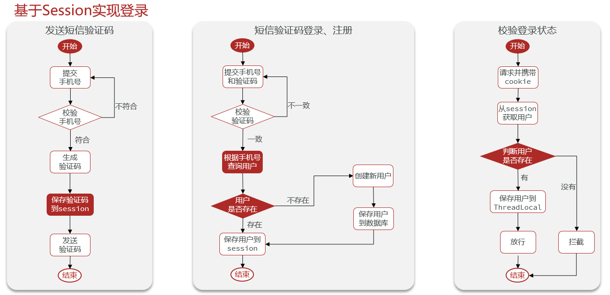

[TOC]


#  基于Session实现登陆功能

基于session的登陆功能流程图：



Controller 层，四个关键方法：

- 发送手机验证码 /user/code
- 登陆+自动注册 /user/login
- 查看个人信息 /user/me
- 注销功能 /user/logout

## Controller：

```java
package com.hmdp.controller;


import com.hmdp.dto.LoginFormDTO;
import com.hmdp.dto.Result;
import com.hmdp.dto.UserDTO;
import com.hmdp.entity.UserInfo;
import com.hmdp.service.IUserInfoService;
import com.hmdp.service.IUserService;
import com.hmdp.utils.UserHolder;
import lombok.extern.slf4j.Slf4j;
import org.springframework.web.bind.annotation.*;

import javax.annotation.Resource;
import javax.servlet.http.HttpSession;

@Slf4j
@RestController
@RequestMapping("/user")
public class UserController {

    @Resource
    private IUserService userService;

    @Resource
    private IUserInfoService userInfoService;

    /**
     * 发送手机验证码
     */
    @PostMapping("code")
    public Result sendCode(@RequestParam("phone") String phone, HttpSession session) {
        // 发送短信验证码并保存验证码
        return userService.sendCode(phone,session);
    }

    /**
     * 登录功能
     * @param loginForm 登录参数，包含手机号、验证码；或者手机号、密码
     */
    @PostMapping("/login")
    public Result login(@RequestBody LoginFormDTO loginForm, HttpSession session){
        // 实现登录功能
        return  userService.login(loginForm,session);
    }

    /**
     * 登出功能
     * @return 无
     */
    @PostMapping("/logout")
    public Result logout(HttpSession session){
        // 实现登出功能
        session.removeAttribute("user");
        return Result.ok();
    }

    @GetMapping("/me")
    public Result me(){
        // 获取当前登录的用户并返回
        UserDTO user = UserHolder.getUser();
        return Result.ok(user);
    }
}
```

## Service:

```java
package com.hmdp.service.impl;

import cn.hutool.core.bean.BeanUtil;
import cn.hutool.core.util.RandomUtil;
import com.baomidou.mybatisplus.extension.service.impl.ServiceImpl;
import com.hmdp.dto.LoginFormDTO;
import com.hmdp.dto.Result;
import com.hmdp.dto.UserDTO;
import com.hmdp.entity.User;
import com.hmdp.mapper.UserMapper;
import com.hmdp.service.IUserService;
import com.hmdp.utils.RegexUtils;
import com.hmdp.utils.SystemConstants;
import lombok.extern.slf4j.Slf4j;
import org.springframework.stereotype.Service;

import javax.servlet.http.HttpSession;


@Service
@Slf4j
public class UserServiceImpl extends ServiceImpl<UserMapper, User> implements IUserService {

    /**
     * 根据手机号，发送验证码
     *
     * @param phone
     * @param session
     * @return
     */
    @Override
    public Result sendCode(String phone, HttpSession session) {
        // 1. 校验手机号
        if (RegexUtils.isPhoneInvalid(phone)) {
            // 2. 如果不符合，返回错误信息
            return Result.fail("手机号格式错误！");
        }
        // 3. 符合，生成验证码
        String code = RandomUtil.randomNumbers(6);
        // 4. 保存验证码到session
        session.setAttribute("code", code);
        // 5. 返回验证码
        log.debug("发送短信验证阿妈成功，验证码：{}", code);
        // 返回
        return Result.ok();
    }

    /**
     * 登陆功能
     *
     * @param loginForm
     * @param session
     * @return
     */
    @Override
    public Result login(LoginFormDTO loginForm, HttpSession session) {
        // 1. 校验手机号
        String phone = loginForm.getPhone();
        if (RegexUtils.isPhoneInvalid(phone)) {
            // 2. 如果不符合，返回错误信息
            return Result.fail("手机号格式错误！");
        }
        Object cacheCode = session.getAttribute("code");
        String code = loginForm.getCode();
        if (cacheCode == null || !cacheCode.toString().equals(code)) {
            // 3. 不一致，报错
            return Result.fail("验证码错误");
        }
        // 4. 一致，根据手机号查询用户
        User user = query().eq("phone", phone).one();
        // 5. 判断用户是否存在
        if (user == null) {
            // 6. 不存在，创建新用户并保存
            user = createUserWithPhone(phone);
        }
        // 7. 保存用户信息到session
        session.setAttribute("user", BeanUtil.copyProperties(user, UserDTO.class));
        return Result.ok();
    }

    private User createUserWithPhone(String phone) {
        // 1. 创建用户
        User user = new User();
        user.setPhone(phone);
        user.setNickName(SystemConstants.USER_NICK_NAME_PREFIX + RandomUtil.randomString(10));
        // 2. 保存用户
        save(user);
        return user;
    }
}
```

## 拦截器部分：

```java
package com.hmdp.utils;

import com.hmdp.dto.UserDTO;
import com.hmdp.entity.User;
import org.springframework.web.servlet.HandlerInterceptor;

import javax.servlet.http.HttpServletRequest;
import javax.servlet.http.HttpServletResponse;
import javax.servlet.http.HttpSession;

public class LoginInterceptor implements HandlerInterceptor {

    @Override
    public boolean preHandle(HttpServletRequest request, HttpServletResponse response, Object handler) throws Exception {
        // 1. 获取session
        HttpSession session = request.getSession();
        // 2. 获取session中的用户
        Object user = session.getAttribute("user");
        // 3. 判断用户是否存在
        if (user == null) {
            // 4. 不存在，拦截 返回401状态码
            response.setStatus(401);
            return false;
        }
        // 5. 存在，保存用户信息到ThreadLocal
        UserHolder.saveUser((UserDTO) user);
        // 6. 放行
        return true;
    }

    @Override
    public void afterCompletion(HttpServletRequest request, HttpServletResponse response, Object handler, Exception ex) throws Exception {
        // 移除用户
        UserHolder.removeUser();
    }
}
```

```java
package com.hmdp.config;

import com.hmdp.utils.LoginInterceptor;
import org.springframework.context.annotation.Configuration;
import org.springframework.web.servlet.config.annotation.InterceptorRegistry;
import org.springframework.web.servlet.config.annotation.WebMvcConfigurer;

@Configuration
public class MvcConfig implements WebMvcConfigurer {

    @Override
    public void addInterceptors(InterceptorRegistry registry) {
        registry.addInterceptor(new LoginInterceptor())
                .excludePathPatterns(
                        "/shop/**",
                        "/voucher/**",
                        "/shop-type/**",
                        "/upload/**",
                        "/blog/hot",
                        "/user/code",
                        "/user/login"
                );
    }
}
```


