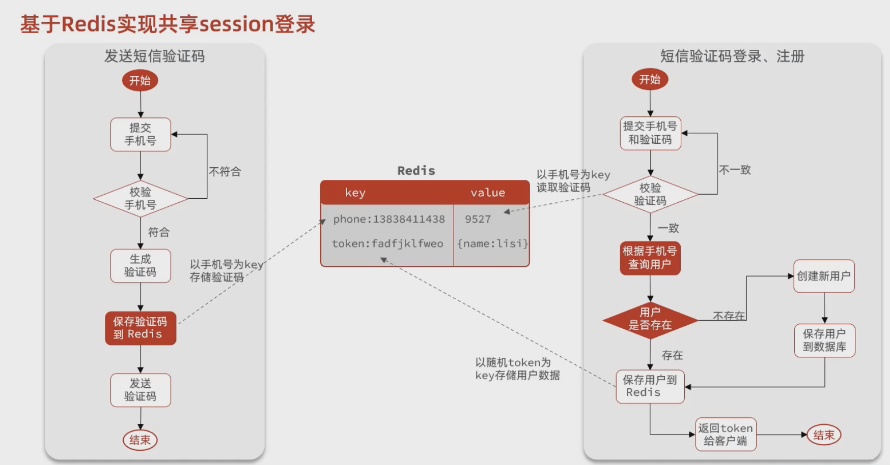
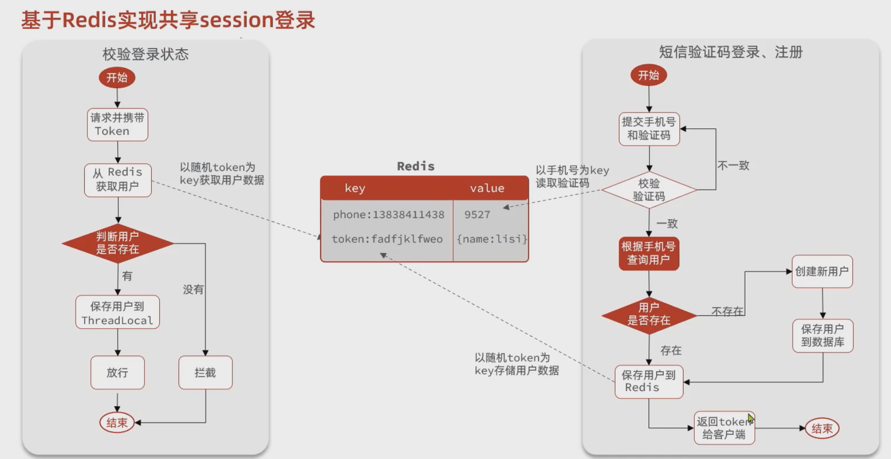

[TOC]


# 集群Session共享问题及解决


## 1. 集群Session共享问题提出

由于session使用的是tomcat的内存空间，多台tomcat并不共享session存储空间，当请求切换到不同tomcat服务时导致数据丢失的问题。

session的替代方案应该满足：

- 数据共享
- 内存存储
- key、value结构

故可以使用 redis 来作为session的替代方案。


## 2. 用Redis解决Session共享问题

- 登陆：将 短信验证码 保存在 redis中，登陆的时候客户端携带验证码与redis中的验证码进行比较。

- 登陆后：将 用户信息保存在 redis，设置过期时间



- 校验登陆状态：客户端携带 服务端 颁发的token 进行请求，请求到达后去redis中检查是否已登录。



### 2.1 发送验证码

思路：将验证码存入redis中

键：`login:code:手机号`

值：验证码   这部分TTL 2分钟

```java
/**
* 发送手机验证码
*/
@PostMapping("code")
public Result sendCode(@RequestParam("phone") String phone, HttpSession session) {
    // 发送短信验证码并保存验证码
    return userService.sendCode(phone,session);
}


/**
* 根据手机号，发送验证码
*
* @param phone
* @param session
* @return
*/
@Override
public Result sendCode(String phone, HttpSession session) {
    // 1. 校验手机号
    if (RegexUtils.isPhoneInvalid(phone)) {
        // 2. 如果不符合，返回错误信息
        return Result.fail("手机号格式错误！");
    }
    // 3. 符合，生成验证码
    String code = RandomUtil.randomNumbers(6);
    // 4. 保存验证码到redis
    stringRedisTemplate.opsForValue().set(LOGIN_CODE_KEY + phone, code, LOGIN_CODE_TTL, TimeUnit.MINUTES);
    // 5. 返回验证码
    log.debug("发送短信验证码成功，验证码：{}", code);
    // 返回
    return Result.ok();
}
```


### 2.2 短信验证码登陆、注册

思路：

1. 拿到手机号，去redis中获取验证码

   此时： key:  login:code:phone 值，获取到验证码

2. 校验通过后，查询用户信息，并将用户信息存入redis

   此时： key:  login:token:uuid ，值 是一个hash，存的是用户信息

   注意：将token返回给前端，让它下次来访问带过来   TTL 30分钟

```java
/**
 * 登录功能
 * @param loginForm 登录参数，包含手机号、验证码；或者手机号、密码
 */
@PostMapping("/login")
public Result login(@RequestBody LoginFormDTO loginForm, HttpSession session){
    // 实现登录功能
    return  userService.login(loginForm,session);
}


/**
 * 登陆功能
 *
 * @param loginForm
 * @param session
 * @return
 */
@Override
public Result login(LoginFormDTO loginForm, HttpSession session) {
    // 1. 校验手机号
    String phone = loginForm.getPhone();
    if (RegexUtils.isPhoneInvalid(phone)) {
        // 2. 如果不符合，返回错误信息
        return Result.fail("手机号格式错误！");
    }
    // 从redis获取验证码
    String cacheCode = stringRedisTemplate.opsForValue().get(LOGIN_CODE_KEY + phone);
    String code = loginForm.getCode();
    if (cacheCode == null || !cacheCode.equals(code)) {
        // 3. 不一致，报错
        return Result.fail("验证码错误");
    }
    // 4. 一致，根据手机号查询用户
    User user = query().eq("phone", phone).one();
    // 5. 判断用户是否存在
    if (user == null) {
        // 6. 不存在，创建新用户并保存
        user = createUserWithPhone(phone);
    }
    // 7. 保存用户信息到redis
    // 7.1 随机生成token，作为令牌
    String token = UUID.randomUUID().toString(true);
    // 7.2 将User对象转为Hash存储
    UserDTO userDTO = BeanUtil.copyProperties(user, UserDTO.class);
    Map<String, Object> userMap = BeanUtil.beanToMap(userDTO, new HashMap<>(),
            CopyOptions.create()
                    .setIgnoreNullValue(true)
                    .setFieldValueEditor((fieldName, fieldValue) -> fieldValue.toString()));
    // 7.3 存储
    String tokenKey = LOGIN_USER_KEY + token;
    stringRedisTemplate.opsForHash().putAll(tokenKey, userMap);
    // 7.4 设置token有效期
    stringRedisTemplate.expire(tokenKey, LOGIN_USER_TTL, TimeUnit.MINUTES);
    // 8. 返回token
    return Result.ok(token);
}

private User createUserWithPhone(String phone) {
    // 1. 创建用户
    User user = new User();
    user.setPhone(phone);
    user.setNickName(SystemConstants.USER_NICK_NAME_PREFIX + RandomUtil.randomString(10));
    // 2. 保存用户
    save(user);
    return user;
}
```


### 2.3访问续期

拦截器续期，需要获取前端带过来的token

```java
@Override
public boolean preHandle(HttpServletRequest request, HttpServletResponse response, Object handler) throws Exception {
    // 1. 获取请求头中的token
    String token = request.getHeader("authorization");
    if (StrUtil.isBlank(token)) {
        // 不存在， 拦截，返回401
        response.setStatus(401);
        return false;
    }
    // 2. 基于token 获取redis中的用户
    String tokenKey = RedisConstants.LOGIN_USER_KEY + token;
    Map<Object, Object> userMap = stringRedisTemplate.opsForHash().entries(tokenKey);
    // 3. 判断用户是否存在
    if (userMap.isEmpty()) {
        // 4. 不存在， 拦截，返回401
        response.setStatus(401);
        return false;
    }
    // 5. 将查询到的hash数据转为userDTO对象
    UserDTO userDTO = BeanUtil.fillBeanWithMap(userMap, new UserDTO(), false);
    // 6. 保存用户信息到ThreadLocal
    UserHolder.saveUser(userDTO);
    // 7. 刷新token有效期
    stringRedisTemplate.expire(tokenKey, RedisConstants.LOGIN_USER_TTL, TimeUnit.MINUTES);
    // 8 放行
    return true;
}
```


