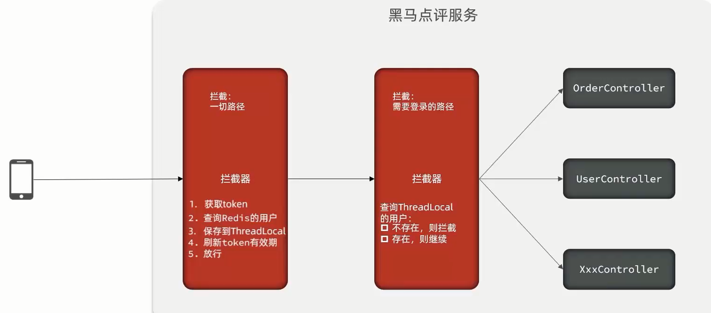

[TOC]


# Redis解决登陆问题单拦截器存在的问题与解决


单个拦截器虽然表面上能完成拦截，但是有一种特殊情况，如果用户已经登陆，然后一直访问不需要登陆的路径，之后再去访问需要登陆的路径因为中间长时间没经过拦截器校验，给redis中的token续期，导致redis中存储该用户token过期用户再访问需要登陆的页面提示重新登录。

解决方案：两个拦截器



## 1 刷新token拦截器

```java
package com.hmdp.utils;

import cn.hutool.core.bean.BeanUtil;
import cn.hutool.core.util.StrUtil;
import com.hmdp.dto.UserDTO;
import org.springframework.data.redis.core.StringRedisTemplate;
import org.springframework.web.servlet.HandlerInterceptor;

import javax.servlet.http.HttpServletRequest;
import javax.servlet.http.HttpServletResponse;
import java.util.Map;
import java.util.concurrent.TimeUnit;

/**
 * 刷新token拦截器
 */
public class RefreshTokenInterceptor implements HandlerInterceptor {

    private StringRedisTemplate stringRedisTemplate;

    public RefreshTokenInterceptor(StringRedisTemplate stringRedisTemplate) {
        this.stringRedisTemplate = stringRedisTemplate;
    }

    @Override
    public boolean preHandle(HttpServletRequest request, HttpServletResponse response, Object handler) throws Exception {
        // 1. 获取请求头中的token
        String token = request.getHeader("authorization");
        if (StrUtil.isBlank(token)) {
            return true;
        }
        // 2. 基于token 获取redis中的用户
        String tokenKey = RedisConstants.LOGIN_USER_KEY + token;
        Map<Object, Object> userMap = stringRedisTemplate.opsForHash().entries(tokenKey);
        // 3. 判断用户是否存在
        if (userMap.isEmpty()) {
            return true;
        }
        // 5. 将查询到的hash数据转为userDTO对象
        UserDTO userDTO = BeanUtil.fillBeanWithMap(userMap, new UserDTO(), false);
        // 6. 保存用户信息到ThreadLocal
        UserHolder.saveUser(userDTO);
        // 7. 刷新token有效期
        stringRedisTemplate.expire(tokenKey, RedisConstants.LOGIN_USER_TTL, TimeUnit.MINUTES);
        // 8 放行
        return true;
    }

    @Override
    public void afterCompletion(HttpServletRequest request, HttpServletResponse response, Object handler, Exception ex) throws Exception {
        // 移除用户
        UserHolder.removeUser();
    }
}
```


## 2 登陆拦截器

```java
package com.hmdp.utils;

import org.springframework.web.servlet.HandlerInterceptor;

import javax.servlet.http.HttpServletRequest;
import javax.servlet.http.HttpServletResponse;

/**
 * 登陆拦截器
 */
public class LoginInterceptor implements HandlerInterceptor {


    @Override
    public boolean preHandle(HttpServletRequest request, HttpServletResponse response, Object handler) throws Exception {
        // 判断是否需要拦截(ThreadLocal中是否有用户)
        if(UserHolder.getUser() == null){
            // 没有，需要拦截，设置状态码
            response.setStatus(401);
            // 拦截
            return false;
        }
        return true;
    }
}
```


## 3 双拦截器配置

这里的order 越小，执行时机越早

```java
package com.hmdp.config;

import com.hmdp.utils.LoginInterceptor;
import com.hmdp.utils.RefreshTokenInterceptor;
import org.springframework.context.annotation.Configuration;
import org.springframework.data.redis.core.StringRedisTemplate;
import org.springframework.web.servlet.config.annotation.InterceptorRegistry;
import org.springframework.web.servlet.config.annotation.WebMvcConfigurer;

import javax.annotation.Resource;

@Configuration
public class MvcConfig implements WebMvcConfigurer {

    @Resource
    private StringRedisTemplate stringRedisTemplate;

    @Override
    public void addInterceptors(InterceptorRegistry registry) {
        // 登陆拦截器
        registry.addInterceptor(new LoginInterceptor(stringRedisTemplate))
                .excludePathPatterns(
                        "/shop/**",
                        "/voucher/**",
                        "/shop-type/**",
                        "/upload/**",
                        "/blog/hot",
                        "/user/code",
                        "/user/login"
                );
        // token刷新拦截器
        registry.addInterceptor(new RefreshTokenInterceptor(stringRedisTemplate))
                .addPathPatterns("/**").order(0);
    }
}
```

