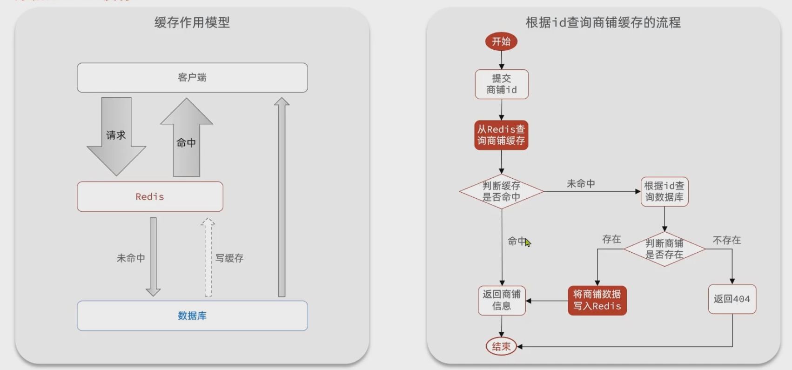

[toc]


# 商铺信息和商铺类型加入redis缓存


## 1. 商铺信息入redis缓存

流程图：




```java
/**
 * 根据id查询商铺信息
 * @param id 商铺id
 * @return 商铺详情数据
 */
@GetMapping("/{id}")
public Result queryShopById(@PathVariable("id") Long id) {
    return shopService.queryById(id);
}


@Autowired
private StringRedisTemplate stringRedisTemplate;

@Override
public Result queryById(Long id) {
    String key = RedisConstants.CACHE_SHOP_KEY + id;
    // 1. 从redis查询商铺缓存
    String shopJson = stringRedisTemplate.opsForValue().get(key);
    // 2. 判断是否存在
    if (StrUtil.isNotBlank(shopJson)) {
        // 3. 存在，直接返回
        Shop shop = JSONUtil.toBean(shopJson, Shop.class);
        return Result.ok(shop);
    }
    // 4. 不存在，根据id查询缓存
    Shop shop = getById(id);
    // 5. 不存在，返回错误
    if(shop == null){
        return Result.fail("店铺不存在！");
    }
    // 6. 存在，写入Redis
    stringRedisTemplate.opsForValue().set(key,JSONUtil.toJsonStr(shop));
    // 7. 返回
    return Result.ok(shop);
}
```


## 2. 商铺类型业务添加redis缓存

```java
@RestController
@RequestMapping("/shop-type")
public class ShopTypeController {
    @Resource
    private IShopTypeService typeService;

    @GetMapping("list")
    public Result queryTypeList() {
        List<ShopType> typeList = typeService.queryAll();
        return Result.ok(typeList);
    }
}


@Autowired
private StringRedisTemplate stringRedisTemplate;

/**
 * 查询所有商铺分类
 *
 * @return
 */
@Override
public List<ShopType> queryAll() {
    String key = RedisConstants.CACHE_TYPE_KEY;
    // 1. 从redis查询商铺分类
    String jsonData = stringRedisTemplate.opsForValue().get(key);
    // 2. 判断是否存在
    if (StrUtil.isNotBlank(jsonData)) {
        // 3. 存在，直接返回
        List<ShopType> typeList = JSONUtil.toList(jsonData, ShopType.class);
        return typeList;
    }
    // 4. 不存在，查询数据库
    List<ShopType> typeList = query().orderByAsc("sort").list();
    // 5. 为空
    if (typeList == null) {
        typeList = new ArrayList<>();
    }
    // 5. 转为String
    jsonData = JSONUtil.toJsonStr(typeList);
    // 6. 存在，写入redis
    stringRedisTemplate.opsForValue().set(key,jsonData,1, TimeUnit.DAYS);
    return typeList;
}