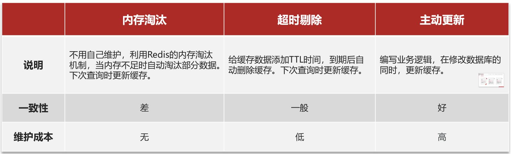
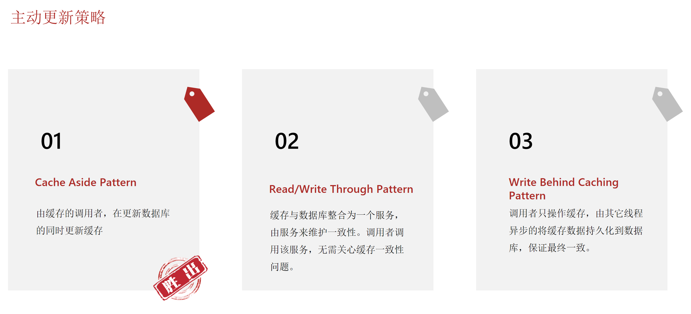
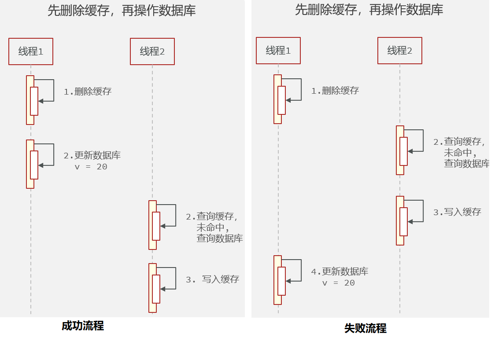
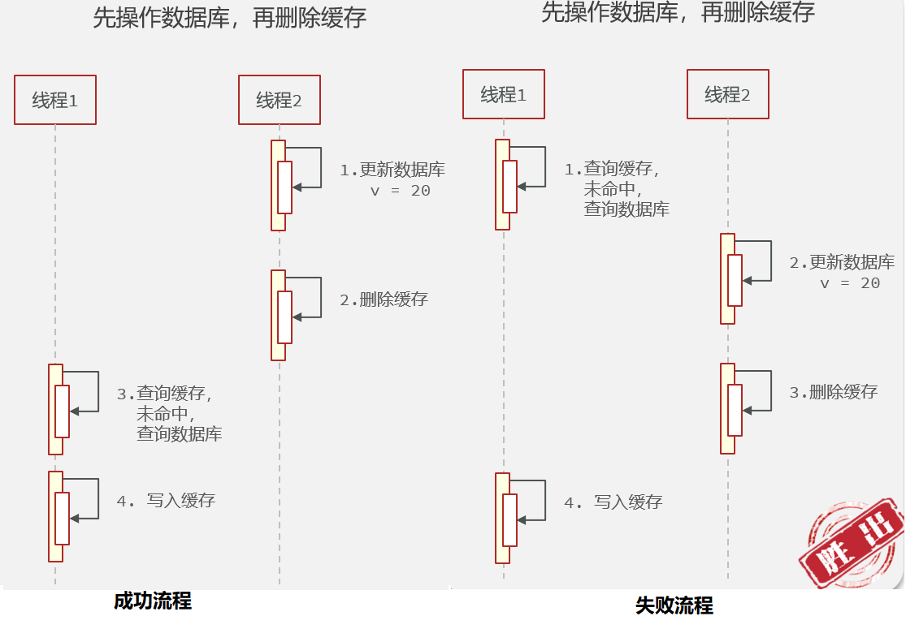

# 缓存更新策略剖析


## 1.更新策略

缓存更新一般有三种策略：

- 内存淘汰
- 超时更新
- 主动更新




业务场景：

- 低一致性需求：使用内存淘汰机制。例如店铺类型的查询缓存
- 高一致性需求：主动更新，并以超时剔除作为兜底方案。例如店铺详情查询的缓存


主动更新策略一般有三种模式的实现：




### 操作缓存和数据库时有三个问题需要考虑：

1. 删除缓存还是更新缓存？

   1. 更新缓存：每次更新数据库都更新缓存，无效写操作较多
   2. 删除缓存：更新数据库时让缓存失效，查询时再更新缓存
   3. 所以选择删除缓存

2. 如何保证缓存与数据库的操作的同时成功或失败？

   1. 单体系统，将缓存与数据库操作放在一个事务
   2. 分布式系统，利用TCC等分布式事务方案

3. 先操作缓存还是先操作数据库？

   这个问题比较复杂，都会有不安全发生，详细见下






为什么失败了，依然是**先操作数据库再删缓存**胜出呢？

- 首先看失败的场景，**一定要线程1 去查询数据库，再写入数据的**，也就是说，必须是缓存恰好失效的前提下才会发生。而缓存中大概率是有数据的，所以这种情况发生的概率极低。
- 由于这种情况线程1必须查到旧数据，所以**线程2需要在线程1从查数据到写入缓存之间的时间完成 数据库的写操作**，也就是说严格按照流程图的顺序。这种情况也是极小概率事件，毕竟不大可能写 数据库操作比写redis操作使用时间短。
- 综上，虽然不安全，但是发生不安全的概率极低，可以使用缓存超时机制兜底


### 缓存更新策略的最佳实践方案：

- 低一致性需求：使用Redis自带的内存淘汰机制
- 高一致性需求：主动更新，并以超时剔除作为兜底方案
  - 读操作：
    - 缓存命中则直接返回
    - 缓存未命中则查询数据库，并写入缓存，设定超时时间
  - 写操作：
    - **先写数据库，然后再删除缓存**
    - 要确保数据库与缓存操作的原子性


## 2. 案例：给查询商铺的缓存添加超时剔除和主动更新的策略

修改业务逻辑，满足下面的需求：

1. 根据id查询店铺时，如果缓存未命中，则查询数据库，将数据库结果写入缓存，并设置超时时间
2. 根据id修改店铺时，先修改数据库，再删除缓存

```java
package com.hmdp.service.impl;

import cn.hutool.core.util.StrUtil;
import cn.hutool.json.JSONUtil;
import com.hmdp.dto.Result;
import com.hmdp.entity.Shop;
import com.hmdp.mapper.ShopMapper;
import com.hmdp.service.IShopService;
import com.baomidou.mybatisplus.extension.service.impl.ServiceImpl;
import com.hmdp.utils.RedisConstants;
import org.springframework.beans.factory.annotation.Autowired;
import org.springframework.data.redis.core.StringRedisTemplate;
import org.springframework.stereotype.Service;
import org.springframework.transaction.annotation.Transactional;

import java.util.concurrent.TimeUnit;

@Service
public class ShopServiceImpl extends ServiceImpl<ShopMapper, Shop> implements IShopService {

    @Autowired
    private StringRedisTemplate stringRedisTemplate;

    @Override
    public Result queryById(Long id) {
        String key = RedisConstants.CACHE_SHOP_KEY + id;
        // 1. 从redis查询商铺缓存
        String shopJson = stringRedisTemplate.opsForValue().get(key);
        // 2. 判断是否存在
        if (StrUtil.isNotBlank(shopJson)) {
            // 3. 存在，直接返回
            Shop shop = JSONUtil.toBean(shopJson, Shop.class);
            return Result.ok(shop);
        }
        // 4. 不存在，根据id查询缓存
        Shop shop = getById(id);
        // 5. 不存在，返回错误
        if (shop == null) {
            return Result.fail("店铺不存在！");
        }
        // 6. 存在，写入Redis
        stringRedisTemplate.opsForValue().set(key, JSONUtil.toJsonStr(shop), RedisConstants.CACHE_SHOP_TTL, TimeUnit.MINUTES);
        // 7. 返回
        return Result.ok(shop);
    }

    @Override
    @Transactional
    public Result update(Shop shop) {
        Long id = shop.getId();
        if (id == null){
            return Result.fail("店铺id不能为空");
        }
        // 1. 更新数据库
        updateById(shop);
        // 2. 删除缓存
        stringRedisTemplate.delete(RedisConstants.CACHE_SHOP_KEY + id);
        return null;
    }
}
```


