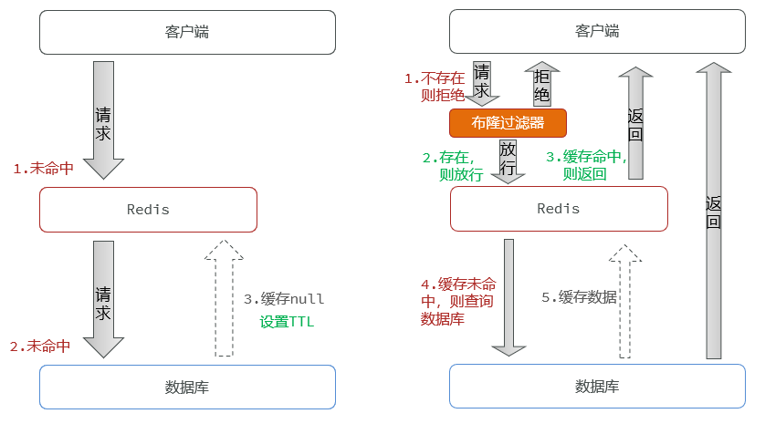
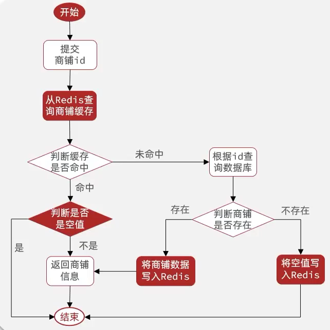

[TOC]

# 缓存穿透-某些key缓存不到


## 缓存穿透理论知识

缓存穿透是指客户端请求的数据在缓存中和数据库中都不存在，这样缓存永远不会生效，这些请求都会打到数据库。


常见的解决方案有三种：

- 缓存空对象
  - 优点：实现简单，维护方便
  - 缺点：
    - 额外的内存消耗
    - 可能造成短期的不一致
- 布隆过滤
  - 优点：内存占用较少，没有多余key
  - 缺点：
    - 实现复杂
    - 存在误判可能
- 增加id复杂度，避免别人知道你ID的规律，做好ID格式校验，不符合ID格式规范的直接pass

此外还可以加强用户权限校验，做好热点参数限流等。




## 案例：用缓存空对象解决缓存穿透



```java
@Override
public Result queryById(Long id) {
    String key = RedisConstants.CACHE_SHOP_KEY + id;
    // 1. 从redis查询商铺缓存
    String shopJson = stringRedisTemplate.opsForValue().get(key);
    // 2. 判断是否存在,这个工具方法 有真正的字符串才会是true，""是不会进去的
    if (StrUtil.isNotBlank(shopJson)) {
        // 3. 存在，直接返回
        Shop shop = JSONUtil.toBean(shopJson, Shop.class);
        return Result.ok(shop);
    }
    // 判断命中是否是空 不是 有字符串的，也不是null，就是""空字符串了
    if (shopJson != null) {
        // 返回错误信息
        return Result.fail("店铺信息不存在");
    }
    // 能走到这，说明是 null，redis中确实没缓存，空缓存也没有
    // 4. 不存在，根据id查询缓存
    Shop shop = getById(id);
    // 5. 不存在，返回错误
    if (shop == null) {
        // 将空值写入redis
        stringRedisTemplate.opsForValue().set(key, "", RedisConstants.CACHE_NULL_TTL, TimeUnit.MINUTES);
        return Result.fail("店铺不存在！");
    }
    // 6. 存在，写入Redis
    stringRedisTemplate.opsForValue().set(key, JSONUtil.toJsonStr(shop), RedisConstants.CACHE_SHOP_TTL, TimeUnit.MINUTES);
    // 7. 返回
    return Result.ok(shop);
}
```


