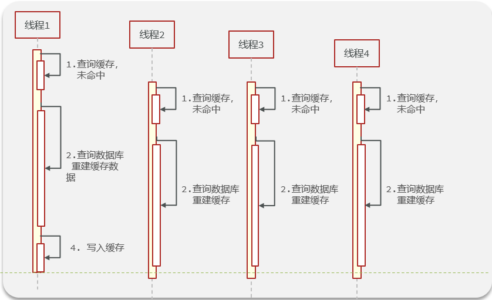
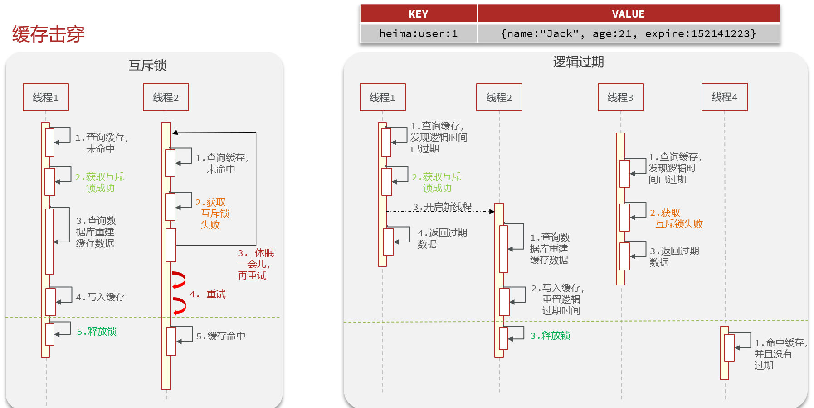
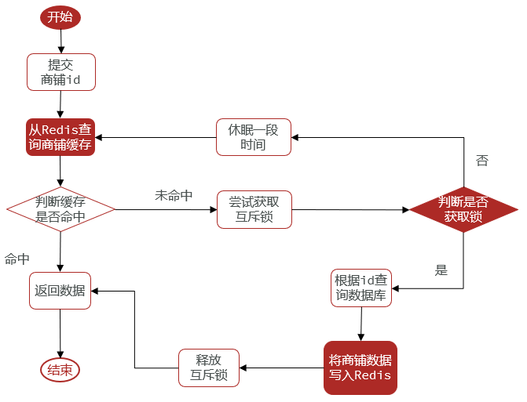
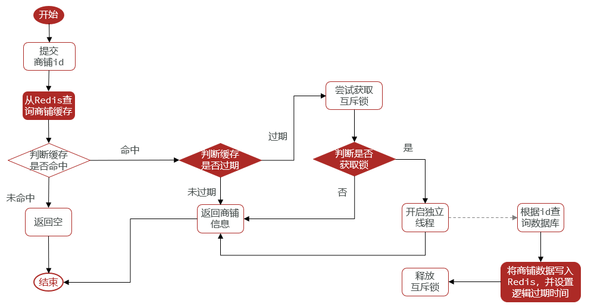

[TOC]

# 缓存击穿-热点key失效


## 缓存击穿理论

缓存击穿问题也叫热点Key问题，就是一个被高并发访问并且缓存重建业务较复杂的key突然失效了，无数的请求访问会在瞬间给数据库带来巨大的冲击。




解决方案：

- 互斥锁
- 逻辑过期

流程图如下：




### 互斥锁

优点：

- 没有额外内存消耗
- 保证一致性
- 实现简单

缺点：

- 线程需要等待，性能受到影响
- 可能有死锁风险

### 逻辑过期

优点：

- 线程无需等待，性能较好

缺点：

- 不保证一致性
- 有额外内存消耗
- 实现复杂


## 案例1：基于互斥锁方式解决缓存击穿

需求：修改根据id查询商铺的业务，基于互斥锁方式来解决缓存击穿问题



此处 互斥锁 用 redis的 `setnx` 命令

详细实现代码见 本文 最后

## 案例2：基于逻辑过期方式解决缓存击穿问题

需求：修改根据id查询商铺的业务，基于逻辑过期方式来解决缓存击穿问题



### 

逻辑过期需要用一个包装类包装redis存储的数据 + 逻辑过期时间

```java
package com.hmdp.utils;

import lombok.Data;

import java.time.LocalDateTime;

@Data
public class RedisData {
    /**
     * 逻辑过期时间
     */
    private LocalDateTime expireTime;

    private Object data;
}
```

准备热点数据

```java
@SpringBootTest
class HmDianPingApplicationTests {

    @Resource
    private ShopServiceImpl shopService;

    @Test
    void testSaveShop(){
        shopService.saveShop2Redis(1L,10L);
    }
}


/**
 * 提前将商品信息存入 redis
 *
 * @param id
 * @param expireSeconds
 */
public void saveShop2Redis(Long id, Long expireSeconds) {
	// 1. 查询店铺数据
	Shop shop = getById(id);
	// 2. 封装逻辑过期时间
	RedisData redisData = new RedisData();
	redisData.setData(shop);
	redisData.setExpireTime(LocalDateTime.now().plusSeconds(expireSeconds));
	// 3. 写入Redis
	stringRedisTemplate.opsForValue().set(RedisConstants.CACHE_SHOP_KEY + id, JSONUtil.toJsonStr(redisData));
}
```

完整代码：

```java
package com.hmdp.service.impl;

import cn.hutool.core.util.BooleanUtil;
import cn.hutool.json.JSONObject;
import com.hmdp.entity.Shop;
import com.hmdp.mapper.ShopMapper;
import com.hmdp.service.IShopService;
import com.baomidou.mybatisplus.extension.service.impl.ServiceImpl;
import com.hmdp.utils.RedisData;
import org.springframework.stereotype.Service;


import cn.hutool.core.util.StrUtil;
import cn.hutool.json.JSONUtil;
import com.hmdp.dto.Result;
import com.hmdp.utils.RedisConstants;
import org.springframework.beans.factory.annotation.Autowired;
import org.springframework.data.redis.core.StringRedisTemplate;
import org.springframework.transaction.annotation.Transactional;

import java.time.LocalDateTime;
import java.util.concurrent.ExecutorService;
import java.util.concurrent.Executors;
import java.util.concurrent.TimeUnit;


@Service
public class ShopServiceImpl extends ServiceImpl<ShopMapper, Shop> implements IShopService {

    @Autowired
    private StringRedisTemplate stringRedisTemplate;

    private static final ExecutorService CACHE_REBUILD_EXECUTOR = Executors.newFixedThreadPool(10);

    @Override
    public Result queryById(Long id) {
        Shop shop = null;
        // 解决缓存穿透
        //shop = queryWithPassThrough(id);
        // 互斥锁解决缓存击穿
        //shop = queryWithMutex(id);
        // 逻辑过期解决缓存击穿
        shop = queryWithLogicalExpire(id);
        if (shop == null) {
            return Result.fail("店铺不存在！");
        }
        return Result.ok(shop);
    }

    /**
     * 查询商户信息，解决缓存穿透 + 击穿
     * 使用逻辑过期
     * 逻辑过期实际上是将所有的前端都交给redis
     * redis用逻辑过期时间决定什么时候查询mysql
     *
     * @param id
     * @return
     */
    public Shop queryWithLogicalExpire(Long id) {
        String key = RedisConstants.CACHE_SHOP_KEY + id;
        // 1. 从redis查询商铺缓存
        String shopJson = stringRedisTemplate.opsForValue().get(key);
        // 2. 判断是否存在
        if (StrUtil.isBlank(shopJson)) {
            // 3. 不存在，直接返回null，这里假设热点数据都是提前加载入Redis的
            return null;
        }
        // 4. 命中需要先把Json反序列化为对象
        RedisData redisData = JSONUtil.toBean(shopJson, RedisData.class);
        JSONObject data = (JSONObject) redisData.getData();
        Shop shop = JSONUtil.toBean(data, Shop.class);
        LocalDateTime expireTime = redisData.getExpireTime();
        // 5. 判断是否过期
        if (expireTime.isAfter(LocalDateTime.now())) {
            // 5.1 未过期，直接返回店铺信息
            return shop;
        }
        // 5.2 已过期缓存重建
        // 6. 缓存重建
        // 6.1 获取互斥锁
        String localKey = RedisConstants.LOCK_SHOP_KEY + id;
        boolean isLock = tryLock(localKey);
        // 6.2 判断是否获取锁成功
        if (isLock) {
            // 6.3 成功，开启独立线程实现缓存重建
            CACHE_REBUILD_EXECUTOR.submit(() -> {
                try {
                    // 重建缓存
                    saveShop2Redis(id, 20L);
                } finally {
                    // 释放锁
                    unlock(localKey);
                }
            });
        }
        // 6.4 返回过期商铺信息
        return shop;
    }


    /**
     * 缓存空值解决缓存穿透
     *
     * @param id
     * @return
     */
    public Shop queryWithPassThrough(Long id) {
        String key = RedisConstants.CACHE_SHOP_KEY + id;
        // 1. 从redis查询商铺缓存
        String shopJson = stringRedisTemplate.opsForValue().get(key);
        // 2. 判断是否存在,这个工具方法 有真正的字符串才会是true，""是不会进去的
        if (StrUtil.isNotBlank(shopJson)) {
            // 3. 存在，直接返回
            return JSONUtil.toBean(shopJson, Shop.class);
        }
        // 判断命中是否是空 不是 有字符串的，也不是null，就是""空字符串了
        if (shopJson != null) {
            return null;
        }
        // 能走到这，说明是 null，redis中确实没缓存，空缓存也没有
        // 4. 不存在，根据id查询缓存
        Shop shop = getById(id);
        // 5. 不存在，返回错误
        if (shop == null) {
            // 将空值写入redis
            stringRedisTemplate.opsForValue().set(key, "", RedisConstants.CACHE_NULL_TTL, TimeUnit.MINUTES);
            return null;
        }
        // 6. 存在，写入Redis
        stringRedisTemplate.opsForValue().set(key, JSONUtil.toJsonStr(shop), RedisConstants.CACHE_SHOP_TTL, TimeUnit.MINUTES);
        // 7. 返回
        return shop;
    }

    /**
     * 查询商户信息，解决 缓存穿透 + 击穿
     * 其中，穿透使用空值法，击穿采用自定义 分布式锁
     *
     * @param id
     * @return
     */
    public Shop queryWithMutex(Long id) {
        String key = RedisConstants.CACHE_SHOP_KEY + id;
        // 1. 从redis查询商铺缓存
        String shopJson = stringRedisTemplate.opsForValue().get(key);
        // 2. 判断是否存在
        if (StrUtil.isNotBlank(shopJson)) {
            // 3. 存在，直接返回
            return JSONUtil.toBean(shopJson, Shop.class);
        }
        // 判断命中是否是空，解决缓存穿透
        if (shopJson != null) {
            // 返回错误信息
            return null;
        }
        // 4. 实现缓存重建
        // 4.1 获取互斥锁
        String lockKey = "lock:shop:" + id;
        Shop shop = null;
        try {
            boolean isLock = tryLock(lockKey);
            // 4.2 判断是否成功
            if (!isLock) {
                // 4.3 失败，则休眠并重试
                Thread.sleep(50);
                return queryWithMutex(id);
            }

            // 4.4 成功，根据id查询数据库
            shop = getById(id);
            // 5. 不存在，返回错误
            if (shop == null) {
                // 将空值写入redis
                stringRedisTemplate.opsForValue().set(key, "", RedisConstants.CACHE_NULL_TTL, TimeUnit.MINUTES);
                return null;
            }
            // 6. 存在，写入Redis
            stringRedisTemplate.opsForValue().set(key, JSONUtil.toJsonStr(shop), RedisConstants.CACHE_SHOP_TTL, TimeUnit.MINUTES);
        } catch (InterruptedException e) {
            throw new RuntimeException(e);
        } finally {
            // 7. 释放互斥锁
            unlock(lockKey);
        }
        // 8. 返回
        return shop;
    }


    /**
     * 获取自定义分布式锁
     *
     * @param key
     * @return
     */
    private boolean tryLock(String key) {
        Boolean flag = stringRedisTemplate.opsForValue().setIfAbsent(key, "1", 10, TimeUnit.SECONDS);
        return BooleanUtil.isTrue(flag);
    }

    /**
     * 释放自定义分布式锁
     *
     * @param key
     */
    private void unlock(String key) {
        stringRedisTemplate.delete(key);
    }

    /**
     * 提前将商品信息存入 redis
     *
     * @param id
     * @param expireSeconds
     */
    public void saveShop2Redis(Long id, Long expireSeconds) {
        // 1. 查询店铺数据
        Shop shop = getById(id);
        // 2. 封装逻辑过期时间
        RedisData redisData = new RedisData();
        redisData.setData(shop);
        redisData.setExpireTime(LocalDateTime.now().plusSeconds(expireSeconds));
        // 3. 写入Redis
        stringRedisTemplate.opsForValue().set(RedisConstants.CACHE_SHOP_KEY + id, JSONUtil.toJsonStr(redisData));
    }

    @Override
    @Transactional
    public Result update(Shop shop) {
        Long id = shop.getId();
        if (id == null) {
            return Result.fail("店铺id不能为空");
        }
        // 1. 更新数据库
        updateById(shop);
        // 2. 删除缓存
        stringRedisTemplate.delete(RedisConstants.CACHE_SHOP_KEY + id);
        return null;
    }
}
```


