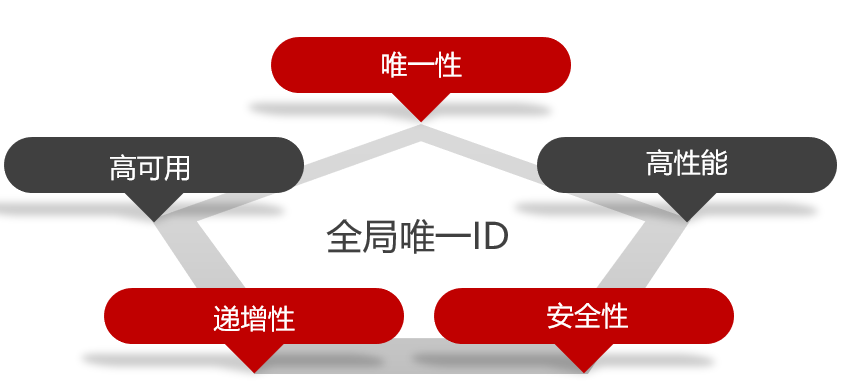
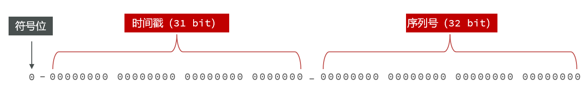

# Redis实现全局ID生成器


全局ID生成器，是一种在分布式系统下用来生成全局唯一ID的工具，一般要满足下列特性：




为了增加ID的安全性，我们可以不直接使用Redis自增的数值，而是拼接一些其它信息：



ID的组成部分：

- 符号位：1bit，永远为0
- 时间戳：31bit，以秒为单位，可以使用69年
- 序列号：32bit，秒内的计数器，支持每秒产生2^32个不同ID

实现：

```java
package com.hmdp.utils;

import org.springframework.data.redis.core.StringRedisTemplate;
import org.springframework.stereotype.Component;

import java.time.LocalDateTime;
import java.time.ZoneOffset;
import java.time.format.DateTimeFormatter;

@Component
public class RedisIdWorker {
    /**
     * 开始时间戳
     */
    private static final long BEGIN_TIMESTAMP = 1640995200L;

    /**
     * 序列号的位数
     */
    private static final int COUNT_BITS = 32;

    private StringRedisTemplate stringRedisTemplate;

    public RedisIdWorker(StringRedisTemplate stringRedisTemplate) {
        this.stringRedisTemplate = stringRedisTemplate;
    }

    public long nextId(String keyPrefix) {
        // 1. 生成时间戳
        LocalDateTime now = LocalDateTime.now();
        long nowSecond = now.toEpochSecond(ZoneOffset.UTC);
        long timestamp = nowSecond - BEGIN_TIMESTAMP;

        // 2. 生成序列号
        // 2.1 获取当前日期，精确到天
        String date = now.format(DateTimeFormatter.ofPattern("yyyy:MM:dd"));
        // 2.2 自增长
        long count = stringRedisTemplate.opsForValue().increment("icr:" + keyPrefix + ":" + date);
        // 3. 拼接并返回
        return timestamp << COUNT_BITS | count;
    }

    /**
     * 为了得到上面的 1640995200L
     * @param args
     */
    public static void main(String[] args) {
        LocalDateTime time = LocalDateTime.of(2022, 1, 1, 0, 0, 0);
        long second = time.toEpochSecond(ZoneOffset.UTC);
        System.out.println("second = " + second);
    }

}
```


