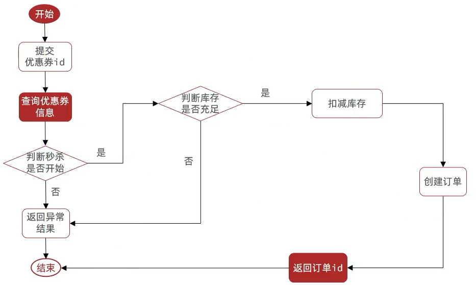

[TOC]


# 下单基本实现


下单时需要判断两点：

1. 秒杀是否开始或结束，如果尚未开始或已经结束则无法下单
2. 库存是否充足，不足则无法下单




这里只是实现了基本功能，安全性有很多问题

```java
package com.hmdp.service.impl;

import com.hmdp.dto.Result;
import com.hmdp.entity.SeckillVoucher;
import com.hmdp.entity.VoucherOrder;
import com.hmdp.mapper.VoucherOrderMapper;
import com.hmdp.service.ISeckillVoucherService;
import com.hmdp.service.IVoucherOrderService;
import com.baomidou.mybatisplus.extension.service.impl.ServiceImpl;
import com.hmdp.utils.RedisIdWorker;
import com.hmdp.utils.UserHolder;
import lombok.val;
import org.springframework.stereotype.Service;
import org.springframework.transaction.annotation.Transactional;

import javax.annotation.Resource;
import java.time.LocalDateTime;

@Service
public class VoucherOrderServiceImpl extends ServiceImpl<VoucherOrderMapper, VoucherOrder> implements IVoucherOrderService {

    /**
     * 秒杀券的service，查库存用
     */
    @Resource
    private ISeckillVoucherService seckillVoucherService;

    @Resource
    private RedisIdWorker redisIdWorker;

    @Override
    @Transactional
    public Result seckillVoucher(Long voucherId) {
        // 1. 查询优惠券
        SeckillVoucher voucher = seckillVoucherService.getById(voucherId);
        // 2. 判断秒杀是否开始
        if (voucher.getBeginTime().isAfter(LocalDateTime.now())) {
            return Result.fail("秒杀尚未开始！");
        }
        // 3. 判断秒杀是否结束
        if (voucher.getEndTime().isBefore(LocalDateTime.now())) {
            return Result.fail("秒杀已经结束！");
        }
        // 4. 判断库存是否充足
        if (voucher.getStock() < 1) {
            // 库存不足
            return Result.fail("库存不足！");
        }
        // 5. 扣减库存
        boolean success = seckillVoucherService.update().setSql("stock = stock-1").eq("voucher_id", voucherId).update();
        if (!success) {
            // 库存不足
            return Result.fail("库存不足！");
        }
        // 6. 创建订单
        VoucherOrder voucherOrder = new VoucherOrder();
        // 6.1 订单id
        long orderId = redisIdWorker.nextId("order");
        voucherOrder.setId(orderId);
        // 6.2 用户id
        Long userId = UserHolder.getUser().getId();
        voucherOrder.setUserId(userId);
        // 6.3 代金券id
        voucherOrder.setVoucherId(voucherId);
        // 写入数据库
        save(voucherOrder);
        // 7. 返回订单Id
        return Result.ok(orderId);
    }
}
```

