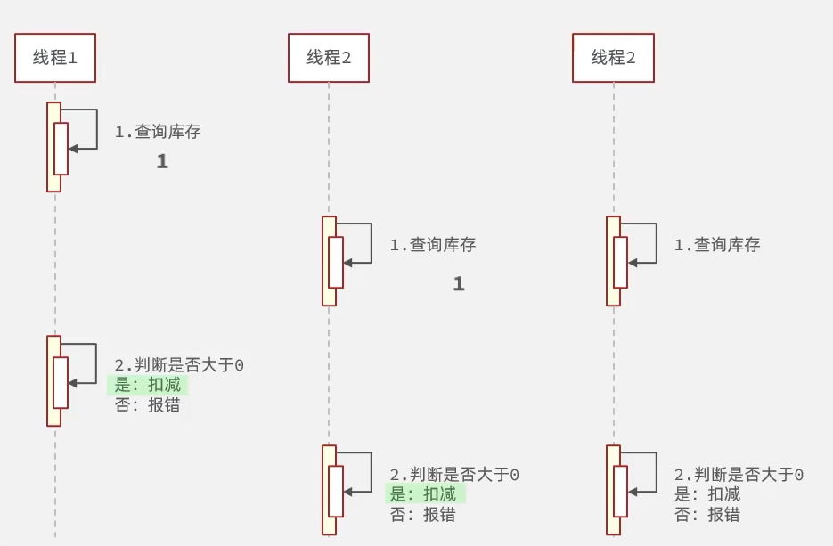
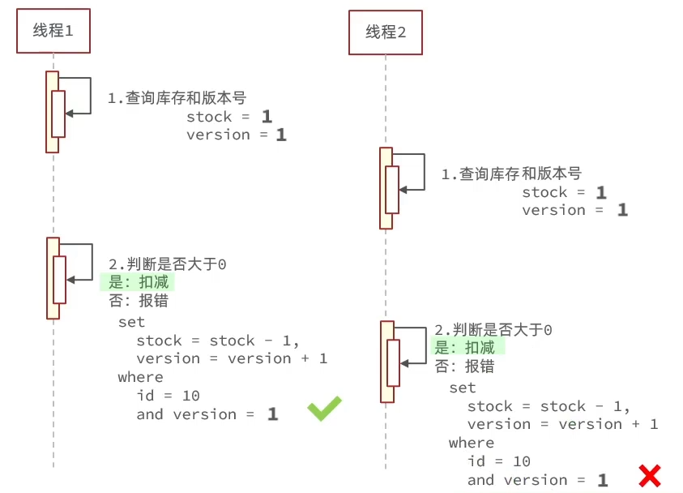
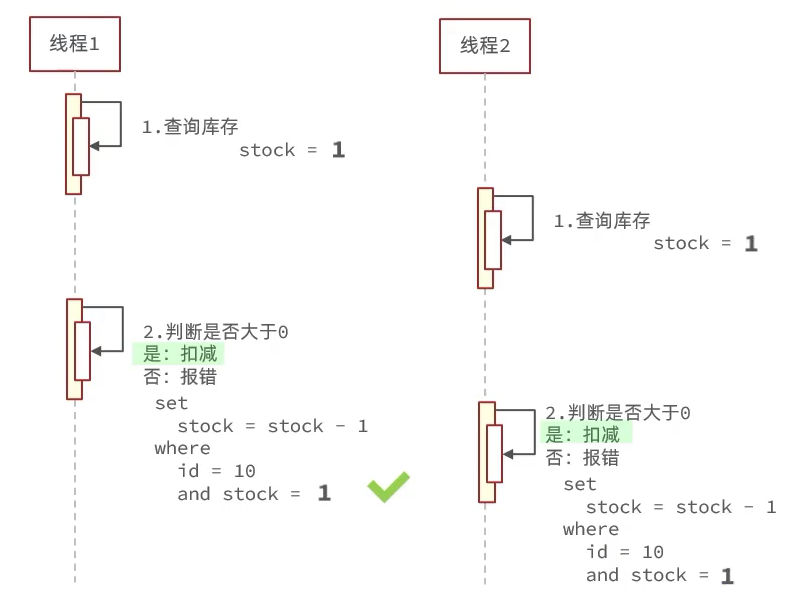

[TOc]


# 超卖问题与解决


## 问题提出




超卖问题是典型的多线程安全问题，针对这一问题的常见解决方案就是加锁：

## 悲观锁

悲观锁认为线程安全问题一定会发生，因此在操作数据之前先获取锁，确保线程串行执行。 例如Synchronized、Lock都属于悲观锁

## 乐观锁

- 认为线程安全问题不一定会发生，因此不加锁，只是在更新数据时去判断有没有其它线程对数据做了修改。
- 如果没有修改则认为是安全的，自己才更新数据。
- 如果已经被其它线程修改说明发生了安全问题，此时可以重试或异常。


## 乐观锁解决超卖版本号法思路


### 版本号法



### CAS法




##  基于乐观锁CAS方案解决超卖问题

在SQL 语句上着手，保证库存

方式1：

```java
// 5. 扣减库存
boolean success = seckillVoucherService.update()
        .setSql("stock = stock-1")  // set stock = stock - 1
        .eq("voucher_id", voucherId) // where voucher_id = ?
        .eq("stock",voucher.getStock()) // and stock = ?
        .update();
```

但这种方式效率过低，很多请求进来发现库存被改过直接失败了

方式2：

```java
boolean success = seckillVoucherService.update()
                .setSql("stock = stock-1")  // set stock = stock - 1
                .eq("voucher_id", voucherId) // where voucher_id = ?
                .gt("stock",0) // and stock > 0
                .update();
```

我们并不需要在查询和操作库存之间完全没有别的线程动过，而是需要最终库存大于0 即可。


## 总结：

悲观锁：添加同步锁，让线程串行执行

- 优点：简单粗暴
- 缺点：性能一般

乐观锁：不加锁，在更新时判断是否有其他线程在修改

- 优点：性能好
- 缺点：存在成功率低的问题