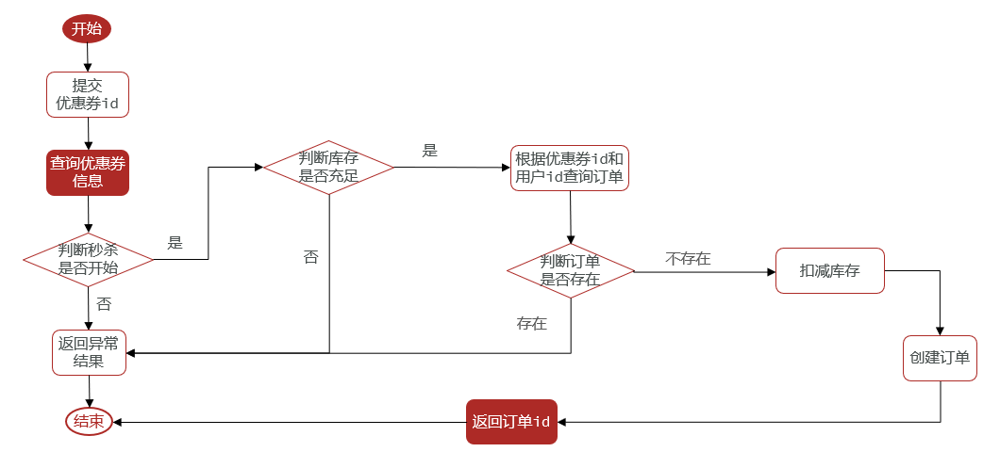

[TOC]


# 一人一单问题与解决 - 分布式锁


增加对同一个用户是否下过单的判断，要求一个用户只能下一单。




## 单机版解决


思路：以`synchronized`对用户ID加锁，保证同一个用户请求此接口是串行

```java
package com.hmdp.service.impl;

import com.hmdp.dto.Result;
import com.hmdp.entity.SeckillVoucher;
import com.hmdp.entity.VoucherOrder;
import com.hmdp.mapper.VoucherOrderMapper;
import com.hmdp.service.ISeckillVoucherService;
import com.hmdp.service.IVoucherOrderService;
import com.baomidou.mybatisplus.extension.service.impl.ServiceImpl;
import com.hmdp.utils.RedisIdWorker;
import com.hmdp.utils.UserHolder;
import org.springframework.aop.framework.AopContext;
import org.springframework.stereotype.Service;
import org.springframework.transaction.annotation.Transactional;

import javax.annotation.Resource;
import java.time.LocalDateTime;


@Service
public class VoucherOrderServiceImpl extends ServiceImpl<VoucherOrderMapper, VoucherOrder> implements IVoucherOrderService {

    /**
     * 秒杀券的service，查库存用
     */
    @Resource
    private ISeckillVoucherService seckillVoucherService;

    @Resource
    private RedisIdWorker redisIdWorker;

    @Override
    @Transactional
    public Result seckillVoucher(Long voucherId) {
        // 1. 查询优惠券
        SeckillVoucher voucher = seckillVoucherService.getById(voucherId);
        // 2. 判断秒杀是否开始
        if (voucher.getBeginTime().isAfter(LocalDateTime.now())) {
            return Result.fail("秒杀尚未开始！");
        }
        // 3. 判断秒杀是否结束
        if (voucher.getEndTime().isBefore(LocalDateTime.now())) {
            return Result.fail("秒杀已经结束！");
        }
        // 4. 判断库存是否充足
        if (voucher.getStock() < 1) {
            // 库存不足
            return Result.fail("库存不足！");
        }
        return createVoucherOrder(voucherId);
    }


    /**
     * 创建订单
     *
     * @param voucherId
     * @return
     */
    @Transactional
    public Result createVoucherOrder(Long voucherId) {
        // 5. 一人一单
        Long userId = UserHolder.getUser().getId();
        // 这里的 String 对象一定要用 intern 获取字符串常量池中的对象加锁
        synchronized (userId.toString().intern()) {
            // 5.1 查询订单
            int count = query().eq("user_id", userId).eq("voucher_id", voucherId).count();
            // 5.2 判断是否存在
            if (count > 0) {
                // 用户已经购买过了
                return Result.fail("用户已经购买过一次！");
            }
            // 6. 扣减库存,超卖问题主要由 .gt("stock",0) 控制
            boolean success = seckillVoucherService.update()
                .setSql("stock = stock-1")  // set stock = stock - 1
                .eq("voucher_id", voucherId) // where voucher_id = ?
                .gt("stock", 0) // and stock > 0
                .update();
            if (!success) {
                // 库存不足
                return Result.fail("库存不足！");
            }
            // 7. 创建订单
            VoucherOrder voucherOrder = new VoucherOrder();
            // 7.1 订单id
            long orderId = redisIdWorker.nextId("order");
            voucherOrder.setId(orderId);
            // 7.2 用户id
            voucherOrder.setUserId(userId);
            // 7.3 代金券id
            voucherOrder.setVoucherId(voucherId);
            // 写入数据库
            save(voucherOrder);
            // 8. 返回订单Id
            return Result.ok(orderId);
        }
    }
}

```


## 集群版存在问题


核心问题：集群模式下 `synchronized` 锁监视器不是同一个，想要解决需要用到**分布式锁**


