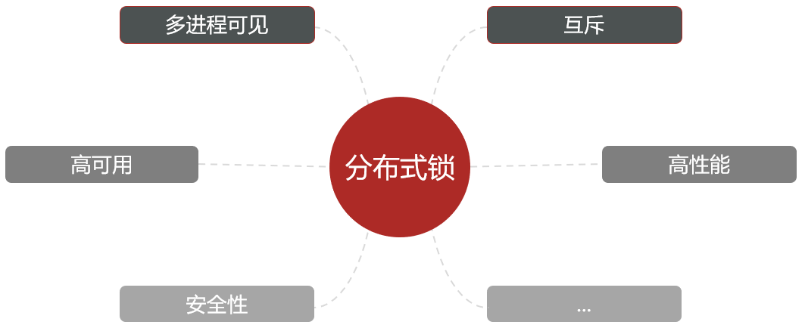
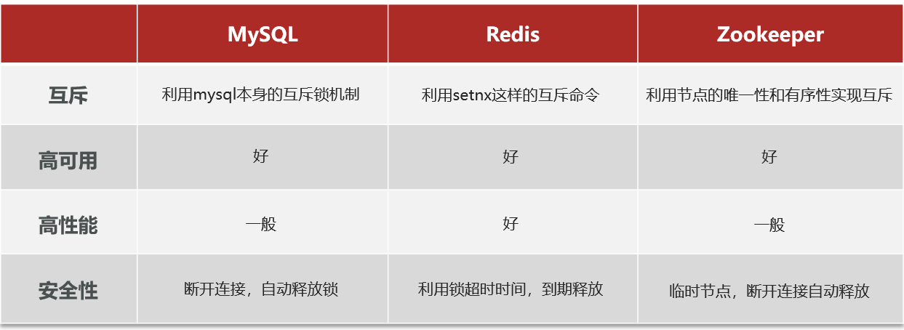
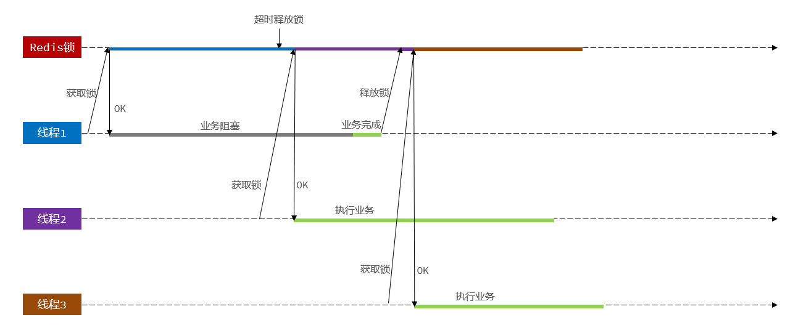
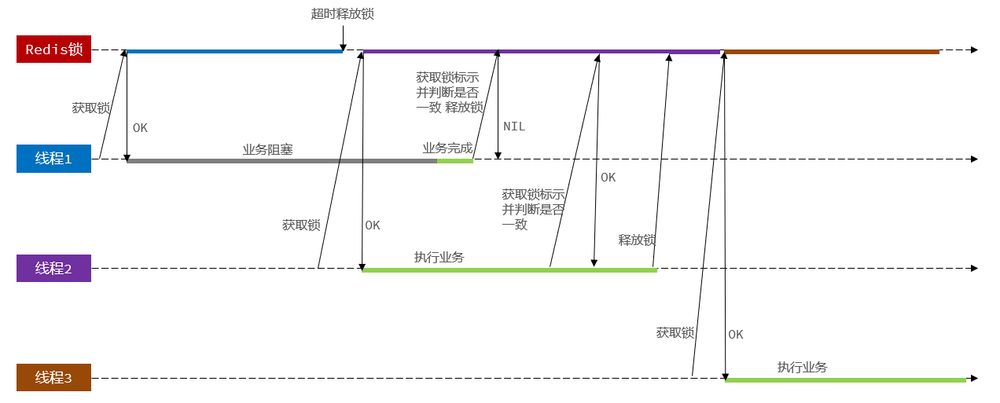
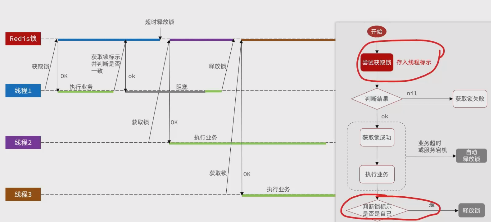
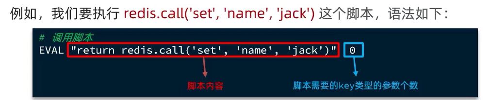
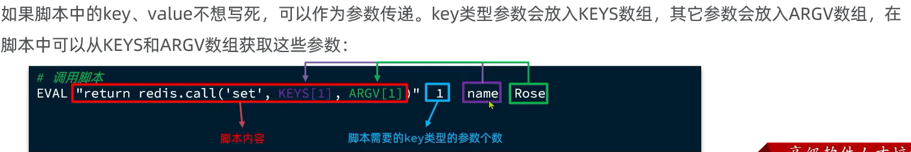
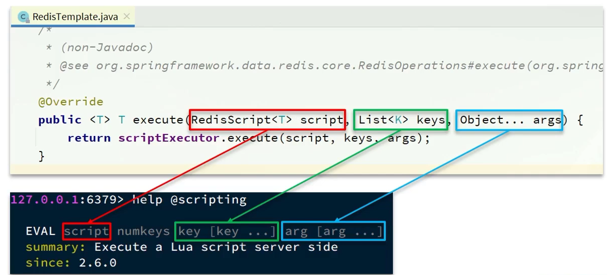
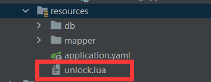

[TOC]


# 分布式锁


分布式锁：满足分布式系统或集群模式下多进程可见并且互斥的锁。



分布式锁的核心是实现多进程之间互斥，而满足这一点的方式有很多，常见的有三种：




## Redis分布式锁基础实现


需求：定义一个类，实现下面接口，利用Redis实现分布式锁功能。

实现逻辑：利用 `redis` 的 `setnx` 操作进行加锁，只会有一个线程执行成功，别的线程加锁都失败。为了方式获得锁的线程宕机造成死锁，redis中的锁对象需要加上超时过期时间。

锁接口如下：

```java
package com.hmdp.utils;

public interface ILock {

    /**
     * 尝试获取锁
     * @param timeoutSec 锁持有的超时时间，过期后自动释放
     * @return true代表获取锁成功; false代表获取锁失败
     */
    boolean tryLock(long timeoutSec);

    /**
     * 释放锁
     */
    void unlock();
}
```

锁实现：

```java
package com.hmdp.utils;

import org.springframework.data.redis.core.StringRedisTemplate;

import java.util.concurrent.TimeUnit;

public class SimpleRedisLock implements ILock {

    private StringRedisTemplate stringRedisTemplate;
    private String name; // 业务名称
    private static final String KEY_PREFIX = "lock:";

    public SimpleRedisLock(String name,StringRedisTemplate stringRedisTemplate) {
        this.stringRedisTemplate = stringRedisTemplate;
        this.name = name;
    }

    /**
     * 获取锁
     * @param timeoutSec 锁持有的超时时间，过期后自动释放
     * @return
     */
    @Override
    public boolean tryLock(long timeoutSec) {
        // 获取线程标识
        long threadId = Thread.currentThread().getId();
        // 获取锁
        Boolean success = stringRedisTemplate.opsForValue()
            .setIfAbsent(KEY_PREFIX + name, threadId + "", timeoutSec, TimeUnit.SECONDS);
        return Boolean.TRUE.equals(success);
    }

    @Override
    public void unlock() {
        // 释放锁
        stringRedisTemplate.delete(KEY_PREFIX+name);
    }
}
```

业务逻辑

```java
@Override
@Transactional
public Result seckillVoucher(Long voucherId) {
    // 1. 查询优惠券
    SeckillVoucher voucher = seckillVoucherService.getById(voucherId);
    // 2. 判断秒杀是否开始
    if (voucher.getBeginTime().isAfter(LocalDateTime.now())) {
        return Result.fail("秒杀尚未开始！");
    }
    // 3. 判断秒杀是否结束
    if (voucher.getEndTime().isBefore(LocalDateTime.now())) {
        return Result.fail("秒杀已经结束！");
    }
    // 4. 判断库存是否充足
    if (voucher.getStock() < 1) {
        // 库存不足
        return Result.fail("库存不足！");
    }
    return createVoucherOrder(voucherId);
}


/**
 * 创建订单 ，手写Redis分布式锁实现
 *
 * @param voucherId
 * @return
 */
@Transactional
public Result createVoucherOrder(Long voucherId) {
    // 5. 一人一单
    Long userId = UserHolder.getUser().getId();

    // 创建锁对象
    SimpleRedisLock redisLock = new SimpleRedisLock("order:" + userId, stringRedisTemplate);
    boolean isLock = redisLock.tryLock(1200);
    // 判断
    if (!isLock) {
        // 获取锁失败，直接返回失败或重试
        return Result.fail("不允许重复下单");
    }

    try {
        // 5.1 查询订单
        int count = query().eq("user_id", userId).eq("voucher_id", voucherId).count();
        // 5.2 判断是否存在
        if (count > 0) {
            // 用户已经购买过了
            return Result.fail("用户已经购买过一次！");
        }
        // 6. 扣减库存,超卖问题主要由 .gt("stock",0) 控制
        boolean success = seckillVoucherService.update()
            .setSql("stock = stock-1")  // set stock = stock - 1
            .eq("voucher_id", voucherId) // where voucher_id = ?
            .gt("stock", 0) // and stock > 0
            .update();
        if (!success) {
            // 库存不足
            return Result.fail("库存不足！");
        }
        // 7. 创建订单
        VoucherOrder voucherOrder = new VoucherOrder();
        // 7.1 订单id
        long orderId = redisIdWorker.nextId("order");
        voucherOrder.setId(orderId);
        // 7.2 用户id
        voucherOrder.setUserId(userId);
        // 7.3 代金券id
        voucherOrder.setVoucherId(voucherId);
        // 写入数据库
        save(voucherOrder);
        // 8. 返回订单Id
        return Result.ok(orderId);
    } finally {
        // 释放锁
        redisLock.unlock();
    }
}
```


## Redis分布式锁的误删问题

### 问题提出：

1. 锁的过期时间固定，有可能业务卡顿导致执行时间大于锁的TTL，导致锁节点被删除，别的服务获取锁成功
2. 超长阻塞的服务执行完自己的逻辑，去释放锁，会误将别的微服务加的锁释放

时序图如下：




### 解决方案：

增加对加锁内容的校验，是自己加的再释放




所以这里就需要改进前面的`redis`锁基础实现，判断如果是自己加的锁，再进行释放。

```java
package com.hmdp.utils;

import cn.hutool.core.lang.UUID;
import org.springframework.data.redis.core.StringRedisTemplate;

import java.util.concurrent.TimeUnit;

public class SimpleRedisLock implements ILock {

    private StringRedisTemplate stringRedisTemplate;
    private String name; // 业务名称
    private static final String KEY_PREFIX = "lock:";
    private static final String ID_PREFIX = UUID.randomUUID().toString(true) + "-";

    public SimpleRedisLock(String name, StringRedisTemplate stringRedisTemplate) {
        this.stringRedisTemplate = stringRedisTemplate;
        this.name = name;
    }

    /**
     * 获取锁
     *
     * @param timeoutSec 锁持有的超时时间，过期后自动释放
     * @return
     */
    @Override
    public boolean tryLock(long timeoutSec) {
        // 获取线程标识
        long threadId = Thread.currentThread().getId();
        // 获取锁
        Boolean success = stringRedisTemplate.opsForValue()
            .setIfAbsent(KEY_PREFIX + name, threadId + "", timeoutSec, TimeUnit.SECONDS);
        return Boolean.TRUE.equals(success);
    }

    @Override
    public void unlock() {
        // 获取线程标识
        String threadId = ID_PREFIX + Thread.currentThread().getId();
        // 获取锁中的标识
        String id = stringRedisTemplate.opsForValue().get(KEY_PREFIX + name);
        // 判断标识是否一致
        if (threadId.equals(id)) {
            // 释放锁
            stringRedisTemplate.delete(KEY_PREFIX + name);
        }
    }
}
```


## Redis 分布式锁的原子性问题

### 问题提出：

上面基于先判断再释放锁是两个步骤，在极端情况下依然可能存在安全问题，即删除不属于自己的锁

问题出现的原因就是判断和释放的非原子性，如下图所示。




### 解决方案：

Lua脚本使用。

Redis提供了Lua脚本功能，在一个脚本中编写多条Redis命令，确保多条命令执行时的原子性。Lua是一种编程语言，它的基本语法可以参考网站：https://www.runoob.com/lua/lua-tutorial.html

调用脚本：





所以将查询和删除用Lua脚本写就是这样的：

```lua
-- 这里的 KEYS[1] 就是锁的key，这里的ARGV[1] 就是当前线程标示
-- 获取锁中的标示，判断是否与当前线程标示一致
if (redis.call('GET', KEYS[1]) == ARGV[1]) then
  -- 一致，则删除锁
  return redis.call('DEL', KEYS[1])
end
-- 不一致，则直接返回
return 0
```


如果想用Java API调用 lua脚本：



Lua脚本文件放这：




改造java代码：

```java
package com.hmdp.utils;

import cn.hutool.core.lang.UUID;
import org.springframework.core.io.ClassPathResource;
import org.springframework.data.redis.core.StringRedisTemplate;
import org.springframework.data.redis.core.script.DefaultRedisScript;
import org.springframework.data.redis.core.script.RedisScript;

import java.util.Collections;
import java.util.concurrent.TimeUnit;

public class SimpleRedisLock implements ILock {

    private StringRedisTemplate stringRedisTemplate;
    private String name; // 业务名称
    private static final String KEY_PREFIX = "lock:";
    private static final String ID_PREFIX = UUID.randomUUID().toString(true) + "-";
    // 可以用这个类持有LUA脚本
    private static final DefaultRedisScript<Long> UNLOCK_SCRIPT;

    static {
        UNLOCK_SCRIPT = new DefaultRedisScript<>();
        // 设置脚本路径
        UNLOCK_SCRIPT.setLocation(new ClassPathResource("unlock.lua"));
        // 设置返回值
        UNLOCK_SCRIPT.setResultType(Long.class);
    }

    public SimpleRedisLock(String name, StringRedisTemplate stringRedisTemplate) {
        this.stringRedisTemplate = stringRedisTemplate;
        this.name = name;
    }

    /**
     * 获取锁
     *
     * @param timeoutSec 锁持有的超时时间，过期后自动释放
     * @return
     */
    @Override
    public boolean tryLock(long timeoutSec) {
        // 获取线程标识
        String threadId = ID_PREFIX + Thread.currentThread().getId();
        // 获取锁
        Boolean success = stringRedisTemplate.opsForValue()
            .setIfAbsent(KEY_PREFIX + name, threadId + "", timeoutSec, TimeUnit.SECONDS);
        return Boolean.TRUE.equals(success);
    }

    @Override
    public void unlock() {
        // 调用Lua脚本
        stringRedisTemplate.execute(
            UNLOCK_SCRIPT,
            Collections.singletonList(KEY_PREFIX + name),
            ID_PREFIX + Thread.currentThread().getId());
    }
}
```


## 总结

基于Redis的分布式锁实现思路

- 获取锁：利用set nx ex 获取锁，并设置过期时间，保存线程标识
- 释放锁时：先判断线程标识是否与自己一致，一致则删除锁，用LUA脚本保证原子性

特性：

- 利用set nx满足互斥性
- 利用set ex保证故障时锁依然能释放，避免死锁，提高安全性
- 利用Redis集群保证高可用和高并发特性

