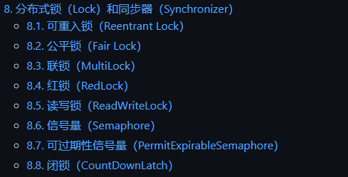
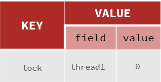
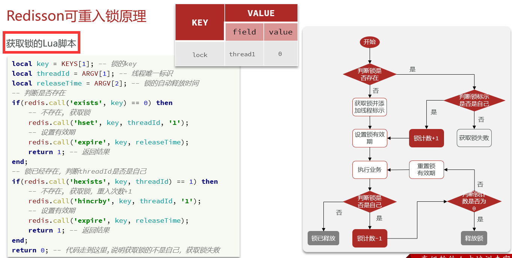
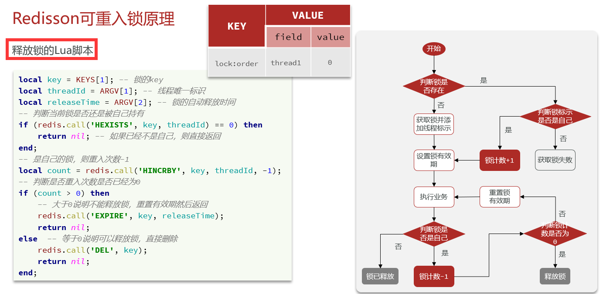
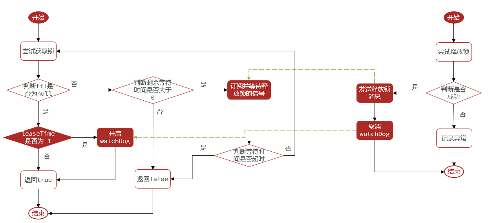

[TOC]

# Redisson 分布式锁


## Redisson概述

### 引入

基于setnx和lua脚本实现的分布式锁还存在如下问题：

- 不可重入

  同一个线程无法多次获取同一把锁

- 不可重试

  获取锁只尝试一次就返回false，没有重试机制

- 超时释放

  锁超时释放虽然可以避免死锁，但如果业务执行耗时较长，也会导致锁释放，存在安全隐患

- 主从一致性

  如果Redis提供了主从集群，主从同步存在延迟，当主宕机时，如果从未同步主中的锁数据，则会出现锁失效


### Redisson 简介

Redisson是一个在Redis的基础上实现的**Java驻内存数据网格（In-Memory Data Grid）**。它不仅提供了一系列的分布式的Java常用对象，还提供了许多分布式服务，其中就包含了各种分布式锁的实现。

官网地址： https://redisson.org GitHub地址： https://github.com/redisson/redisson




## Redisson 分布式锁的快速入门

### 引入依赖

```xml
<dependency>
    <groupId>org.redisson</groupId>
    <artifactId>redisson</artifactId>
    <version>3.13.6</version>
</dependency>
```

### 配置Redisson客户端

```java
package com.hmdp.config;

import org.redisson.Redisson;
import org.redisson.api.RedissonClient;
import org.redisson.config.Config;
import org.springframework.beans.factory.annotation.Value;
import org.springframework.context.annotation.Bean;
import org.springframework.context.annotation.Configuration;

@Configuration
public class RedissonConfig {

    @Value("${spring.redis.host}")
    private String redisHost;

    @Value("${spring.redis.port}")
    private String redisPort;

    @Value("${spring.redis.password}")
    private String redisPwd;

    @Bean
    public RedissonClient redissonClient() {
        // 配置
        Config config = new Config();
        // 添加redis地址，也可以使用config.useClusterServers();添加集群地址
        config.useSingleServer().setPassword(redisPwd).setAddress("redis://" + redisHost + ":" + redisPort);
        // 创建RedissonClient对象
        return Redisson.create(config);
    }
}
```

### 使用Redisson的分布式锁

```java
@Resource
private RedissonClient redissonClient;

@Test
void testRedisson() throws InterruptedException {
    // 获取锁（可重入），指定锁的名称
    RLock lock = redissonClient.getLock("anyLock");
    // 尝试获取锁，参数分别是：获取锁的最大等待时间（期间会重试），锁自动释放时间，时间单位
    boolean isLock = lock.tryLock(1, 10, TimeUnit.SECONDS);
    // 判断释放获取成功    if(isLock){
    try {
        System.out.println("执行业务");
    }finally {
        // 释放锁
        lock.unlock();
    }
}
```

利用redisson分布式锁改进之前创建订单逻辑

```java
@Resource
private RedissonClient redissonClient;


/**
 * 创建订单 ，Redisson分布式锁
 *
 * @param voucherId
 * @return
 */
@Transactional
public Result createVoucherOrder(Long voucherId) {
    // 5. 一人一单
    Long userId = UserHolder.getUser().getId();
    // 创建锁对象
    RLock redisLock = redissonClient.getLock("lock:order:" + userId);
    // 尝试获取锁
    boolean isLock = redisLock.tryLock();
    // 判断
    if (!isLock) {
        // 获取锁失败，直接返回失败或重试
        return Result.fail("不允许重复下单");
    }
    try {
        // 5.1 查询订单
        int count = query().eq("user_id", userId).eq("voucher_id", voucherId).count();
        // 5.2 判断是否存在
        if (count > 0) {
            // 用户已经购买过了
            return Result.fail("用户已经购买过一次！");
        }
        // 6. 扣减库存,超卖问题主要由 .gt("stock",0) 控制
        boolean success = seckillVoucherService.update()
            .setSql("stock = stock-1")  // set stock = stock - 1
            .eq("voucher_id", voucherId) // where voucher_id = ?
            .gt("stock", 0) // and stock > 0
            .update();
        if (!success) {
            // 库存不足
            return Result.fail("库存不足！");
        }
        // 7. 创建订单
        VoucherOrder voucherOrder = new VoucherOrder();
        // 7.1 订单id
        long orderId = redisIdWorker.nextId("order");
        voucherOrder.setId(orderId);
        // 7.2 用户id
        voucherOrder.setUserId(userId);
        // 7.3 代金券id
        voucherOrder.setVoucherId(voucherId);
        // 写入数据库
        save(voucherOrder);
        // 8. 返回订单Id
        return Result.ok(orderId);
    } finally {
        // 释放锁
        redisLock.unlock();
    }
}
```


## Redisson原理部分

### 可重入原理

与`ReentrantLock` 原理相似，这里用一个 `map`的`value` 记录重入次数

可以在 Redisson的源码中找到脚本：

加锁在  `RedissonLock`的 `tryLockInnerAsync` 方法中

解锁在  `RedissonLock`的 `unlockInnerAsync` 方法中








### 重试机制原理



通过`RedissonLock` 的 `public boolean tryLock(long waitTime, long leaseTime, TimeUnit unit)` 方法可以看出超时等待机制。

里面用了 **TTL** 和 **订阅通知** 进行尝试，避免盲目重试造成资源消耗


###  看门狗TTL续期


#### 添加续期

```java
// RedissonLock.java

private <T> RFuture<Long> tryAcquireAsync(long waitTime, long leaseTime, TimeUnit unit, long threadId) {
    // 如果自己设置了过期时间 就没有看门狗。
    if (leaseTime != -1) {
        return tryLockInnerAsync(waitTime, leaseTime, unit, threadId, RedisCommands.EVAL_LONG);
    }
    // 尝试获取锁,这里的逻辑是有看门狗的
    RFuture<Long> ttlRemainingFuture = tryLockInnerAsync(waitTime,
                                                         commandExecutor.getConnectionManager().getCfg().getLockWatchdogTimeout(),
                                                         TimeUnit.MILLISECONDS, threadId, RedisCommands.EVAL_LONG);

    // 当回调函数完成
    ttlRemainingFuture.onComplete((ttlRemaining, e) -> {
        // 如果e不为空，出异常了，也不用看门狗了
        if (e != null) {
            return;
        }

        // lock acquired
        // ttlRemaining 表示剩余有效期，如果是null，表示获取锁成功
        if (ttlRemaining == null) {
            // 到期更新任务
            scheduleExpirationRenewal(threadId);
        }
    });
    return ttlRemainingFuture;
}


private void scheduleExpirationRenewal(long threadId) {
    ExpirationEntry entry = new ExpirationEntry();
    // 这个 c_hashmap 中记录了重入的锁
    ExpirationEntry oldEntry = EXPIRATION_RENEWAL_MAP.putIfAbsent(getEntryName(), entry);
    if (oldEntry != null) {
        oldEntry.addThreadId(threadId);
    } else {
        entry.addThreadId(threadId);
        // 续期，新任务才用启动续期递归，旧任务已经有了
        renewExpiration();
    }
}

private void renewExpiration() {
    ExpirationEntry ee = EXPIRATION_RENEWAL_MAP.get(getEntryName());
    if (ee == null) {
        return;
    }
    // 定时任务，多久之后进行
    Timeout task = commandExecutor.getConnectionManager().newTimeout(new TimerTask() {
        @Override
        public void run(Timeout timeout) throws Exception {
            ExpirationEntry ent = EXPIRATION_RENEWAL_MAP.get(getEntryName());
            if (ent == null) {
                return;
            }
            Long threadId = ent.getFirstThreadId();
            if (threadId == null) {
                return;
            }
            // 刷新有效期，脚本写在这里面
            RFuture<Boolean> future = renewExpirationAsync(threadId);
            future.onComplete((res, e) -> {
                if (e != null) {
                    log.error("Can't update lock " + getName() + " expiration", e);
                    return;
                }

                if (res) {
                    // reschedule itself
                    // 如果成功，调自己，递归
                    renewExpiration();
                }
            });
        }
    }, internalLockLeaseTime / 3, TimeUnit.MILLISECONDS);

    ee.setTimeout(task);
}
```


#### 解除续期

```java
@Override
public RFuture<Void> unlockAsync(long threadId) {
    RPromise<Void> result = new RedissonPromise<Void>();
    // 释放锁
    RFuture<Boolean> future = unlockInnerAsync(threadId);
    // 释放完成，取消定期任务
    future.onComplete((opStatus, e) -> {
        // 取消续期的
        cancelExpirationRenewal(threadId);

        if (e != null) {
            result.tryFailure(e);
            return;
        }

        if (opStatus == null) {
            IllegalMonitorStateException cause = new IllegalMonitorStateException("attempt to unlock lock, not locked by current thread by node id: " + id + " thread-id: " + threadId);
            result.tryFailure(cause);
            return;
        }

        result.trySuccess(null);
    });

    return result;
}


void cancelExpirationRenewal(Long threadId) {
    // 拿到是哪个任务
    ExpirationEntry task = EXPIRATION_RENEWAL_MAP.get(getEntryName());
    if (task == null) {
        return;
    }

    if (threadId != null) {
        task.removeThreadId(threadId);
    }

    if (threadId == null || task.hasNoThreads()) {
        Timeout timeout = task.getTimeout();
        if (timeout != null) {
            // 取消掉
            timeout.cancel();
        }
        EXPIRATION_RENEWAL_MAP.remove(getEntryName());
    }
}
```


# 总结

- **可重入**：利用hash结构记录线程id和重入次数
- **可重试**：利用信号量和PubSub功能实现等待、唤醒，获取锁失败的重试机制
- **超时续约**：利用watchDog，每隔一段时间（releaseTime / 3），重置超时时间

