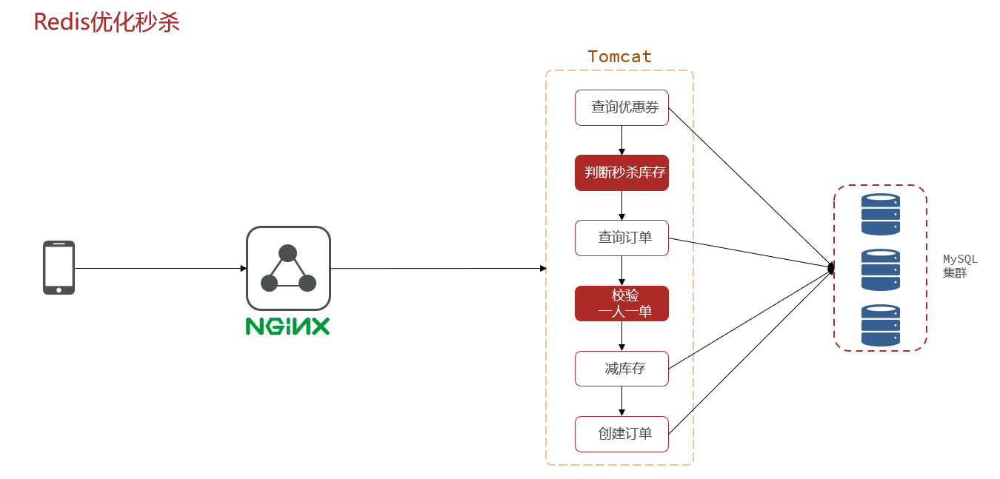
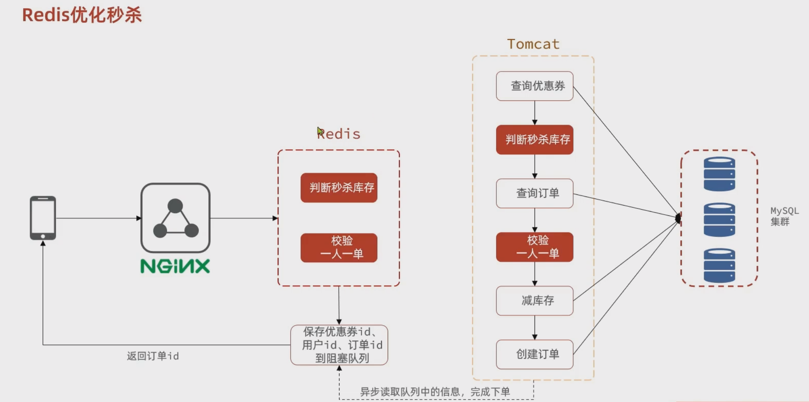
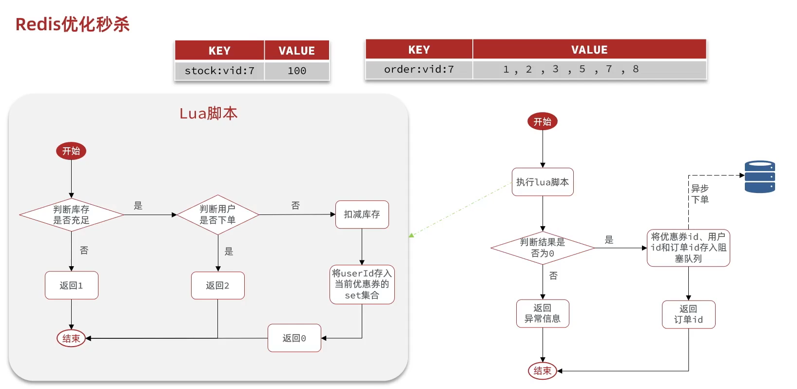
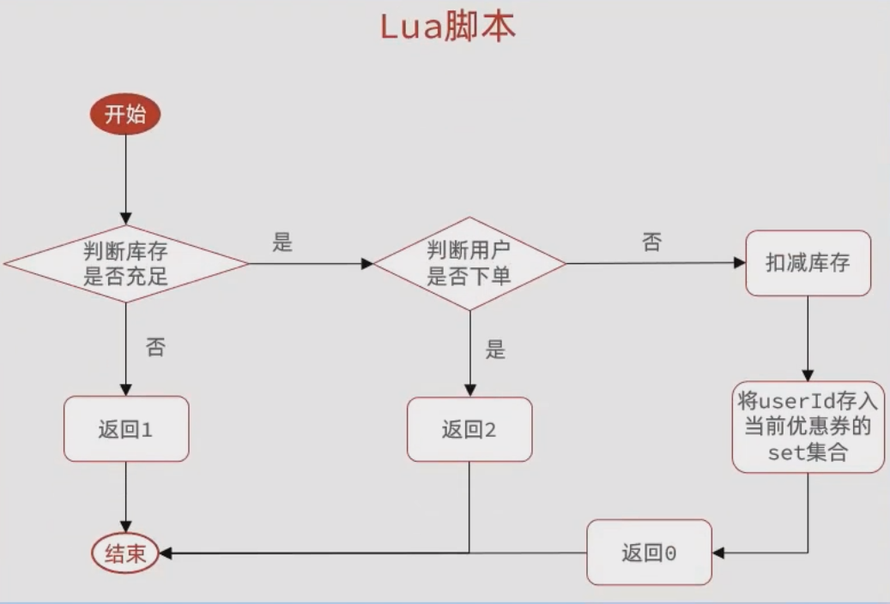
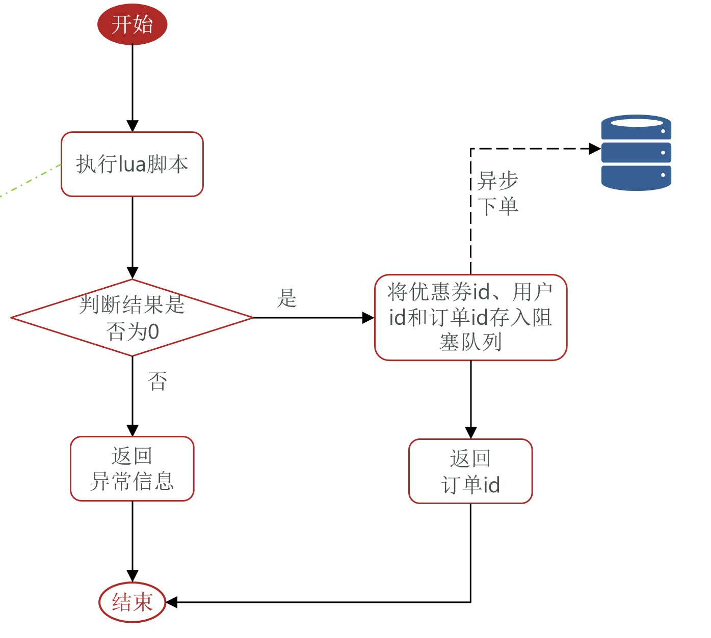

# Redis秒杀优化


## 存在问题

之前的业务流程如下：



可以看出，之前的业务流程全部是串行执行，且秒杀下单接口需要4次访问数据库，2次数据库写操作，效率低下。

优化点：

- 将**同步下单**变为**异步下单**，操作数据库的耗时操作用**阻塞队列+异步线程**完成
- 将数据库的数据存放到redis中，提高性能






## 改进业务


思路：

- 新增秒杀优惠券的同时，将优惠券信息保存到Redis中
- 基于Lua脚本，判断秒杀库存、一人一单，决定用户是否抢购成功
- 如果抢购成功，将优惠券id和用户id封装后存入阻塞队列
- 开启线程任务，不断从阻塞队列中获取信息，实现异步下单功能


### 新增秒杀券的同时，保存到Redis中

```java
@Override
@Transactional
public void addSeckillVoucher(Voucher voucher) {
    // 保存优惠券
    save(voucher);
    // 保存秒杀信息
    SeckillVoucher seckillVoucher = new SeckillVoucher();
    seckillVoucher.setVoucherId(voucher.getId());
    seckillVoucher.setStock(voucher.getStock());
    seckillVoucher.setBeginTime(voucher.getBeginTime());
    seckillVoucher.setEndTime(voucher.getEndTime());
    seckillVoucherService.save(seckillVoucher);
    // 保存秒杀信息到redis
    stringRedisTemplate.opsForValue().set(SECKILL_STOCK_KEY + voucher.getId(), voucher.getStock().toString());
}
```


### 主线程流程

主要完成：

- 基于Lua脚本，判断秒杀库存、一人一单，决定用户是否抢购成功
- 如果抢购成功，将优惠券id和用户id封装后存入阻塞队列



```lua
-- 1.参数列表
-- 1.1.优惠券id
local voucherId = ARGV[1]
-- 1.2.用户id
local userId = ARGV[2]

-- 2.数据key
-- 2.1.库存key
local stockKey = 'seckill:stock:' .. voucherId
-- 2.2.订单key
local orderKey = 'seckill:order:' .. voucherId

-- 3.脚本业务
-- 3.1.判断库存是否充足 get stockKey
if(tonumber(redis.call('get', stockKey)) <= 0) then
    -- 3.2.库存不足，返回1
    return 1
end
-- 3.2.判断用户是否下单 SISMEMBER orderKey userId
if(redis.call('sismember', orderKey, userId) == 1) then
    -- 3.3.存在，说明是重复下单，返回2
    return 2
end
-- 3.4.扣库存 incrby stockKey -1
redis.call('incrby', stockKey, -1)
-- 3.5.下单（保存用户）sadd orderKey userId
redis.call('sadd', orderKey, userId)
return 0
```

代码调用执行lua脚本：



```java
// lua脚本变量
private static final DefaultRedisScript<Long> SECKILL_SCRIPT;

static {
	SECKILL_SCRIPT = new DefaultRedisScript<>();
	// 设置脚本路径
	SECKILL_SCRIPT.setLocation(new ClassPathResource("seckill.lua"));
	// 设置返回值
	SECKILL_SCRIPT.setResultType(Long.class);
}

// 阻塞队列，用于存下单成功的信息
private BlockingQueue<VoucherOrder> orderTasks = new ArrayBlockingQueue<>(1024 * 1024);

/**
 * 异步下单逻辑
 *
 * @param voucherId
 * @return
 */
@Override
public Result seckillVoucher(Long voucherId) {
	Long userId = UserHolder.getUser().getId();
	// 1. 执行Lua脚本
	Long result = stringRedisTemplate.execute(
			SECKILL_SCRIPT,
			Collections.emptyList(),
			voucherId.toString(), userId.toString()
	);
	int r = result.intValue();
	// 2. 判断结果是否为0
	if (r != 0) {
		// 2.1 不为0，代表没有购买资格
		return Result.fail(r == 1 ? "库存不足" : "不能重复下单");
	}
	// 2.2 为 0,有购买资格，把下单信息保存到阻塞队列
	long orderId = redisIdWorker.nextId("order");
	// 3. 创建阻塞队列中放的信息
	VoucherOrder voucherOrder = new VoucherOrder();
	// 3.1 订单id
	voucherOrder.setId(orderId);
	// 3.2 用户id
	voucherOrder.setUserId(userId);
	// 3.3 代金券id
	voucherOrder.setVoucherId(voucherId);
	// 3.4  保存阻塞队列
	orderTasks.add(voucherOrder);
	// 4. 返回订单id
	return Result.ok(orderId);
}
```


### 异步子线程

```java
// 线程池，异步处理下单内容到数据库
private static final ExecutorService SECKILL_ORDER_EXECUTOR = Executors.newSingleThreadExecutor();

// 该类一加载，线程池就跑起来
@PostConstruct
private void init() {
    SECKILL_ORDER_EXECUTOR.submit(new VoucherOrderHandler());
}

// 任务 只做一件事，获取阻塞队列内容保存到数据库
private class VoucherOrderHandler implements Runnable {
    @Override
    public void run() {
        while (true){
            try {
                // 1. 获取队列中的订单信息
                VoucherOrder voucherOrder = orderTasks.take();
                // 2. 创建订单
                createVoucherOrder(voucherOrder);
            } catch (InterruptedException e) {
                log.error("处理订单异常，",e);
            }
        }
    }
}

// 创建订单，；里面有一些兜底判断
private void createVoucherOrder(VoucherOrder voucherOrder) {
    Long userId = voucherOrder.getUserId();
    Long voucherId = voucherOrder.getVoucherId();
    // 创建锁对象
    RLock redisLock = redissonClient.getLock("lock:order:" + userId);
    // 尝试获取锁
    boolean isLock = redisLock.tryLock();
    // 判断
    if (!isLock) {
        // 获取锁失败，直接返回失败或者重试
        log.error("不允许重复下单！");
        return;
    }

    try {
        // 5.1.查询订单
        int count = query().eq("user_id", userId).eq("voucher_id", voucherId).count();
        // 5.2.判断是否存在
        if (count > 0) {
            // 用户已经购买过了
            log.error("不允许重复下单！");
            return;
        }

        // 6.扣减库存
        boolean success = seckillVoucherService.update()
            .setSql("stock = stock - 1") // set stock = stock - 1
            .eq("voucher_id", voucherId).gt("stock", 0) // where id = ? and stock > 0
            .update();
        if (!success) {
            // 扣减失败
            log.error("库存不足！");
            return;
        }
        // 7.创建订单
        save(voucherOrder);
    } finally {
        // 释放锁
        redisLock.unlock();
    }
}
```


