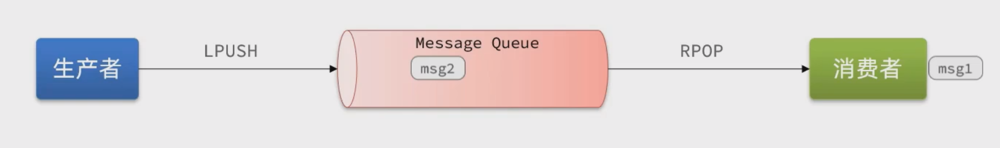
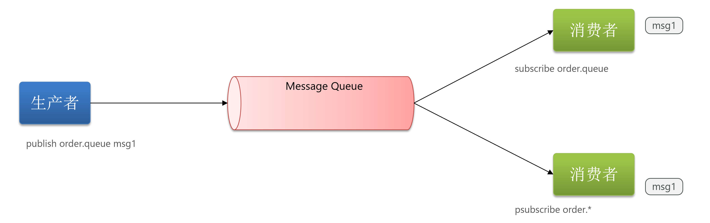
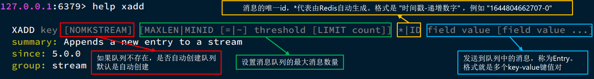
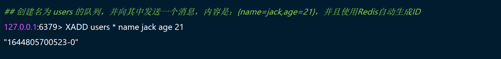
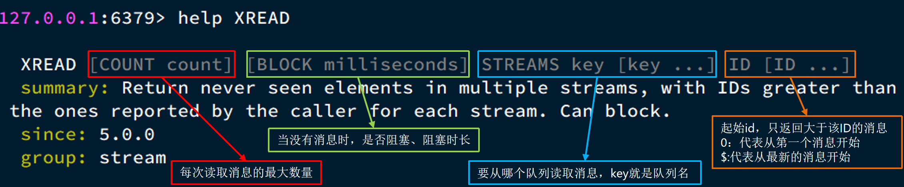
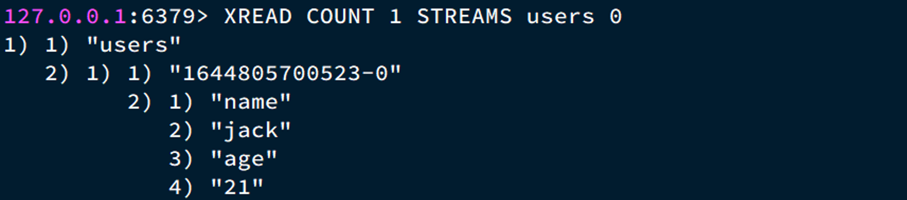
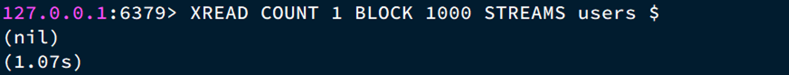
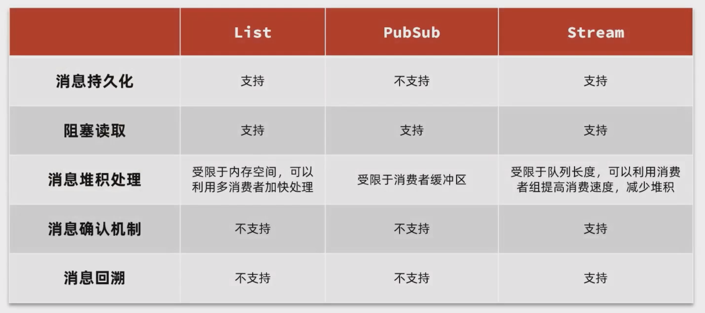

# Redis实现消息队列


前面的秒杀优化用到了JDK的阻塞队列，JDK内存中的阻塞队列有诸多局限性：

- 内存限制问题，内存中能容纳的订单量是一定的
- 数据安全问题
  - 如果JVM宕机，已经返回给前端下单成功的订单将丢失
  - JVM宕机时，有的任务正在保存到数据库中，也会造成数据保存失败


所以这种阻塞队列中的内容有条件不应该放在JVM内存中，而是应该独立于应用放在消息队列中。


## 1. Redis 消息队列理论知识

**消息队列（Message Queue）**，字面意思就是存放消息的队列。最简单的消息队列模型包括3个角色：

- 消息队列：存储和管理消息，也被称为消息代理（Message Broker）
- 生产者：发送消息到消息队列
- 消费者：从消息队列获取消息并处理消息

Redis提供了三种不同的方式来实现消息队列：

- list结构：基于List结构模拟消息队列
- PubSub：基本的点对点消息模型
- Stream：比较完善的消息队列模型

### 1.1 基于List结构消息队列

Redis的list数据结构是一个双向链表，很容易模拟出队列效果。

队列是入口和出口不在一边，因此我们可以利用：LPUSH 结合 RPOP、或者 RPUSH 结合 LPOP来实现。

当队列中没有消息时RPOP或LPOP操作会返回null，并不像JVM的阻塞队列那样会阻塞并等待消息。因此这里应该使用**BRPOP**或者**BLPOP**来实现阻塞效果。



基于List的消息队列有哪些优缺点？

优点：

- 利用Redis存储，不受限于JVM内存上限
- 基于Redis的持久化机制，数据安全性有保证
- 可以满足消息有序性

缺点：

- 无法避免消息丢失
- 只支持单消费者

### 1.2 基于PubSub的消息队列

PubSub（发布订阅）是Redis2.0版本引入的消息传递模型。

消费者可以订阅一个或多个`channel`，生产者向对应`channel`发送消息后，所有订阅者都能收到相关消息。

- SUBSCRIBE channel：订阅一个或多个频道
- PUBLISH channel msg ：向一个频道发送消息
- PSUBSCRIBE pattern：订阅与pattern格式匹配的所有频道



基于PubSub的消息队列有哪些优缺点？

优点：

- 采用发布订阅模型，支持多生产、多消费

缺点：

- 不支持数据持久化
- 无法避免消息丢失
- 消息堆积有上限，超出时数据丢失

### 1.3 基于Stream的消息队列

Stream 是 Redis 5.0 引入的一种新数据类型，可以实现一个功能非常完善的消息队列。

发送消息命令：



例如：



读取消息命令：



例如：




XREAD阻塞方式，读取最新的消息：



在业务开发中，我们可以循环的调用XREAD阻塞方式来查询最新消息，从而实现持续监听队列的效果，伪代码如下：

```java
while(true){
    // 尝试读取队列中的消息，阻塞2秒
    Object msg = redis.execute("XREAD COUNT 1 BLOCK 2000 STREAMS users $");
    if(msg == null){
        continue;
    }
    // 处理消息
    handleMessage(msg);
}
```

但是：

当我们指定起始ID为`$`时，代表读取最新的消息，如果我们处理一条消息的过程中，又有超过1条以上的消息到达队列，则下次获取时也只能获取到最新的一条，**会出现漏读消息的问题**。

STREAM类型消息队列的XREAD命令特点：

- 消息可回溯
- 一个消息可以被多个消费者读取
- 可以阻塞读取
- 有消息漏读的风险


### 1.4 基于Stream消费者组的消息队列

消费者组（Consumer Group）：将多个消费者划分到一个组中，监听同一个队列。具备下列特点：

- 消息分流

  队列中的消息会分流给组内的不同消费者，而不是重复消费，从而加快消息处理的速度

- 消息标示

  消费者组会维护一个标示，记录最后一个被处理的消息，哪怕消费者宕机重启，还会从标示之后读取消息。确保每一个消息都会被消费

- 消息确认

  消费者获取消息后，消息处于pending状态，并存入一个pending-list。当处理完成后需要通过XACK来确认消息，标记消息为已处理，才会从pending-list移除。


消费者组命令：

```shell
# 创建消费者组：
XGROUP CREATE  key groupName ID [MKSTREAM]
# 参数：
#    key：队列名称
#    groupName：消费者组名称
#    ID：起始ID标示，$代表队列中最后一个消息，0则代表队列中第一个消息
#    MKSTREAM：队列不存在时自动创建队列

# 删除指定的消费者组
XGROUP DESTORY key groupName

# 给指定的消费者组添加消费者
XGROUP CREATECONSUMER key groupname consumername

# 删除消费者组中的指定消费者
XGROUP DELCONSUMER key groupname consumername
```

从消费者组读取消息：

```shell
XREADGROUP GROUP group consumer [COUNT count] [BLOCK milliseconds] [NOACK] STREAMS key [key ...] ID [ID ...]

# group：消费组名称
# consumer：消费者名称，如果消费者不存在，会自动创建一个消费者
# count：本次查询的最大数量
# BLOCK milliseconds：当没有消息时最长等待时间
# NOACK：无需手动ACK，获取到消息后自动确认
# STREAMS key：指定队列名称
# ID：获取消息的起始ID：
# 	">"：从下一个未消费的消息开始
# 	其它：根据指定id从pending-list中获取已消费但未确认的消息，例如0，是从pending-list中的第一个消息开始
```

确认消息：

```shell
XACK key group ID [ID ...]

# key 队列名称
# group 组名称
# ID  要确认消息的ID
```

消费者监听消息的基本思路：

```java
while(true){
    // 尝试监听消息，使用阻塞模式，最长等待2000毫秒
    Object msg = redis.call("XREADGROUP GROUP g1 c1 COUNT 1 BLOCK 2000 STREAMS s1 >");
    // null 说明没有消息，继续下一次
    if(msg == null){
        continue;
    }
    try{
        // 处理消息，完成后一定要ACK
        handleMessage(msg);
    }catch(Exception e){
        while(true){
            Object msg = redis.call("XREADGROUP GROUP g1 c1 COUNT 1 BLOCK 2000 STREAMS s1 0");
            if(msg == null){
                break;
            }
            try{
                // 说明有异常消息，再次处理
                handleMessage(msg);
            }catch(Excetion e){
                // 再次出现异常，记录日志，继续循环
                continue;
            }
        }
    }
}
```

STREAM类型消息队列的XREADGROUP命令特点：

- 消息可回溯
- 可以多消费者争抢消息，加快消费速度
- 可以阻塞读取
- 没有消息漏读的风险
- 有消息确认机制，保证消息至少被消费一次

### 1.5 Redis实现消息队列总结




## 2. 基于Redis Stream消息队列实现异步秒杀


### 2.1 Redis中创建队列

```shell
# 创建 stream.order队列，消费者组名为g1 从0 开始读  MKSTREAM 表示队列不存在时自动创建队列
XGROUP CREATE stream.orders g1 0 MKSTREAM
```


### 2.2 修改Lua脚本

修改之前的秒杀下单Lua脚本，在认定有抢购资格后，直接向stream.orders中添加消息，内容包含voucherId、userId、orderId

```lua
-- 1.参数列表
-- 1.1.优惠券id
local voucherId = ARGV[1]
-- 1.2.用户id
local userId = ARGV[2]
-- 1.3.订单id
local orderId = ARGV[3]

-- 2.数据key
-- 2.1.库存key
local stockKey = 'seckill:stock:' .. voucherId
-- 2.2.订单key
local orderKey = 'seckill:order:' .. voucherId

-- 3.脚本业务
-- 3.1.判断库存是否充足 get stockKey
if(tonumber(redis.call('get', stockKey)) <= 0) then
    -- 3.2.库存不足，返回1
    return 1
end
-- 3.2.判断用户是否下单 SISMEMBER orderKey userId
if(redis.call('sismember', orderKey, userId) == 1) then
    -- 3.3.存在，说明是重复下单，返回2
    return 2
end
-- 3.4.扣库存 incrby stockKey -1
redis.call('incrby', stockKey, -1)
-- 3.5.下单（保存用户）sadd orderKey userId
redis.call('sadd', orderKey, userId)
-- 3.6.发送消息到队列中， XADD stream.orders * k1 v1 k2 v2 ...
redis.call('xadd', 'stream.orders', '*', 'userId', userId, 'voucherId', voucherId, 'id', orderId)
return 0
```


### 2.3  修改Lua脚本调用逻辑

创建订单ID后，将消息放入Redis消息队列中

```java
/**
 * 异步下单逻辑，利用redis消息队列
 *
 * @param voucherId
 * @return
 */
@Override
public Result seckillVoucher(Long voucherId) {
	Long userId = UserHolder.getUser().getId();
	long orderId = redisIdWorker.nextId("order");
	// 1. 执行Lua脚本
	Long result = stringRedisTemplate.execute(
			SECKILL_SCRIPT,
			Collections.emptyList(),
			voucherId.toString(), userId.toString(), String.valueOf(orderId)
	);
	int r = result.intValue();
	// 2. 判断结果是否为0
	if (r != 0) {
		// 2.1 不为0，代表没有购买资格
		return Result.fail(r == 1 ? "库存不足" : "不能重复下单");
	}
	// 3. 返回订单id
	return Result.ok(orderId);
}
```


### 2.4 开启线程任务，处理消息队列中的消息

```java
// 线程池，异步处理下单内容到数据库
private static final ExecutorService SECKILL_ORDER_EXECUTOR = Executors.newSingleThreadExecutor();

// 该类一加载，线程池就跑起来
@PostConstruct
private void init() {
    SECKILL_ORDER_EXECUTOR.submit(new VoucherOrderHandler());
}


private class VoucherOrderHandler implements Runnable {

    @Override
    public void run() {
        String queueName = "stream.orders";
        while (true) {
            try {
                // 1.获取消息队列中的订单信息 XREADGROUP GROUP g1 c1 COUNT 1 BLOCK 2000 STREAMS s1 >
                List<MapRecord<String, Object, Object>> list = stringRedisTemplate.opsForStream().read(
                    Consumer.from("g1", "c1"),
                    StreamReadOptions.empty().count(1).block(Duration.ofSeconds(2)),
                    StreamOffset.create(queueName, ReadOffset.lastConsumed())
                );
                // 2.判断订单信息是否为空
                if (list == null || list.isEmpty()) {
                    // 如果为null，说明没有消息，继续下一次循环
                    continue;
                }
                // 解析数据
                MapRecord<String, Object, Object> record = list.get(0);
                Map<Object, Object> value = record.getValue();
                VoucherOrder voucherOrder = BeanUtil.fillBeanWithMap(value, new VoucherOrder(), true);
                // 3.创建订单
                createVoucherOrder(voucherOrder);
                // 4.确认消息 XACK
                stringRedisTemplate.opsForStream().acknowledge(queueName, "g1", record.getId());
            } catch (Exception e) {
                log.error("处理订单异常", e);
                handlePendingList();
            }
        }
    }

    private void handlePendingList() {
        String queueName = "stream.orders";
        while (true) {
            try {
                // 1.获取pending-list中的订单信息 XREADGROUP GROUP g1 c1 COUNT 1 BLOCK 2000 STREAMS s1 0
                List<MapRecord<String, Object, Object>> list = stringRedisTemplate.opsForStream().read(
                    Consumer.from("g1", "c1"),
                    StreamReadOptions.empty().count(1),
                    StreamOffset.create(queueName, ReadOffset.from("0"))
                );
                // 2.判断订单信息是否为空
                if (list == null || list.isEmpty()) {
                    // 如果为null，说明没有异常消息，结束循环
                    break;
                }
                // 解析数据
                MapRecord<String, Object, Object> record = list.get(0);
                Map<Object, Object> value = record.getValue();
                VoucherOrder voucherOrder = BeanUtil.fillBeanWithMap(value, new VoucherOrder(), true);
                // 3.创建订单
                createVoucherOrder(voucherOrder);
                // 4.确认消息 XACK
                stringRedisTemplate.opsForStream().acknowledge(queueName, "g1", record.getId());
            } catch (Exception e) {
                log.error("处理订单异常", e);
            }
        }
    }
}
```


