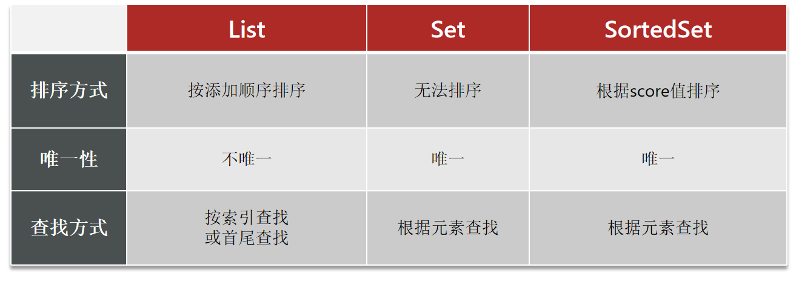

[TOC]


# 需要：分别实现点赞和点赞排行榜功能

由 Set 进化为 SortedSet


## 1. 点赞

需求：

- 同一个用户只能点赞一次，再次点击则取消点赞
- 如果当前用户已经点赞，则点赞按钮高亮显示（前端已实现，判断字段Blog类的isLike属性）

实现步骤：

- 给Blog类中添加一个isLike字段，标示是否被当前用户点赞
- 修改点赞功能，利用Redis的set集合判断是否点赞过，未点赞过则点赞数+1，已点赞过则点赞数-1
- 修改根据id查询Blog的业务，判断当前登录用户是否点赞过，赋值给isLike字段
- 修改分页查询Blog业务，判断当前登录用户是否点赞过，赋值给isLike字段

### 1.1 blog中添加 isLike 字段

```java
/**
 * 是否点赞过了
 */
@TableField(exist = false)
private Boolean isLike;
```

### 1.2 修改点赞功能

利用Redis的set集合判断是否点赞过，未点赞过则点赞数+1，已点赞过则点赞数-1

```java
// Controller
@PutMapping("/like/{id}")
public Result likeBlog(@PathVariable("id") Long id) {
    return blogService.likeBlog(id);
}

// Service
@Override
public Result likeBlog(Long id) {
    // 1.获取登录用户
    Long userId = UserHolder.getUser().getId();
    // 2.判断当前登录用户是否已经点赞
    String key = BLOG_LIKED_KEY + id;
    Boolean isMember = stringRedisTemplate.opsForSet().isMember(key, userId.toString());
    if (BooleanUtil.isFalse(isMember)) {
        // 3.如果未点赞，可以点赞
        // 3.1.数据库点赞数 + 1
        boolean isSuccess = update().setSql("liked = liked + 1").eq("id", id).update();
        // 3.2.保存用户到Redis的Set集合  zadd key value score
        if (isSuccess) {
            stringRedisTemplate.opsForSet().add(key, userId.toString());
        }
    } else {
        // 4.如果已点赞，取消点赞
        // 4.1.数据库点赞数 -1
        boolean isSuccess = update().setSql("liked = liked - 1").eq("id", id).update();
        // 4.2.把用户从Redis的SortedSet集合移除
        if (isSuccess) {
            stringRedisTemplate.opsForSet().remove(key, userId.toString());
        }
    }
    return Result.ok();
}
```

### 1.3 修改根据id查询Blog的业务和分页查询Blog业务

```java
@Override
public Result queryHotBlog(Integer current) {
    // 根据用户查询
    Page<Blog> page = query()
        .orderByDesc("liked")
        .page(new Page<>(current, SystemConstants.MAX_PAGE_SIZE));
    // 获取当前页数据
    List<Blog> records = page.getRecords();
    // 查询用户
    records.forEach(blog -> {
        this.queryBlogUser(blog);
        this.isBlogLiked(blog);
    });
    return Result.ok(records);
}

@Override
public Result queryBlogById(Long id) {
    // 1.查询blog
    Blog blog = getById(id);
    if (blog == null) {
        return Result.fail("笔记不存在！");
    }
    // 2.查询blog有关的用户
    queryBlogUser(blog);
    // 3.查询blog是否被点赞
    isBlogLiked(blog);
    return Result.ok(blog);
}

private void queryBlogUser(Blog blog) {
    Long userId = blog.getUserId();
    User user = userService.getById(userId);
    blog.setName(user.getNickName());
    blog.setIcon(user.getIcon());
}

private void isBlogLiked(Blog blog) {
    // 1.获取登录用户
    UserDTO user = UserHolder.getUser();
    if (user == null) {
        // 用户未登录，无需查询是否点赞
        return;
    }
    Long userId = user.getId();
    // 2.判断当前登录用户是否已经点赞
    String key = "blog:liked:" + blog.getId();
    Boolean isMember = stringRedisTemplate.opsForSet().isMember(key, userId.toString());
    blog.setIsLike(BooleanUtil.isTrue(isMember));
}
```


## 2. 点赞排行榜

由于Set集合默认是无序的，想要按照点赞时间进行排序无法做到，对比Redis支持的数据结构，可以选用SortedSet




### 2.1 点赞使用SortedSet改造

判断SortedSet中是否存在某元素，可以用到 sorce() 方法

```java
@Override
public Result likeBlog(Long id) {
    // 1.获取登录用户
    Long userId = UserHolder.getUser().getId();
    // 2.判断当前登录用户是否已经点赞
    String key = BLOG_LIKED_KEY + id;
    Double score = stringRedisTemplate.opsForZSet().score(key, userId.toString());
    if (score == null) {
        // 3.如果未点赞，可以点赞
        // 3.1.数据库点赞数 + 1
        boolean isSuccess = update().setSql("liked = liked + 1").eq("id", id).update();
        // 3.2.保存用户到Redis的SortedSet集合  zadd key value score
        if (isSuccess) {
            stringRedisTemplate.opsForZSet().add(key, userId.toString(), System.currentTimeMillis());
        }
    } else {
        // 4.如果已点赞，取消点赞
        // 4.1.数据库点赞数 -1
        boolean isSuccess = update().setSql("liked = liked - 1").eq("id", id).update();
        // 4.2.把用户从Redis的SortedSet集合移除
        if (isSuccess) {
            stringRedisTemplate.opsForZSet().remove(key, userId.toString());
        }
    }
    return Result.ok();
}
```


### 2.2 查询时判断用户是否点赞过

```java
private void isBlogLiked(Blog blog) {
    // 1.获取登录用户
    UserDTO user = UserHolder.getUser();
    if (user == null) {
        // 用户未登录，无需查询是否点赞
        return;
    }
    Long userId = user.getId();
    // 2.判断当前登录用户是否已经点赞
    String key = "blog:liked:" + blog.getId();
    Double score = stringRedisTemplate.opsForZSet().score(key, userId.toString());
    blog.setIsLike(score != null);
}
```


### 3. 进入博客列举点赞用户

```java
// Controller
@GetMapping("/likes/{id}")
public Result queryBlogLikes(@PathVariable("id") Long id) {
    return blogService.queryBlogLikes(id);
}

// Service
@Override
public Result queryBlogLikes(Long id) {
    String key = BLOG_LIKED_KEY + id;
    // 1.查询top5的点赞用户 zrange key 0 4
    Set<String> top5 = stringRedisTemplate.opsForZSet().range(key, 0, 4);
    if (top5 == null || top5.isEmpty()) {
        return Result.ok(Collections.emptyList());
    }
    // 2.解析出其中的用户id
    List<Long> ids = top5.stream().map(Long::valueOf).collect(Collectors.toList());
    String idStr = StrUtil.join(",", ids);
    // 3.根据用户id查询用户 WHERE id IN ( 5 , 1 ) ORDER BY FIELD(id, 5, 1)
    List<UserDTO> userDTOS = userService.query()
        .in("id", ids).last("ORDER BY FIELD(id," + idStr + ")").list()
        .stream()
        .map(user -> BeanUtil.copyProperties(user, UserDTO.class))
        .collect(Collectors.toList());
    // 4.返回
    return Result.ok(userDTOS);
}
```

