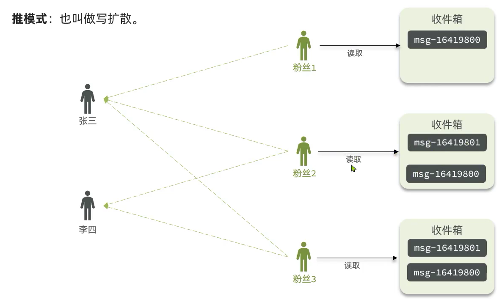

[TOC]


# Redis的SortedSet实现Feed流


## 1. 理论部分

关注推送也叫做Feed流，直译为投喂。为用户持续的提供“沉浸式”的体验，通过无限下拉刷新获取新的信息。


Feed流产品有两种常见模式：

**Timeline**：不做内容筛选，简单的按照内容发布时间排序，常用于好友或关注。例如朋友圈

- 优点：信息全面，不会有缺失。并且实现也相对简单
- 缺点：信息噪音较多，用户不一定感兴趣，内容获取效率低

**智能排序**：利用智能算法屏蔽掉违规的、用户不感兴趣的内容。推送用户感兴趣信息来吸引用户

- 优点：投喂用户感兴趣信息，用户粘度很高，容易沉迷
- 缺点：如果算法不精准，可能起到反作用

本例中的个人页面，是基于关注的好友来做Feed流，因此采用Timeline的模式。该模式的实现方案有三种：

- 拉模式
- 推模式
- 推拉结合





## 2. 案例：基于推模式实现关注推送功能

需求：

- 修改新增探店笔记的业务，在保存blog到数据库的同时，推送到粉丝的收件箱
- 收件箱满足可以根据时间戳排序，必须用Redis的数据结构实现
- 查询收件箱数据时，可以实现分页查询


为解决滚动分页问题，使用**SortedSet**实现分页功能


### 2.1 发布博客时，保存blog到数据库的同时，推送到粉丝的收件箱

```java
// Controller
@PostMapping
public Result saveBlog(@RequestBody Blog blog) {
    return blogService.saveBlog(blog);
}

// Service 保存笔记的同时，推送到redis粉丝收件箱
@Override
public Result saveBlog(Blog blog) {
    // 1.获取登录用户
    UserDTO user = UserHolder.getUser();
    blog.setUserId(user.getId());
    // 2.保存探店笔记
    boolean isSuccess = save(blog);
    if(!isSuccess){
        return Result.fail("新增笔记失败!");
    }
    // 3.查询笔记作者的所有粉丝 select * from tb_follow where follow_user_id = ?
    List<Follow> follows = followService.query().eq("follow_user_id", user.getId()).list();
    // 4.推送笔记id给所有粉丝
    for (Follow follow : follows) {
        // 4.1.获取粉丝id
        Long userId = follow.getUserId();
        // 4.2.推送
        String key = FEED_KEY + userId;
        stringRedisTemplate.opsForZSet().add(key, blog.getId().toString(), System.currentTimeMillis());
    }
    // 5.返回id
    return Result.ok(blog.getId());
}
```


## 2.2 查询收件箱数据时，可以实现分页查询

查询需要用SortedSet 按分数排序的查询功能，其中分数就是时间戳，总共需要4个参数，用 `SortedSet` 的 `ZRANGEBYSCORE` 命令

```shell
ZRANGEBYSCORE key min max [WITHSCORES] [LIMIT offset count]
summary: Return a range of members in a sorted set, by score
since: 1.0.5

max: 当前时间戳(首次查询) | 上一次查询的最小时间戳
min: 0
offset: 0(首次查询) | 上一次的结果中，与最小值一样的元素个数
count:  3 与前端约定一次查几个
```

滚动分页返回结果：

```java
@Data
public class ScrollResult {
    private List<?> list;
    private Long minTime;
    private Integer offset;
}
```


```java
// Controller
/**
 * 查看关注的人发布的新笔记
 * @param max 上一次查询的最小时间，本次查询的最大时间
 * @param offset 要跳过的个数
 * @return
 */
@GetMapping("/of/follow")
public Result queryBlogOfFollow(
    @RequestParam("lastId") Long max, @RequestParam(value = "offset", defaultValue = "0") Integer offset){
    return blogService.queryBlogOfFollow(max, offset);
}

// service
@Override
public Result queryBlogOfFollow(Long max, Integer offset) {
    // 1. 获取当前用户
    Long userId = UserHolder.getUser().getId();
    // 2. 查询收件箱 ZREVRANGEBYSCORE key Max Min LIMIT offset count
    String key = FEED_KEY + userId;
    Set<ZSetOperations.TypedTuple<String>> typedTuples = stringRedisTemplate.opsForZSet()
        .reverseRangeByScoreWithScores(key, 0, max, offset, 2);
    // 3.非空判断
    if (typedTuples == null || typedTuples.isEmpty()) {
        return Result.ok();
    }
    // 4. 解析数据：blogId、score(时间戳)、offset(和最小值一样的结果)
    List<Long> ids = new ArrayList<>(typedTuples.size());
    long minTime = 0; // 2
    int os = 1; // 与最小值一样的个数
    for (ZSetOperations.TypedTuple<String> tuple : typedTuples) {
        // 4.1 获取id
        // 4.1.获取id
        ids.add(Long.valueOf(tuple.getValue()));
        // 4.2.获取分数(时间戳）
        long time = tuple.getScore().longValue();
        if(time == minTime){
            os++;
        }else{
            minTime = time;
            os = 1;
        }
    }
    // 5.根据id查询blog
    String idStr = StrUtil.join(",", ids);
    List<Blog> blogs = query().in("id", ids).last("ORDER BY FIELD(id," + idStr + ")").list();

    for (Blog blog : blogs) {
        // 5.1.查询blog有关的用户
        queryBlogUser(blog);
        // 5.2.查询blog是否被点赞
        isBlogLiked(blog);
    }
    // 6.封装并返回
    ScrollResult r = new ScrollResult();
    r.setList(blogs);
    r.setOffset(os);
    r.setMinTime(minTime);
    return Result.ok(r);
}
```

