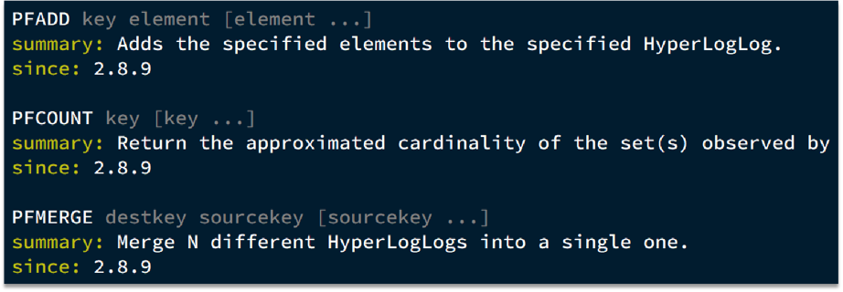

# Redis的HyperLogLog实现UV统计


## 1. UV / PV


- UV：全称Unique Visitor，也叫独立访客量，是指通过互联网访问、浏览这个网页的自然人。1天内同一个用户多次访问该网站，只记录1次。
- PV：全称Page View，也叫页面访问量或点击量，用户每访问网站的一个页面，记录1次PV，用户多次打开页面，则记录多次PV。往往用来衡量网站的流量。

UV统计在服务端做会比较麻烦，因为要判断该用户是否已经统计过了，需要将统计过的用户信息保存。但是如果每个访问的用户都保存到Redis中，数据量会非常恐怖。


## 2. HyperLogLog


Hyperloglog(HLL)是从Loglog算法派生的概率算法，用于确定非常大的集合的基数，而不需要存储其所有值。相关算法原理大家可以参考：https://juejin.cn/post/6844903785744056333#heading-0


Redis中的HLL是基于string结构实现的，单个HLL的内存永远小于16kb，内存占用低的令人发指！作为代价，其测量结果是概率性的，有小于0.81％的误差。不过对于UV统计来说，这完全可以忽略。




## 3. 测试使用HyperLogLog


首先查看 redis的内存占用情况

```shell
info memory
# Memory
used_memory:877280
used_memory_human:856.72K   # 内存值

# Memory
used_memory:891720
used_memory_human:870.82K   # 使用HyperLogLog之后的值
used_memory_rss:12599296
```

测试代码：

```java
@Test
void testHyperLogLog() {
    // 准备数组，装用户数据
    String[] users = new String[1000];
    int index = 0;
    for (int i = 1; i <= 1000000; i++) {
        // 赋值
        users[index++] = "user_" + i;
        // 每1000条发送一次
        if (i % 1000 == 0) {
            index = 0;
            stringRedisTemplate.opsForHyperLogLog().add("hll1", users);
        }
    }
    // 统计数量
    Long size = stringRedisTemplate.opsForHyperLogLog().size("hll1");
    System.out.println("size = " + size);
}
```

