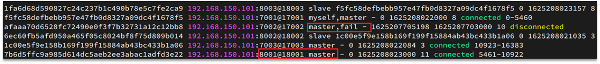

[TOC]

# Redis 分片集群


## 1.分片集群简介

主从和哨兵可以解决高可用、高并发读的问题。但是依然有两个问题没有解决：

- 海量数据存储问题

- 高并发写的问题

使用分片集群可以解决上述问题，如图:


分片集群特征：

- 集群中有多个master，每个master保存不同数据

- 每个master都可以有多个slave节点

- master之间通过ping监测彼此健康状态

- 客户端请求可以访问集群任意节点，最终都会被转发到正确节点


## 2 搭建分片集群

### 2.1 集群结构

分片集群需要的节点数量较多，这里我们搭建一个最小的分片集群，包含3个master节点，每个master包含一个slave节点，结构如下：


同一台虚拟机中开启6个redis实例，模拟分片集群，信息如下：

|       IP        | PORT |  角色  |
| :-------------: | :--: | :----: |
| 192.168.174.201 | 7001 | master |
| 192.168.174.201 | 7002 | master |
| 192.168.174.201 | 7003 | master |
| 192.168.174.201 | 8001 | slave  |
| 192.168.174.201 | 8002 | slave  |
| 192.168.174.201 | 8003 | slave  |

### 2.2 准备实例和配置

删除之前的7001、7002、7003这几个目录，重新创建出7001、7002、7003、8001、8002、8003目录：

```shell
# 进入/tmp目录
cd /tmp
# 删除旧的，避免配置干扰
rm -rf 7001 7002 7003
# 创建目录
mkdir 7001 7002 7003 8001 8002 8003
```

在`/tmp`下准备一个新的`redis.conf`文件，内容如下：

```shell
port 6379
# 开启集群功能
cluster-enabled yes
# 集群的配置文件名称，不需要我们创建，由redis自己维护
cluster-config-file /tmp/6379/nodes.conf
# 节点心跳失败的超时时间
cluster-node-timeout 5000
# 持久化文件存放目录
dir /tmp/6379
# 绑定地址
bind 0.0.0.0
# 让redis后台运行
daemonize yes
# 注册的实例ip
replica-announce-ip 192.168.150.101
# 保护模式
protected-mode no
# 数据库数量
databases 1
# 日志
logfile /tmp/6379/run.log
```

将这个文件拷贝到每个目录下：

```shell
# 进入/tmp目录
cd /tmp
# 执行拷贝
echo 7001 7002 7003 8001 8002 8003 | xargs -t -n 1 cp redis.conf
```

修改每个目录下的redis.conf，将其中的6379修改为与所在目录一致：

```shell
# 进入/tmp目录
cd /tmp
# 修改配置文件
printf '%s\n' 7001 7002 7003 8001 8002 8003 | xargs -I{} -t sed -i 's/6379/{}/g' {}/redis.conf
```

### 2.3 启动

因为已经配置了后台启动模式，所以可以直接启动服务：

```shell
# 进入/tmp目录
cd /tmp
# 一键启动所有服务
printf '%s\n' 7001 7002 7003 8001 8002 8003 | xargs -I{} -t redis-server {}/redis.conf
```

通过ps查看状态：

```shell
ps -ef | grep redis


root      13817      1  0 22:32 ?        00:00:00 redis-server 0.0.0.0:7001 [cluster]
root      13822      1  0 22:32 ?        00:00:00 redis-server 0.0.0.0:7002 [cluster]
root      13829      1  0 22:32 ?        00:00:00 redis-server 0.0.0.0:7003 [cluster]
root      13835      1  0 22:32 ?        00:00:00 redis-server 0.0.0.0:8001 [cluster]
root      13841      1  0 22:32 ?        00:00:00 redis-server 0.0.0.0:8002 [cluster]
root      13847      1  0 22:32 ?        00:00:00 redis-server 0.0.0.0:8003 [cluster]
root      13853  13556  0 22:32 pts/3    00:00:00 grep --color=auto redis


# 如果要关闭所有进程，可以执行命令：
ps -ef | grep redis | awk '{print $2}' | xargs kill
# 或者
printf '%s\n' 7001 7002 7003 8001 8002 8003 | xargs -I{} -t redis-cli -p {} shutdown
```


### 2.4 创建集群

虽然服务启动了，但是目前每个服务之间都是独立的，没有任何关联。

我们需要执行命令来创建集群，在Redis5.0之前创建集群比较麻烦，5.0之后集群管理命令都集成到了redis-cli中。

#### 2.4.1 Redis5.0 之前

Redis5.0之前集群命令都是用redis安装包下的src/redis-trib.rb来实现的。因为redis-trib.rb是有ruby语言编写的所以需要安装ruby环境。

```shell
# 安装依赖
yum -y install zlib ruby rubygems
gem install redis
```

然后通过命令来管理集群：

```shell
# 进入redis的src目录
cd /tmp/redis-6.2.4/src
# 创建集群
redis-cli --cluster create --cluster-replicas 1 192.168.174.201:7001 192.168.174.201:7002 192.168.174.201:7003 192.168.174.201:8001 192.168.174.201:8002 192.168.174.201:8003
```


#### 2.4.2 Redis5.0 以后

我们使用的是Redis6.2.4版本，集群管理以及集成到了redis-cli中，格式如下：

```shell
redis-cli --cluster create --cluster-replicas 1 192.168.150.101:7001 192.168.150.101:7002 192.168.150.101:7003 192.168.150.101:8001 192.168.150.101:8002 192.168.150.101:8003
```

命令说明：

- `redis-cli --cluster`或者`./redis-trib.rb`：代表集群操作命令
- `create`：代表是创建集群
- `--replicas 1`或者`--cluster-replicas 1` ：指定集群中每个master的副本个数为1，此时`节点总数 ÷ (replicas + 1)` 得到的就是master的数量。因此节点列表中的前n个就是master，其它节点都是slave节点，随机分配到不同master

运行后的样子：


这里输入yes，则集群开始创建：


通过命令可以查看集群状态：

```shell
redis-cli -p 7001 cluster nodes
```

### 2.5 测试

尝试连接7001节点，存储一个数据：

```shell
# 连接
redis-cli -p 7001
# 存储数据
set num 123
# 读取数据
get num
# 再次存储
set a 1
```

结果悲剧了：


集群操作时，需要给`redis-cli`加上`-c`参数才可以：

```shell
redis-cli -c -p 7001
```

这次可以了：


## 3 散列插槽

### 3.1 插槽原理

Redis会把每一个master节点映射到0~16383共16384个插槽（hash slot）上，查看集群信息时就能看到：


数据key不是与节点绑定，而是与插槽绑定。redis会根据key的有效部分计算插槽值，分两种情况：

- key中包含"`{}`"，且“`{}`”中至少包含1个字符，“`{}`”中的部分是有效部分
- key中不包含“`{}`”，整个`key`都是有效部分

例如：key是num，那么就根据num计算，如果是{itcast}num，则根据itcast计算。计算方式是利用CRC16算法得到一个hash值，然后对16384取余，得到的结果就是slot值。


如图，在7001这个节点执行set a 1时，对a做hash运算，对16384取余，得到的结果是15495，因此要存储到103节点。

到了7003后，执行`get num`时，对num做hash运算，对16384取余，得到的结果是2765，因此需要切换到7001节点

### 3.2 小结

Redis如何判断某个key应该在哪个实例？

- 将16384个插槽分配到不同的实例
- 根据key的有效部分计算哈希值，对16384取余
- 余数作为插槽，寻找插槽所在实例即可

如何将同一类数据固定的保存在同一个Redis实例？

- 这一类数据使用相同的有效部分，例如key都以`{typeId}`为前缀


## 4 集群伸缩

`redis-cli --cluster`提供了很多操作集群的命令，可以通过下面方式查看：


比如，添加节点的命令：


### 4.1 扩容案例需求

需求：向集群中添加一个新的master节点，并向其中存储 num = 10

- 启动一个新的redis实例，端口为7004
- 添加7004到之前的集群，并作为一个master节点
- 给7004节点分配插槽，使得num这个key可以存储到7004实例

这里需要两个新的功能：

- 添加一个节点到集群中
- 将部分插槽分配到新插槽

### 4.2 创建新的redis实例

```shell
cd /tmp
mkdir 7004
cp redis.conf 7004
sed -i s/6379/7004/g 7004/redis.conf
redis-server 7004/redis.conf
```


### 4.3 添加新节点到redis集群

添加节点的语法如下：


执行命令：

```sh
redis-cli --cluster add-node  192.168.174.201:7004 192.168.174.201:7001
```

通过命令查看集群状态：

```sh
redis-cli -p 7001 cluster nodes
```

如图，7004加入了集群，并且默认是一个master节点：


### 4.4 转移插槽

我们要将num存储到7004节点，因此需要先看看num的插槽是多少：


如上图所示，num的插槽为2765.

我们可以将0~3000的插槽从7001转移到7004，命令格式如下：


具体命令如下：

```shell
redis-cli --cluster reshard 192.168.174.201:7001
```

得到下面的反馈：


询问要移动多少个插槽，我们计划是3000个：


这里问哪个节点接受这些插槽

显然是7004，那么7004节点的id是多少呢？


复制这个id，然后拷贝到刚才的控制台后：


这里询问，你的插槽是从哪里移动过来的？

- all：代表全部，也就是三个节点各转移一部分
- 具体的id：目标节点的id
- done：没有了

这里我们要从7001获取，因此填写7001的id：


填完后，点击done，这样插槽转移就准备好了：


确认要转移吗？输入yes：

然后，通过命令查看结果：

```shell
redis-cli -p 7001 cluster nodes
```

可以看到： 


目的达成。


## 5 故障转移

集群初识状态是这样的：


其中7001、7002、7003都是master，我们计划让7002宕机。

### 5.1 自动故障转移

当集群中有一个master宕机会发生什么呢？

直接停止一个redis实例，例如7002：

```sh
redis-cli -p 7002 shutdown
```

1）首先是该实例与其它实例失去连接

2）然后是疑似宕机：


3）最后是确定下线，自动提升一个slave为新的master：



4）当7002再次启动，就会变为一个slave节点了：


### 5.2.手动故障转移

利用cluster failover命令可以手动让集群中的某个master宕机，切换到执行cluster failover命令的这个slave节点，实现无感知的数据迁移。其流程如下：


这种failover命令可以指定三种模式：

- 缺省：默认的流程，如图1~6歩
- force：省略了对offset的一致性校验
- takeover：直接执行第5歩，忽略数据一致性、忽略master状态和其它master的意见


如：


效果：


## 6 RedisTemplate 访问分片集群


RedisTemplate底层同样基于lettuce实现了分片集群的支持，而使用的步骤与哨兵模式基本一致：

1）引入redis的starter依赖

2）配置分片集群地址

3）配置读写分离

与哨兵模式相比，其中只有分片集群的配置方式略有差异，如下：

```yaml
spring:
  redis:
    cluster:
      nodes:
        - 192.168.150.101:7001
        - 192.168.150.101:7002
        - 192.168.150.101:7003
        - 192.168.150.101:8001
        - 192.168.150.101:8002
        - 192.168.150.101:8003
```

