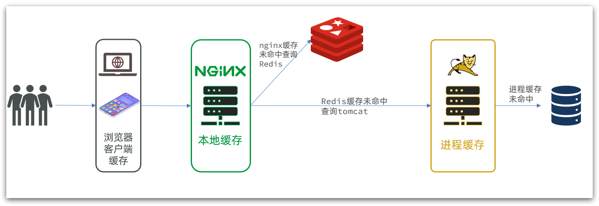

[toc]


# 多级缓存-JVM进程缓存


## 1. 多级缓存概述

多级缓存就是充分利用请求处理的每个环节，分别添加缓存，减轻Tomcat压力，提升服务性能：

- 浏览器访问静态资源时，优先读取浏览器本地缓存
- 访问非静态资源（ajax查询数据）时，访问服务端
- 请求到达Nginx后，优先读取Nginx本地缓存
- 如果Nginx本地缓存未命中，则去直接查询Redis（不经过Tomcat）
- 如果Redis查询未命中，则查询Tomcat
- 请求进入Tomcat后，优先查询JVM进程缓存
- 如果JVM进程缓存未命中，则查询数据库



在多级缓存架构中，Nginx内部需要编写本地缓存查询、Redis查询、Tomcat查询的业务逻辑，因此这样的nginx服务不再是一个**反向代理服务器**，而是一个编写**业务的Web服务器了**。

因此这样的业务Nginx服务也需要搭建集群来提高并发，再有专门的nginx服务来做反向代理，如图：

另外，我们的Tomcat服务将来也会部署为集群模式：


可见，多级缓存的关键有两个：

- 一个是在nginx中编写业务，实现nginx本地缓存、Redis、Tomcat的查询

- 另一个就是在Tomcat中实现JVM进程缓存

其中Nginx编程则会用到OpenResty框架结合Lua这样的语言。


---


本节以案例形式引入JVM进程缓存


## 2. 导入Demo数据

创建mysql的docker容器

```shell
# 进入/tmp目录
cd /tmp
# 创建文件夹
mkdir mysql
# 进入mysql目录
cd mysql

docker run \
     -p 3306:3306 \
     --name mysql \
     -v $PWD/conf:/etc/mysql/conf.d \
     -v $PWD/logs:/logs \
     -v $PWD/data:/var/lib/mysql \
     -e MYSQL_ROOT_PASSWORD=123 \
     --privileged \
     -d \
     mysql:5.7.25
 
# 创建文件
touch /tmp/mysql/conf/my.cnf

## 文件内容如下
[mysqld]
skip-name-resolve
character_set_server=utf8
datadir=/var/lib/mysql
server-id=1000


#  重启mysql
docker restart mysql
```


之后创建库 heima，导入资料sql


## 3. 初识Caffeine

缓存在日常开发中启动至关重要的作用，由于是存储在内存中，数据的读取速度是非常快的，能大量减少对数据库的访问，减少数据库的压力。我们把缓存分为两类：

- 分布式缓存，例如Redis：
  - 优点：存储容量更大、可靠性更好、可以在集群间共享
  - 缺点：访问缓存有网络开销
  - 场景：缓存数据量较大、可靠性要求较高、需要在集群间共享
- 进程本地缓存，例如HashMap、GuavaCache：
  - 优点：读取本地内存，没有网络开销，速度更快
  - 缺点：存储容量有限、可靠性较低、无法共享
  - 场景：性能要求较高，缓存数据量较小

我们今天会利用Caffeine框架来实现JVM进程缓存。


**Caffeine**是一个基于Java8开发的，提供了近乎最佳命中率的高性能的本地缓存库。目前Spring内部的缓存使用的就是Caffeine。GitHub地址：https://github.com/ben-manes/caffeine

使用基本API：

```java
@Test
void testBasicOps() {
    // 构建cache对象
    Cache<String, String> cache = Caffeine.newBuilder().build();

    // 存数据
    cache.put("gf", "迪丽热巴");

    // 取数据
    String gf = cache.getIfPresent("gf");
    System.out.println("gf = " + gf);

    // 取数据，包含两个参数：
    // 参数一：缓存的key
    // 参数二：Lambda表达式，表达式参数就是缓存的key，方法体是查询数据库的逻辑
    // 优先根据key查询JVM缓存，如果未命中，则执行参数二的Lambda表达式
    String defaultGF = cache.get("defaultGF", key -> {
        // 根据key去数据库查询数据
        return "柳岩";
    });
    System.out.println("defaultGF = " + defaultGF);
}
```

Caffeine既然是缓存的一种，肯定需要有缓存的清除策略，不然的话内存总会有耗尽的时候。

Caffeine提供了三种缓存驱逐策略：

- **基于容量**：设置缓存的数量上限

  ```java
  // 创建缓存对象
  Cache<String, String> cache = Caffeine.newBuilder()
      .maximumSize(1) // 设置缓存大小上限为 1
      .build();
  ```

- **基于时间**：设置缓存的有效时间

  ```java
  // 创建缓存对象
  Cache<String, String> cache = Caffeine.newBuilder()
      // 设置缓存有效期为 10 秒，从最后一次写入开始计时 
      .expireAfterWrite(Duration.ofSeconds(10)) 
      .build();
  ```

- **基于引用**：设置缓存为软引用或弱引用，利用GC来回收缓存数据。性能较差，不建议使用。


> **注意**：在默认情况下，当一个缓存元素过期的时候，Caffeine不会自动立即将其清理和驱逐。而是在一次读或写操作后，或者在空闲时间完成对失效数据的驱逐。


## 4. 实现商品的查询的本地进程缓存


### 4.1 需求

利用Caffeine实现下列需求：

- 给根据id查询商品的业务添加缓存，缓存未命中时查询数据库
- 给根据id查询商品库存的业务添加缓存，缓存未命中时查询数据库
- 缓存初始大小为100
- 缓存上限为10000

### 4.2 实现

首先，我们需要定义两个Caffeine的缓存对象，分别保存商品、库存的缓存数据。

在item-service的`com.heima.item.config`包下定义`CaffeineConfig`类：

```java
package com.heima.item.config;

import com.github.benmanes.caffeine.cache.Cache;
import com.github.benmanes.caffeine.cache.Caffeine;
import com.heima.item.pojo.Item;
import com.heima.item.pojo.ItemStock;
import org.springframework.context.annotation.Bean;
import org.springframework.context.annotation.Configuration;

@Configuration
public class CaffeineConfig {

    @Bean
    public Cache<Long, Item> itemCache(){
        return Caffeine.newBuilder()
                .initialCapacity(100)
                .maximumSize(10_000)
                .build();
    }

    @Bean
    public Cache<Long, ItemStock> stockCache(){
        return Caffeine.newBuilder()
                .initialCapacity(100)
                .maximumSize(10_000)
                .build();
    }
}
```

然后，修改item-service中的`com.heima.item.web`包下的ItemController类，添加缓存逻辑：

```java
@RestController
@RequestMapping("item")
public class ItemController {

    @Autowired
    private IItemService itemService;
    @Autowired
    private IItemStockService stockService;

    @Autowired
    private Cache<Long, Item> itemCache;
    @Autowired
    private Cache<Long, ItemStock> stockCache;
    
    // ...其它略
    
    @GetMapping("/{id}")
    public Item findById(@PathVariable("id") Long id) {
        return itemCache.get(id, key -> itemService.query()
                .ne("status", 3).eq("id", key)
                .one()
        );
    }

    @GetMapping("/stock/{id}")
    public ItemStock findStockById(@PathVariable("id") Long id) {
        return stockCache.get(id, key -> stockService.getById(key));
    }
}
```


