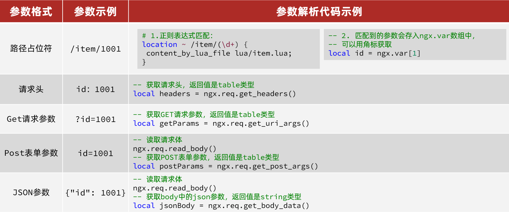

[TOC]

# 多级缓存-OpenResty


## 1. OpenResty 简介与安装

### 1.1 简介

OpenResty® 是一个基于 Nginx的高性能 Web 平台，用于方便地搭建能够处理超高并发、扩展性极高的动态 Web 应用、Web 服务和动态网关。具备下列特点：

- 具备Nginx的完整功能
- 基于Lua语言进行扩展，集成了大量精良的 Lua 库、第三方模块
- 允许使用Lua**自定义业务逻辑**、**自定义库**

官方网站： https://openresty.org/cn/

说白了，就是一个带`lua库`的Nginx

### 1.2 安装

（1）安装依赖库

```shell
yum install -y pcre-devel openssl-devel gcc --skip-broken
```

（2）安装OpenResty仓库

```shell
yum install -y yum-utils 
yum-config-manager --add-repo https://openresty.org/package/centos/openresty.repo
```

（3）安装OpenResty

```shell
yum install -y openresty
```

（4）安装opm工具

opm是OpenResty的一个管理工具，可以帮助我们安装一个第三方的Lua模块。

如果你想安装命令行工具 `opm`，那么可以像下面这样安装 `openresty-opm` 包：

```shell
yum install -y openresty-opm
```

### 1.3 简单使用

（1）目录结构

默认情况OpenResty安装目录是：`/usr/local/openresty`


OpenResty就是在Nginx基础上集成了一些Lua模块。

（2）配置nginx环境变量

```shell
vim /etc/profile

## 最后加入下面两行
export NGINX_HOME=/usr/local/openresty/nginx
export PATH=${NGINX_HOME}/sbin:$PATH


## 让配置生效
source /etc/profile
```

（3）启动和运行

OpenResty底层是基于Nginx的，查看OpenResty目录的nginx目录，结构与windows中安装的nginx基本一致：


所以运行方式与nginx基本一致：

```shell
# 启动nginx
nginx
# 重新加载配置
nginx -s reload
# 停止
nginx -s stop
```

nginx的默认配置文件注释太多，影响后续我们的编辑，这里将nginx.conf中的注释部分删除，保留有效部分。

修改`/usr/local/openresty/nginx/conf/nginx.conf`文件，内容如下：

```shell
vim /usr/local/openresty/nginx/conf/nginx.conf


#####################下面才是内容#####################
#user  nobody;
worker_processes  1;
error_log  logs/error.log;

events {
    worker_connections  1024;
}

http {
    include       mime.types;
    default_type  application/octet-stream;
    sendfile        on;
    keepalive_timeout  65;

    server {
        listen       8081;
        server_name  localhost;
        location / {
            root   html;
            index  index.html index.htm;
        }
        error_page   500 502 503 504  /50x.html;
        location = /50x.html {
            root   html;
        }
    }
}
```


## 2. 请求链路

请求：localhost/item.html?id=10001


## 3. OpenResty实现简单监听请求


### 3.1  OpenResty监听请求配置

OpenResty的很多功能都依赖于其目录下的Lua库，需要在nginx.conf中指定依赖库的目录，并导入依赖：

1）添加对OpenResty的Lua模块的加载

修改`/usr/local/openresty/nginx/conf/nginx.conf`文件，在其中的http下面，添加下面代码：

```shell
#lua 模块
lua_package_path "/usr/local/openresty/lualib/?.lua;;";
#c模块     
lua_package_cpath "/usr/local/openresty/lualib/?.so;;";  
```

并添加`/api/item`路径监听

```shell
location  /api/item {
    # 默认的响应类型
    default_type application/json;
    # 响应结果由lua/item.lua文件来决定
    content_by_lua_file lua/item.lua;
}
```

此时OpenResty完整配置如下：

```shell
# user nobody;
worker_processes  1;
error_log  logs/error.log;

events {
    worker_connections  1024;
}

http {
    include       mime.types;
    default_type  application/octet-stream;
    sendfile        on;
    keepalive_timeout  65;
    #lua 模块
    lua_package_path "/usr/local/openresty/lualib/?.lua;;";
    #c模块     
    lua_package_cpath "/usr/local/openresty/lualib/?.so;;";  

    server {
        listen       8081;
        server_name  localhost;
        location  /api/item {
            # 默认的响应类型
            default_type application/json;
            # 响应结果由lua/item.lua文件来决定
            content_by_lua_file lua/item.lua;
        }
        location / {
            root   html;
            index  index.html index.htm;
        }
        error_page   500 502 503 504  /50x.html;
        location = /50x.html {
            root   html;
        }
    }
}
```

这个监听，就类似于SpringMVC中的`@GetMapping("/api/item")`做路径映射。

而`content_by_lua_file lua/item.lua`则相当于调用item.lua这个文件，执行其中的业务，把结果返回给用户。相当于java中调用service。


### 3.2 编写item.lua

在`/usr/loca/openresty/nginx`目录创建文件夹：lua

在`/usr/loca/openresty/nginx/lua`文件夹下，新建文件：item.lua

```shell
cd /usr/local/openresty/nginx
mkdir lua
cd /usr/local/openresty/nginx/lua
touch item.lua
```

首先返回假数据，在tem.lua中，利用ngx.say()函数返回数据到Response中

ngx.say() 函数能将内容写入Response中

```lua
ngx.say('{"id":10001,"name":"SALSA AIR","title":"RIMOWA 22寸托运箱拉杆箱 SALSA AIR系列果绿色 820.70.36.4","price":17900,"image":"https://m.360buyimg.com/mobilecms/s720x720_jfs/t6934/364/1195375010/84676/e9f2c55f/597ece38N0ddcbc77.jpg!q70.jpg.webp","category":"拉杆箱","brand":"RIMOWA","spec":"","status":1,"createTime":"2019-04-30T16:00:00.000+00:00","updateTime":"2019-04-30T16:00:00.000+00:00","stock":2999,"sold":31290}')
```

### 3.3 重新加载配置并测试

```shell
nginx -s reload
```

此时再访问页面 `localhost/item.html?id=10001`即可看到我们在ngx.say()中配置的响应


### 3.4 总结

OpenResty使用同nginx类似，需要在`nginx.conf`中编写一个server 监听端口，然后在server中的location中监听路径并指定路径的处理方式，这里采用lua文件进行处理，正常需要在lua文件中编写业务逻辑。


## 4. OpenResity请求参数处理

获取参数的API

OpenResty中提供了一些API用来获取不同类型的前端请求参数：




针对上面的场景，此时`nginx.conf`中做如下修改

```shell
location ~ /api/item/(\d+) {
    # 默认的响应类型
    default_type application/json;
    # 响应结果由lua/item.lua文件来决定
    content_by_lua_file lua/item.lua;
}
```

lua中获取参数：

```lua
-- 获取路径参数
local id = ngx.var[1]
ngx.say('{"id":'.. id ..',"name":"SALSA AIR","title":"RIMOWA 22寸托运箱拉杆箱 SALSA AIR系列果绿色 820.70.36.4","price":17900,"image":"https://m.360buyimg.com/mobilecms/s720x720_jfs/t6934/364/1195375010/84676/e9f2c55f/597ece38N0ddcbc77.jpg!q70.jpg.webp","category":"拉杆箱","brand":"RIMOWA","spec":"","status":1,"createTime":"2019-04-30T16:00:00.000+00:00","updateTime":"2019-04-30T16:00:00.000+00:00","stock":2999,"sold":31290}')
```

nginx -s reload  然后去访问，看是否能正确取到参数。


## 5 .OpenResity查询tomcat

需求：获取请求路径中的商品id信息，根据id向Tomcat查询商品信息

### 5.1 流程

nginx提供了内部API用以发送http请求：

```javascript
local resp = ngx.location.capture("/path",{
    method = ngx.HTTP_GET,   -- 请求方式
    args = {a=1,b=2},  -- get方式传参数
})

// 返回的响应内容包括：
- resp.status：响应状态码
- resp.header：响应头，是一个table
- resp.body：响应体，就是响应数据
```

注意：这里的path是路径，并不包含IP和端口。这个请求会被nginx内部的server监听并处理。

但是我们希望这个请求发送到Tomcat服务器，所以还需要编写一个server来对这个路径做反向代理：

```shell
 location /path {
     # 这里是windows电脑的ip和Java服务端口，需要确保windows防火墙处于关闭状态
     proxy_pass http://192.168.31.141:8081; 
 }
```


所以总体流程是

- 拦截到请求，交给item.lua处理
- item.lua发起http请求，又被nginx捕获
- nginx捕获请求后，反向代理到tomcat服务器
- tomcat处理完成，返回给nginx 请求发起处


### 5.2 更改nginx.conf，捕获请求

```shell
# 遇到 /item 的反向代理到tomcat 服务器
location /item {
	proxy_pass http://192.168.31.141:8081;
}
location ~ /api/item/(\d+) {
    # 默认的响应类型
    default_type application/json;
    # 响应结果由lua/item.lua文件来决定
    content_by_lua_file lua/item.lua;
}
```


### 5.3 封装工具类

```shell
vim /usr/local/openresty/lualib/common.lua
```

内容如下

```lua
-- 封装函数，发送http请求，并解析响应
local function read_http(path, params)
    local resp = ngx.location.capture(path,{
        method = ngx.HTTP_GET,
        args = params,
    })
    if not resp then
        -- 记录错误信息，返回404
        ngx.log(ngx.ERR, "http请求查询失败, path: ", path , ", args: ", args)
        ngx.exit(404)
    end
    return resp.body
end
-- 将方法导出
local _M = {  
    read_http = read_http
}  
return _M
```


### 5.4 调用工具类，实现对tomcat的请求

更改item.lua，完成对tomcat的请求和数据封装

cjson库  序列化，将lua的table转json，反序列化，将json转lua的table

```lua
-- 导入common函数库
local common = require('common')
local read_http = common.read_http
-- 导入cjson库
local cjson = require('cjson')

-- 获取路径参数
local id = ngx.var[1]
-- 根据id查询商品
local itemJSON = read_http("/item/" .. id, nil)
-- 根据id查询商品库存
local itemStockJSON = read_http("/item/stock/" .. id, nil)

-- JSON转化为lua的table
local item = cjson.decode(itemJSON)
local stock = cjson.decode(itemStockJSON)

-- 组合数据
item.stock = stock.stock
item.sold = stock.sold

-- 把item序列化为json 返回结果
ngx.say(cjson.encode(item))
```

## 6. OpenResity 查询tomcat负载均衡

刚才的代码中，我们的tomcat是单机部署。而实际开发中，tomcat一定是集群模式：


因此，OpenResty需要对tomcat集群做负载均衡。

而默认的负载均衡规则是轮询模式，当我们查询/item/10001时：

- 第一次会访问8081端口的tomcat服务，在该服务内部就形成了JVM进程缓存
- 第二次会访问8082端口的tomcat服务，该服务内部没有JVM缓存（因为JVM缓存无法共享），会查询数据库
- ...

你看，因为轮询的原因，第一次查询8081形成的JVM缓存并未生效，直到下一次再次访问到8081时才可以生效，缓存命中率太低了。

如果能让同一个商品，每次查询时都访问同一个tomcat服务，那么JVM缓存就一定能生效了。

也就是说，我们需要根据商品id做负载均衡，而不是轮询。


### 基于请求路径的nginx负载均衡配置

nginx根据请求路径做hash运算，把得到的数值对tomcat服务的数量取余，余数是几，就访问第几个服务，实现负载均衡。

例如：

- 我们的请求路径是 /item/10001
- tomcat总数为2台（8081、8082）
- 对请求路径/item/1001做hash运算求余的结果为1
- 则访问第一个tomcat服务，也就是8081

只要id不变，每次hash运算结果也不会变，那就可以保证同一个商品，一直访问同一个tomcat服务，确保JVM缓存生效。

修改`/usr/local/openresty/nginx/conf/nginx.conf`文件，实现基于ID做负载均衡。

```shell
# 首先，定义tomcat集群，并设置基于路径做负载均衡： hash 如果不配置，就是默认轮询的负载均衡

upstream tomcat-cluster {
    hash $request_uri;
    server 192.168.31.141:8081;
    server 192.168.31.141:8082;
}

# 然后，修改对tomcat服务的反向代理，目标指向tomcat集群：
location /item {
    proxy_pass http://tomcat-cluster;
}

# 记得重新加载 OpenResty
nginx -s reload
```


此时 nginx.conf 完整如下

```shell
# user nobody;
worker_processes  1;
error_log  logs/error.log;

events {
    worker_connections  1024;
}

http {
    include       mime.types;
    default_type  application/octet-stream;
    sendfile        on;
    keepalive_timeout  65;
    #lua 模块
    lua_package_path "/usr/local/openresty/lualib/?.lua;;";
    #c模块     
    lua_package_cpath "/usr/local/openresty/lualib/?.so;;";  

    upstream tomcat-cluster {
        hash $request_uri;
        server 192.168.31.141:8081;
        server 192.168.31.141:8082;
    }
    server {
        listen       8081;
        server_name  localhost;
        # 遇到 /item 的反向代理到tomcat 服务器
        location /item {
            proxy_pass http://tomcat-cluster;
        }
        location ~ /api/item/(\d+) {
            # 默认的响应类型
            default_type application/json;
            # 响应结果由lua/item.lua文件来决定
            content_by_lua_file lua/item.lua;
        }
        location / {
            root   html;
            index  index.html index.htm;
        }
        error_page   500 502 503 504  /50x.html;
        location = /50x.html {
            root   html;
        }
    }
}
```


## 7. OpenResity 查询Redis缓存

### 7.1  Redis缓存预热

Redis缓存会面临冷启动问题：

**冷启动**：服务刚刚启动时，Redis中并没有缓存，如果所有商品数据都在第一次查询时添加缓存，可能会给数据库带来较大压力。

**缓存预热**：在实际开发中，我们可以利用大数据统计用户访问的热点数据，在项目启动时将这些热点数据提前查询并保存到Redis中。

我们数据量较少，并且没有数据统计相关功能，目前可以在启动时将所有数据都放入缓存中。


缓存预热需要在项目启动时完成，并且必须是拿到RedisTemplate之后。

这里我们利用InitializingBean接口来实现，因为InitializingBean可以在对象被Spring创建并且成员变量全部注入后执行。

```java
package com.heima.item.config;

import com.fasterxml.jackson.core.JsonProcessingException;
import com.fasterxml.jackson.databind.ObjectMapper;
import com.heima.item.pojo.Item;
import com.heima.item.pojo.ItemStock;
import com.heima.item.service.IItemService;
import com.heima.item.service.IItemStockService;
import org.springframework.beans.factory.InitializingBean;
import org.springframework.beans.factory.annotation.Autowired;
import org.springframework.data.redis.core.StringRedisTemplate;
import org.springframework.stereotype.Component;

import java.util.List;

@Component
public class RedisHandler implements InitializingBean {

    @Autowired
    private StringRedisTemplate redisTemplate;

    @Autowired
    private IItemService itemService;
    @Autowired
    private IItemStockService stockService;

    private static final ObjectMapper MAPPER = new ObjectMapper();

    @Override
    public void afterPropertiesSet() throws Exception {
        // 初始化缓存
        // 1.查询商品信息
        List<Item> itemList = itemService.list();
        // 2.放入缓存
        for (Item item : itemList) {
            // 2.1.item序列化为JSON
            String json = MAPPER.writeValueAsString(item);
            // 2.2.存入redis
            redisTemplate.opsForValue().set("item:id:" + item.getId(), json);
        }

        // 3.查询商品库存信息
        List<ItemStock> stockList = stockService.list();
        // 4.放入缓存
        for (ItemStock stock : stockList) {
            // 2.1.item序列化为JSON
            String json = MAPPER.writeValueAsString(stock);
            // 2.2.存入redis
            redisTemplate.opsForValue().set("item:stock:id:" + stock.getId(), json);
        }
    }

    public void saveItem(Item item) {
        try {
            String json = MAPPER.writeValueAsString(item);
            redisTemplate.opsForValue().set("item:id:" + item.getId(), json);
        } catch (JsonProcessingException e) {
            throw new RuntimeException(e);
        }
    }

    public void deleteItemById(Long id) {
        redisTemplate.delete("item:id:" + id);
    }
}

```

### 7.2 OpenResity加入查询redis流程

当请求进入OpenResty之后：

- 优先查询Redis缓存
- 如果Redis缓存未命中，再查询Tomcat


### 7.3 封装Redis工具

OpenResty提供了操作Redis的模块，我们只要引入该模块就能直接使用。但是为了方便，我们将Redis操作封装到之前的common.lua工具库中。

修改`/usr/local/openresty/lualib/common.lua`文件：

1）引入Redis模块，并初始化Redis对象

```lua
-- 导入redis
local redis = require('resty.redis')
-- 初始化redis
local red = redis:new()
red:set_timeouts(1000, 1000, 1000)
```

2）封装函数，用来释放Redis连接，其实是放入连接池

```lua
-- 关闭redis连接的工具方法，其实是放入连接池
local function close_redis(red)
    local pool_max_idle_time = 10000 -- 连接的空闲时间，单位是毫秒
    local pool_size = 100 --连接池大小
    local ok, err = red:set_keepalive(pool_max_idle_time, pool_size)
    if not ok then
        ngx.log(ngx.ERR, "放入redis连接池失败: ", err)
    end
end
```

3）封装函数，根据key查询Redis数据

```lua
-- 查询redis的方法 ip和port是redis地址，key是查询的key
local function read_redis(ip, port, key)
    -- 获取一个连接
    local ok, err = red:connect(ip, port)
    if not ok then
        ngx.log(ngx.ERR, "连接redis失败 : ", err)
        return nil
    end
    ok, err = red:auth(password)
    if not ok then
        ngx.log(ngx.ERR, "连接redis密码错误 : ", err)
        return nil
    end
    -- 查询redis
    local resp, err = red:get(key)
    -- 查询失败处理
    if not resp then
        ngx.log(ngx.ERR, "查询Redis失败: ", err, ", key = " , key)
    end
    --得到的数据为空处理
    if resp == ngx.null then
        resp = nil
        ngx.log(ngx.ERR, "查询Redis数据为空, key = ", key)
    end
    close_redis(red)
    return resp
end
```

4）导出

```lua
-- 将方法导出
local _M = {  
    read_http = read_http,
    read_redis = read_redis
}  
return _M
```

完整的common.lua：

```lua
-- 导入redis
local redis = require('resty.redis')
-- 初始化redis
local red = redis:new()
red:set_timeouts(1000, 1000, 1000)

-- 关闭redis连接的工具方法，其实是放入连接池
local function close_redis(red)
    local pool_max_idle_time = 10000 -- 连接的空闲时间，单位是毫秒
    local pool_size = 100 --连接池大小
    local ok, err = red:set_keepalive(pool_max_idle_time, pool_size)
    if not ok then
        ngx.log(ngx.ERR, "放入redis连接池失败: ", err)
    end
end

-- 查询redis的方法 ip和port是redis地址，key是查询的key
local function read_redis(ip, port, password, key)
    -- 获取一个连接
    local ok, err = red:connect(ip, port)
    if not ok then
        ngx.log(ngx.ERR, "连接redis失败 : ", err)
        return nil
    end
    ok, err = red:auth(password)
    if not ok then
        ngx.log(ngx.ERR, "连接redis密码错误 : ", err)
        return nil
    end
    -- 查询redis
    local resp, err = red:get(key)
    -- 查询失败处理
    if not resp then
        ngx.log(ngx.ERR, "查询Redis失败: ", err, ", key = " , key)
    end
    --得到的数据为空处理
    if resp == ngx.null then
        resp = nil
        ngx.log(ngx.ERR, "查询Redis数据为空, key = ", key)
    end
    close_redis(red)
    return resp
end

-- 封装函数，发送http请求，并解析响应
local function read_http(path, params)
    local resp = ngx.location.capture(path,{
        method = ngx.HTTP_GET,
        args = params,
    })
    if not resp then
        -- 记录错误信息，返回404
        ngx.log(ngx.ERR, "http查询失败, path: ", path , ", args: ", args)
        ngx.exit(404)
    end
    return resp.body
end
-- 将方法导出
local _M = {  
    read_http = read_http,
    read_redis = read_redis
}  
return _M
```

### 7.4 调用工具，实现Redis查询

item.lua文件，实现对Redis的查询了。

查询逻辑是：

- 根据id查询Redis
- 如果查询失败则继续查询Tomcat
- 将查询结果返回

1）修改`/usr/local/openresty/lua/item.lua`文件，添加一个查询函数：

```lua
-- 导入common函数库
local common = require('common')
local read_http = common.read_http
local read_redis = common.read_redis

-- 封装查询函数
function read_data(key, path, params)
    -- 查询本地缓存
    local val = read_redis("127.0.0.1", 6379, "123456", key)
    -- 判断查询结果
    if not val then
        ngx.log(ngx.ERR, "redis查询失败，尝试查询http， key: ", key)
        -- redis查询失败，去查询http
        val = read_http(path, params)
    end
    -- 返回数据
    return val
end
```

2）而后修改商品查询、库存查询的业务：

```lua
-- 查询商品信息
local itemJSON = read_data("item:id:" .. id,  "/item/" .. id, nil)
-- 查询库存信息
local stockJSON = read_data("item:stock:id:" .. id, "/item/stock/" .. id, nil)
```

3）完整的item.lua代码：

```lua
-- 导入common函数库
local common = require('common')
local read_http = common.read_http
local read_redis = common.read_redis
-- 导入cjson库
local cjson = require('cjson')

-- 封装查询函数
function read_data(key, path, params)
    -- 查询本地缓存
    local val = read_redis("127.0.0.1", 6379, "123456", key)
    -- 判断查询结果
    if not val then
        ngx.log(ngx.ERR, "redis查询失败，尝试查询http， key: ", key)
        -- redis查询失败，去查询http
        val = read_http(path, params)
    end
    -- 返回数据
    return val
end

-- 获取路径参数
local id = ngx.var[1]

-- 查询商品信息
local itemJSON = read_data("item:id:" .. id,  "/item/" .. id, nil)
-- 查询库存信息
local stockJSON = read_data("item:stock:id:" .. id, "/item/stock/" .. id, nil)

-- JSON转化为lua的table
local item = cjson.decode(itemJSON)
local stock = cjson.decode(stockJSON)
-- 组合数据
item.stock = stock.stock
item.sold = stock.sold

-- 把item序列化为json 返回结果
ngx.say(cjson.encode(item))
```

此时如果 tomcat 关闭，页面还能正常刷新出数据，则说明OpenResity调用Redis成功


## 8.  Nginx本地缓存

现在，整个多级缓存中只差最后一环，也就是nginx的本地缓存了。如图：


OpenResty为Nginx提供了**shard dict**的功能，可以在nginx的多个worker之间共享数据，实现缓存功能。

1）开启共享字典，在nginx.conf的**`http`**下添加配置：

```shell
 # 共享字典，也就是本地缓存，名称叫做：item_cache，大小150m
 lua_shared_dict item_cache 150m; 
```

2）操作共享字典：

```lua
-- 获取本地缓存对象
local item_cache = ngx.shared.item_cache
-- 存储, 指定key、value、过期时间，单位s，默认为0代表永不过期
item_cache:set('key', 'value', 1000)
-- 读取
local val = item_cache:get('key')
```


### 实现本地缓存查询

记得在  `nginx.conf`的http标签中开启共享词典

1）修改`/usr/local/openresty/lua/item.lua`文件，修改read_data查询函数，添加本地缓存逻辑：

```lua
-- 导入共享词典，本地缓存
local item_cache = ngx.shared.item_cache

-- 封装查询函数
function read_data(key, expire, path, params)
    -- 查询本地缓存
    local val = item_cache:get(key)
    if not val then
        ngx.log(ngx.ERR, "本地缓存查询失败，尝试查询Redis， key: ", key)
        -- 查询redis
        val = read_redis("127.0.0.1", 6379, "123456", key)
        -- 判断查询结果
        if not val then
            ngx.log(ngx.ERR, "redis查询失败，尝试查询http， key: ", key)
            -- redis查询失败，去查询http
            val = read_http(path, params)
        end
    end
    -- 查询成功，把数据写入本地缓存
    item_cache:set(key, val, expire)
    -- 返回数据
    return val
end
```

2）修改item.lua中查询商品和库存的业务，实现最新的read_data函数：

```lua
-- 查询商品信息
local itemJSON = read_data("item:id:" .. id, 1800,  "/item/" .. id, nil)
-- 查询库存信息
local stockJSON = read_data("item:stock:id:" .. id, 60, "/item/stock/" .. id, nil)
```

其实就是多了缓存时间参数，过期后nginx缓存会自动删除，下次访问即可更新缓存。

这里给商品基本信息设置超时时间为30分钟，库存为1分钟。

因为库存更新频率较高，如果缓存时间过长，可能与数据库差异较大。

3）完整的item.lua文件：

```lua
-- 导入common函数库
local common = require('common')
local read_http = common.read_http
local read_redis = common.read_redis
-- 导入cjson库
local cjson = require('cjson')
-- 导入共享词典，本地缓存
local item_cache = ngx.shared.item_cache

-- 封装查询函数
function read_data(key, expire, path, params)
    -- 查询本地缓存
    local val = item_cache:get(key)
    if not val then
        ngx.log(ngx.ERR, "本地缓存查询失败，尝试查询Redis， key: ", key)
        -- 查询redis
        val = read_redis("127.0.0.1", 6379, "123456", key)
        -- 判断查询结果
        if not val then
            ngx.log(ngx.ERR, "redis查询失败，尝试查询http， key: ", key)
            -- redis查询失败，去查询http
            val = read_http(path, params)
        end
    end
    -- 查询成功，把数据写入本地缓存
    item_cache:set(key, val, expire)
    -- 返回数据
    return val
end

-- 获取路径参数
local id = ngx.var[1]

-- 查询商品信息
local itemJSON = read_data("item:id:" .. id, 1800,  "/item/" .. id, nil)
-- 查询库存信息
local stockJSON = read_data("item:stock:id:" .. id, 60, "/item/stock/" .. id, nil)

-- JSON转化为lua的table
local item = cjson.decode(itemJSON)
local stock = cjson.decode(stockJSON)
-- 组合数据
item.stock = stock.stock
item.sold = stock.sold

-- 把item序列化为json 返回结果
ngx.say(cjson.encode(item))
```

此时停掉redis，将过期时间拉长，若还能正常访问数据，则说明本地缓存生效


