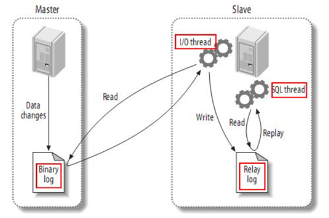
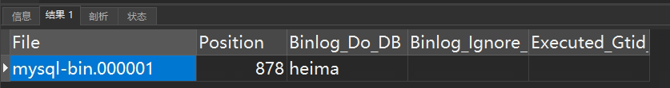
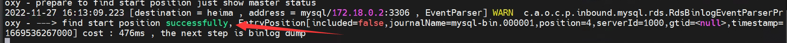
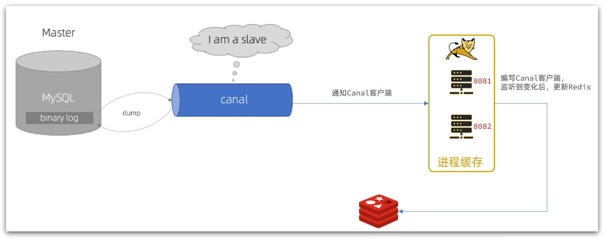
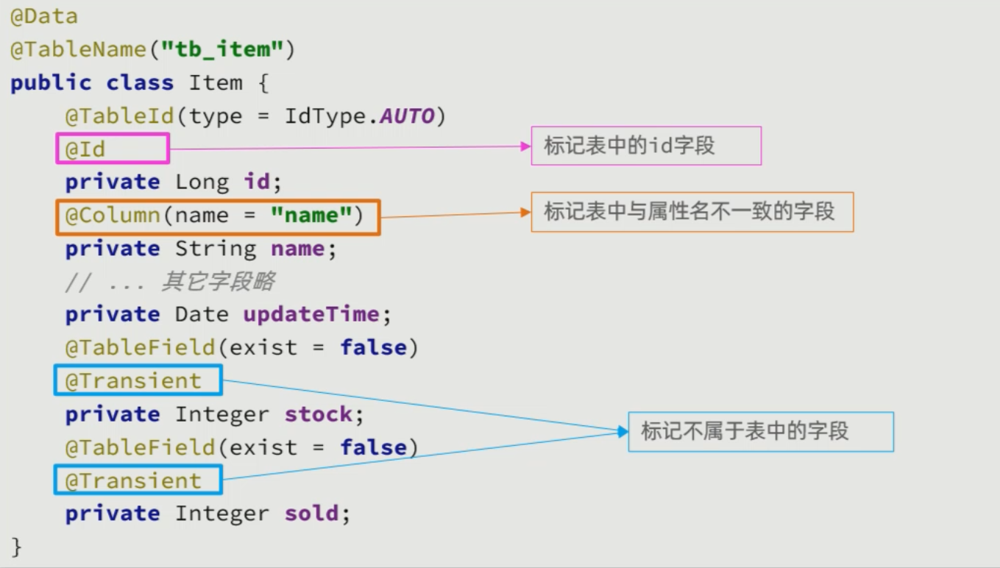
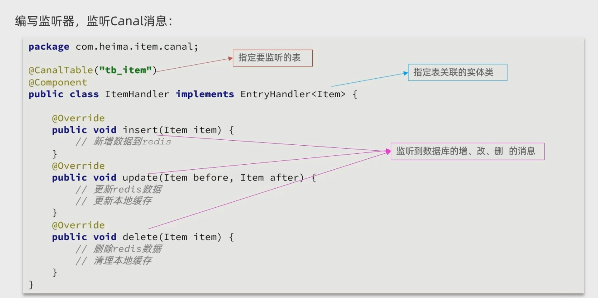

[TOC]


# 基于Canal完成缓存同步

## 1. 数据同步策略

缓存数据同步的常见方式有三种：

**设置有效期**：给缓存设置有效期，到期后自动删除。再次查询时更新

- 优势：简单、方便
- 缺点：时效性差，缓存过期之前可能不一致
- 场景：更新频率较低，时效性要求低的业务

**同步双写**：在修改数据库的同时，直接修改缓存

- 优势：时效性强，缓存与数据库强一致
- 缺点：有代码侵入，耦合度高；
- 场景：对一致性、时效性要求较高的缓存数据

**异步通知：**修改数据库时发送事件通知，相关服务监听到通知后修改缓存数据

- 优势：低耦合，可以同时通知多个缓存服务
- 缺点：时效性一般，可能存在中间不一致状态
- 场景：时效性要求一般，有多个服务需要同步


而异步实现又可以基于MQ或者Canal来实现：

1）基于MQ的异步通知：


- 商品服务完成对数据的修改后，只需要发送一条消息到MQ中。
- 缓存服务监听MQ消息，然后完成对缓存的更新

依然有少量的代码侵入。


2）基于Canal的通知


- 商品服务完成商品修改后，业务直接结束，没有任何代码侵入
- Canal监听MySQL变化，当发现变化后，立即通知缓存服务
- 缓存服务接收到canal通知，更新缓存

代码零侵入


## 2. 初识Canal

### 2.1 Canal概述

**Canal [kə'næl]**，译意为水道/管道/沟渠，canal是阿里巴巴旗下的一款开源项目，基于Java开发。基于数据库增量日志解析，提供增量数据订阅&消费。GitHub的地址：https://github.com/alibaba/canal

Canal是基于mysql的主从同步来实现的，MySQL主从同步的原理如下：



而Canal就是把自己伪装成MySQL的一个slave节点，从而监听master的binary log变化。再把得到的变化信息通知给Canal的客户端，进而完成对其它数据库的同步。


### 2.2 安装Canal

#### 2.2.1 开启MySql主从

（1）开启binlog

打开mysql容器挂载的日志文件，我的在`/tmp/mysql/conf`目录

```shell
vi /tmp/mysql/conf/my.cnf


[mysqld]
skip-name-resolve
character_set_server=utf8
datadir=/var/lib/mysql
server-id=1000
# 加入这两行内容
log-bin=/var/lib/mysql/mysql-bin
binlog-do-db=heima
```

配置解读：

- `log-bin=/var/lib/mysql/mysql-bin`：设置binary log文件的存放地址和文件名，叫做mysql-bin
- `binlog-do-db=heima`：指定对哪个database记录binary log events，这里记录heima这个库

（2）设置用户权限

接下来添加一个仅用于数据同步的账户，出于安全考虑，这里仅提供对heima这个库的操作权限。

```sql
create user canal@'%' IDENTIFIED by 'canal';
GRANT SELECT, REPLICATION SLAVE, REPLICATION CLIENT,SUPER ON *.* TO 'canal'@'%' identified by 'canal';
FLUSH PRIVILEGES;
```

测试设置是否成功：在mysql控制台，或者Navicat中，输入命令：

```shell
show master status;
```




#### 2.2.2 安装Canal

（1）创建网络

我们需要创建一个网络，将MySQL、Canal、MQ放到同一个Docker网络中：

```sh
docker network create heima
```

让mysql加入这个网络：

```sh
docker network connect heima mysql
```

（2）安装启动

```shell
docker pull canal/canal-server:v1.1.5


docker run -p 11111:11111 --name canal \
    -e canal.destinations=heima \
    -e canal.instance.master.address=mysql:3306  \
    -e canal.instance.dbUsername=canal  \
    -e canal.instance.dbPassword=canal  \
    -e canal.instance.connectionCharset=UTF-8 \
    -e canal.instance.tsdb.enable=true \
    -e canal.instance.gtidon=false  \
    -e canal.instance.filter.regex=heima\\..* \
    --network heima \
    -d canal/canal-server:v1.1.5
    
    
## 查看是否与mysql正常通信,进入canal容器
docker exec -it canal bash
tail -f canal-server/logs/canal/canal.log
tail -f canal-server/logs/heima/heima.log
```



说明:

- `-p 11111:11111`：这是canal的默认监听端口
- `-e canal.destinations=heima` camal集群名
- `-e canal.instance.master.address=mysql:3306`：数据库地址和端口，如果不知道mysql容器地址，可以通过`docker inspect 容器id`来查看
- `-e canal.instance.dbUsername=canal`：数据库用户名
- `-e canal.instance.dbPassword=canal` ：数据库密码
- `-e canal.instance.filter.regex=`：要监听的表名称

表名称监听支持的语法：

```shell
mysql 数据解析关注的表，Perl正则表达式.
多个正则之间以逗号(,)分隔，转义符需要双斜杠(\\) 
常见例子：
1.  所有表：.*   or  .*\\..*
2.  canal schema下所有表： canal\\..*
3.  canal下的以canal打头的表：canal\\.canal.*
4.  canal schema下的一张表：canal.test1
5.  多个规则组合使用然后以逗号隔开：canal\\..*,mysql.test1,mysql.test2 
```


## 3. 监听Canal

Canal提供了各种语言的客户端，当Canal监听到binlog变化时，会通知Canal的客户端。



我们可以利用Canal提供的Java客户端，监听Canal通知消息。当收到变化的消息时，完成对缓存的更新。

不过这里我们会使用GitHub上的第三方开源的canal-starter客户端。地址：https://github.com/NormanGyllenhaal/canal-client

与SpringBoot完美整合，自动装配，比官方客户端要简单好用很多。

### 3.1 引入依赖

```xml
<dependency>
    <groupId>top.javatool</groupId>
    <artifactId>canal-spring-boot-starter</artifactId>
    <version>1.2.1-RELEASE</version>
</dependency>
```

### 3.2 编写配置

```yaml
canal:
  destination: heima # canal的集群名字，要与安装canal时设置的名称一致
  server: 192.168.174.200:11111 # canal服务地址
```

### 3.3 修改item实体类

Canal推送给canal-client的是被修改的这一行数据（row），而我们引入的canal-client则会帮我们把行数据封装到Item实体类中。这个过程中需要知道数据库与实体的映射关系，要用到JPA的几个注解：



```java
package com.heima.item.pojo;
   
import com.baomidou.mybatisplus.annotation.IdType;
import com.baomidou.mybatisplus.annotation.TableField;
import com.baomidou.mybatisplus.annotation.TableId;
import com.baomidou.mybatisplus.annotation.TableName;
import lombok.Data;
import org.springframework.data.annotation.Id;
import org.springframework.data.annotation.Transient;

import javax.persistence.Column;
import java.util.Date;

@Data
@TableName("tb_item")
public class Item {
    @TableId(type = IdType.AUTO)
    @Id
    private Long id;//商品id
    @Column(name = "name")
    private String name;//商品名称
    private String title;//商品标题
    private Long price;//价格（分）
    private String image;//商品图片
    private String category;//分类名称
    private String brand;//品牌名称
    private String spec;//规格
    private Integer status;//商品状态 1-正常，2-下架
    private Date createTime;//创建时间
    private Date updateTime;//更新时间
    @TableField(exist = false)
    @Transient
    private Integer stock;
    @TableField(exist = false)
    @Transient
    private Integer sold;
}
```

### 3.4 编写监听器



通过实现`EntryHandler<T>`接口编写监听器，监听Canal消息。注意两点：

- 实现类通过`@CanalTable("tb_item")`指定监听的表信息
- EntryHandler的泛型是与表对应的实体类

```java
package com.heima.item.canal;

import com.github.benmanes.caffeine.cache.Cache;
import com.heima.item.config.RedisHandler;
import com.heima.item.pojo.Item;
import org.springframework.beans.factory.annotation.Autowired;
import org.springframework.stereotype.Component;
import top.javatool.canal.client.annotation.CanalTable;
import top.javatool.canal.client.handler.EntryHandler;

@CanalTable("tb_item")
@Component
public class ItemHandler implements EntryHandler<Item> {

    @Autowired
    private RedisHandler redisHandler;
    @Autowired
    private Cache<Long, Item> itemCache;

    @Override
    public void insert(Item item) {
        // 写数据到JVM进程缓存
        itemCache.put(item.getId(), item);
        // 写数据到redis
        redisHandler.saveItem(item);
    }

    @Override
    public void update(Item before, Item after) {
        // 写数据到JVM进程缓存
        itemCache.put(after.getId(), after);
        // 写数据到redis
        redisHandler.saveItem(after);
    }

    @Override
    public void delete(Item item) {
        // 删除数据到JVM进程缓存
        itemCache.invalidate(item.getId());
        // 删除数据到redis
        redisHandler.deleteItemById(item.getId());
    }
}
```

在这里对Redis的操作都封装到了RedisHandler这个对象中，是我们之前做缓存预热时编写的一个类，内容如下：

```java
package com.heima.item.config;

import com.fasterxml.jackson.core.JsonProcessingException;
import com.fasterxml.jackson.databind.ObjectMapper;
import com.heima.item.pojo.Item;
import com.heima.item.pojo.ItemStock;
import com.heima.item.service.IItemService;
import com.heima.item.service.IItemStockService;
import org.springframework.beans.factory.InitializingBean;
import org.springframework.beans.factory.annotation.Autowired;
import org.springframework.data.redis.core.StringRedisTemplate;
import org.springframework.stereotype.Component;

import java.util.List;

@Component
public class RedisHandler implements InitializingBean {

    @Autowired
    private StringRedisTemplate redisTemplate;

    @Autowired
    private IItemService itemService;
    @Autowired
    private IItemStockService stockService;

    private static final ObjectMapper MAPPER = new ObjectMapper();

    @Override
    public void afterPropertiesSet() throws Exception {
        // 初始化缓存
        // 1.查询商品信息
        List<Item> itemList = itemService.list();
        // 2.放入缓存
        for (Item item : itemList) {
            // 2.1.item序列化为JSON
            String json = MAPPER.writeValueAsString(item);
            // 2.2.存入redis
            redisTemplate.opsForValue().set("item:id:" + item.getId(), json);
        }

        // 3.查询商品库存信息
        List<ItemStock> stockList = stockService.list();
        // 4.放入缓存
        for (ItemStock stock : stockList) {
            // 2.1.item序列化为JSON
            String json = MAPPER.writeValueAsString(stock);
            // 2.2.存入redis
            redisTemplate.opsForValue().set("item:stock:id:" + stock.getId(), json);
        }
    }

    public void saveItem(Item item) {
        try {
            String json = MAPPER.writeValueAsString(item);
            redisTemplate.opsForValue().set("item:id:" + item.getId(), json);
        } catch (JsonProcessingException e) {
            throw new RuntimeException(e);
        }
    }

    public void deleteItemById(Long id) {
        redisTemplate.delete("item:id:" + id);
    }
}
```


