[TOC]


# Redis最佳实践


## 1. Redis键值设计

### 1.1 优雅的key结构

Redis的Key虽然可以自定义，但最好遵循下面的几个最佳实践约定：

- 遵循基本格式：[业务名称]:[数据名]:[id]
- 长度不超过44字节
- 不包含特殊字符

例如：我们的登录业务，保存用户信息，其key是这样的：`login:user:10`

优点：

- 可读性强
- 避免key冲突
- 方便管理
- 更节省内存： key是string类型，底层编码包含int、embstr和raw三种。embstr在小于44字节使用，采用连续内存空间，内存占用更小

### 1.2 拒绝BigKey

#### 1.2.1 什么是BigKey

BigKey通常以**Key的大小**和**Key中成员的数量**来综合判定，例如：

- Key本身的数据量过大：一个String类型的Key，它的值为5 MB。
- Key中的成员数过多：一个ZSET类型的Key，它的成员数量为10,000个。
- Key中成员的数据量过大：一个Hash类型的Key，它的成员数量虽然只有1,000个但这些成员的Value（值）总大小为100 MB。

推荐值：

- 单个key的value小于10KB
- 对于集合类型的key，建议元素数量小于1000


#### 1.2.2 BigKey的危害

网络阻塞

- 对BigKey执行读请求时，少量的QPS就可能导致带宽使用率被占满，导致Redis实例，乃至所在物理机变慢

数据倾斜

- BigKey所在的Redis实例内存使用率远超其他实例，无法使数据分片的内存资源达到均衡

Redis阻塞

- 对元素较多的hash、list、zset等做运算会耗时较旧，使主线程被阻塞

 CPU压力

- 对BigKey的数据序列化和反序列化会导致CPU的使用率飙升，影响Redis实例和本机其它应用

#### 1.2.3 如何发现BigKey

redis-cli --bigkeys

- 利用redis-cli提供的--bigkeys参数，可以遍历分析所有key，并返回Key的整体统计信息与每个数据的Top1的big key

 scan扫描

- 自己编程，利用scan扫描Redis中的所有key，利用strlen、hlen等命令判断key的长度（此处不建议使用MEMORY USAGE）

  ```java
  final static int STR_MAX_LEN = 10 * 1024;
  final static int HASH_MAX_LEN = 500;
  
  
  @Test
  void testScan() {
      int maxLen = 0;
      long len = 0;
      String cursor = "0";
      do {
          // 扫描并获取一部分key
          ScanResult<String> result = jedis.scan(cursor);
          // 记录 cursor
          cursor = result.getCursor();
          List<String> list = result.getResult();
          if (list == null || list.isEmpty()) {
              break;
          }
          // 遍历
          for (String key : list) {
              // 判断key的类型
              String type = jedis.type(key);
              switch (type) {
                  case "string":
                      len = jedis.strlen(key);
                      maxLen = STR_MAX_LEN;
                      break;
                  case "hash":
                      len = jedis.hlen(key);
                      maxLen = HASH_MAX_LEN;
                      break;
                  case "list":
                      len = jedis.llen(key);
                      maxLen = HASH_MAX_LEN;
                      break;
                  case "set":
                      len = jedis.scard(key);
                      maxLen = HASH_MAX_LEN;
                      break;
                  case "zset":
                      len = jedis.zcard(key);
                      maxLen = HASH_MAX_LEN;
                      break;
                  default:
                      break;
              }
              if (len > maxLen) {
                  System.out.printf("found big key :%s ,type :%s ,length or sizeL %d %n", key, type, len);
              }
          }
      } while (!"0".equals(cursor));
  }
  ```

第三方工具

- 利用第三方工具，如 Redis-Rdb-Tools 分析RDB快照文件，全面分析内存使用情况

网络监控

- 自定义工具，监控进出Redis的网络数据，超出预警值时主动告警

#### 1.2.4 如何删除BigKey

BigKey内存占用较多，即便时删除这样的key也需要耗费很长时间，导致Redis主线程阻塞，引发一系列问题。

-  edis 3.0 及以下版本
  - 如果是集合类型，则遍历BigKey的元素，先逐个删除子元素，最后删除BigKey
-  Redis 4.0以后
  - Redis在4.0后提供了异步删除的命令：unlink

### 1.3 恰当的数据类型

例1：比如存储一个User对象，我们有三种存储方式：

方式一：json字符串


- 优点：实现简单粗暴
- 缺点：数据耦合，不够灵活

方式二：字段打散


- 优点：可以灵活访问对象任意字段
- 缺点：占用空间大、没办法做统一控制

方式三：hash


- 优点：底层使用ziplist，空间占用小，可以灵活访问对象的任意字段
- 缺点：代码相对复杂


例2：假如有hash类型的key，其中有100万对field和value，field是自增id，这个key存在什么问题？如何优化？

方案一：采用hash存储

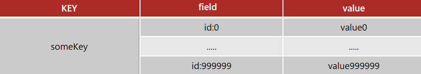

占用内存：

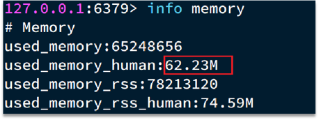

存在的问题：

- hash的entry数量超过500时，会使用哈希表而不是ZipList，内存占用较多。
- 可以通过hash-max-ziplist-entries配置entry上限。但是如果entry过多就会导致BigKey问题

方案二：拆分为string类型

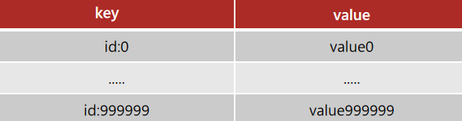

占用内存：

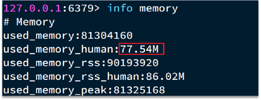

存在的问题：

- string结构底层没有太多内存优化，内存占用较多。
- 想要批量获取这些数据比较麻烦

方案三：拆分为小的hash，将 id / 100 作为key， 将id % 100 作为field，这样每100个元素为一个Hash

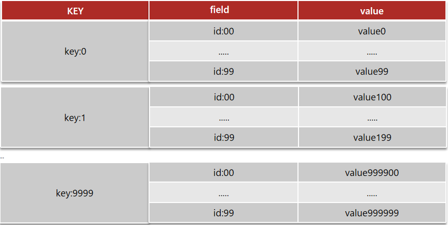

占用内存：

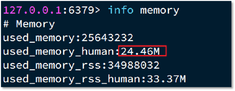


### 1.4 小结

Key的最佳实践：

- 固定格式：[业务名]:[数据名]:[id]
- 足够简短：不超过44字节
- 不包含特殊字符

Value的最佳实践：

- 合理的拆分数据，拒绝BigKey
- 选择合适数据结构
- Hash结构的entry数量不要超过1000
- 设置合理的超时时间


## 2. 批处理优化

### 2.1 单个命令的执行流程

一次命令的响应时间 = 1次往返的网络传输耗时 + 1次Redis执行命令耗时

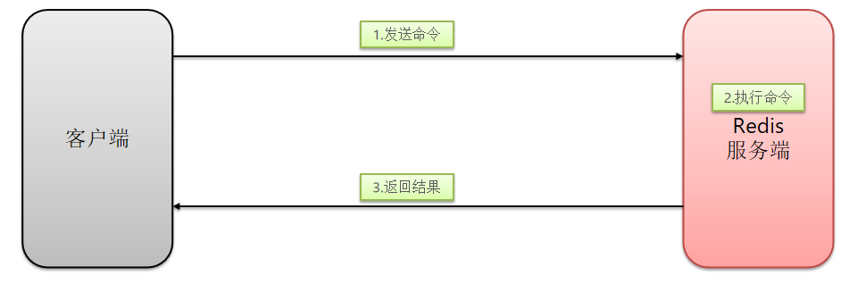

N次命令的响应时间 = N次往返的网络传输耗时 + N次Redis执行命令耗时

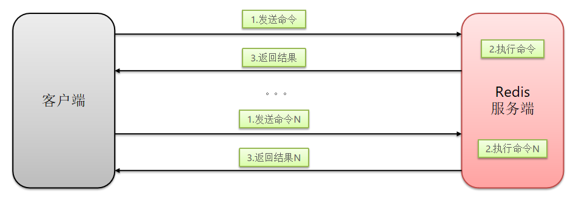

### 2.2 N条命令批量执行

N次命令的响应时间 = 1次往返的网络传输耗时 + N次Redis执行命令耗时

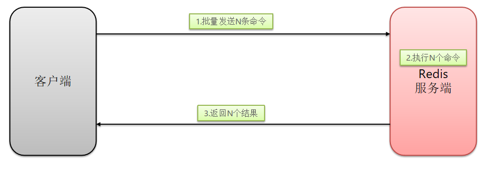


### 2.3 Mxxx命令实现批量数据操作

Redis提供了很多Mxxx这样的命令，可以实现批量插入数据，例如：

- mset
- hmset

利用mset批量插入10万条数据：

```java
@Test
void testMxx() {
    String[] arr = new String[2000];
    int j;
    for (int i = 1; i <= 100000; i++) {
        j = (i % 1000) << 1;
        arr[j] = "test:key_" + i;
        arr[j + 1] = "value_" + i;
        if (j == 0) {
            jedis.mset(arr);
        }
    }
}
```

### 2.4 Pipline实现批量数据操作

MSET虽然可以批处理，但是却只能操作部分数据类型，因此如果有对复杂数据类型的批处理需要，建议使用Pipeline功能：

```java
@Test
void testPipeline() {
    // 创建管道
    Pipeline pipeline = jedis.pipelined();

    for (int i = 1; i <= 100000; i++) {
        // 放入命令到管道
        pipeline.set("test:key_" + i, "value_" + i);
        if (i % 1000 == 0) {
            // 每放入1000条命令，批量执行
            pipeline.sync();
        }
    }
}
```

### 2.5 集群下的批处理

如MSET或Pipeline这样的批处理需要在一次请求中携带多条命令，而此时如果Redis是一个集群，那批处理命令的多个key必须落在一个插槽中，否则就会导致执行失败。

> Spring 已经默认实现 **并行slot**

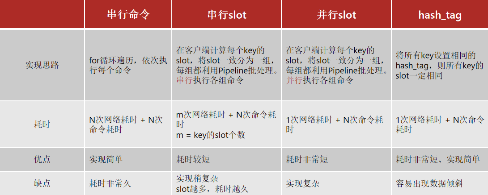

串行slot代码：

```java
package com.heima.test;

import com.heima.jedis.util.ClusterSlotHashUtil;
import org.junit.jupiter.api.AfterEach;
import org.junit.jupiter.api.BeforeEach;
import org.junit.jupiter.api.Test;
import redis.clients.jedis.HostAndPort;
import redis.clients.jedis.JedisCluster;
import redis.clients.jedis.JedisPoolConfig;

import java.util.HashMap;
import java.util.HashSet;
import java.util.List;
import java.util.Map;
import java.util.stream.Collectors;

public class JedisClusterTest {

    private JedisCluster jedisCluster;

    @BeforeEach
    void setUp() {
        // 配置连接池
        JedisPoolConfig poolConfig = new JedisPoolConfig();
        poolConfig.setMaxTotal(8);
        poolConfig.setMaxIdle(8);
        poolConfig.setMinIdle(0);
        poolConfig.setMaxWaitMillis(1000);
        HashSet<HostAndPort> nodes = new HashSet<>();
        nodes.add(new HostAndPort("192.168.150.101", 7001));
        nodes.add(new HostAndPort("192.168.150.101", 7002));
        nodes.add(new HostAndPort("192.168.150.101", 7003));
        nodes.add(new HostAndPort("192.168.150.101", 8001));
        nodes.add(new HostAndPort("192.168.150.101", 8002));
        nodes.add(new HostAndPort("192.168.150.101", 8003));
        jedisCluster = new JedisCluster(nodes, poolConfig);
    }
    // 无法正常执行
    @Test
    void testMSet() {
        jedisCluster.mset("name", "Jack", "age", "21", "sex", "male");
    }

    // 先按slot 分组后执行
    @Test
    void testMSet2() {
        Map<String, String> map = new HashMap<>(3);
        map.put("name", "Jack");
        map.put("age", "21");
        map.put("sex", "Male");

        Map<Integer, List<Map.Entry<String, String>>> result = map.entrySet()
            .stream()
            .collect(Collectors.groupingBy(
                entry -> ClusterSlotHashUtil.calculateSlot(entry.getKey()))
                    );
        for (List<Map.Entry<String, String>> list : result.values()) {
            String[] arr = new String[list.size() * 2];
            int j = 0;
            for (int i = 0; i < list.size(); i++) {
                j = i<<2;
                Map.Entry<String, String> e = list.get(0);
                arr[j] = e.getKey();
                arr[j + 1] = e.getValue();
            }
            jedisCluster.mset(arr);
        }
    }

    @AfterEach
    void tearDown() {
        if (jedisCluster != null) {
            jedisCluster.close();
        }
    }
}


public final class ClusterSlotHashUtil {

    private static final int SLOT_COUNT = 16384;

    private static final byte SUBKEY_START = '{';
    private static final byte SUBKEY_END = '}';

    private static final int[] LOOKUP_TABLE = { 0x0000, 0x1021, 0x2042, 0x3063, 0x4084, 0x50A5, 0x60C6, 0x70E7, 0x8108,
                                               0x9129, 0xA14A, 0xB16B, 0xC18C, 0xD1AD, 0xE1CE, 0xF1EF, 0x1231, 0x0210, 0x3273, 0x2252, 0x52B5, 0x4294, 0x72F7,
                                               0x62D6, 0x9339, 0x8318, 0xB37B, 0xA35A, 0xD3BD, 0xC39C, 0xF3FF, 0xE3DE, 0x2462, 0x3443, 0x0420, 0x1401, 0x64E6,
                                               0x74C7, 0x44A4, 0x5485, 0xA56A, 0xB54B, 0x8528, 0x9509, 0xE5EE, 0xF5CF, 0xC5AC, 0xD58D, 0x3653, 0x2672, 0x1611,
                                               0x0630, 0x76D7, 0x66F6, 0x5695, 0x46B4, 0xB75B, 0xA77A, 0x9719, 0x8738, 0xF7DF, 0xE7FE, 0xD79D, 0xC7BC, 0x48C4,
                                               0x58E5, 0x6886, 0x78A7, 0x0840, 0x1861, 0x2802, 0x3823, 0xC9CC, 0xD9ED, 0xE98E, 0xF9AF, 0x8948, 0x9969, 0xA90A,
                                               0xB92B, 0x5AF5, 0x4AD4, 0x7AB7, 0x6A96, 0x1A71, 0x0A50, 0x3A33, 0x2A12, 0xDBFD, 0xCBDC, 0xFBBF, 0xEB9E, 0x9B79,
                                               0x8B58, 0xBB3B, 0xAB1A, 0x6CA6, 0x7C87, 0x4CE4, 0x5CC5, 0x2C22, 0x3C03, 0x0C60, 0x1C41, 0xEDAE, 0xFD8F, 0xCDEC,
                                               0xDDCD, 0xAD2A, 0xBD0B, 0x8D68, 0x9D49, 0x7E97, 0x6EB6, 0x5ED5, 0x4EF4, 0x3E13, 0x2E32, 0x1E51, 0x0E70, 0xFF9F,
                                               0xEFBE, 0xDFDD, 0xCFFC, 0xBF1B, 0xAF3A, 0x9F59, 0x8F78, 0x9188, 0x81A9, 0xB1CA, 0xA1EB, 0xD10C, 0xC12D, 0xF14E,
                                               0xE16F, 0x1080, 0x00A1, 0x30C2, 0x20E3, 0x5004, 0x4025, 0x7046, 0x6067, 0x83B9, 0x9398, 0xA3FB, 0xB3DA, 0xC33D,
                                               0xD31C, 0xE37F, 0xF35E, 0x02B1, 0x1290, 0x22F3, 0x32D2, 0x4235, 0x5214, 0x6277, 0x7256, 0xB5EA, 0xA5CB, 0x95A8,
                                               0x8589, 0xF56E, 0xE54F, 0xD52C, 0xC50D, 0x34E2, 0x24C3, 0x14A0, 0x0481, 0x7466, 0x6447, 0x5424, 0x4405, 0xA7DB,
                                               0xB7FA, 0x8799, 0x97B8, 0xE75F, 0xF77E, 0xC71D, 0xD73C, 0x26D3, 0x36F2, 0x0691, 0x16B0, 0x6657, 0x7676, 0x4615,
                                               0x5634, 0xD94C, 0xC96D, 0xF90E, 0xE92F, 0x99C8, 0x89E9, 0xB98A, 0xA9AB, 0x5844, 0x4865, 0x7806, 0x6827, 0x18C0,
                                               0x08E1, 0x3882, 0x28A3, 0xCB7D, 0xDB5C, 0xEB3F, 0xFB1E, 0x8BF9, 0x9BD8, 0xABBB, 0xBB9A, 0x4A75, 0x5A54, 0x6A37,
                                               0x7A16, 0x0AF1, 0x1AD0, 0x2AB3, 0x3A92, 0xFD2E, 0xED0F, 0xDD6C, 0xCD4D, 0xBDAA, 0xAD8B, 0x9DE8, 0x8DC9, 0x7C26,
                                               0x6C07, 0x5C64, 0x4C45, 0x3CA2, 0x2C83, 0x1CE0, 0x0CC1, 0xEF1F, 0xFF3E, 0xCF5D, 0xDF7C, 0xAF9B, 0xBFBA, 0x8FD9,
                                               0x9FF8, 0x6E17, 0x7E36, 0x4E55, 0x5E74, 0x2E93, 0x3EB2, 0x0ED1, 0x1EF0 };

    private ClusterSlotHashUtil() {

    }

    /**
	 * @param keys must not be {@literal null}.
	 * @return
	 * @since 2.0
	 */
    public static boolean isSameSlotForAllKeys(Collection<ByteBuffer> keys) {

        Assert.notNull(keys, "Keys must not be null!");

        if (keys.size() <= 1) {
            return true;
        }

        return isSameSlotForAllKeys((byte[][]) keys.stream() //
                                    .map(ByteBuffer::duplicate) //
                                    .map(ByteUtils::getBytes) //
                                    .toArray(byte[][]::new));
    }

    /**
	 * @param keys must not be {@literal null}.
	 * @return
	 * @since 2.0
	 */
    public static boolean isSameSlotForAllKeys(ByteBuffer... keys) {

        Assert.notNull(keys, "Keys must not be null!");
        return isSameSlotForAllKeys(Arrays.asList(keys));
    }

    /**
	 * @param keys must not be {@literal null}.
	 * @return
	 */
    public static boolean isSameSlotForAllKeys(byte[]... keys) {

        Assert.notNull(keys, "Keys must not be null!");

        if (keys.length <= 1) {
            return true;
        }

        int slot = calculateSlot(keys[0]);
        for (int i = 1; i < keys.length; i++) {
            if (slot != calculateSlot(keys[i])) {
                return false;
            }
        }
        return true;
    }

    /**
	 * Calculate the slot from the given key.
	 *
	 * @param key must not be {@literal null} or empty.
	 * @return
	 */
    public static int calculateSlot(String key) {

        Assert.hasText(key, "Key must not be null or empty!");
        return calculateSlot(key.getBytes());
    }

    /**
	 * Calculate the slot from the given key.
	 *
	 * @param key must not be {@literal null}.
	 * @return
	 */
    public static int calculateSlot(byte[] key) {

        Assert.notNull(key, "Key must not be null!");

        byte[] finalKey = key;
        int start = indexOf(key, SUBKEY_START);
        if (start != -1) {
            int end = indexOf(key, start + 1, SUBKEY_END);
            if (end != -1 && end != start + 1) {

                finalKey = new byte[end - (start + 1)];
                System.arraycopy(key, start + 1, finalKey, 0, finalKey.length);
            }
        }
        return crc16(finalKey) % SLOT_COUNT;
    }

    private static int indexOf(byte[] haystack, byte needle) {
        return indexOf(haystack, 0, needle);
    }

    private static int indexOf(byte[] haystack, int start, byte needle) {
        for (int i = start; i < haystack.length; i++) {
            if (haystack[i] == needle) {
                return i;
            }
        }
        return -1;
    }

    private static int crc16(byte[] bytes) {

        int crc = 0x0000;

        for (byte b : bytes) {
            crc = ((crc << 8) ^ LOOKUP_TABLE[((crc >>> 8) ^ (b & 0xFF)) & 0xFF]);
        }
        return crc & 0xFFFF;
    }
}
```

### 2.6 小结

批量处理的方案：

- 原生的M操作
- Pipeline批处理

注意事项：

- 批处理时不建议一次携带太多命令
- Pipeline的多个命令之间不具备原子性

集群下使用默认批处理会失败，由于多个key计算可能不在一个slot内，可以先按slot分组再进行redis操作，其中Spring的`Lettuce`已经帮我们实现了并行slot方案。


## 3. 服务端优化

### 3.1 持久化配置

Redis的持久化虽然可以保证数据安全，但也会带来很多额外的开销，因此持久化请遵循下列建议：

- 用来做缓存的Redis实例尽量不要开启持久化功能
- 建议关闭RDB持久化功能，使用AOF持久化
- 利用脚本定期在slave节点做RDB，实现数据备份
- 设置合理的rewrite阈值，避免频繁的bgrewrite
- 配置no-appendfsync-on-rewrite = yes，禁止在rewrite期间做aof，避免因AOF引起的阻塞

部署有关建议：

- Redis实例的物理机要预留足够内存，应对fork和rewrite
- 单个Redis实例内存上限不要太大，例如4G或8G。可以加快fork的速度、减少主从同步、数据迁移压力
- 不要与CPU密集型应用部署在一起
- 不要与高硬盘负载应用一起部署。例如：数据库、消息队列


### 3.2 慢查询

慢查询：在Redis执行时耗时超过某个阈值的命令，称为慢查询。

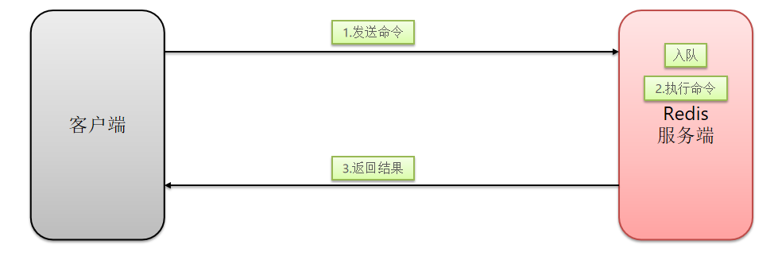

慢查询的阈值可以通过配置指定：

- `slowlog-log-slower-than`：慢查询阈值，单位是微秒。默认是10000，建议1000

慢查询会被放入慢查询日志中，日志的长度有上限，可以通过配置指定：

- `slowlog-max-len`：慢查询日志（本质是一个队列）的长度。默认是128，建议1000

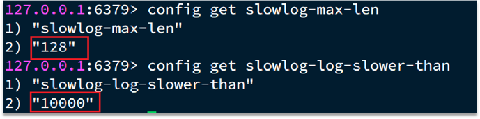

修改这两个配置可以使用：`config set`命令：

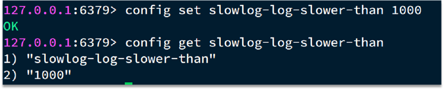

查看慢查询日志列表：

- `slowlog len`：查询慢查询日志长度
- `slowlog get [n]`：读取n条慢查询日志
- `slowlog reset`：清空慢查询列表

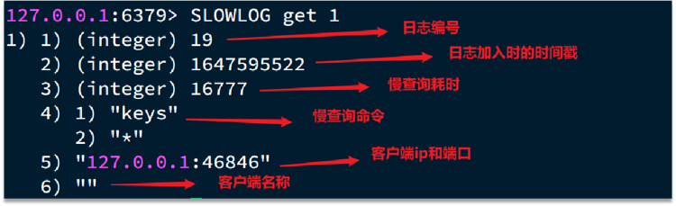

Redis 桌面客户端也可以看到服务器信息用来分析慢查询

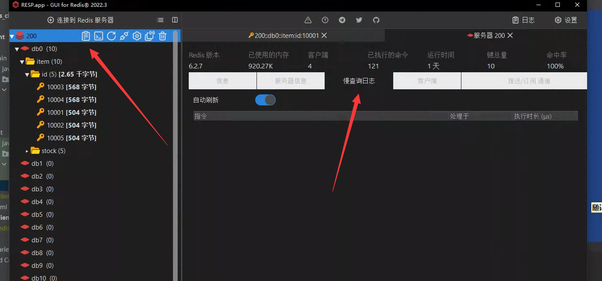

### 3.3 命令及安全配置

Redis会绑定在0.0.0.0:6379，这样将会将Redis服务暴露到公网上，而Redis如果没有做身份认证，会出现严重的安全漏洞.
漏洞重现方式：https://cloud.tencent.com/developer/article/1039000

漏洞出现的核心的原因有以下几点：

- Redis未设置密码
- 利用了Redis的config set命令动态修改Redis配置
- 使用了Root账号权限启动Redis

为了避免这样的漏洞，这里给出一些建议：

- Redis一定要设置密码
- 禁止线上使用下面命令：keys、flushall、flushdb、config set等命令。可以利用rename-command禁用。
- bind：限制网卡，禁止外网网卡访问
- 开启防火墙
- 不要使用Root账户启动Redis
- 尽量不使用默认的端口

### 3.4 内存配置

当Redis内存不足时，可能导致Key频繁被删除、响应时间变长、QPS不稳定等问题。当内存使用率达到90%以上时就需要我们警惕，并快速定位到内存占用的原因。

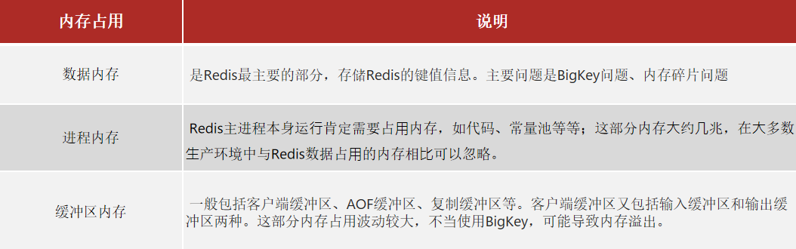

Redis提供了一些命令，可以查看到Redis目前的内存分配状态：

- info memory
- memory xxx

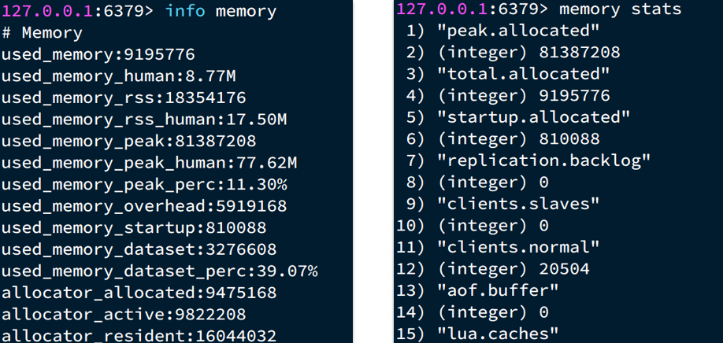

客户端也可以看这些内容


内存缓冲区常见的有三种：

- 复制缓冲区：主从复制的repl_backlog_buf，如果太小可能导致频繁的全量复制，影响性能。通过repl-backlog-size来设置，默认1mb
- AOF缓冲区：AOF刷盘之前的缓存区域，AOF执行rewrite的缓冲区。无法设置容量上限
- 客户端缓冲区：分为输入缓冲区和输出缓冲区，输入缓冲区最大1G且不能设置。输出缓冲区可以设置

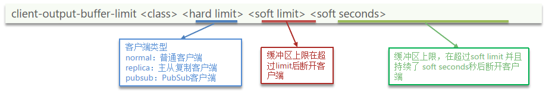

默认的配置如下：

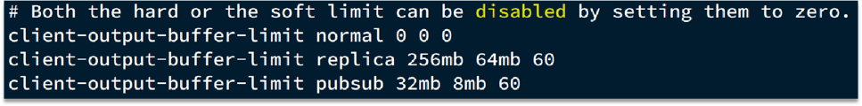


## 4. 集群最佳实践

集群虽然具备高可用特性，能实现自动故障恢复，但是如果使用不当，也会存在一些问题：

- 集群完整性问题
- 集群带宽问题
- 数据倾斜问题
- 客户端性能问题
- 命令的集群兼容性问题
- lua和事务问题


### 4.1 完整性问题

在Redis的默认配置中，如果发现任意一个插槽不可用，则整个集群都会停止对外服务：

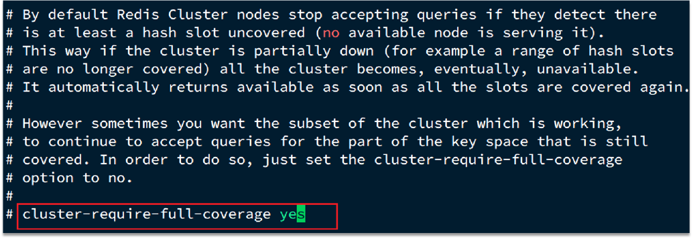

为了保证高可用特性，这里建议将 cluster-require-full-coverage配置为no

### 4.2 集群带宽问题

集群节点之间会不断的互相Ping来确定集群中其它节点的状态。每次Ping携带的信息至少包括：

- 插槽信息
- 集群状态信息

集群中节点越多，集群状态信息数据量也越大，10个节点的相关信息可能达到1kb，此时每次集群互通需要的带宽会非常高。

解决途径：

- 避免大集群，集群节点数不要太多，最好少于1000，如果业务庞大，则建立多个集群。
- 避免在单个物理机中运行太多Redis实例
- 配置合适的cluster-node-timeout值


单体Redis（主从Redis）已经能达到万级别的QPS，并且也具备很强的高可用特性。如果主从能满足业务需求的情况下，尽量不搭建Redis集群。

