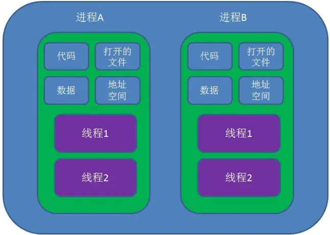
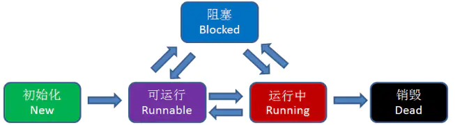
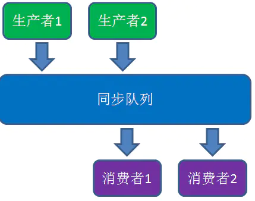
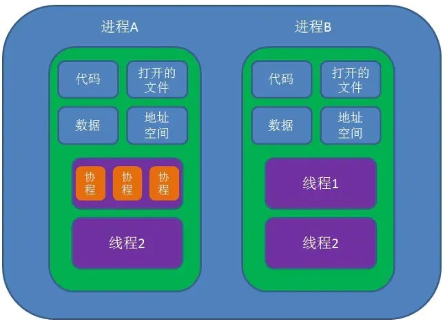
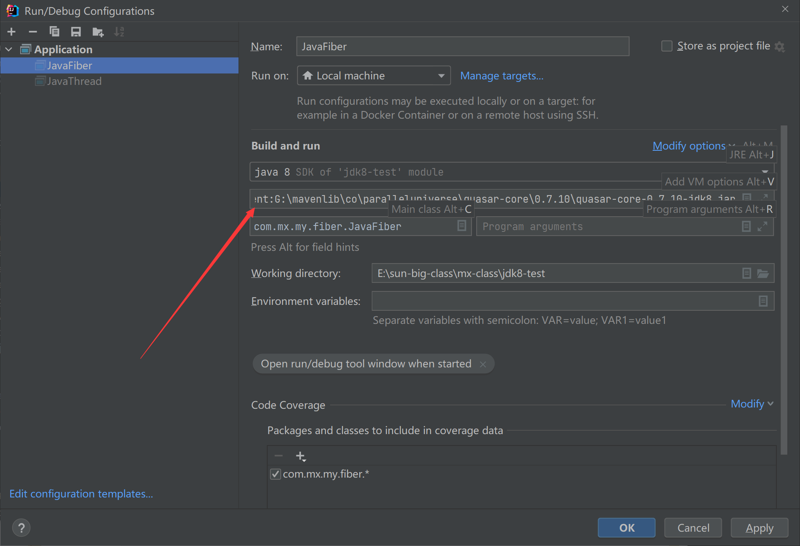
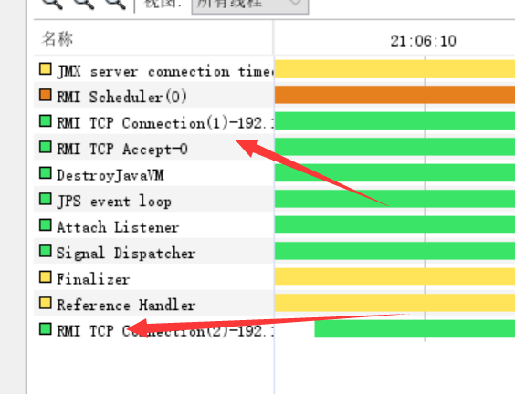

# 1. 进程、线程、协程的概念和区别


## 1.1 进程、线程、协程的概念和区别

### 1.1.1 什么是进程和线程

**进程**是应用程序的启动实例，进程拥有 **代码** 和 **资源**  包括：文件资源、数据资源、独立的内存空间。

**线程**从属于进程，是进程的实际执行者，一个进程至少包含一个主线程，也可以有更多子线程，**线程拥有自己的栈空间**。




对操作系统而言，无论进程还是线程，都是由操作系统所管理，其中

- 线程是最小的执行单元
- 进程是最小的资源管理单元


线程的状态：

线程具有五种状态：初始化、可运行、运行中、阻塞、销毁



进程与线程的区别：

1. 进程是CPU资源分配的基本单位，线程是独立运行和独立调度的基本单位（CPU上真正执行的是线程）。
2. 进程拥有自己的资源空间，一个进程包含若干线程，线程与CPU资源分配无关，多个线程共享一个进程内的资源。
3. 线程的调度与切换比进程快得多。


经验：

> CPU密集型代码（各种循环处理，计算等等）：使用多进程。很少跟硬盘打交道，IO少，阻塞少。
>
> IO密集型代码（文件处理、网络爬虫等）：使用多线程。跟硬盘、网络打交道多，IO阻塞多。


### 1.1.2 线程之间是如何进行协作的

最经典的例子是`生产者/消费者`模式，即若干个生产者线程向队列中生产数据，若干个消费者线程从队列中消费数据。



生产者消费者模型的性能问题是什么？

- 涉及到同步锁
- 涉及到线程阻塞状态和可运行状态之间的切换
- 涉及到线程上下文的切换


### 1.1.3 什么是协程

协程（Coroutines）是一种比线程更加轻量级的存在，正如一个进程可以拥有多个线程一样。一个线程可以拥有多个协程。



**操作系统中的协程**

协程不是被操作系统内核所管理的，而是完全由程序所控制，也就是在用户态执行。这样带来的好处是性能大幅度的提升，因为不会像线程切换那样消耗资源。

协程不是进程也不是线程，而是一种特殊的函数，这个函数可以在某个地方挂起，并且可以重新在挂起的地方继续运行。所以说，协程与进程、线程相比并不是一个维度的概念。

一个进程可以包含多个线程，一个线程也可以包含多个协程。简单来说，一个线程内可以有多个这样的特殊函数在运行，但是有一点必须明确的是，**一个线程的多个协程的运行是串行的**。如果是多核CPU，多个进程或一个进程内的多个线程是可以并行运行的，但是一个线程内的协程却绝对是串行的，无论CPU有多少个核。毕竟协程虽然是一种特殊的函数，但仍然是一个函数。一个线程内可以运行多个函数，但这些函数都是串行运行的。**当一个协程运行时，其他协程必须挂起**。


### 1.1.4 进程、线程、协程对比

- 协程既不是进程也不是线程，协程仅仅是一个特殊的函数，协程与进程和线程不是一个维度的
- 一个进程可以包含多个线程，一个线程可以包含多个协程
- 一个线程内的多个协程虽然可以切换，但是多个协程是串行执行的，只能在一个线程内执行，没法利用CPU的多核能力。
- 协程与进程一样，切换时存在上下文切换问题。
- 进程的切换者是操作系统，切换时机是根据操作系统自己的切换策略，用户是无感知的。进程的切换内容包括 页全局目录、内核栈、硬件上下文、切换内容保存在内存中。进程切换过程是由”用户态到内核态到用户态“的方式，切换效率低。
- 线程的切换者是操作系统，切换时机是根据操作系统自己的切换策略，用户无感知。线程的切换内容包括内核栈和硬件上下文。线程切换内容保存在内核栈中。线程切换过程是由“用户态到内核态到用户态”， 切换效率中等。
- 切成的切换者是用户（编程者或应用程序），切换时机是用户自己的程序所决定的。协程的切换内容是硬件上下文，切换内存保存在用户自己的变量（用户栈或堆）中。协程的切换过程只有用户态，即没有陷入内核态，因此切换效率高。


### 1.1.5 线程 vs 协程性能对比

测试代码如下：

线程：

```java
public class JavaThread {

    /**
     * 10w个线程，每个线程处理2百万次运算
     * @param argus
     * @throws InterruptedException
     */
    public static void main(String[] argus) throws InterruptedException {
        long begin = System.currentTimeMillis();
        int threadLength = 100000;//10w
        Thread[] threads = new Thread[threadLength];
        for (int i = 0; i < threadLength; i++) {
            threads[i] = new Thread(() -> {
                calc();
            });
        }
        for (int i = 0; i < threadLength; i++) {
            threads[i].start();
        }
        for (int i = 0; i < threadLength; i++) {
            threads[i].join();
        }
        System.out.println(System.currentTimeMillis() - begin);
    }


    // 200w次计算
    static void calc() {
        int result = 0;
        for (int i = 0; i < 10000; i++) {
            for (int j = 0; j < 200; j++) {
                result += i;
            }
        }
    }
}
```

协程：

```java
public class JavaFiber {

    /**
     * 10w个协程，每个协程处理2百万次运算
     * @param argus
     * @throws InterruptedException
     */
    public static void main(String[] argus) throws ExecutionException, InterruptedException {
        long begin = System.currentTimeMillis();
        int fiberLength = 100000;//10w
        Fiber<Void>[] fibers = new Fiber[fiberLength];
        for (int i = 0; i < fiberLength; i++) {
            fibers[i] = new Fiber(() -> {
                calc();
            });
        }


        for (int i = 0; i < fiberLength; i++) {
            fibers[i].start();
        }
        for (int i = 0; i < fiberLength; i++) {
            fibers[i].join();
        }
        System.out.println(System.currentTimeMillis() - begin);
    }

    //200w次计算
    static void calc() {
        int result = 0;
        for (int i = 0; i < 10000; i++) {
            for (int j = 0; j < 200; j++) {
                result += i;
            }
        }
    }
}
```

协程需要添加依赖：

```xml
<dependency>
    <groupId>co.paralleluniverse</groupId>
    <artifactId>quasar-core</artifactId>
    <version>0.7.10</version>
    <classifier>jdk8</classifier>
</dependency>
```

执行的时候加参数，加在VM options里

```shell
-javaagent:G:\mavenlib\co\paralleluniverse\quasar-core\0.7.10\quasar-core-0.7.10-jdk8.jar
```



结论： 协程因为没有上下文切换的问题，快的飞起。

**25w个协程共用一个线程（一个线程中跑多个协程，协程不需要调度，对内核透明），4个线程一个100w个协程。**


### 1.1.6 多线程一定快吗？

因为有上下文切换的成本，多线程不一定比单线程快。

测试代码：

```java
package com.mx.my.fiber;

import java.util.concurrent.Callable;
import java.util.concurrent.FutureTask;

public class ConcurrencyTest {

    private static final long count = 1000000000l;

    public static void main(String[] args) throws InterruptedException {
        concurrency();
        serial();
    }

    private static void concurrency() throws InterruptedException {
        long start = System.currentTimeMillis();
//        Thread thread = new Thread(new Runnable() {
//            @Override
//            public void run() {
//                int a = 0;
//                for (long i = 0; i < count; i++) {
//                    a += 5;
//                }
//            }
//        });

        FutureTask task = new FutureTask<Integer>(new Callable<Integer>() {
            @Override
            public Integer call() throws Exception {
                int a = 0;
                for (long i = 0; i < count; i++) {
                    a += 5;
                }
                return a;
            }
        });

        Thread thread2 = new Thread(task);
        thread2.start();
        int b = 0;
        for (long i = 0; i < count; i++) {
            b--;
        }
        //两种方式计算才准：1、用join 2、task.get() 区别是计算总时间放的位置
//        thread2.join();
//        long time = System.currentTimeMillis() - start;
        try {
            System.out.println("b=" + b + ",a=" + task.get());
            long time = System.currentTimeMillis() - start;
            System.out.println("concurrency :" + time + "ms");
        } catch (Exception e) {
            e.printStackTrace();
        }
    }

    private static void serial() {
        long start = System.currentTimeMillis();
        int a = 0;
        for (long i = 0; i < count; i++) {
            a += 5;
        }
        int b = 0;
        for (long i = 0; i < count; i++) {
            b--;
        }
        long time = System.currentTimeMillis() - start;
        System.out.println("serial:" + time + "ms,b=" + b + ",a=" + a);
    }
}

```

同样次数的操作，多线程在某些情况下快，线程过多反而会变慢。


### 1.1.7 默认线程详解

main 线程启动后，可以用如下代码获取

```java
// 获取所有线程
Map<Thread, StackTraceElement[]> allStackTraces = Thread.getAllStackTraces();
Set<Thread> threads = allStackTraces.keySet();
for (Thread thread : threads) {    
    System.out.println("线程名：" + thread.getName());
}

// 结果如下
//线程名：Attach Listener     用于监听外部命令
//线程名：Finalizer           垃圾回收线程
//线程名：Reference Handler   协助回收引用对象
//线程名：Signal Dispatcher   Attach Listener 接受到命令后，用于分发处理
//线程名：Monitor Ctrl-Break   监控程序
//线程名：main                 主程序线程
```

使用 jvisualvm 还能看到另外几个线程：



主要是JMX 和 RMI 相关的，这些是为了外部监控连接JVM的。

此外，关于Monitor Ctrl-Break

```
Monitoring Thread Activity With Thread Dumps Thread dumps,
or "thread stack traces," reveal information about
an application's activity that can help you diagnose problems
and better optimize application and JVM performance;
for example, thread dumps can show the occurrence of "deadlock" conditions,
which can seriously impact application performance.
You can create a thread dump by invoking a control break
(usually by pressing Ctrl-Break or Ctrl-\ or SIGQUIT on linux).
This section provides information on working with thread dumps.
It includes information on these subjects:
1.Lock Information in Thread Dumps 2.Detecting Deadlocks

使用线程转储监视线程活动线程转储，
或“线程堆栈跟踪”，揭示有关
可以帮助您诊断问题的应用程序活动
更好地优化应用程序和JVM性能；
例如，线程转储可以显示“死锁”条件的发生，
这会严重影响应用性能。
您可以通过调用控件中断来创建线程转储
（通常在linux上按Ctrl-Break或Ctrl-\或SIGQUIT）。
本节提供有关使用线程转储的信息。
它包括关于这些主题的信息：
1.线程转储中的锁定信息2.检测死锁

大概意思就是， 它负责 记录 dump 和  检测死锁
```


