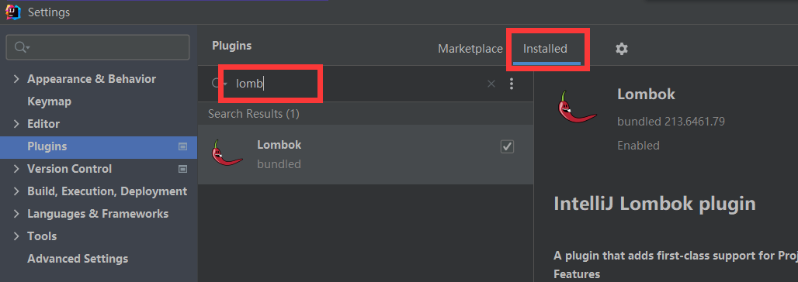
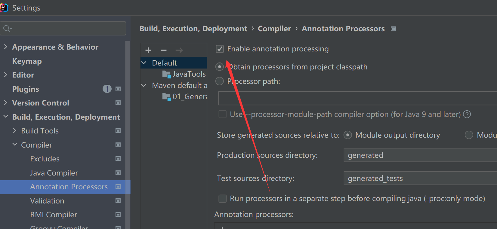

# 项目引入lombok并加入日志


## 添加maven依赖

```xml
<dependencies>
    <!--https://mvnrepository.com/artifact/org.projectlombok/lombok/1.18.16-->
    <!--scope=provided，说明它只在编译阶段生效，不需要打入包中,
Lombok在编译期将带Lombok注解的Java文件正确编译为完整的Class文件-->
    <dependency>
        <groupId>org.projectlombok</groupId>
        <artifactId>lombok</artifactId>
        <version>1.18.16</version>
        <!-- 如果别的项目需要引用本项目进而引入lombook，则去掉lombok，provided不会进行依赖传递-->
        <scope>provided</scope>
    </dependency>
    <dependency>
        <groupId>ch.qos.logback</groupId>
        <artifactId>logback-classic</artifactId>
        <version>1.2.11</version>
    </dependency>
</dependencies>
```


## 修改idea

## 安装lombok插件



## 开启事物自动处理

File-Setting-Compile-Annotation Process

